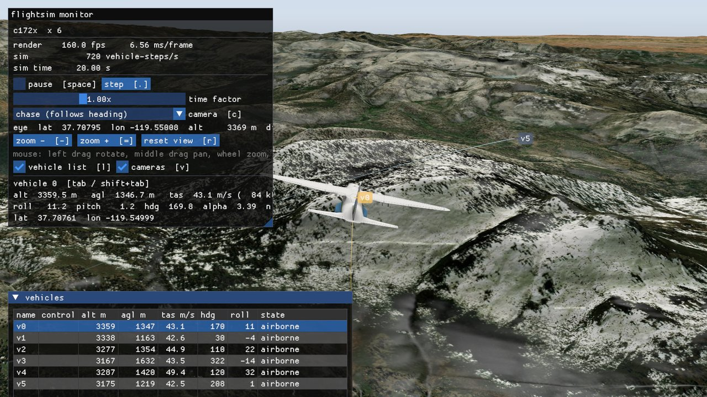

# flightsim

A pure C++ flight-simulation platform for AI and reinforcement-learning training:
[JSBSim](https://github.com/JSBSim-Team/jsbsim) flight dynamics for many vehicles at once,
[VulkanSceneGraph](https://github.com/vsg-dev/VulkanSceneGraph) for full-Earth visualisation and
vision observations, and a C++ SDK with a stable C ABI as the primary interface - and a Python SDK
over the same ABI (`import fsim`), with Gymnasium and Stable-Baselines3 adapters, at C's speed.



## Quick start

From the repository root:

```bat
fsim demo
```

Six aircraft flying over San Francisco on real satellite imagery and terrain. Left-drag to look
around, wheel to zoom out as far as the whole planet, `c` cycles the camera, `tab` picks another
aircraft, `esc` quits.

Nothing built yet? `fsim build` first (a few minutes, once). `fsim` on its own lists everything
you can run - train a policy, replay a recording, render an aircraft's camera views - and prints
the full command each time, so you can run the executables directly once you know what you want.

The architecture, requirements, technology evaluation and roadmap are in
[docs/FlightSim_System_Architecture_and_Design.md](docs/FlightSim_System_Architecture_and_Design.md).

## How it is used

1. **Write a training application against the SDK** ([docs/sdk](docs/sdk/README.md)): create a
   `fsim::World`, create vehicles by name, type and initial state, command them at any level of the
   control stack (actuators, attitude, acceleration, velocity, position, behaviours), control the
   environment in real time, attach effects (sensor noise, gusts, forces, GNSS loss) and let vehicles
   talk over a modelled network. Step the world from your learner's loop.
2. **Start the prebuilt viewer whenever you like.** `flightsim-viewer.exe` discovers the world through
   shared memory and mirrors it - creations, resets, state, control levels, environment - without the
   trainer knowing it exists and without slowing it down (wait-free, rate-limited publish; measured within
   a few percent at 64 vehicles).
3. For vectorised RL, `fsim::VecEnv` gives the same world a gym-style batch interface with actions at
   the control level of your choice.

```cpp
#include <fsim/World.h>

fsim::World world({.name = "dogfight-01"});
world.environment().setWind({.directionDeg = 270, .speedMs = 8, .turbulence = 0.3});

fsim::VehicleSpec spec; spec.name = "red-1"; spec.type = "jsbsim:c172x";
spec.initial.altitudeMslM = 1500; spec.initial.headingDeg = 90; spec.initial.airspeedTrueMs = 60;
fsim::Vehicle red = world.createVehicle(spec);
spec.name = "blue-1"; spec.initial.longitudeDeg -= 0.03;
fsim::Vehicle blue = world.createVehicle(spec);

red.command(fsim::control::AttitudeCommand{.rollRad = 0.4, .pitchRad = 0.05, .airspeedMs = 60});
blue.command(fsim::control::BehaviorCommand{.id = "pursuit", .target = red.id(), .params = {{"range_m", 200}}});
for (int k = 0; k < 3000; ++k) {
    world.step();                           // all vehicles, lockstep, 30 Hz world steps by default
    red.command(policy(red.sensed()));      // any level, any time
}
```

## Status

Milestones **M0 (skeleton), viewer, M2 (RL environment + SDK), M2b (vehicle SDK + transparent
viewer) and M4 (vision observations) done**; M5 (release v1) is packaged and built by CI on every
push, not yet tagged:

- **Vehicle SDK** (`include/fsim/World.h`, `libfsim.dll`): `World` / `Vehicle` object model over a
  lockstep worker pool; vehicles by name and type; per-vehicle random streams; determinism for any
  worker count (tested).
- **Multi-level control stack** (`fsim/Control.h`): six strictly ordered levels, one command variant,
  controllers that cascade to any lower level, built-in PID loops (attitude, acceleration, velocity,
  position) and behaviours (hold, waypoints, loiter, pursuit, evade, formation, aerobatics), a registry to
  replace any of them, tunable gains, introspection of the derived commands.
- **Real-time environment** (time, atmosphere, wind and turbulence, weather) applied to every JSBSim
  instance per step and published to the viewer.
- **Effects** (`fsim/Effects.h`): a context with wind, force/moment (generic external reaction injected
  into every stock aircraft), property and sensed-state channels; built-in sensor noise, latency,
  constant force, gusts, GNSS degradation.
- **Communication** (`fsim/Comm.h`): nodes, messages, raw/JSON codecs, ideal medium and range/latency/loss
  link model, beacon protocol; all interfaces.
- **Transparent viewer**: `flightsim-viewer.exe` attaches to any published world (`--list`,
  `--world`), waits for one, follows vehicle creation/reset/removal, interpolates in wall time, lights the
  scene from the world's clock, shows names/types/control levels/environment/throughput; `--demo` keeps
  the built-in scenario. Full-Earth satellite imagery over real relief, glTF aircraft, chase/orbit/overview
  mouse cameras, sky, trails, labels, Dear ImGui panels.
- **`fsim::VecEnv`** on the object model: Gymnasium-style batch semantics, actions as `surfaces`,
  `attitude`, `acceleration` or `velocity` commands, visible in the viewer.
- **C ABI** (`fsim/fsim_c.h`): the whole object model and the batch layer, tested from C99.
- **Python SDK** (`import fsim`, [docs/sdk/python.md](docs/sdk/python.md)): the object model, the batch layer,
  cameras, recordings and scenarios through a C extension over the C ABI - results are numpy views of the
  platform's memory, many-vehicle calls are one call, the GIL is released while it simulates. Measured against
  the same loops in C: a 64-aircraft VecEnv step 375.3 us from C, 375.4 us from Python. Gymnasium and
  Stable-Baselines3 vector environments (`fsim.gym`, `fsim.sb3`); one wheel for CPython 3.11+;
  `fsim python examples\python\train_sb3.py`. Actions can be torch tensors on any device; tasks,
  observations, actions and controllers written in C++ load as plugin DLLs (`fsim.load_plugin`,
  `fsim python examples\python\train_plugin.py`); `fsim.sb3.RolloutThreads` keeps torch's threads off the
  platform's cores while it collects, 17% faster PPO end to end.
- **hangar, aircraft of your own** ([docs/hangar.md](docs/hangar.md)): an aircraft that exists only on paper,
  described in one TOML file (surfaces, bodies, engine, gear, masses), becomes a JSBSim aircraft with a 3D model
  and a validation report. hangar computes the aerodynamic tables over the whole attitude range, the mass
  properties and the engine's tables (piston or electric with a propeller, turboprop, turbofan with or without
  afterburner). It then flies the result in the platform's JSBSim: trim, stall, climb, ceiling, dynamic modes
  against MIL-F-8785C, and random-state robustness. `fsim hangar skua`. A Cessna 172P rebuilt from public
  dimensions, with two numbers fitted to its top speed and climb rate, predicts its handbook's stall speed and
  ceiling within 4 %.
- **Fighter library** ([docs/hangar.md](docs/hangar.md#the-fighter-library)): fourteen fighters built with hangar
  from public dimensions, weights and engine data - F-16C, F-15C, F/A-18C, F-22A, F-35A, Su-27S, Su-57, MiG-29A,
  Typhoon, Rafale C, Gripen, Mirage 2000C, J-10A, J-20A - each flown through its own fly-by-wire (angle-of-attack
  and g limits, roll no faster than the rudder can coordinate); the F-22A and the Su-57 vector their thrust.
  Its published top speed is each one's only calibration target; its climb, ceiling and handling are
  predictions. `jsbsim:<name>` in the SDKs, scenario files and the viewer;
  `fsim python examples\python\fighters.py` flies all fourteen.
- **Support aircraft** ([docs/hangar.md](docs/hangar.md#support-aircraft)): fifteen more, built the same way -
  bombers (B-52H, H-6K), tankers (KC-135R, KC-46A), transports (C-130J, C-17A), AEW&C (E-3G, E-7A),
  reconnaissance (RC-135W, U-2S, RQ-4B), electronic warfare (EC-130H, EA-18G) and attack aircraft (A-10C,
  Su-25) - on direct controls or their own fly-by-wire, each flown against its published speed and ceiling.
- **Per-aircraft gains** ([docs/sdk/control.md](docs/sdk/control.md#per-aircraft-gains)): the built-in control
  loops fly each of these aircraft with its own gains - found by hangar's `autopilot` stage from small steps at a
  reference condition, scheduled on airspeed, with its trim law and flight-path feedforwards - carried in its
  JSBSim file as `fsim/control` properties ([docs/hangar.md](docs/hangar.md#the-autopilot)). Of 558 manoeuvres
  (31 designs, three speeds), those that lost control, never reached their target, overshot it by more than
  half or oscillated went from 336 with the shared gains to 29.
- **Capability contracts** ([docs/control-architecture.md](docs/control-architecture.md), ADR-26;
  [docs/sdk/control.md](docs/sdk/control.md#capabilities-and-activities)): a vehicle says what it offers - its
  control levels and behaviours, with typed parameters and ranges - and answers every command at once. A
  command becomes an activity (pending, active, then completed, failed or canceled) that a policy updates
  every step, an engaged autopilot or an operator's override outranks, and a behaviour completes when it reaches
  its goal - in C++, the C ABI (1.4) and Python. Every existing command flies exactly as before, its per-step
  path 20 % faster and allocation-free; the control stack stays the runtime underneath. Each aircraft carries a
  profile of separately versioned sections (identity, effectors, envelope, propulsion, identified plant,
  performance, gains) - hangar writes them for its 31 designs - and flies through the adapter of its family
  (fly-by-wire or surfaces); gear, flaps, brakes, speedbrake and pitch trim are capabilities of their own, with
  their placards. Commands can own the axes apart - a policy on the bank while an autopilot holds the height and
  speed, merged into one pass down the cascade - with per-engine throttles and a vehicle default that holds
  instead of idling (steps 1-3 of 6).
- `sim::VehiclePool` (one worker per physical core), JSBSim 1.3.1 adapter with terrain ground callback,
  `flightsim.exe` headless benchmark.

Measured on an 8-core desktop (Release): 64 c172x with control cascades, effects and beacons ~760k
vehicle-steps/s (`multi_level_control --extra 59`); VecEnv 32 envs ~180k agent-steps/s (~6000x real time).

- **`examples/ppo_trainer`**: clipped PPO with GAE, a hand-written MLP and Adam (no ML library) over
  `fsim::VecEnv`; on 64 environments it takes altitude/heading hold from 0.20 to 0.73 reward/step in ~2 minutes,
  beating the hand-tuned PD baseline (0.57); `--eval` replays the saved policy in the viewer.
- **Sharp ground at low altitude**: imagery streams to level 19 over relief synthesised from the deepest
  elevation level (bilinear, seam-consistent); elevation is resampled onto the mesh's vertex grid with edge
  extrapolation so tile seams and LOD transitions no longer open cracks on cliffs.
- **Terrain physics in the SDK** (`WorldOptions::terrain`): the same public elevation tiles the viewer
  draws, fetched headless (WinHTTP + stb_image, no VSG), cached on disk alongside the viewer's downloads,
  prefetched around spawns and kept warm around moving vehicles.
- **Recording and replay** (`WorldOptions::recordPath`): the trainer writes the same rows and samples the
  segment carries to a `.fsrec` file; `flightsim-viewer.exe --replay run.fsrec` plays it back with the
  demo's pause/step/time-factor controls and a timeline; `fsim::Recording::load` reads it back as data.

- **Per-type vehicle models**: the viewer draws `models/<type>.glb` for each vehicle type it sees
  (loaded and compiled once, on first use), `VehicleSpec::model` for an explicit file, else the sample aircraft.
- **Scenario files** (`fsim::loadScenario` / `applyScenario`, `fsim_scenario_*`): world, environment, vehicles,
  initial commands and effects as one JSON document; `examples/scenario_runner` runs one.
- **Comm bridges**: `comm::BridgeProtocol` over a `Transport` (UDP built in) makes an external process or device a
  node of the world's network (fixed "FSMG" wire format); `examples/udp_peer` + `multi_level_control --bridge`.
- **Offline tiles**: `tools/tile_prefetch` fills the shared tile cache (elevation + imagery pyramid) for a region,
  for training machines and viewers without network access; `fetch-maps` fills the package's own maps (about
  2.4 GB, [Map assets](#map-assets)), so a distributed viewer opens no sockets at all.
- **Rust example** (`examples/rust_trainer`): the C ABI from Rust with hand-written `extern "C"` declarations,
  object model and VecEnv at full throughput; `cargo run --release -- world | vecenv`.
- **Vision observations (M4)**: `fsim::vision::Sensors` mounts cameras on vehicles and renders them offscreen
  (`fsim_vision.dll`, Vulkan without a window) over the same imagery, relief, sky and models the viewer draws;
  64 cameras in ~8 ms per step, RGB, depth and per-vehicle segmentation ids; `examples/vision_capture` writes
  PNGs; the viewer shows the trainer's camera images live through shared memory.

- **Moving control surfaces**: glTF nodes named `fsim:aileron`, `fsim:elevator`, `fsim:rudder` or `fsim:flaps` turn about
  their hinge with each vehicle's own deflections in the viewer and the vision cameras; the geometry stays shared.
  Landing gear and its doors, leading-edge flaps, propellers, nozzles, struts, steering and wheels move with the
  vehicle's state the same way. hangar writes its models this way
  ([docs/sdk/viewer.md](docs/sdk/viewer.md#moving-control-surfaces)).
- **Engine exhaust and airflow effects** ([docs/sdk/viewer.md](docs/sdk/viewer.md#effects)), after DCS World:
  afterburner flames with shock diamonds, nozzle glow and heat haze; tip vortices and vapour in a hard pull, a
  vapour cone near Mach 1, contrails in cold air, and air streaks that grow with speed - all from each vehicle's
  reported state, shaped and animated on the GPU; the viewer's own work grows by 0.01 - 0.03 ms a frame. `e`
  toggles them, `--no-effects` starts without.

Imagery and elevation come from Esri World Imagery and AWS Terrain Tiles under their respective terms (attribution required); tiles are cached under `%LOCALAPPDATA%\flightsim\tilecache`.

## Build (Windows x64, MSYS2 UCRT64 / GCC)

The mandated toolchain is MSYS2 **UCRT64** at `D:\ENV\DevLanguages\Cpp\msys2\ucrt64`
(override with `-DFSIM_UCRT64_ROOT=...`). Packages needed in that environment:

```bash
pacman -S mingw-w64-ucrt-x86_64-{gcc,cmake,ninja,vulkan-headers,vulkan-loader,glslang,spirv-tools,assimp,curl}
```

Keep the installation consistent (`pacman -Syu`); MSYS2 does not support partial upgrades.

```bash
git clone --recursive https://github.com/coasho/DecisionDRLTest.git
cd DecisionDRLTest

# 1. VSG stack (vsg, vsgXchange, vsgImGui) -> build/deps-ucrt64/install   (once)
cmake -S deps --preset deps-ucrt64
cd deps && cmake --build --preset deps-ucrt64 && cd ..

# 2. flightsim (viewer + headless)
cmake --preset ucrt64-release
cmake --build --preset ucrt64-release --parallel
ctest --preset ucrt64-release
```

`ucrt64-headless` builds without Vulkan or the VSG stack.

Staging runs as part of the build, so every directory something is run from
has the DLLs it needs and works without `ucrt64/bin` on `PATH`.

### Where things are built

Four kinds of output, four directories - the viewer is never mixed with the
SDK, and neither is mixed with the tests:

| directory | what |
| --- | --- |
| `build/ucrt64-release/bin` | the applications: `flightsim-viewer`, `flightsim`, `tile_prefetch` |
| `build/ucrt64-release/examples` | demo trainers written against the SDK |
| `build/ucrt64-release/tests` | test executables - shipped in nothing |
| `build/ucrt64-release/dist` | the packages below |

```bash
cmake --build --preset ucrt64-release --target dist    # or: fsim dist
```

writes four self-contained trees:

| package | contents |
| --- | --- |
| `dist/viewer` | the visualisation application: executable, every DLL, `config/viewer.json`, the JSBSim data and models, and a complete copy of `assets/maps`. Start it with `run-viewer.cmd`; it needs nothing installed and never touches the network. |
| `dist/sdk` | `fsim.dll`, `fsim_vision.dll`, headers, import libraries and the `find_package(fsim CONFIG)` package |
| `dist/python` | the Python SDK: the `fsim` package and `fsim-<version>-cp311-abi3-win_amd64.whl` (`pip install` it into any CPython 3.11+) |
| `dist/tools` | the headless `flightsim` command-line application |
| `dist/examples` | the demo trainers |

The viewer reads `config/viewer.json` for its window, map sources and tiles;
command-line flags override it for one run. The packaged copy is generated
from the development one (`cmake/PackageConfig.cmake`) with three values
changed: `offline` true, `tileCache` `../maps`, and the level ceilings capped
to what the map plan actually contains. A distributed viewer therefore reads
every tile from the `maps/` directory beside it and opens no sockets at all -
its layer URLs are file paths, not addresses.

### Map assets

The tiles are gigabytes, so they are not in git. Fetch them before building a
package:

```
fetch-maps              download what the plan asks for (about 2.4 GB)
fetch-maps --dry-run    count and price it first
```

They land in `assets/maps`, and `fsim dist` copies them whole into the
package. What gets downloaded is `assets/config/offline-map-plan.json`: a
global base, every continent to level 9 (306 m per pixel at the equator, no
coarser anywhere), mountain ranges with relief to level 11 and imagery to 10
or 11, airports with imagery to level 14, and route corridors.
`bin/tile_prefetch` takes regions as discs, boxes, route corridors, the whole
globe or all of its land, with a level range per layer; see
`assets/config/maps.README.md`.

`cpack` in the build directory still produces one zip of everything.

## Run

```bash
# 1. a training application (this one: five c172x at different control levels, wind, gusts, beacons)
build/ucrt64-release/examples/multi_level_control.exe --realtime --seconds 600 --terrain
# 2. the viewer, in another terminal, whenever you like
build/ucrt64-release/bin/flightsim-viewer.exe
build/ucrt64-release/bin/flightsim-viewer.exe --list

# vectorised RL trainer skeleton (32 envs, PD baseline; --random for a random policy); world "vecenv"
build/ucrt64-release/examples/minimal_trainer.exe --envs 32 --steps 3000
# PPO (dependency-free MLP + Adam) learning altitude/heading hold at the attitude level; world "ppo"
build/ucrt64-release/examples/ppo_trainer.exe --envs 64 --iterations 1000 --save policy.bin
build/ucrt64-release/examples/ppo_trainer.exe --load policy.bin --eval --envs 16
build/ucrt64-release/examples/ppo_trainer.exe --scenario examples/scenarios/vecenv_windy_altitude_hold.json   # world, wind, effects from a file
build/ucrt64-release/examples/ppo_trainer.exe --depth 8x6      # + a forward depth camera per vehicle in the observation (fsim_vision)

# built-in demo scenario on the viewer's own simulation thread
build/ucrt64-release/bin/flightsim-viewer.exe --demo --vehicles 8
build/ucrt64-release/bin/flightsim-viewer.exe --demo --vehicles 6 --lat 37.72 --lon -119.55 --alt 3200 --spread 0.02
build/ucrt64-release/bin/flightsim-viewer.exe --demo --vehicles 3 --spread 0.004 --on-ground
build/ucrt64-release/bin/flightsim-viewer.exe --help

# run a scenario file (world, environment, vehicles, commands, effects as data)
build/ucrt64-release/examples/scenario_runner.exe examples/scenarios/formation_and_pursuit.json --realtime
build/ucrt64-release/examples/scenario_runner.exe examples/scenarios/dogfight.json --realtime   # F-16s: pursuit vs evade, formation, loops

# an external process as a node of the world's network (two terminals)
build/ucrt64-release/examples/udp_peer.exe --listen 47001 --send 47000
build/ucrt64-release/examples/multi_level_control.exe --realtime --bridge 47000:47001

# cameras on a vehicle over Yosemite, written as PNGs (no window needed)
build/ucrt64-release/examples/vision_capture.exe --seconds 20 --every 2 --out captures

# fill the tile cache for a region once (terrain physics + viewer imagery offline afterwards)
build/ucrt64-release/bin/tile_prefetch.exe --lat 37.72 --lon -119.55 --radius-km 30

# record a run without a viewer, replay it later
build/ucrt64-release/examples/multi_level_control.exe --seconds 60 --quiet --record run.fsrec
build/ucrt64-release/bin/flightsim-viewer.exe --replay run.fsrec

# headless benchmark
build/ucrt64-release/bin/flightsim.exe --vehicles 64 --steps 300 --benchmark
```

Viewer keys: `tab` next vehicle, `c` camera (chase / orbit / overview), `-`/`=` zoom, `r` reset view,
`l` vehicle list, `m` monitor, `n` labels, `t` trails, `e` effects (exhaust, vapour, contrails, air streaks),
`esc` quit; in demo mode also `space` pause, `.` step,
`[`/`]` time factor. Mouse, following osgEarth's EarthManipulator: **left drag pans** - detached (free camera,
or before any vehicle exists) it drags the globe so the ground follows the cursor, including across the poles;
**middle drag rotates** around the focus; **the wheel zooms**, smoothed, from 6 m up to the whole Earth, and
changes nothing but the distance. osgEarth also zooms towards the pointer (`zoomToMouse`) and puts zoom on the
right button; here the right button is left alone, and zooming towards the pointer is `--zoom-to-cursor`,
because holding a point under the cursor means sliding the globe beneath it. The eye never goes below the terrain; `r` resets the view.
`--no-gui` hides the panels, labels and trails, leaving only the rendered scene - what you want when judging the graphics rather than the instruments; `--no-effects` starts with the effects off. Camera modes (`c`): orbit
(default, north-referenced), chase (turns with the aircraft), overview, free.

## Using the SDK

See [docs/sdk](docs/sdk/README.md): [world and vehicles](docs/sdk/world.md), [multi-level
control](docs/sdk/control.md), [environment, effects, communication](docs/sdk/environment.md),
[transparent visualisation](docs/sdk/viewer.md), [scenario files](docs/sdk/scenarios.md), [vision](docs/sdk/vision.md),
[VecEnv](docs/sdk/vecenv.md) and [your own task / observation / action](docs/sdk/vecenv.md#your-own-task-observation-or-action), [C ABI](docs/sdk/c_abi.md),
[Python](docs/sdk/python.md).
Link against `fsim` (`libfsim.dll` + `libJSBSim.dll` at runtime); JSBSim's aircraft data is found
automatically next to the executable (`share/flightsim/jsbsim`) or in the source tree.

### Install and package

```bash
cmake --build --preset ucrt64-release --target deploy      # runtime DLLs next to the executables
cmake --install build/ucrt64-release --prefix dist/flightsim
cd build/ucrt64-release && cpack                           # package/flightsim-<version>-win64.zip (~27 MB)
```

The tree is `bin/` (executables, `libfsim.dll`, `libfsim_vision.dll`, `libJSBSim.dll`, the MinGW
runtime), `include/fsim/`, `lib/` (import libraries, `cmake/fsim`), `share/flightsim/` (models,
`jsbsim/` data, `scenarios/`) and `share/doc/flightsim/`. A trainer outside this repository uses the
CMake package:

```cmake
find_package(fsim CONFIG REQUIRED)            # -Dfsim_DIR=<prefix>/lib/cmake/fsim
target_link_libraries(my_trainer PRIVATE fsim::sdk)     # and fsim::vision for cameras
```

`tests/package_consumer` is such a project; run it from the package's `bin/` (or put that
directory on `PATH`) so the DLLs and `share/` are found.

## Layout

```
fsim.cmd          the front door: build, run, the demos, hangar, Python (fsim help)
fetch-maps.cmd    fetches the offline map tiles into assets/maps/
CMakeLists.txt    the build; CMakePresets.json its presets (release, debug, headless)
cmake/            toolchains, warnings, dependencies, assets, install and packaging
deps/             superbuild for the VSG stack (build/deps-ucrt64)
third_party/      JSBSim (LGPL-2.1, DLL), VSG, vsgXchange, vsgImGui submodules; stb

include/fsim/     public SDK headers
src/platform/     OS isolation (the only module with Win32 includes)
src/core/         logging, registries, module lifecycle, RNG, profiler
src/io/           asset resolution; the terrain tile cache the headless physics reads
src/sim/          FlightModel, JsbsimModel (JSBSim adapter), VehiclePool, GroundProvider
src/control/      multi-level control stack, built-in loops and behaviours, registry
src/effects/      effect pipeline; built-in effects (sensor noise, GNSS degradation, forces, delays, dropouts)
src/comm/         communication: network, media, codecs, protocols
src/ipc/          shared-memory world segment: publisher, mirror, registry
src/session/      World implementation (vehicles, stepping, environment, publisher)
src/env/          Scenario, Task, Observation/Action spaces and their registry, VecEnv (batch layer)
src/sdk/          libfsim.dll: C++ SDK (World, VecEnv) + C ABI
src/vision/       libfsim_vision.dll: offscreen vehicle cameras (needs Vulkan)
src/render/       VSG window, viewer, render graph (viewer builds)
src/world/        Earth tiles, vehicle visuals, cameras, the exhaust and airflow effects
src/ui/           Dear ImGui monitor / vehicle list, key bindings
src/app/          flightsim.exe, flightsim-viewer.exe

python/           the Python SDK: fsim._native / fsim._vision (C, stable ABI), the fsim package, tests, benchmark, wheel
tools/            tile_prefetch: offline tile cache for a region; hangar: the aircraft design tool (Python; its mesher in native/)
aircraft/         designs made with hangar: <name>.toml, and the JSBSim aircraft and 3D model it builds
assets/           the viewer's config (viewer.json, the offline map plan, run-viewer.cmd); maps/ (fetched, not in git)
examples/         C++ trainers and tools on the SDK, a Rust trainer, the Python examples, scenario files
tests/            Catch2 unit + JSBSim integration tests (hangar's own: tools/hangar/tests)
docs/             the design document and hangar's guide; sdk/ the SDK guide
.claude/skills/   the aircraft-design skill: designing an aircraft with hangar
.github/          CI: build, tests and the package on every push
```

## License

MIT — see [LICENSE](LICENSE). JSBSim is LGPL-2.1 and is linked as a shared library; every bundled
component and data service is listed with its licence in [THIRD_PARTY_NOTICES.md](THIRD_PARTY_NOTICES.md).
