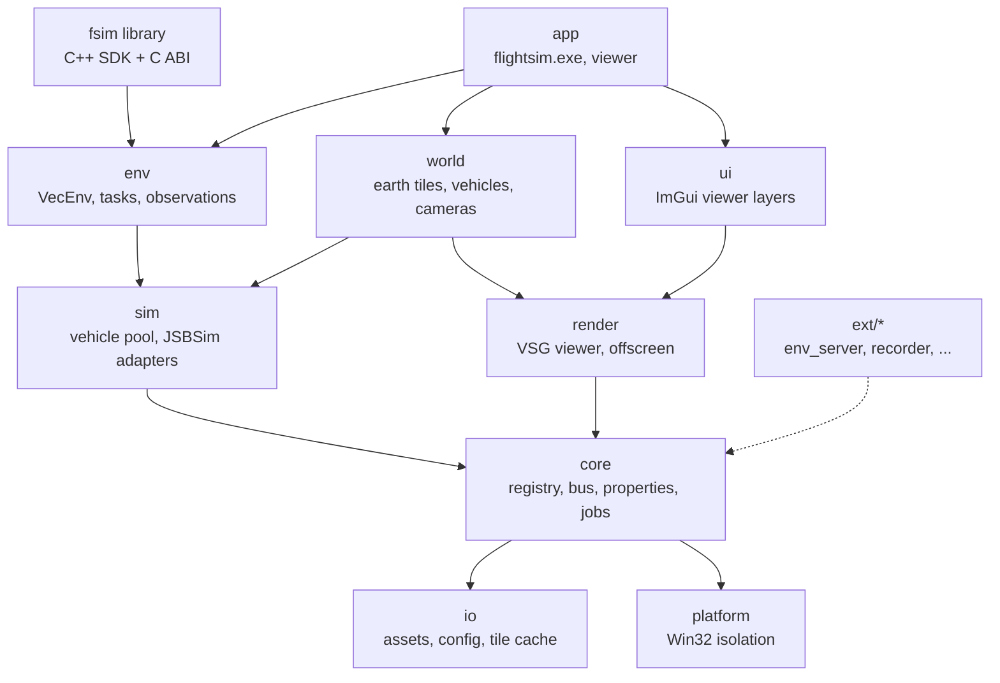
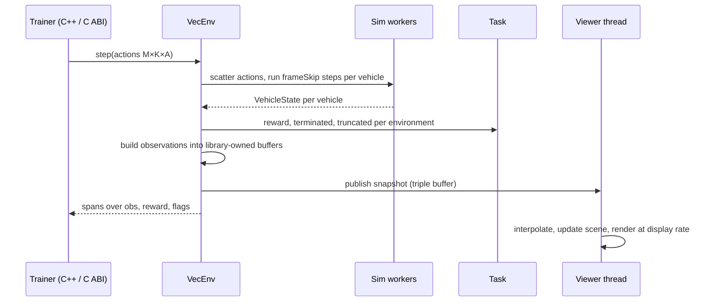
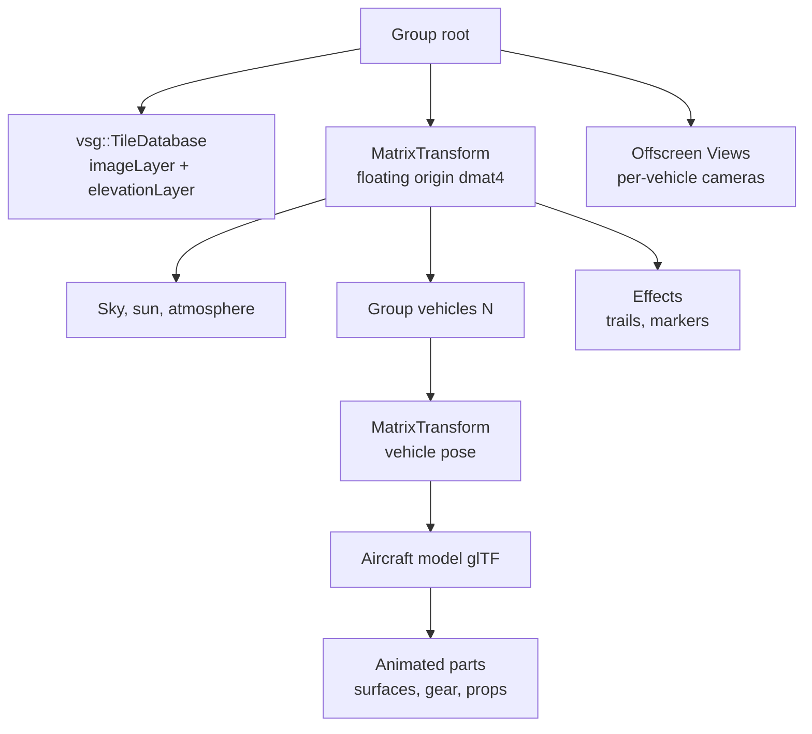

# Flight Simulator (C++ / VSG / JSBSim) — System Architecture & Design

2026-09-19 · @Someone

## 1. Purpose and scope

This document defines the architecture of a pure C++ flight-simulation platform for AI and reinforcement-learning (RL) training: JSBSim computes flight dynamics for many vehicles at once, VulkanSceneGraph (VSG) renders a full-Earth scene for visualisation and for vision-based observations, and a C++ SDK with a stable C ABI is the primary interface. It is the reference for structure, boundaries and major technical decisions; implementation details live in code and per-module design notes.

In scope: the application skeleton, module boundaries, runtime/threading model, integration of VSG and JSBSim, the RL environment API (C++ and C ABI), the debug viewer, VSG-native full-Earth terrain, build and packaging on Windows, and the extension mechanism. Out of scope for this revision: human-piloted operation (no flight-stick input, cockpit or instrument panels), networking/multiplayer, RL algorithms themselves, and certification-grade fidelity requirements. Project owner decisions of 2026-09-19 that shaped this revision: RL training is the primary purpose, full-Earth visualisation, no human pilot for now, powerful training hardware, open-source licence, Windows only, multiple vehicles, JSBSim used as-is, VSG mandatory, no Cesium, no Python.

Reading guide: sections 2–4 fix requirements and technology choices; sections 5–10 describe the design; sections 11–13 cover build, performance and cross-cutting concerns; sections 14–17 hold risks, roadmap, decisions and open questions.

## 2. Requirements and design drivers

Four drivers shape every decision below, in this priority order when they conflict: performance, portability, lightweight, extensibility. For an RL training platform "performance" means simulation throughput first and frame rate second, and "portability" means Windows x64 across GPU vendors today with a clean path to Linux servers later. Each driver has a measurable target so the architecture can be checked, not just argued.

| Driver | What it means here | Target (v1) | How it is enforced |
| --- | --- | --- | --- |
| Performance | Maximise simulated vehicle-steps per second; keep visualisation and vision rendering from slowing the simulation | ≥ 100,000 JSBSim vehicle-steps/s aggregate on a 16-core workstation (headless, stock c172/f16); a 64-vehicle scene renders at 60 fps at 1440p on an RTX-class GPU; vision observations at 128×128 for 64 vehicles ≥ 2,000 frames/s | parallel sim workers, zero per-step heap allocation, batched stepping API, offscreen render batching, throughput benchmark in CI |
| Portability | Windows 10/11 x64 on NVIDIA, AMD and Intel Vulkan drivers; no OS-specific code outside `platform/` so a Linux build is a port, not a rewrite | identical results on all three GPU vendors; `platform/` is the only module with Win32 includes (checked in CI) | C++17, VSG's own windowing and tile streaming, CMake, dependency isolation |
| Lightweight | Few dependencies, small install, low idle resource use, no language runtimes | headless library + viewer executable < 20 MB excluding terrain cache; ≤ 5 third-party libraries in the core; headless start < 1 s; idle RAM < 500 MB with 64 vehicles headless | static linking, dependency budget reviewed per ADR, VSG-native solutions preferred over third-party ones |
| Extensibility | New aircraft, tasks/rewards, observation types, sensors, cameras, data sinks and external trainers without touching the core | add a task or observation builder as a C++ module without core edits; bind the platform from any language through the C ABI; optional modules excluded at build time | module registry, property store, event bus, stable C++ SDK headers, versioned C ABI |

Secondary requirements that follow from the four drivers and the owner decisions:

- Determinism and reproducibility: given a seed, a scenario and a fixed step, every run produces the same trajectory; JSBSim guarantees this per instance when fed a fixed `dt`, and the platform never lets wall-clock time enter the simulation.
- Headless first: the simulation and environment API run with no window and no GPU; rendering is an optional module attached to a running simulation for visualisation or vision observations.
- Many vehicles: dozens to hundreds of JSBSim instances per process, stepped in parallel and in lockstep, grouped into independent environments.
- Full-Earth world on VSG alone: any latitude/longitude, WGS-84 ECEF double precision, imagery and elevation streamed by `vsg::TileDatabase` from a tile pyramid (self-hosted or public), and the same elevation tiles used for physics ground height, headless and offline once cached.
- Pure C++: no Python, Lua or other language runtime anywhere in the platform; external trainers use the C++ SDK or the C ABI.
- Open source: the platform is released under MIT; every dependency is MIT, Apache-2.0, BSD, Zlib or LGPL (JSBSim), with JSBSim linked as a shared library.
- JSBSim as-is: stock aircraft, engines, systems and XML scripts from the JSBSim repository; flight-control automation uses JSBSim's own FCS/autopilot definitions; no custom FDM code in v1.

## 3. Technology stack baseline

Licensing consequence: JSBSim's LGPL-2.1 is the only copyleft component. Dynamic linking of JSBSim, or shipping object files to allow relinking, keeps the application's own licence free. All other core components are MIT/Zlib/Apache.

The fixed stack is C++17, VSG 1.1.x and JSBSim 1.3.x, with vsgXchange for model loading and HTTP tile fetching and vsgImGui for the viewer UI; nothing else is required at runtime. All components are actively maintained and MIT/LGPL licensed; CMake is the build system because every dependency already uses it. Status checked 2026-09-19.

| Component | Version | License | Last release / push | Role | Notes |
| --- | --- | --- | --- | --- | --- |
| C++ | C++17 (GCC 16.2, MSYS2 UCRT64 — mandated toolchain at D:\\ENV\\DevLanguages\\Cpp\\msys2\\ucrt64) | — | — | Implementation language | C++17 is VSG's requirement; code stays C++17 so a GCC/Clang Linux port needs no language changes |
| [VulkanSceneGraph](https://github.com/vsg-dev/VulkanSceneGraph) | 1.1.16 | MIT | 2026-08-21 | Scene graph, Vulkan rendering, windowing, offscreen rendering, viewer, **full-Earth tile streaming (`vsg::TileDatabase` with `imageLayer` + `elevationLayer`)**, serialisation (`.vsgt/.vsgb`) | Requires Vulkan 1.1 SDK; glslang optional |
| [vsgXchange](https://github.com/vsg-dev/vsgXchange) | tracks VSG | MIT | 2026-08-24 | glTF loader (assimp), KTX/PNG/JPEG image readers, `curl` reader for HTTP tile sources | Only assimp, KTX, stb\_image and curl modules enabled; GDAL module off |
| [JSBSim](https://github.com/JSBSim-Team/jsbsim) | 1.3.1 | LGPL-2.1 | 2026-05-17 (push 2026-09-15) | Flight dynamics (`FGFDMExec`), stock aircraft/engines/systems, XML scripts, property tree | Linked as a DLL; one instance per vehicle |
| [vsgImGui](https://github.com/vsg-dev/vsgImGui) | 0.8.0 | MIT | 2026-08-21 | Dear ImGui + ImPlot debug/monitor UI inside the VSG frame | Viewer only |
| libcurl (via vsgXchange) | current | MIT-style | active | HTTP(S) fetch of imagery/elevation tiles when a remote pyramid is used | not needed for file-based pyramids |
| CMake + vcpkg | ≥ 3.25 / manifest mode | BSD-3 / MIT | — | Build and dependency management | vcpkg has ports for every dependency above |
| Offline tooling only: GDAL | current | MIT | active | `tools/tile_builder` converts DEM and imagery sources into the tile pyramid | never linked into the platform; runs at data-preparation time |

Compiler and platform for v1 (owner decision 2026-09-19): MSYS2 **UCRT64** — GCC 16.2, mingw-w64, UCRT — on Windows 10/11 x64; CMake 4.1 and Ninja from the same environment; Vulkan headers/loader, glslang, SPIRV-Tools, assimp and curl from MSYS2 packages. The MSYS2 installation must be kept consistent with `pacman -Syu` (partial upgrades break newly installed packages). MSVC is not used. A Linux build is not a v1 deliverable but nothing in the stack prevents it.

## 4. Entry point and primary interface evaluation

Recommendation: the primary interface is a C++ SDK (`fsim::VecEnv`, static or shared library, public headers under `include/fsim/`) with a versioned C ABI (`fsim_c.h`) exported from the same DLL so trainers in any compiled language can bind it; an optional shared-memory environment server serves out-of-process trainers. The graphical interface is an optional in-process viewer using VSG's native window and Dear ImGui (vsgImGui). No scripting runtime, no flight-stick input and no cockpit UI.

### 4.1 Primary interface: how RL code reaches the simulator

| # | Option | How it works | Step overhead (64 envs) | Extra dependencies | Verdict |
| --- | --- | --- | --- | --- | --- |
| I1 | C++ SDK, in-process | trainer links `fsim.lib`/`fsim.dll`, calls `VecEnv::step(actions) -> batch` on preallocated buffers | \~0 (function call) | none | **Selected as primary** — fastest possible, type-safe, the platform's own tests and tools use it |
| I2 | C ABI, in-process | `fsim_c.h`: opaque handles, plain structs, `fsim_vecenv_step(h, actions, n)`; buffers owned by the library | \~0 | none | **Selected as companion** — stable across compiler versions; Rust/C#/Julia/Go bind it with their standard FFI tools; an `extern "C"` layer over I1 |
| I3 | Shared-memory environment server | `flightsim.exe --serve` maps a ring of action/observation buffers; trainer process attaches; semaphore handshake per step | \~20–50 µs | none (Win32 named shared memory in `platform/`) | **Selected as optional module** `ext/env_server` — isolates trainer crashes from the simulator, allows a different toolchain per side |
| I4 | TCP/UDP flat-binary protocol | same message layout as I3 over a socket | 100–300 µs + network | none | variant of I3 for remote trainers; post-v1 |
| I5 | gRPC / protobuf service | RPC per step | 200–500 µs, serialisation | gRPC, protobuf (\~10 MB) | rejected: dependency weight and latency for no gain over I3/I4 |
| I6 | Embedded scripting runtime (Lua, Python) | scripts drive the loop in-process | — | runtime + bindings | rejected by owner decision |
| I7 | In-process training with LibTorch | RL algorithm in C++ using the LibTorch C++ API | 0 | LibTorch (CPU \~200 MB, CUDA \~2 GB) | not part of the platform; supported as a consumer of I1 (`examples/torch_ppo` shows it); never a core dependency |

### 4.2 Graphical interface (optional viewer)

| # | Option | UI toolkit | Extra dependencies | Approx. size | Verdict |
| --- | --- | --- | --- | --- | --- |
| A | VSG native window + vsgImGui | Dear ImGui + ImPlot | none beyond VSG | \~0.5 MB | **Selected** — monitoring, telemetry plots, property browser, camera control |
| C | SDL3 / GLFW window + adopted surface | Dear ImGui | SDL3 or GLFW | 0.3–2 MB | rejected: a second library owning the window for no benefit; joystick support is not needed |
| E | Qt 6 + vsgQt | Qt Widgets/QML | Qt6 (LGPL-3) | 20–35 MB | rejected for the viewer; possible future scenario editor as a separate tool |
| G | RmlUi | HTML/CSS documents | RmlUi + FreeType | 2–3 MB | rejected: no operator-facing UI to justify it |
| H | Web dashboard (browser) | HTML/JS served from the process | embedded HTTP server (\~0.3 MB) | small | deferred: remote monitoring of long training runs; post-v1 module |

### 4.3 Scoring against the requirements

Scale 1 (poor) to 5 (excellent); weights follow the driver priority in section 2.

| Criterion (weight) | I1+I2 C++ SDK & C ABI + A | I3 shared memory + A | I5 gRPC + A | I1 + E Qt viewer |
| --- | --- | --- | --- | --- |
| Performance (3) | 5 | 4 | 2 | 5 |
| Portability (3) | 5 | 4 | 5 | 4 |
| Lightweight (2) | 5 | 5 | 3 | 1 |
| Extensibility (2) | 5 | 5 | 4 | 5 |
| VSG / JSBSim integration (2) | 5 | 5 | 4 | 4 |
| Maintainability (2) | 5 | 4 | 4 | 4 |
| Weighted total (max 70) | 70 | 62 | 51 | 55 |

### 4.4 Decision and rationale

- Entry points: (1) the `fsim` library, linked by the trainer's own C++ program — the primary one; (2) `flightsim.exe` for headless batch runs, benchmarks, recording and `--serve` (shared-memory server); (3) `flightsim-viewer.exe`, or `attachViewer()` from the SDK, for the window. All construct the same `Application` object.
- Batched API: `VecEnv` holds M environments, each with K vehicles; `step()` consumes an `(M×K×A)` action span and fills `(M×K×O)` observation, reward and flag buffers owned by the library, so one call advances every vehicle and no data is copied. The C ABI exposes the same buffers as raw pointers with sizes and a layout version.
- Windowing and viewer: `vsg::Window` and `vsg::Viewer`, Dear ImGui through vsgImGui. The viewer never blocks the simulation; it renders the latest snapshot at display rate (section 6).
- Not included: Python, Lua, Cesium/3D Tiles, SDL3, HUD, instruments, cockpit view. The event/property infrastructure stays, so a piloted mode can be added later as a module.

## 5. System architecture overview

The platform is a set of statically linked C++ modules in five layers with strictly downward dependencies, exposed through the `fsim` library (C++ SDK + C ABI) and two thin executables. VSG's object model (`vsg::Object`, `vsg::ref_ptr`, visitors, `vsg::Input/Output`) is the single object model for the codebase; the `env` layer, which turns simulations into RL environments, sits above `sim` and knows nothing about rendering.



Reading the diagram: `env` is the RL-facing layer and the only thing a trainer sees; `world` and `render` are optional and attach to a running `sim` to visualise it or to produce vision observations; `core` knows neither JSBSim nor Vulkan and runs headless.

| Module | Responsibility | Depends on | External libs |
| --- | --- | --- | --- |
| `fsim` (SDK) | Public C++ headers (`fsim/VecEnv.h`, `fsim/Scenario.h`, `fsim/Spaces.h`) and the `extern "C"` layer `fsim_c.h`; the only exported symbols of `fsim.dll` | `env` | — |
| `app` | `flightsim.exe` (headless runs, benchmark, record, `--serve`) and `flightsim-viewer.exe`; command line, configuration, module wiring | all | — |
| `env` | `Environment` = scenario + vehicles + task; `VecEnv` batching M environments; observation and action builders; task/reward/termination interface; seeding; episode bookkeeping | `sim`, `core` | — |
| `sim` | `VehiclePool`: N `FlightModel` instances stepped in parallel by a worker pool in lockstep; JSBSim adapter; scenario spawning; environment model (atmosphere, wind); `GroundProvider` reading elevation tiles | `core`, `io` | JSBSim |
| `world` | Scene composition: `vsg::TileDatabase` Earth (imagery + elevation layers), vehicle visuals and part animation, cameras (chase, orbit, free, per-vehicle sensor cameras), sun and sky; maps sim snapshots to scene transforms | `sim`, `render`, `core` | VSG |
| `render` | Window and offscreen render targets, viewer, render/command graphs, shader sets, GPU→host readback for vision observations, frame statistics | `core` | VSG, vsgXchange |
| `ui` | ImGui layers: monitor (throughput, episode stats), telemetry plots, property browser, camera and vehicle selection, scenario controls | `render`, `core` | vsgImGui |
| `io` | Asset resolver, config, JSBSim aircraft path management, tile pyramid access and disk cache (shared by physics and rendering), recording files | `platform` | vsgXchange (curl, image readers) |
| `core` | Module registry and lifecycle, event bus, property store, deterministic RNG streams, job system, logging, profiler | `io`, `platform` | VSG core |
| `platform` | Win32 specifics: paths, high-resolution clock, thread naming/affinity, shared memory, crash handler | — | Win32 |
| `ext/*` | Optional modules: `env_server` (shared memory), `recorder`, `web_dashboard`, extra sensors, scripted traffic | `core` + what they need | per module |

Dependency rules, enforced by CMake target visibility and a CI check:

1. No module includes a header from a layer above it; `env` never includes `render` or `world`.
2. JSBSim headers appear only inside `sim`; Vulkan and `vsg::` GPU types only inside `render`, `world` and `ui`; Win32 headers only inside `platform`.
3. Hot-path communication (stepping, snapshots, observations) uses typed buffers described in section 6, never the event bus.
4. Optional modules are compiled in via CMake options and self-register through `core::ModuleRegistry`; the headless configuration (`sim` + `env` + `fsim`, no `render`/`world`/`ui`) builds and runs without the Vulkan SDK.
5. Only `fsim/*.h` and `fsim_c.h` are public; everything else may change without notice.

## 6. Runtime model

The simulation is driven in lockstep by the caller (`VecEnv::step()` from the trainer's C++ code, the C ABI, or the shared-memory server), not by a clock: each call advances every vehicle by a fixed number of JSBSim steps across a worker pool, then builds observations; the optional viewer runs on its own thread at display rate and reads immutable snapshots, so visualisation never slows training.

### 6.1 Process entry

1. The trainer constructs `fsim::VecEnv(scenarioPath, options)` (or `flightsim.exe` does) which builds `Application` in headless mode: `core` services, `io`, `sim`, `env`. The Vulkan SDK is not touched.
2. Scenario files (`.vsgt` text or JSON) define per-environment vehicles (JSBSim aircraft name, initial-condition distributions, JSBSim script if any), the task id, observation and action specs, the sensors and the tile pyramid to use for ground height.
3. `VehiclePool` creates one `JsbsimModel` per vehicle (M environments × K vehicles), each with its own `FGFDMExec`, `dt` and RNG stream derived from the seed.
4. `reset()` runs `RunIC()` per vehicle and fills the first observation batch.
5. `step(actions)` for each call: scatter actions to vehicles, step all vehicles `frameSkip` times in parallel, compute rewards/terminations in the task, gather observations into the output buffers, auto-reset finished environments, publish a snapshot for viewers.
6. `attachViewer()` (or `flightsim-viewer.exe --attach`) constructs `render`, `world` and `ui` on a separate thread with a window; detaching destroys them without affecting the simulation.
7. Shutdown is reverse order; `shutdown()` runs on every module even after an exception so JSBSim outputs and recordings are flushed.

### 6.2 Threads

| Thread | Driven by | Owns | Must never |
| --- | --- | --- | --- |
| Caller (trainer) | `step()` / `reset()` calls | `VecEnv`, task evaluation, observation assembly | touch `vsg::` GPU objects |
| Sim workers (`nWorkers`, default = physical cores − 2) | work items = one vehicle × `frameSkip` steps | `FGFDMExec` instances (each worker touches only its assigned vehicles for a given call) | allocate, log at info level, or share state across vehicles |
| Render (viewer only) | display refresh | `vsg::Viewer`, window events, ImGui, scene mutation | call into JSBSim or block the sim workers |
| Vision render (optional) | `step()` when a vision observation is requested | offscreen `vsg::View`s for sensor cameras, readback | — (synchronous with the step: the caller waits for readback) |
| Job pool | on demand | tile fetch/decode for `vsg::TileDatabase` and the ground provider, recording flush | mutate the live scene graph directly |
| Server (optional `ext/env_server`) | semaphore from the trainer process | shared-memory ring, one `VecEnv` | — |

### 6.3 Stepping and data flow



`VehicleState` is a fixed-size POD (ECEF position `dvec3`, attitude `dquat`, body and NED velocities, rates, accelerations, control positions, engine data, gear state, \~60 scalars) written by the worker that stepped the vehicle. Observation builders read these plus any cached JSBSim property handles declared in the observation spec; outputs are `float32` arrays owned by `VecEnv` and returned as `std::span` (C++) or pointer + length (C ABI) without copying. Actions map to JSBSim `fcs/*-cmd-norm` properties or, when the scenario says so, to JSBSim autopilot targets (heading, altitude, airspeed), which uses JSBSim's own FCS as-is.

### 6.4 Time

- Simulation time advances only inside `step()`; there is no real-time clock in the training path. `dt` (default 1/120 s) and `frameSkip` (default 4 → 30 Hz agent rate) are scenario parameters.
- Determinism: fixed `dt`, per-vehicle RNG streams seeded from `(seed, envIndex, vehicleIndex)`, and no dependence on thread scheduling (each vehicle's step is independent), so results are identical regardless of `nWorkers`.
- Viewer time: the render thread interpolates between the two latest snapshots using their simulation timestamps and shows the current wall-clock speed factor; a `--realtime` option throttles `step()` calls in the exe only.

### 6.5 Budget per `step()` (64 environments × 1 vehicle, frame\_skip 4, 16 workers)

Measured 2026-09-19 (M0 build, Release, 16-thread desktop, c172x, frame-skip 4): one JSBSim step costs \~6 µs, not the 40 µs assumed in the first draft. 64 vehicles run at 148,000 vehicle-steps/s on one worker and 1,138,000 on 16 workers (`step()` mean 0.225 ms), i.e. 11× the section 2 target before any tuning; the f16 runs at 757,000 on 6 workers. Vision observations add GPU render + readback time and will be the dominant cost when enabled (section 8.4).

## 7. Flight dynamics integration (JSBSim)

JSBSim is used as-is — stock aircraft, engines, systems, autopilots and XML scripts from the JSBSim repository — behind a `sim::FlightModel` interface implemented by `sim::JsbsimModel`, one instance per vehicle; the rest of the platform never sees JSBSim types, units or its property tree, and all conversion to SI units and the ECEF-metre world frame happens inside the adapter.

### 7.1 Interface

```cpp
class FlightModel : public vsg::Inherit<vsg::Object, FlightModel> {
public:
    virtual bool load(const AircraftSpec&, const InitialConditions&) = 0;
    virtual void step(const ControlInputs&, double dt) = 0;   // exactly one fixed step
    virtual void state(VehicleState&) const = 0;              // fill snapshot, SI units, ECEF metres
    virtual PropertyHandle property(std::string_view path) = 0; // cached, O(1) read/write after lookup
    virtual void reset(const InitialConditions&) = 0;
};
```

`step()` is the only method called at 120 Hz; `property()` returns a handle wrapping a cached `FGPropertyNode*` so hot reads (instrument values, control positions) never repeat a string lookup.

### 7.2 JSBSim adapter lifecycle

| Phase | JSBSim calls | Notes |
| --- | --- | --- |
| Construct | `FGFDMExec`, `SetRootDir`, `SetAircraftPath`, `SetEnginePath`, `SetSystemsPath`, `Setdt(dt)` | one instance per vehicle; JSBSim's own `aircraft/`, `engine/`, `systems/` and `scripts/` directories are shipped unchanged as the asset root |
| Load | `LoadModel(name)`, `GetIC()->...`, optionally `LoadScript(path)`, `RunIC()` | runs on a sim worker inside `try/catch`; XML errors become a `LoadFailed` result on the environment, never a crash. Initial conditions come from the scenario (lat/lon/alt, heading, speed) or a JSBSim IC file |
| Step | write commands via cached nodes (`fcs/*-cmd-norm`, `fcs/throttle-cmd-norm[n]`, gear, flaps, brakes, or autopilot targets `ap/*` when the aircraft defines them), `Run()` × `frame_skip`, read state | `Run()` advances exactly `dt`; JSBSim scripts, event triggers and `FGOutput` (CSV/socket) remain available and are enabled per scenario for logging |
| Reset | `ResetToInitialConditions(0)`, then re-apply randomised ICs from the environment's RNG stream | preserves the loaded model; a reset costs \~1 ms, so environments auto-reset in place |
| Destroy | destructor | JSBSim logging routed to `core::Log` via `FGLogger`, level warning and above only on workers |

### 7.3 Units and frames

| Quantity | JSBSim | Application (`VehicleState`) | Conversion |
| --- | --- | --- | --- |
| Position | ECEF, feet (`FGPropagate::GetLocation`), WGS-84 | ECEF, metres, `vsg::dvec3` | × 0.3048 |
| Attitude | body-to-local (NED) Euler/quaternion; body axes x forward, y right, z down | ECEF-to-body quaternion `vsg::dquat`; model axes x forward, y left, z up | compose with NED-to-ECEF at current lat/lon; body→model flips y and z |
| Velocities | body frame ft/s, NED ft/s | body and NED m/s | × 0.3048 |
| Angular rates | rad/s | rad/s | none |
| Mass, forces | slugs, lbf | kg, N | × 14.5939, × 4.44822 |
| Altitude | ft (`position/h-sl-ft`), AGL via terrain callback | m | × 0.3048 |

Terrain: JSBSim asks the host for ground elevation through `FGGroundCallback`; the adapter implements it against `sim::GroundProvider`, which samples the same elevation tile pyramid that `vsg::TileDatabase` renders (section 8.2), decoded on the CPU by `io::TilePyramid` at a configurable level (default: the pyramid's finest level, 30 m) with bilinear interpolation in double precision. Physics and rendering therefore read identical data, the provider works headless and offline once tiles are cached, and it is deterministic.

### 7.4 Rendering frame

The world frame is ECEF metres in double precision. `world` keeps a floating origin: the scene root is a `vsg::MatrixTransform` with a `dmat4` that re-bases the scene near the camera, so GPU floats never see coordinates above \~10 km. VSG performs the `dmat4` × `dmat4` multiplication on the CPU during record and uploads floats, which is what its `dmat4` transforms exist for.

### 7.5 Multiple vehicles

`sim::VehiclePool` owns N `FlightModel`s and steps them with a fixed worker pool: each `step()` call partitions vehicles across workers in a deterministic order, every worker steps its vehicles `frame_skip` times, and a barrier ends the call. Vehicles share nothing (separate `FGFDMExec`, separate ground-provider cache handles), so scaling is linear until memory bandwidth limits; JSBSim's \~5–10 MB per instance puts 256 vehicles at 1.5–2.5 GB, well within the training hardware. Interactions between vehicles (relative geometry for pursuit/evasion or formation tasks, simple collision detection) are computed in the `env` task layer from the snapshot batch after the step, not inside the FDM. A lighter `KinematicModel` implementing the same interface serves scripted traffic and replay without a JSBSim instance.

## 8. Visualization design (VSG)

Rendering is an optional module built entirely on VSG with two jobs: a full-Earth viewer for humans (one `vsg::Viewer`, one window, Earth streamed by VSG's own `vsg::TileDatabase`, ImGui overlay) and offscreen sensor cameras that produce vision observations for agents; both read the same immutable snapshots and share one scene graph, and neither is present in the headless training configuration.

### 8.1 Scene graph layout



`vsg::TileDatabase` builds a `PagedLOD` quadtree over the WGS-84 `EllipsoidModel` in ECEF metres with its own precision handling; vehicle transforms above the model level are `dmat4`, model-local data is float.

### 8.2 Components

| Concern | Design | Why |
| --- | --- | --- |
| Full-Earth terrain and imagery | `vsg::TileDatabase` with `TileDatabaseSettings`: `imageLayer` and `elevationLayer` URL templates (`{z}/{x}/{y}`), `ellipsoidModel` = WGS-84, `maxLevel` per pyramid, `lodTransitionScreenHeightRatio` tuned per quality tier; tiles come from a **self-hosted tile pyramid** (files on disk or any HTTP server) produced by `tools/tile_builder`, or from public XYZ imagery servers (OpenStreetMap, Bing via VSG's `createBingMapsSettings()`) for quick starts | VSG-native, zero extra runtime dependency, streamed by VSG's `DatabasePager` on the job pool, cached on disk by `io` |
| Tile pyramid format | imagery: JPEG or KTX2 256×256 tiles; elevation: 16-bit PNG heightmaps (metres × scale + offset, documented in `pyramid.json`) decoded by vsgXchange's stb\_image reader and interpreted through `elevationLayerCallback`; global coverage from Copernicus GLO-30 (30 m) or GLO-90 built offline | one format for physics and rendering; PNG/JPEG readers already in the stack; no GDAL at runtime |
| Physics vs. visual ground | both read `io::TilePyramid`; the viewer's debug layer shows the residual between the CPU sample and the rendered mesh at the selected vehicle (mesh simplification + skirts explain sub-metre differences) | consistency by construction |
| Aircraft models | glTF 2.0 via vsgXchange; a `ModelManifest` (`.vsgt`) maps named nodes to `VehicleState` fields; stock JSBSim aircraft get simple placeholder models until proper ones exist | one loader, PBR materials |
| Part animation | `world::PartAnimator` resolves named transforms once at load and writes rotations each frame from the interpolated snapshot | no per-frame lookups |
| Sky / lighting | analytic sky shader; sun position from scenario date/time; one directional light + ambient; VSG PBR `ShaderSet`; shadows optional | no texture assets; time of day for free |
| Cameras | `CameraController` strategies: chase, orbit, free, tower, follow-selected; plus `SensorCamera`s attached to vehicles for vision observations | swap by key; sensors are data-defined in the scenario |
| Many vehicles | vehicle subgraphs share model geometry (one loaded model, N transforms); per-vehicle `vsg::Switch` for visibility; selection and labels via ImGui overlay | 64–256 vehicles at 60 fps with a few draw calls per model |
| Shaders | GLSL compiled to SPIR-V at build time; runtime glslang only in developer builds | size and startup |
| Frame statistics | VSG frame stamps + GPU timestamp queries in the ImGui monitor | needed to hold budgets |

### 8.3 Viewer update pass

Each frame the render thread pumps events (VSG visitors, then ImGui), acquires the latest snapshot batch and interpolates, writes vehicle `dmat4`s and part rotations, updates the floating origin when the camera moved more than 5 km, updates cameras, builds the ImGui frame, then `viewer->update()`, `recordAndSubmit()`, `present()`. `vsg::DatabasePager` loads and compiles tiles on its own threads and merges them during `update()`; the pager's memory and tile-request limits are set per quality tier.

### 8.4 Vision observations

When a scenario declares a camera observation (`rgb`, `depth`, `segmentation`; resolution, field of view, mount pose), `render` creates an offscreen `vsg::View` per sensor rendering into a shared image array; all sensors for a `step()` are recorded into one command buffer, submitted once, and read back with a single copy into a host-visible buffer exposed as an `(M×K×H×W×C)` `uint8`/`float16` span. Terrain tiles for sensor views are requested by the pager from each sensor camera, so agents see the same Earth the viewer does; for training on a fixed region the pyramid is prefetched by `tools/tile_builder --prefetch` so no I/O happens during episodes. Budget: 64 cameras at 128×128 RGB in under 30 ms per step on an RTX-class GPU; a GPU-resident path (no host readback) is a post-v1 optimisation.

### 8.5 Assets and cache

The install ships shaders, placeholder aircraft models, the JSBSim aircraft tree and the ImGui font (< 20 MB). The tile pyramid is separate data: a global 90 m elevation + low-resolution imagery pyramid is \~3 GB; 30 m elevation with 10 m imagery for a training region of 500×500 km is \~2 GB. Both are built once with `tools/tile_builder` and either copied locally or served from any static HTTP server; the runtime disk cache has a configurable size limit (default 20 GB).

## 9. User interface design: C++ SDK, C ABI and viewer

The primary interface is the `fsim` library — a C++17 SDK and a versioned `extern "C"` ABI over it; the viewer is a set of stateless ImGui layers reading snapshots and emitting commands. Neither contains simulation logic, so both can change freely without touching `sim` or `env`.

### 9.1 C++ SDK

```cpp
#include <fsim/VecEnv.h>

fsim::VecEnvOptions opt;
opt.numEnvs = 64; opt.seed = 7;
opt.observation = "state";          // or "state+rgb"
opt.action = "surfaces";            // or "autopilot"
fsim::VecEnv env("scenarios/pursuit_f16.vsgt", opt);

auto batch = env.reset();            // spans over library-owned buffers
std::vector<float> actions(env.actionSize());
for (int i = 0; i < 10'000; ++i) {
    policy(batch.observations, actions);         // (M×K×A) float32
    batch = env.step(actions);                   // obs, reward, terminated, truncated, info
}
env.attachViewer();                              // optional window, non-blocking
auto vc = env.property("velocities/vc-kts");     // cached handle, per vehicle
env.record("runs/ep1.fsrec");                    // snapshots + actions at agent rate
```

| Element | Design |
| --- | --- |
| `VecEnv` | `reset(seed, options)`, `step(actions)`, `observationSpace()`, `actionSpace()`, `numEnvs()`, `numVehicles()`, auto-reset with final observation in `info`; all buffers preallocated and owned by the library, returned as `std::span` |
| Spaces | `Box` float32 for state observations and continuous actions; a `Dict`-like `ObservationLayout` describing offsets when vision or multiple sensors are declared; discrete action mapping available as a builder |
| Multi-agent | vehicle-major layout `(M×K×…)` so per-agent views are slices; `env.agentView(envIndex, vehicleIndex)` returns spans |
| Scenario | `.vsgt` (VSG text serialisation, human-readable) or JSON: vehicles (aircraft, IC distributions, optional JSBSim script), task id and parameters, observation/action specs, sensors, tile pyramid, date/time and weather |
| Tasks | C++ classes registered by id: waypoint following, altitude/heading hold, pursuit–evasion, formation; user tasks implement `fsim::Task` (vectorised `evaluate(batch)`) and register through the SDK without rebuilding the platform |
| Observations | state builders from `VehicleState` and property handles (normalised); relative-geometry features between vehicles; vision spans from section 8.4 |
| Actions | `surfaces`: aileron/elevator/rudder/throttle (±1 normalised) written to `fcs/*-cmd-norm`; `autopilot`: targets written to the aircraft's JSBSim autopilot properties, using JSBSim's own FCS as-is |
| Errors | no exceptions from `step()`; load-time failures throw `fsim::Error` with a code and message; the C ABI returns error codes and a last-error string |

### 9.2 C ABI

`fsim_c.h` exports opaque handles and plain structs: `fsim_vecenv_create(path, const fsim_options*, fsim_vecenv**)`, `fsim_vecenv_reset`, `fsim_vecenv_step(h, const float* actions, size_t n)`, `fsim_vecenv_buffers(h, fsim_buffers*)` (pointers + sizes + layout version), `fsim_vecenv_attach_viewer`, `fsim_vecenv_destroy`, `fsim_abi_version()`. The layout is fixed for a major version; every buffer is 64-byte aligned. This is the binding surface for Rust (`bindgen`), C#, Julia, Go or any other trainer language — the platform ships no bindings itself.

### 9.3 Shared-memory server (optional module)

`flightsim.exe --serve <scenario> --envs 64 --shm fsim0` maps a named shared-memory region holding the same buffers as 9.2 plus a control block (step counter, command word) and two named semaphores; a trainer in another process writes actions, signals, waits, reads observations. Layout and protocol are documented in `docs/env_server.md`; the trainer never links `fsim`.

### 9.4 Command line

`flightsim.exe --scenario <file> [--envs N] [--steps S] [--benchmark] [--record <file>] [--serve --shm <name>] [--viewer] [--realtime]` and `flightsim-viewer.exe --attach <scenario|recording|shm-name>`. Parsing uses `vsg::CommandLine`; every option maps to the same configuration schema as `config.json`.

### 9.5 Viewer layers (ImGui)

| Layer | Content | Default key |
| --- | --- | --- |
| Monitor | vehicle-steps/s, `step()` time breakdown, environments and episodes, reward statistics, GPU/CPU frame time | always on |
| Vehicle list | table of all vehicles with state summary; click to follow; multi-select for labels and trails | `L` |
| Telemetry | ImPlot strip charts of any property path for the selected vehicles; CSV export | `T` |
| Property browser | live JSBSim/application property tree with search and (when paused) edit | `P` |
| Scenario controls | pause/resume stepping (exe only), reset environment, camera mode, time-of-day, quality tier | menu |
| Sensor preview | thumbnails of vision observations for the selected vehicle | `V` |
| Debug | VSG statistics, tile streaming status, ground-provider vs. terrain height difference, thread states | `F3` |

### 9.6 Input and style

Keyboard and mouse only, delivered by VSG to a `ui::EventDispatcher` that offers events to ImGui first and then to the camera controller and key-binding table. One ImGui style, DPI scaling from the window's content scale, a single embedded font.

## 10. Extensibility

Extension happens at four levels — data, SDK registration, built-in modules and (later) dynamic plugins — and every level reaches the same small set of core interfaces, so a task can start in the trainer's own code, be promoted to a built-in module, and be split into a plugin without changing the core.

### 10.1 Extension points

| Level | Mechanism | Examples | Requires platform rebuild |
| --- | --- | --- | --- |
| Data | `.vsgt`/JSON scenarios and manifests resolved through `io::AssetResolver`; JSBSim XML; tile pyramids | new aircraft (JSBSim XML + glTF + manifest), scenarios, IC distributions, sensor definitions, quality presets, training regions | no |
| SDK registration | trainer code implements `fsim::Task`, `fsim::ObservationBuilder` or `fsim::ActionMapper` and registers it by id through the SDK before creating a `VecEnv` | curriculum, reward shaping, custom observation stacks, discrete action sets | no (trainer rebuild only) |
| Registries | `core::Registry<T>` keyed by string id, populated in module `init()` | tasks, observation builders, action mappers, flight-model implementations, camera controllers, sensors, UI layers | yes (static) |
| Modules | `core::Module` interface (`init / start / update(phase) / stop / shutdown`), compiled in behind a CMake option, self-registering | `ext/env_server`, `ext/recorder`, `ext/web_dashboard`, `ext/lidar`, `ext/traffic` | yes |
| Dynamic plugins | same `Module` interface exported through `extern "C" Module* createModule()`, loaded from a plugin directory | third-party sensors or tasks without source access | no (post-v1) |

### 10.2 Core interfaces modules use

- `EventBus`: typed publish/subscribe (`bus.subscribe<VehicleLoaded>(...)`) for low-rate events: load, reset, pause, camera change, device hot-plug. Dispatch is on the render thread between frames; the sim thread posts, never dispatches.
- `PropertyStore`: string-addressed tree of scalars and strings mirroring the JSBSim tree plus application values (`/app/time-factor`, `/render/fps`). Handles are resolved once and read lock-free; this is how UI, telemetry, recorder and scripting reach any value without new APIs.
- `Registry<T>`: id → factory; unknown ids produce a logged error and a no-op default, never a crash.
- `JobSystem`: `submit(fn)` and `submitOnRender(fn)` for work that must land on the render thread.
- `Context`: what `init()` receives — the services above, the `vsg::Viewer` (may be null when headless), the asset resolver and configuration.

### 10.3 Stability rules

1. Headers under `include/fsim/` are the SDK; anything else is internal and may change without notice.
2. Modules never include each other's headers; they communicate through the bus, the property store or registries.
3. The core compiles with every `ext/*` option off, and CI builds that configuration.
4. `VehicleState` may only gain fields, appended, so recorders and network consumers stay compatible.

### 10.4 No scripting runtime

The platform embeds no scripting language. Behaviour that would be scripted elsewhere is either data (scenarios, JSBSim XML scripts and autopilots, which are used unchanged) or compiled C++ registered through the SDK. External orchestration — sweeps, curricula, evaluation — lives in the trainer program, which talks to the platform through the C++ SDK, the C ABI or the shared-memory server.

## 11. Build, dependencies and packaging

A single CMake super-project builds Windows x64 with MSVC 2022, resolves dependencies through a vcpkg manifest with pinned baseline, produces the `fsim` library (headers + DLL + import lib), two executables and the offline tile tool, and is released under MIT.

### 11.1 Repository layout

```
flightsim/
├─ CMakeLists.txt          options: FSIM_WITH_RENDER, FSIM_BUILD_TOOLS, FSIM_EXT_*
├─ vcpkg.json              manifest + baseline
├─ cmake/                  toolchain, warnings, LTO, dependency checks, install/export
├─ include/fsim/           public C++ SDK headers + fsim_c.h (section 10.3)
├─ src/{app,core,env,sim,world,render,ui,io,platform}/
├─ ext/{env_server,recorder,web_dashboard,...}/
├─ shaders/                GLSL -> SPIR-V at build time
├─ assets/                 placeholder models, fonts, ui; JSBSim data tree as a submodule
├─ scenarios/              example scenarios and tasks (.vsgt)
├─ examples/               minimal_trainer (C++), torch_ppo (optional, LibTorch), rust_ffi (C ABI)
├─ tests/                  Catch2 unit + integration, golden trajectories, benchmarks, ABI tests
└─ tools/                  tile_builder (GDAL, offline), scenario validator, asset packer
```

### 11.2 Dependency budget

| Library | Configuration | Linked | Estimated release size |
| --- | --- | --- | --- |
| JSBSim (bundled expat) | headless + viewer | DLL (LGPL) | \~2.5 MB |
| VulkanSceneGraph (incl. `TileDatabase`, `DatabasePager`) | viewer | static | \~3 MB |
| vsgXchange (assimp glTF, KTX, stb\_image, curl) | viewer; `curl` + image readers also in headless for tile access | static | \~3–4 MB (assimp is the bulk; a glTF-only build cuts it to \~1 MB) |
| libcurl + zlib (via vsgXchange) | headless + viewer | static | \~0.7 MB |
| Dear ImGui + ImPlot (vsgImGui) | viewer | source | \~0.6 MB |
| Catch2 | tests | — | 0 |
| GDAL | `tools/tile_builder` only | separate exe | not shipped with the platform |
| Vulkan loader | system | `vulkan-1.dll` from the driver | 0 |

Headless `fsim.dll`: \~5 MB. Viewer executable: \~9–12 MB. Total install well under the 20 MB target; LTO and `/OPT:REF,ICF` on for release. M0 note: JSBSim is built from the submodule's own `src/` CMake tree (it must ship its data tree anyway) and Catch2 is fetched at configure time; the vcpkg manifest arrives with the VSG dependencies in M3.

### 11.3 Platform notes (Windows 10/11 x64)

| Topic | Decision |
| --- | --- |
| Toolchain | MSYS2 UCRT64: GCC 16.2, CMake ≥ 3.25, Ninja, MSYS2 pacman packages (vulkan-headers, vulkan-loader, glslang, spirv-tools, assimp, curl); toolchain file cmake/toolchains/ucrt64.cmake; LTO off (GCC LTO collides with dllexport vtables in JSBSim.dll) |
| CRT | dynamic UCRT, `/MD`; the C ABI carries no CRT types so trainers built with other compilers or runtimes can link `fsim.dll` |
| Distribution | zip with `bin/` (`fsim.dll`, `JSBSim.dll`, `flightsim.exe`, `flightsim-viewer.exe`), `include/fsim/`, `lib/fsim.lib`, `share/` (assets, scenarios), CMake package config for `find_package(fsim)` |
| GPU matrix | NVIDIA (RTX), AMD (RDNA), Intel Arc drivers tested in the viewer/vision CI job |
| Future Linux | no Win32 outside `platform/` (shared memory and semaphores get a POSIX implementation); every dependency supports Linux, so a port is a CI job plus `platform/linux` |

### 11.4 Continuous integration

GitHub Actions on `windows-2022`: configure and build headless and viewer configurations (Debug/Release); Catch2 suites; a 60-second headless golden-trajectory test per stock aircraft (tolerance 1e-6 relative); determinism test across worker counts; a throughput benchmark with regression gate (−10 % fails); C ABI test compiled as plain C; the `examples/minimal_trainer` built against the installed package; a 200-frame offscreen render with Vulkan validation layers on a software device (SwiftShader/Lavapipe) using a tiny bundled tile pyramid; binary size check against the budget.

## 12. Performance design

Performance means training throughput: vehicle-steps per second with the trainer's loop in charge, then vision frames per second, then viewer frame rate. It comes from structure — lockstep batching, share-nothing vehicles, library-owned zero-copy buffers, no allocation in the step path — and from measurement built in from the first milestone.

### 12.1 Budgets and measurements

| Metric | Target | Measured by | Fails CI when |
| --- | --- | --- | --- |
| Headless throughput, state observations | ≥ 100,000 vehicle-steps/s on 16 physical cores (c172x); ≥ 60,000 (f16). Measured at M0: 1,138,000 (c172x, 16 workers), 757,000 (f16, 6 workers) | `flightsim.exe --benchmark`, CSV | −10 % vs. last release |
| `step()` overhead excluding JSBSim | < 2 µs per vehicle (task + observation assembly) | profiler scopes | > 4 µs |
| Worker scaling | ≥ 0.85 × linear from 1 to 16 workers | benchmark sweep | < 0.7 |
| Shared-memory server round trip | < 50 µs per step excluding simulation | benchmark with a dummy trainer process | > 100 µs |
| Vision observations | 64 × 128×128 RGB < 30 ms per step steady state on an RTX 4070-class GPU | GPU timestamps + readback timer | > 50 ms |
| Viewer frame time | < 8 ms CPU on the render thread with 256 vehicles and streaming terrain | frame profiler | tracked, not gated |
| Heap allocations in `step()` (steady state) | 0 | allocation counter in debug builds | > 0 |
| Memory | < 10 MB per JSBSim vehicle; tile cache within its configured limit | OS counters | > 15 MB per vehicle |
| Startup | headless `VecEnv(64)` ready < 2 s | wall clock | > 4 s |

### 12.2 Hot-path rules

- Vehicles are partitioned across workers once per `step()` in a deterministic order; workers write only their own `VehicleState` slots.
- Property access uses cached `FGPropertyNode*` handles resolved at load; no string lookups in `step()`.
- Observation and action buffers are preallocated per `VecEnv` and reused; the SDK returns spans and the C ABI returns pointers over the same memory, so no consumer ever receives a copy.
- Task evaluation runs vectorised over the snapshot batch (flat arrays), not per-vehicle virtual calls.
- Ground-height queries hit a per-worker tile cache (last tile + neighbours), so the common case is a bilinear sample with no lookup.
- Snapshots for viewers are published by index swap into a triple buffer; the render thread never blocks the caller.
- Sim workers are pinned to physical cores; the render thread and job pool use the remaining ones.

### 12.3 GPU-side

Vision sensors render into one image array with one command buffer and one submit per step, read back through a single copy into a persistently mapped host buffer. Vehicle models share geometry (instancing per model type); `DatabasePager` limits (max tiles per frame, memory budget) are set per quality tier so streaming does not stall the step, and training regions are prefetched. Reverse-Z depth handles the 2 m–200 km range of a full-Earth scene.

### 12.4 Scaling

One process scales to roughly `physical_cores × 8` vehicles before worker overhead dominates; beyond that, the trainer runs several `VecEnv` instances or several `--serve` processes and the design needs no change. A GPU-resident observation path (Vulkan external memory / CUDA interop) and asynchronous stepping (`stepAsync` / `stepWait`) are the two post-v1 optimisations already accommodated by the interfaces.

## 13. Cross-cutting concerns

Configuration, logging, errors and tests all follow one rule: no new dependency, one mechanism each, usable headless.

| Concern | Design |
| --- | --- |
| Configuration | One schema, versioned, stored as `.vsgt` or JSON; sources merged in order: built-in defaults → `config.vsgt` in `%LOCALAPPDATA%\flightsim` → `--config` / `VecEnvOptions` → command-line flags. Scenario files are separate from configuration (what to simulate vs. how to run) |
| Logging | `core::Log` with levels and per-module categories, lock-free ring buffer drained by a job-pool thread to stderr and a rotating file; JSBSim (`FGLogger`) and VSG (`vsg::Logger`) redirected into it; the SDK exposes a log callback so trainers can route records into their own logging |
| Errors | Exceptions only at load-time boundaries (scenario, JSBSim model, Vulkan device); `step()` never throws for simulation reasons — a diverged or crashed vehicle marks its environment `terminated` with an `info` code and auto-resets. The C ABI converts every exception to an error code. Vulkan validation layers in Debug; device-lost triggers a controlled viewer shutdown, the simulation continues |
| Determinism checks | CI replays a recorded episode with different `nWorkers` values and asserts bit-identical trajectories |
| Crash handling | Minimal Win32 crash handler writes the last 2 s of the log ring and the current snapshot batch to the config directory |
| Recording and replay | `ext/recorder` writes snapshots + actions at agent rate to a compact binary stream (`.fsrec`, VSG binary serialisation); replay feeds `KinematicModel`s, so the viewer shows recorded episodes through the same code path |
| Testing | Catch2 for `core`, `sim` conversions, `env` builders and the SDK; C ABI tests compiled as C; headless golden trajectories per stock aircraft; offscreen render + validation layers; throughput benchmark with regression gate |
| Licensing | Platform under MIT; `THIRD_PARTY_LICENSES.md` generated from vcpkg SPDX data at build time; JSBSim as a DLL satisfies LGPL-2.1 |
| Data access | Any property-store value can be observed, plotted or recorded without code changes |

## 14. Risks and mitigations

The largest risks are the ones the stack does not already solve: building and hosting the global tile pyramid, `vsg::TileDatabase`'s fitness at very low altitude, keeping the C ABI stable, and vision-observation cost.

| Risk | Likelihood | Impact | Mitigation |
| --- | --- | --- | --- |
| Global tile pyramid is large to build and host (30 m elevation worldwide ≈ tens of GB) | high | data logistics | 90 m global base + 30 m regional pyramids; `tools/tile_builder` is incremental; any static HTTP server or local disk serves tiles; public imagery servers for quick starts |
| `vsg::TileDatabase` shows seams, cracks or popping at low altitude / high LOD | medium | visual quality | tune `skirtRatio`, `lodTransitionScreenHeightRatio` and `maxLevel`; the tile subgraph is regenerated through `elevationLayerCallback`, so a custom mesh builder (finer subdivision near vehicles) is possible without leaving VSG |
| Physics ground vs. rendered mesh residual | low | visual only | same tiles for both; residual shown in debug layer; sub-metre by construction |
| C ABI drift breaks external trainers | medium | adoption | layout version in every buffer descriptor; ABI tests compiled as C in CI; additive changes only within a major version |
| Vision observations dominate step time | high when enabled | performance | shared image array, one submit per step, pager limits, region prefetch; GPU-resident path post-v1 |
| JSBSim instance memory at hundreds of vehicles | low | memory | measured per aircraft in M1; multiple processes above \~256 vehicles |
| JSBSim numerical divergence with extreme RL actions | medium | training stability | per-vehicle NaN/limit checks after each step → `terminated` with code, auto-reset; action rate limiting option |
| No Python means slower adoption by RL researchers | medium | adoption | C ABI lets anyone build bindings in an afternoon; `examples/` show C++ and Rust trainers and an optional LibTorch PPO |
| Windows-only leaves Linux training clusters out | medium | adoption | strict `platform/` isolation; every dependency supports Linux; port planned as a post-v1 CI job |
| VSG API changes between 1.1.x releases | low | maintenance | pin by tag; quarterly upgrade with CI green |
| Dependency budget creeps | medium | size, build time | every new library needs an ADR and the size check must pass |

## 15. Roadmap and milestones

Six milestones take the project from an empty repository to a v1 release. Re-planned 2026-09-19 at the owner's direction: visualisation is the most important component and comes first (M0 skeleton, then the viewer), the RL API follows, vision observations and release last. Status: M0 done; the viewer milestone is in progress (full-Earth OSM imagery, N vehicles, chase/orbit/overview cameras, ImGui monitor, interpolated motion delivered). Each milestone ends with CI green and the section 12 metrics recorded. Durations assume one to two developers.

| # | Milestone | Deliverable | Exit criteria | Duration |
| --- | --- | --- | --- | --- |
| M0 | Skeleton | CMake + vcpkg project, `core` services, headless `Application`, CI on Windows | headless exe steps one JSBSim vehicle | 2 weeks |
| M1 | Multi-vehicle FDM + terrain data | `JsbsimModel`, `VehiclePool` with workers, unit conversions, `io::TilePyramid` + `GroundProvider`, `tools/tile_builder` (90 m global + one 30 m region), golden trajectories, recorder | 64 vehicles headless over real terrain; determinism across worker counts; throughput measured | 4 weeks |
| M2 | RL API | `env` layer (`VecEnv`, tasks, state observations, action mappers), `fsim` SDK + C ABI, install/export package, `examples/minimal_trainer`, benchmark mode | a C++ PPO (LibTorch example) trains altitude-hold on c172x through the SDK; the C ABI example steps from Rust; ≥ 100k vehicle-steps/s | 3 weeks |
| M3 | Viewer | `render`, `world` with `vsg::TileDatabase` full-Earth from the pyramid, vehicle models driven by snapshots, cameras, ImGui monitor/vehicle list/telemetry, `attachViewer()` | watch 64 training vehicles anywhere on Earth at 60 fps without slowing `step()` | 4 weeks |
| M4 | Vision observations + server | offscreen sensor cameras, batched readback, `rgb`/`depth` observation types, sensor preview layer, `ext/env_server` shared-memory module | 64 × 128×128 RGB per step within budget; an out-of-process trainer steps through shared memory | 3 weeks |
| M5 | Release v1 | packaging (zip + CMake package), docs and examples, licence generation, crash handler | public MIT release; benchmarks within budget; SDK headers and C ABI v1 frozen | 3 weeks |

Post-v1 candidates, in priority order: Linux build, GPU-resident observations, asynchronous stepping, finer terrain meshing near vehicles, additional sensors (lidar/radar models), scripted traffic, TCP variant of the environment server, web dashboard, and a scenario editor.

## 16. Architecture decision records

Each major choice, its alternatives and the driver that decided it; status "accepted" reflects the project owner's decisions of 2026-09-19, the rest are proposed.

| ADR | Decision | Alternatives considered | Deciding driver | Status |
| --- | --- | --- | --- | --- |
| ADR-1 | C++ SDK (`fsim`) with a versioned C ABI is the primary interface; exe entry points share the same `Application` | Python bindings, gRPC service, C++-only without C ABI | owner decision (no Python), performance, extensibility | accepted |
| ADR-2 | Lockstep, caller-driven stepping across a worker pool; no real-time clock in the training path | free-running sim thread with real-time clock | throughput, determinism | accepted |
| ADR-3 | One JSBSim instance per vehicle, share-nothing, JSBSim used as-is (stock aircraft, FCS, scripts) | custom FDM, shared JSBSim instance | owner decision, determinism | accepted |
| ADR-4 | Viewer = VSG native window + Dear ImGui (vsgImGui), optional module | Qt, SDL/GLFW window, RmlUi, web view | lightweight, single render pass | accepted |
| ADR-5 | No flight-stick input, HUD, instruments or cockpit view in v1 | SDL3 input module | owner decision | accepted |
| ADR-6 | Full-Earth rendering via VSG's own `vsg::TileDatabase` (imagery + elevation layers) from a self-hosted tile pyramid | vsgCs / Cesium 3D Tiles, own PagedLOD engine | owner decision (VSG mandatory, no Cesium), lightweight | accepted |
| ADR-7 | Physics ground from the same elevation tiles, sampled on the CPU by `io::TilePyramid` | separate DEM source; height from rendered mesh | consistency, headless, determinism | proposed |
| ADR-8 | Vision observations via offscreen VSG views, batched, host readback | per-sensor windows, separate render process | performance | proposed |
| ADR-9 | VSG object model and serialisation (`.vsgt`) in `world`, `render`, `ui` and for scenarios/manifests; `core`, `sim` and `env` are plain C++ so the headless build has no VSG/Vulkan dependency (revised at M0) | own model, JSON everywhere | one model, VSG mandatory | proposed |
| ADR-10 | `FlightModel` interface hides JSBSim; SI + ECEF metres at the boundary | JSBSim types used directly | extensibility, testability | proposed |
| ADR-11 | ECEF double world frame; `TileDatabase` handles Earth precision; floating origin for vehicle subgraphs | flat local tangent plane | full-Earth correctness | proposed |
| ADR-12 | Windows x64 / MSVC 2022 only for v1; Win32 confined to `platform/` | Linux from day one | owner decision | accepted |
| ADR-13 | vcpkg manifest as the dependency manager; static linking except JSBSim DLL and `fsim.dll` itself | `FetchContent`, system packages | Windows build reproducibility, LGPL | proposed |
| ADR-14 | MIT licence; JSBSim as DLL | GPL, Apache-2.0 | owner decision | accepted |
| ADR-15 | No scripting runtime anywhere; data + compiled C++ only | Lua/Python module | owner decision, lightweight | accepted |
| ADR-16 | Shaders compiled to SPIR-V at build time | runtime glslang | size, startup | proposed |
| ADR-17 | Optional shared-memory environment server for out-of-process trainers; no gRPC | gRPC, TCP-only | lightweight, latency | proposed |

## 17. Open questions

Owner decisions so far are recorded in section 1; the remaining questions below change scope or a proposed ADR.

- [ ] Tile data: build a global 90 m pyramid plus 30 m regional pyramids with `tools/tile_builder` (fully self-hosted, offline), or start from public XYZ imagery (OpenStreetMap/Bing) with elevation only for training regions?
- [ ] Trainer language: decided 2026-09-19 — C++. The first example trainer in M2 is C++ (\`examples/minimal\_trainer\`, then the LibTorch PPO); the Rust C ABI example follows later.
- [ ] First tasks: which two or three RL tasks should M2 ship with (e.g. altitude/heading hold, waypoint following, pursuit–evasion) and with which stock aircraft?
- [ ] Vision in v1: are image observations required for the first release (M4 as planned) or can they slip to post-v1 to bring the release forward by \~3 weeks?
- [ ] Linux timing: post-v1 (as planned) or before the public release, given that most training clusters run Linux?
- [ ] Aircraft models: placeholder low-poly models for stock JSBSim aircraft are planned; are any licensed glTF models already available?

## Sources

- [VulkanSceneGraph repository](https://github.com/vsg-dev/VulkanSceneGraph) — platforms, C++17 requirement, dependencies, release 1.1.16
- [vsg/nodes/TileDatabase.h](https://github.com/vsg-dev/VulkanSceneGraph/blob/master/include/vsg/nodes/TileDatabase.h) — `TileDatabaseSettings` fields: `imageLayer`, `elevationLayer`, `detailLayer`, `ellipsoidModel`, `maxLevel`, `skirtRatio`, `lodTransitionScreenHeightRatio`, `createOpenStreetMapSettings()`, `createBingMapsSettings()`
- [vsgImGui repository](https://github.com/vsg-dev/vsgImGui) — ImGui and ImPlot integration, release 0.8.0
- [vsgXchange repository](https://github.com/vsg-dev/vsgXchange) — loader modules incl. curl and image readers
- [vsgCs repository](https://github.com/timoore/vsgCs) — considered and rejected by owner decision
- [vsgQt repository](https://github.com/vsg-dev/vsgQt) — Qt integration considered for tooling
- [JSBSim repository](https://github.com/JSBSim-Team/jsbsim) — FDM library, licence, release 1.3.1
- [SDL repository](https://github.com/libsdl-org/SDL) — release 3.4.16, considered and not used
- [GLFW repository](https://github.com/glfw/glfw) — release 3.5.1, considered and not used
- [Dear ImGui repository](https://github.com/ocornut/imgui) — release 1.92.9

Binary-size, latency and throughput figures in sections 4, 6, 11 and 12 are approximate estimates to be replaced by measurements in M1–M2.
