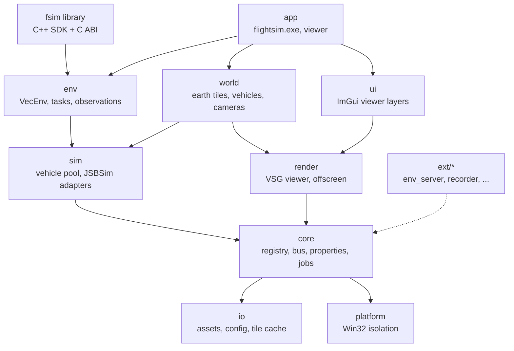
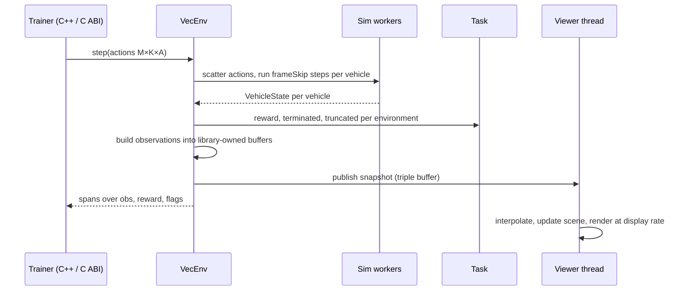
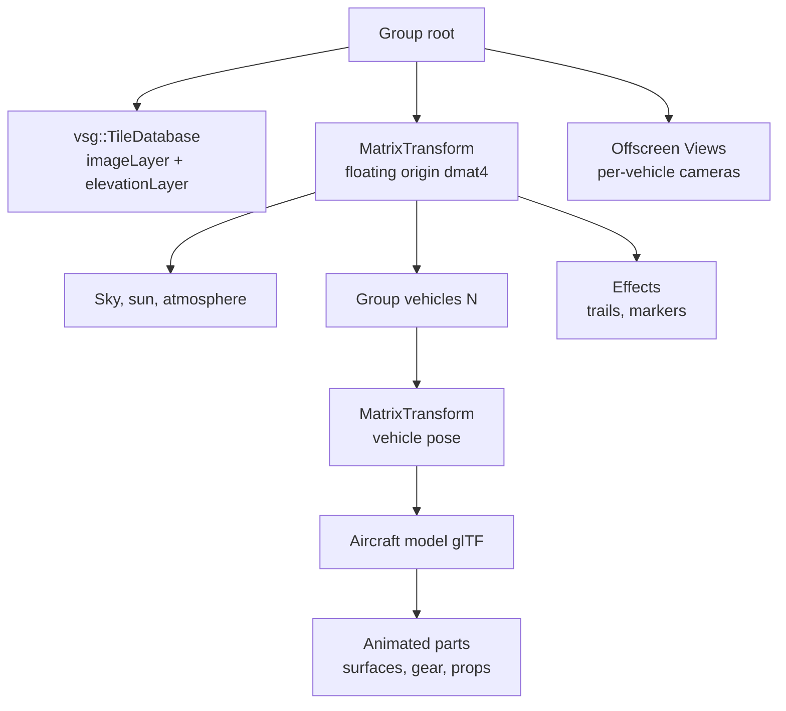
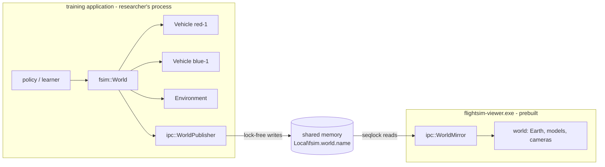
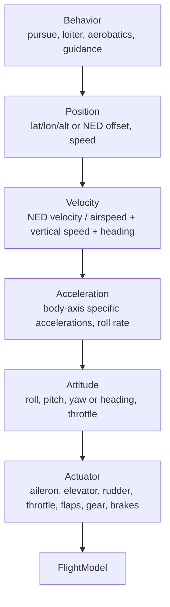

# Flight Simulator (C++ / VSG / JSBSim) — System Architecture & Design

2026-09-19 · @Someone

## 1. Purpose and scope

This document defines the architecture of a pure C++ flight-simulation platform for AI and reinforcement-learning (RL) training: JSBSim computes flight dynamics for many vehicles at once, VulkanSceneGraph (VSG) renders a full-Earth scene for visualisation and for vision-based observations, and a C++ SDK with a stable C ABI is the primary interface. It is the reference for structure, boundaries and major technical decisions; implementation details live in code and per-module design notes.

In scope: the application skeleton, module boundaries, runtime/threading model, integration of VSG and JSBSim, the RL environment API (C++ and C ABI), the debug viewer, VSG-native full-Earth terrain, build and packaging on Windows, and the extension mechanism. Out of scope for this revision: human-piloted operation (no flight-stick input, cockpit or instrument panels), networking/multiplayer, RL algorithms themselves, and certification-grade fidelity requirements. Project owner decisions of 2026-09-19 that shaped this revision: RL training is the primary purpose, full-Earth visualisation, no human pilot for now, powerful training hardware, open-source licence, Windows only, multiple vehicles, JSBSim used as-is, VSG mandatory, no Cesium, no Python. Owner workflow statement of 2026-09-20 (section 9): researchers build training applications against the vehicle SDK; a prebuilt viewer mirrors their world through shared memory transparently and without affecting training throughput; vehicles are created by name/type/initial state and controlled through a multi-level control stack; the environment is controllable in real time; effects and communication are abstract, extensible interfaces. Later owner requests added: an offline map package that ships with the viewer (2026-09-22); a Python SDK over the C ABI (2026-09-23), which relaxes "no Python" for trainers while the platform itself still embeds no language runtime (section 2); hangar (2026-09-22/23), a tool that turns an aircraft design into a flight-tested JSBSim aircraft with a 3D model, and a library of fighters and support aircraft made with it (2026-09-23 to 25); and engine exhaust and airflow effects in the viewer (2026-09-25).

Reading guide: sections 2–4 fix requirements and technology choices; sections 5–10 describe the design; sections 11–13 cover build, performance and cross-cutting concerns; sections 14–17 hold risks, roadmap, decisions and open questions.

## 2. Requirements and design drivers

Four drivers shape every decision below, in this priority order when they conflict: performance, portability, lightweight, extensibility. For an RL training platform "performance" means simulation throughput first and frame rate second, and "portability" means Windows x64 across GPU vendors today with a clean path to Linux servers later. Each driver has a measurable target so the architecture can be checked, not just argued.

| Driver | What it means here | Target (v1) | How it is enforced |
| --- | --- | --- | --- |
| Performance | Maximise simulated vehicle-steps per second; keep visualisation and vision rendering from slowing the simulation | ≥ 100,000 JSBSim vehicle-steps/s aggregate on a 16-core workstation (headless, stock c172/f16); a 64-vehicle scene renders at 60 fps at 1440p on an RTX-class GPU; vision observations at 128×128 for 64 vehicles ≥ 2,000 frames/s | parallel sim workers, zero per-step heap allocation, batched stepping API, offscreen render batching, throughput benchmark in CI |
| Portability | Windows 10/11 x64 on NVIDIA, AMD and Intel Vulkan drivers; no OS-specific code outside `platform/` so a Linux build is a port, not a rewrite | identical results on all three GPU vendors; `platform/` is the only module with Win32 includes (checked in CI) | C++17, VSG's own windowing and tile streaming, CMake, dependency isolation |
| Lightweight | Few dependencies, small install, low idle resource use, no language runtimes | headless library + viewer executable < 20 MB excluding terrain cache; ≤ 5 third-party libraries in the core; headless start < 1 s; idle RAM < 500 MB with 64 vehicles headless | static linking, dependency budget reviewed per ADR, VSG-native solutions preferred over third-party ones |
| Extensibility | New aircraft, tasks/rewards, observation types, sensors, cameras, data sinks and external trainers without touching the core | add a task or observation builder as a C++ module without core edits; bind the platform from any language through the C ABI; optional modules excluded at build time | module registry, property store, event bus, stable C++ SDK headers, versioned C ABI |

Secondary requirements that follow from the four drivers and the owner decisions:

- Determinism and reproducibility: given a seed, a scenario and a fixed step, every run produces the same trajectory; JSBSim guarantees this per instance when fed a fixed `dt`, and the platform never lets wall-clock time enter the simulation.
- Headless first: the simulation and environment API run with no window and no GPU; rendering is an optional module attached to a running simulation for visualisation or vision observations.
- Many vehicles: dozens to hundreds of JSBSim instances per process, stepped in parallel and in lockstep, grouped into independent environments.
- Full-Earth world on VSG alone: any latitude/longitude, WGS-84 ECEF double precision, imagery and elevation streamed by `vsg::TileDatabase` from a tile pyramid (self-hosted or public), and the same elevation tiles used for physics ground height, headless and offline once cached.
- Pure C++: no Python, Lua or other language runtime anywhere in the platform; external trainers use the C++ SDK or the C ABI. Still true since the Python SDK (2026-09-23, `python/`): it is a C extension over the C ABI loaded by the trainer's own interpreter, and hangar (`tools/hangar`), the aircraft design tool, is offline Python tooling that, like `tools/tile_builder`'s GDAL, is never part of the platform.
- Open source: the platform is released under MIT; every dependency is MIT, Apache-2.0, BSD, Zlib or LGPL (JSBSim), with JSBSim linked as a shared library.
- JSBSim as-is: stock aircraft, engines, systems and XML scripts from the JSBSim repository; flight-control automation uses JSBSim's own FCS/autopilot definitions; no custom FDM code in v1.

## 3. Technology stack baseline

Licensing consequence: JSBSim's LGPL-2.1 is the only copyleft component. Dynamic linking of JSBSim, or shipping object files to allow relinking, keeps the application's own licence free. All other core components are MIT/Zlib/Apache.

The fixed stack is C++17, VSG 1.1.x and JSBSim 1.3.x, with vsgXchange for model loading and HTTP tile fetching and vsgImGui for the viewer UI; nothing else is required at runtime. All components are actively maintained and MIT/LGPL licensed; CMake is the build system because every dependency already uses it. Status checked 2026-09-19.

| Component | Version | License | Last release / push | Role | Notes |
| --- | --- | --- | --- | --- | --- |
| C++ | C++17 (GCC 16.2, MSYS2 UCRT64 — mandated toolchain at D:\\ENV\\DevLanguages\\Cpp\\msys2\\ucrt64) | — | — | Implementation language | C++17 is VSG's requirement; code stays C++17 so a GCC/Clang Linux port needs no language changes |
| [VulkanSceneGraph](https://github.com/vsg-dev/VulkanSceneGraph) | 1.1.16 | MIT | 2026-08-21 | Scene graph, Vulkan rendering, windowing, offscreen rendering, viewer, **full-Earth tile streaming (`vsg::TileDatabase` with `imageLayer` + `elevationLayer`)**, serialisation (`.vsgt/.vsgb`) | Requires Vulkan 1.1 SDK; glslang optional |
| [vsgXchange](https://github.com/vsg-dev/vsgXchange) | tracks VSG | MIT | 2026-08-24 | glTF loader (assimp), KTX/PNG/JPEG image readers, `curl` reader for HTTP tile sources | Only assimp, KTX, stb\_image and curl modules enabled; GDAL module off |
| [JSBSim](https://github.com/JSBSim-Team/jsbsim) | 1.3.1 | LGPL-2.1 | 2026-05-17 (push 2026-09-15) | Flight dynamics (`FGFDMExec`), stock aircraft/engines/systems, XML scripts, property tree | Linked as a DLL; one instance per vehicle |
| [vsgImGui](https://github.com/vsg-dev/vsgImGui) | 0.8.0 | MIT | 2026-08-21 | Dear ImGui + ImPlot debug/monitor UI inside the VSG frame | Viewer only |
| libcurl (via vsgXchange) | current | MIT-style | active | HTTP(S) fetch of imagery/elevation tiles when a remote pyramid is used | not needed for file-based pyramids |
| CMake + vcpkg | ≥ 3.25 / manifest mode | BSD-3 / MIT | — | Build and dependency management | vcpkg has ports for every dependency above |
| Offline tooling only: GDAL | current | MIT | active | `tools/tile_builder` converts DEM and imagery sources into the tile pyramid | never linked into the platform; runs at data-preparation time |

Compiler and platform for v1 (owner decision 2026-09-19): MSYS2 **UCRT64** — GCC 16.2, mingw-w64, UCRT — on Windows 10/11 x64; CMake 4.1 and Ninja from the same environment; Vulkan headers/loader, glslang, SPIRV-Tools, assimp and curl from MSYS2 packages. The MSYS2 installation must be kept consistent with `pacman -Syu` (partial upgrades break newly installed packages). MSVC is not used. A Linux build is not a v1 deliverable but nothing in the stack prevents it.

## 4. Entry point and primary interface evaluation

Recommendation: the primary interface is a C++ SDK (`fsim::VecEnv`, static or shared library, public headers under `include/fsim/`) with a versioned C ABI (`fsim_c.h`) exported from the same DLL so trainers in any compiled language can bind it; an optional shared-memory environment server serves out-of-process trainers. The graphical interface is an optional in-process viewer using VSG's native window and Dear ImGui (vsgImGui). No scripting runtime, no flight-stick input and no cockpit UI.

### 4.1 Primary interface: how RL code reaches the simulator

| # | Option | How it works | Step overhead (64 envs) | Extra dependencies | Verdict |
| --- | --- | --- | --- | --- | --- |
| I1 | C++ SDK, in-process | trainer links `fsim.lib`/`fsim.dll`, calls `VecEnv::step(actions) -> batch` on preallocated buffers | \~0 (function call) | none | **Selected as primary** — fastest possible, type-safe, the platform's own tests and tools use it |
| I2 | C ABI, in-process | `fsim_c.h`: opaque handles, plain structs, `fsim_vecenv_step(h, actions, n)`; buffers owned by the library | \~0 | none | **Selected as companion** — stable across compiler versions; Rust/C#/Julia/Go bind it with their standard FFI tools; an `extern "C"` layer over I1 |
| I3 | Shared-memory environment server | `flightsim.exe --serve` maps a ring of action/observation buffers; trainer process attaches; semaphore handshake per step | \~20–50 µs | none (Win32 named shared memory in `platform/`) | **Selected as optional module** `ext/env_server` — isolates trainer crashes from the simulator, allows a different toolchain per side |
| I4 | TCP/UDP flat-binary protocol | same message layout as I3 over a socket | 100–300 µs + network | none | variant of I3 for remote trainers; post-v1 |
| I5 | gRPC / protobuf service | RPC per step | 200–500 µs, serialisation | gRPC, protobuf (\~10 MB) | rejected: dependency weight and latency for no gain over I3/I4 |
| I6 | Embedded scripting runtime (Lua, Python) | scripts drive the loop in-process | — | runtime + bindings | rejected by owner decision |
| I7 | In-process training with LibTorch | RL algorithm in C++ using the LibTorch C++ API | 0 | LibTorch (CPU \~200 MB, CUDA \~2 GB) | not part of the platform; supported as a consumer of I1 (`examples/torch_ppo` shows it); never a core dependency |

### 4.2 Graphical interface (optional viewer)

| # | Option | UI toolkit | Extra dependencies | Approx. size | Verdict |
| --- | --- | --- | --- | --- | --- |
| A | VSG native window + vsgImGui | Dear ImGui + ImPlot | none beyond VSG | \~0.5 MB | **Selected** — monitoring, telemetry plots, property browser, camera control |
| C | SDL3 / GLFW window + adopted surface | Dear ImGui | SDL3 or GLFW | 0.3–2 MB | rejected: a second library owning the window for no benefit; joystick support is not needed |
| E | Qt 6 + vsgQt | Qt Widgets/QML | Qt6 (LGPL-3) | 20–35 MB | rejected for the viewer; possible future scenario editor as a separate tool |
| G | RmlUi | HTML/CSS documents | RmlUi + FreeType | 2–3 MB | rejected: no operator-facing UI to justify it |
| H | Web dashboard (browser) | HTML/JS served from the process | embedded HTTP server (\~0.3 MB) | small | deferred: remote monitoring of long training runs; post-v1 module |

### 4.3 Scoring against the requirements

Scale 1 (poor) to 5 (excellent); weights follow the driver priority in section 2.

| Criterion (weight) | I1+I2 C++ SDK & C ABI + A | I3 shared memory + A | I5 gRPC + A | I1 + E Qt viewer |
| --- | --- | --- | --- | --- |
| Performance (3) | 5 | 4 | 2 | 5 |
| Portability (3) | 5 | 4 | 5 | 4 |
| Lightweight (2) | 5 | 5 | 3 | 1 |
| Extensibility (2) | 5 | 5 | 4 | 5 |
| VSG / JSBSim integration (2) | 5 | 5 | 4 | 4 |
| Maintainability (2) | 5 | 4 | 4 | 4 |
| Weighted total (max 70) | 70 | 62 | 51 | 55 |

### 4.4 Decision and rationale

- Entry points: (1) the `fsim` library, linked by the trainer's own C++ program — the primary one; (2) `flightsim.exe` for headless batch runs, benchmarks, recording and `--serve` (shared-memory server); (3) `flightsim-viewer.exe`, or `attachViewer()` from the SDK, for the window. All construct the same `Application` object.
- Batched API: `VecEnv` holds M environments, each with K vehicles; `step()` consumes an `(M×K×A)` action span and fills `(M×K×O)` observation, reward and flag buffers owned by the library, so one call advances every vehicle and no data is copied. The C ABI exposes the same buffers as raw pointers with sizes and a layout version.
- Windowing and viewer: `vsg::Window` and `vsg::Viewer`, Dear ImGui through vsgImGui. The viewer never blocks the simulation; it renders the latest snapshot at display rate (section 6).
- Not included: Python (bindings over the C ABI followed on 2026-09-23 at the owner's request, section 15), Lua, Cesium/3D Tiles, SDL3, HUD, instruments, cockpit view. The event/property infrastructure stays, so a piloted mode can be added later as a module.

## 5. System architecture overview

The platform is a set of statically linked C++ modules in five layers with strictly downward dependencies, exposed through the `fsim` library (C++ SDK + C ABI) and two thin executables. VSG's object model (`vsg::Object`, `vsg::ref_ptr`, visitors, `vsg::Input/Output`) is the single object model for the codebase; the `env` layer, which turns simulations into RL environments, sits above `sim` and knows nothing about rendering.



Reading the diagram: the `fsim` SDK (object model in `sim`/`control`/`comm`, batch layer in `env`) is the only thing a trainer sees; `ipc` publishes the world for the viewer; `world` and `render` are optional and attach to a running `sim` to visualise it or to produce vision observations; `core` knows neither JSBSim nor Vulkan and runs headless.

| Module | Responsibility | Depends on | External libs |
| --- | --- | --- | --- |
| `fsim` (SDK) | Public C++ headers (`fsim/World.h`, `fsim/Vehicle.h`, `fsim/Control.h`, `fsim/Environment.h`, `fsim/Effects.h`, `fsim/Comm.h`, `fsim/VecEnv.h`) and the `extern "C"` layer `fsim_c.h`; the only exported symbols of `fsim.dll` | `env`, `control`, `comm`, `ipc` | — |
| `control` | Multi-level control stack: command types per level, `Controller`/`Behavior` interfaces, cascade, built-in PID loops and behaviours, controller registry | `sim`, `core` | — |
| `comm` | Communication abstractions: nodes, messages, codecs, protocols, delivery media | `core` | — |
| `ipc` | Shared-memory world segment: publisher (in `fsim.dll`) and read-only mirror (viewer), registry of live worlds | `sim`, `platform` | Win32 file mapping |
| `vision` | `fsim_vision.dll`: vehicle cameras rendered offscreen (headless `vsg::Viewer`, one framebuffer per camera, RGB + depth readback, own-vehicle masking) over the public `World`; C ABI `fsim_vision_c.h` | `world`, `render`, `io`, `sdk` | VSG, Vulkan |
| `app` | `flightsim.exe` (headless runs, benchmark, record, `--serve`) and `flightsim-viewer.exe`; command line, configuration, module wiring | all | — |
| `env` | `VecEnv` batching M environments over the object model; observation and action builders (actions are commands at a chosen control level); task/reward/termination interface; seeding; episode bookkeeping | `control`, `sim`, `core` | — |
| `session` | `World` implementation: vehicle registry by name/type over the pool, per-step environment application, effects pipeline and control cascades on the owning worker, message fabric, shared-memory publisher | `control`, `effects`, `comm`, `ipc`, `sim` | — |
| `effects` | Effect/EffectContext (wind, force, property, sensed-state channels), built-in effects | `sim`, `core` | — |
| `sim` | `VehiclePool` (N `FlightModel` instances stepped in parallel by a worker pool in lockstep, one worker per physical core, pre-step hook for cascades and effects), JSBSim adapter with wind/turbulence/atmosphere/external-force/seed channels, `GroundProvider` reading elevation tiles | `core`, `io` | JSBSim |
| `world` | Scene composition: `vsg::TileDatabase` Earth (imagery + elevation layers), vehicle visuals and part animation, cameras (chase, orbit, free, per-vehicle sensor cameras), sun and sky; maps sim snapshots to scene transforms | `sim`, `render`, `core` | VSG |
| `render` | Window and offscreen render targets, viewer, render/command graphs, shader sets, GPU→host readback for vision observations, frame statistics | `core` | VSG, vsgXchange |
| `ui` | ImGui layers: monitor (throughput, episode stats), telemetry plots, property browser, camera and vehicle selection, scenario controls | `render`, `core` | vsgImGui |
| `io` | Asset resolver, config, JSBSim aircraft path management, tile pyramid access and disk cache (shared by physics and rendering), recording files | `platform` | vsgXchange (curl, image readers) |
| `core` | Module registry and lifecycle, event bus, property store, deterministic RNG streams, job system, logging, profiler | `io`, `platform` | VSG core |
| `platform` | Win32 specifics: paths, high-resolution clock, thread naming/affinity, shared memory, HTTP, UDP, crash handler (minidump via dbghelp, installed by the executables only) | — | Win32 |
| `ext/*` | Optional modules: `env_server` (shared memory), `recorder`, `web_dashboard`, extra sensors, scripted traffic | `core` + what they need | per module |

Dependency rules, enforced by CMake target visibility and a CI check:

1. No module includes a header from a layer above it; `env` never includes `render` or `world`.
2. JSBSim headers appear only inside `sim`; Vulkan and `vsg::` GPU types only inside `render`, `world` and `ui`; Win32 headers only inside `platform`.
3. Hot-path communication (stepping, snapshots, observations) uses typed buffers described in section 6, never the event bus.
4. Optional modules are compiled in via CMake options and self-register through `core::ModuleRegistry`; the headless configuration (`sim` + `env` + `fsim`, no `render`/`world`/`ui`) builds and runs without the Vulkan SDK.
5. Only `fsim/*.h` and `fsim_c.h` are public; everything else may change without notice.

## 6. Runtime model

The simulation is driven in lockstep by the caller (`VecEnv::step()` from the trainer's C++ code, the C ABI, or the shared-memory server), not by a clock: each call advances every vehicle by a fixed number of JSBSim steps across a worker pool, then builds observations; the optional viewer runs on its own thread at display rate and reads immutable snapshots, so visualisation never slows training.

### 6.1 Process entry

1. The trainer constructs `fsim::VecEnv(scenarioPath, options)` (or `flightsim.exe` does) which builds `Application` in headless mode: `core` services, `io`, `sim`, `env`. The Vulkan SDK is not touched.
2. Scenario files (`.vsgt` text or JSON) define per-environment vehicles (JSBSim aircraft name, initial-condition distributions, JSBSim script if any), the task id, observation and action specs, the sensors and the tile pyramid to use for ground height.
3. `VehiclePool` creates one `JsbsimModel` per vehicle (M environments × K vehicles), each with its own `FGFDMExec`, `dt` and RNG stream derived from the seed.
4. `reset()` runs `RunIC()` per vehicle and fills the first observation batch.
5. `step(actions)` for each call: scatter actions to vehicles, step all vehicles `frameSkip` times in parallel, compute rewards/terminations in the task, gather observations into the output buffers, auto-reset finished environments, publish a snapshot for viewers.
6. `attachViewer()` (or `flightsim-viewer.exe --attach`) constructs `render`, `world` and `ui` on a separate thread with a window; detaching destroys them without affecting the simulation.
7. Shutdown is reverse order; `shutdown()` runs on every module even after an exception so JSBSim outputs and recordings are flushed.

### 6.2 Threads

| Thread | Driven by | Owns | Must never |
| --- | --- | --- | --- |
| Caller (trainer) | `step()` / `reset()` calls | `VecEnv`, task evaluation, observation assembly | touch `vsg::` GPU objects |
| Sim workers (`nWorkers`, default = physical cores − 2) | work items = one vehicle × `frameSkip` steps | `FGFDMExec` instances (each worker touches only its assigned vehicles for a given call) | allocate, log at info level, or share state across vehicles |
| Render (viewer only) | display refresh | `vsg::Viewer`, window events, ImGui, scene mutation | call into JSBSim or block the sim workers |
| Vision render (optional) | `step()` when a vision observation is requested | offscreen `vsg::View`s for sensor cameras, readback | — (synchronous with the step: the caller waits for readback) |
| Job pool | on demand | tile fetch/decode for `vsg::TileDatabase` and the ground provider, recording flush | mutate the live scene graph directly |
| Server (optional `ext/env_server`) | semaphore from the trainer process | shared-memory ring, one `VecEnv` | — |

### 6.3 Stepping and data flow



`VehicleState` is a fixed-size POD (ECEF position `dvec3`, attitude `dquat`, body and NED velocities, rates, accelerations, control positions, engine data, gear state, \~60 scalars) written by the worker that stepped the vehicle. Observation builders read these plus any cached JSBSim property handles declared in the observation spec; outputs are `float32` arrays owned by `VecEnv` and returned as `std::span` (C++) or pointer + length (C ABI) without copying. Actions map to JSBSim `fcs/*-cmd-norm` properties or, when the scenario says so, to JSBSim autopilot targets (heading, altitude, airspeed), which uses JSBSim's own FCS as-is.

### 6.4 Time

- Simulation time advances only inside `step()`; there is no real-time clock in the training path. `dt` (default 1/120 s) and `frameSkip` (default 4 → 30 Hz agent rate) are scenario parameters.
- Determinism: fixed `dt`, per-vehicle RNG streams seeded from `(seed, envIndex, vehicleIndex)`, and no dependence on thread scheduling (each vehicle's step is independent), so results are identical regardless of `nWorkers`.
- Viewer time: the render thread interpolates between the two latest snapshots using their simulation timestamps and shows the current wall-clock speed factor; a `--realtime` option throttles `step()` calls in the exe only.

### 6.5 Budget per `step()` (64 environments × 1 vehicle, frame\_skip 4, 16 workers)

Measured 2026-09-19 (M0 build, Release, 16-thread desktop, c172x, frame-skip 4): one JSBSim step costs \~6 µs, not the 40 µs assumed in the first draft. 64 vehicles run at 148,000 vehicle-steps/s on one worker and 1,138,000 on 16 workers (`step()` mean 0.225 ms), i.e. 11× the section 2 target before any tuning; the f16 runs at 757,000 on 6 workers. Vision observations add GPU render + readback time and will be the dominant cost when enabled (section 8.4).

## 7. Flight dynamics integration (JSBSim)

JSBSim is used as-is — stock aircraft, engines, systems, autopilots and XML scripts from the JSBSim repository — behind a `sim::FlightModel` interface implemented by `sim::JsbsimModel`, one instance per vehicle; the rest of the platform never sees JSBSim types, units or its property tree, and all conversion to SI units and the ECEF-metre world frame happens inside the adapter.

### 7.1 Interface

```cpp
class FlightModel : public vsg::Inherit<vsg::Object, FlightModel> {
public:
    virtual bool load(const AircraftSpec&, const InitialConditions&) = 0;
    virtual void step(const ControlInputs&, double dt) = 0;   // exactly one fixed step
    virtual void state(VehicleState&) const = 0;              // fill snapshot, SI units, ECEF metres
    virtual PropertyHandle property(std::string_view path) = 0; // cached, O(1) read/write after lookup
    virtual void reset(const InitialConditions&) = 0;
};
```

`step()` is the only method called at 120 Hz; `property()` returns a handle wrapping a cached `FGPropertyNode*` so hot reads (instrument values, control positions) never repeat a string lookup.

### 7.2 JSBSim adapter lifecycle

| Phase | JSBSim calls | Notes |
| --- | --- | --- |
| Construct | `FGFDMExec`, `SetRootDir`, `SetAircraftPath`, `SetEnginePath`, `SetSystemsPath`, `Setdt(dt)` | one instance per vehicle; JSBSim's own `aircraft/`, `engine/`, `systems/` and `scripts/` directories are shipped unchanged as the asset root |
| Load | `LoadModel(name)`, `GetIC()->...`, optionally `LoadScript(path)`, `RunIC()` | runs on a sim worker inside `try/catch`; XML errors become a `LoadFailed` result on the environment, never a crash. Initial conditions come from the scenario (lat/lon/alt, heading, speed) or a JSBSim IC file |
| Step | write commands via cached nodes (`fcs/*-cmd-norm`, `fcs/throttle-cmd-norm[n]`, gear, flaps, brakes, or autopilot targets `ap/*` when the aircraft defines them), `Run()` × `frame_skip`, read state | `Run()` advances exactly `dt`; JSBSim scripts, event triggers and `FGOutput` (CSV/socket) remain available and are enabled per scenario for logging |
| Reset | `ResetToInitialConditions(0)`, then re-apply randomised ICs from the environment's RNG stream | preserves the loaded model; a reset costs \~1 ms, so environments auto-reset in place |
| Destroy | destructor | JSBSim logging routed to `core::Log` via `FGLogger`, level warning and above only on workers |

### 7.3 Units and frames

| Quantity | JSBSim | Application (`VehicleState`) | Conversion |
| --- | --- | --- | --- |
| Position | ECEF, feet (`FGPropagate::GetLocation`), WGS-84 | ECEF, metres, `vsg::dvec3` | × 0.3048 |
| Attitude | body-to-local (NED) Euler/quaternion; body axes x forward, y right, z down | ECEF-to-body quaternion `vsg::dquat`; model axes x forward, y left, z up | compose with NED-to-ECEF at current lat/lon; body→model flips y and z |
| Velocities | body frame ft/s, NED ft/s | body and NED m/s | × 0.3048 |
| Angular rates | rad/s | rad/s | none |
| Mass, forces | slugs, lbf | kg, N | × 14.5939, × 4.44822 |
| Altitude | ft (`position/h-sl-ft`), AGL via terrain callback | m | × 0.3048 |

Terrain: JSBSim asks the host for ground elevation through `FGGroundCallback`; the adapter implements it against `sim::GroundProvider`, which samples the same elevation tile pyramid that `vsg::TileDatabase` renders (section 8.2), decoded on the CPU by `io::TilePyramid` at a configurable level (default: the pyramid's finest level, 30 m) with bilinear interpolation in double precision. Physics and rendering therefore read identical data, the provider works headless and offline once tiles are cached, and it is deterministic.

### 7.4 Rendering frame

The world frame is ECEF metres in double precision. `world` keeps a floating origin: the scene root is a `vsg::MatrixTransform` with a `dmat4` that re-bases the scene near the camera, so GPU floats never see coordinates above \~10 km. VSG performs the `dmat4` × `dmat4` multiplication on the CPU during record and uploads floats, which is what its `dmat4` transforms exist for.

### 7.5 Multiple vehicles

`sim::VehiclePool` owns N `FlightModel`s and steps them with a fixed worker pool: each `step()` call partitions vehicles across workers in a deterministic order, every worker steps its vehicles `frame_skip` times, and a barrier ends the call. Vehicles share nothing (separate `FGFDMExec`, separate ground-provider cache handles), so scaling is linear until memory bandwidth limits; JSBSim's \~5–10 MB per instance puts 256 vehicles at 1.5–2.5 GB, well within the training hardware. Interactions between vehicles (relative geometry for pursuit/evasion or formation tasks, simple collision detection) are computed in the `env` task layer from the snapshot batch after the step, not inside the FDM. A lighter `KinematicModel` implementing the same interface serves scripted traffic and replay without a JSBSim instance.

## 8. Visualization design (VSG)

Rendering is an optional module built entirely on VSG with two jobs: a full-Earth viewer for humans (one `vsg::Viewer`, one window, Earth streamed by VSG's own `vsg::TileDatabase`, ImGui overlay) and offscreen sensor cameras that produce vision observations for agents; both read the same immutable snapshots and share one scene graph, and neither is present in the headless training configuration.

### 8.1 Scene graph layout



`vsg::TileDatabase` builds a `PagedLOD` quadtree over the WGS-84 `EllipsoidModel` in ECEF metres with its own precision handling; vehicle transforms above the model level are `dmat4`, model-local data is float.

### 8.2 Components

| Concern | Design | Why |
| --- | --- | --- |
| Full-Earth terrain and imagery | `vsg::TileDatabase` with `TileDatabaseSettings`: `imageLayer` and `elevationLayer` URL templates (`{z}/{x}/{y}`), `ellipsoidModel` = WGS-84, `maxLevel` per pyramid, `lodTransitionScreenHeightRatio` tuned per quality tier; tiles come from a **self-hosted tile pyramid** (files on disk or any HTTP server) produced by `tools/tile_builder`, or from public XYZ imagery servers (OpenStreetMap, Bing via VSG's `createBingMapsSettings()`) for quick starts | VSG-native, zero extra runtime dependency, streamed by VSG's `DatabasePager` on the job pool, cached on disk by `io` |
| Tile pyramid format | imagery: JPEG or KTX2 256×256 tiles; elevation: 16-bit PNG heightmaps (metres × scale + offset, documented in `pyramid.json`) decoded by vsgXchange's stb\_image reader and interpreted through `elevationLayerCallback`; global coverage from Copernicus GLO-30 (30 m) or GLO-90 built offline | one format for physics and rendering; PNG/JPEG readers already in the stack; no GDAL at runtime |
| Physics vs. visual ground | both read `io::TilePyramid`; the viewer's debug layer shows the residual between the CPU sample and the rendered mesh at the selected vehicle (mesh simplification + skirts explain sub-metre differences) | consistency by construction |
| Aircraft models | glTF 2.0 via vsgXchange; a `ModelManifest` (`.vsgt`) maps named nodes to `VehicleState` fields; stock JSBSim aircraft get simple placeholder models until proper ones exist | one loader, PBR materials |
| Part animation | `world::PartAnimator` resolves named transforms once at load and writes rotations each frame from the interpolated snapshot | no per-frame lookups |
| Sky / lighting | analytic sky shader; sun position from scenario date/time; one directional light + ambient; VSG PBR `ShaderSet`; shadows optional | no texture assets; time of day for free |
| Cameras | `CameraController` strategies: chase, orbit, free, tower, follow-selected; plus `SensorCamera`s attached to vehicles for vision observations | swap by key; sensors are data-defined in the scenario |
| Many vehicles | vehicle subgraphs share model geometry (one loaded model, N transforms); per-vehicle `vsg::Switch` for visibility; selection and labels via ImGui overlay | 64–256 vehicles at 60 fps with a few draw calls per model |
| Shaders | GLSL compiled to SPIR-V at build time; runtime glslang only in developer builds | size and startup |
| Frame statistics | VSG frame stamps + GPU timestamp queries in the ImGui monitor | needed to hold budgets |

### 8.3 Viewer update pass

Each frame the render thread pumps events (VSG visitors, then ImGui), acquires the latest snapshot batch and interpolates, writes vehicle `dmat4`s and part rotations, updates the floating origin when the camera moved more than 5 km, updates cameras, builds the ImGui frame, then `viewer->update()`, `recordAndSubmit()`, `present()`. `vsg::DatabasePager` loads and compiles tiles on its own threads and merges them during `update()`; the pager's memory and tile-request limits are set per quality tier.

### 8.4 Vision observations

When a scenario declares a camera observation (`rgb`, `depth`, `segmentation`; resolution, field of view, mount pose), `render` creates an offscreen `vsg::View` per sensor rendering into a shared image array; all sensors for a `step()` are recorded into one command buffer, submitted once, and read back with a single copy into a host-visible buffer exposed as an `(M×K×H×W×C)` `uint8`/`float16` span. Terrain tiles for sensor views are requested by the pager from each sensor camera, so agents see the same Earth the viewer does; for training on a fixed region the pyramid is prefetched by `tools/tile_builder --prefetch` so no I/O happens during episodes (today: `tools/tile_prefetch` fills the shared cache for a region from the public servers). Budget: 64 cameras at 128×128 RGB in under 30 ms per step on an RTX-class GPU; a GPU-resident path (no host readback) is a post-v1 optimisation. Delivered 2026-09-21 as `fsim_vision.dll` (`fsim::vision::Sensors`, `include/fsim/Vision.h`): a headless `vsg::Viewer` with one framebuffer and render graph per camera in a single command graph, colour attachments copied into cached host-visible images after the pass, own-vehicle hiding through view masks; 64 cameras measured at ~8 ms per step on an RTX 5070 Ti. Segmentation followed 2026-09-21: `CameraSpec::segmentation` adds a second pass per camera that draws an id-coloured copy of the vehicles over the depth the colour pass just wrote, so occlusion is exact, and reads back a `uint16` vehicle id per pixel (64 cameras: 13.2 ms without, 18.7 ms with). `rgb`/`depth`/`segmentation` are therefore all delivered; semantic classes beyond "which vehicle" are not.

### 8.5 Assets and cache

The install ships shaders, placeholder aircraft models, the JSBSim aircraft tree and the ImGui font (< 20 MB). The tile pyramid is separate data: a global 90 m elevation + low-resolution imagery pyramid is \~3 GB; 30 m elevation with 10 m imagery for a training region of 500×500 km is \~2 GB. Both are built once with `tools/tile_builder` and either copied locally or served from any static HTTP server; the runtime disk cache has a configurable size limit (default 20 GB). As built: the package ships the aircraft designed with hangar (`share/flightsim/aircraft/<name>`: the JSBSim files and the glTF model) and, since 2026-09-22, its own maps instead of a pyramid built with `tools/tile_builder` (not needed so far): `fetch-maps` downloads the public imagery and elevation (Esri World Imagery, AWS Terrain Tiles) that `assets/config/offline-map-plan.json` asks for - a global base to level 9, mountain ranges, airports and route corridors deeper, about 2.4 GB against the owner's 2.5 GB budget - and the packaged viewer reads only those files, opening no sockets.

## 9. User interface design: the vehicle SDK, transparent visualisation and the C ABI

Revised 2026-09-20 to the owner's workflow statement. Researchers write a **training application** against the `fsim` SDK; the platform ships a **prebuilt viewer** (`flightsim-viewer.exe`) that discovers the training application's world through shared memory and mirrors it. The two processes never talk directly, never wait for each other, and the training application contains no visualisation code. The SDK is organised around **vehicle instances** with a **multi-level control stack**, **real-time environment control**, and abstract **effect** and **communication** interfaces; the earlier vectorised `VecEnv` remains as a convenience layer built on top of it.

### 9.1 Researcher workflow



1. The researcher reads `include/fsim/*.h` and `docs/sdk/*.md`, links `fsim.dll`, creates a `World`, creates vehicles by name, type and initial state, commands them at whichever control level the experiment needs, and steps the world.
2. Starting `flightsim-viewer.exe` at any time - before, during or after training starts - shows that world: the viewer lists live worlds, attaches to one, creates a visual for every vehicle it finds and follows creations, resets, state changes and control inputs from then on. Closing it changes nothing in the training process.
3. Visualisation costs the training application one bounded, lock-free memory copy per publish interval (section 9.7); it never allocates, blocks, or waits for a reader, so training throughput is the same with zero, one or several viewers attached.

### 9.2 Object model

```cpp
#include <fsim/World.h>

fsim::World world({.name = "dogfight-01", .dt = 1.0 / 120, .frameSkip = 4, .seed = 7});
world.environment().setWind({.directionDeg = 270, .speedMs = 8, .turbulence = 0.3});
world.environment().setTime(fsim::Utc{2026, 9, 20, 14, 30, 0});

fsim::Vehicle red  = world.createVehicle({.name = "red-1",  .type = "jsbsim:f16",
    .initial = {.latitudeDeg = 37.62, .longitudeDeg = -122.38, .altitudeMslM = 3000, .headingDeg = 90, .airspeedTrueMs = 220}});
fsim::Vehicle blue = world.createVehicle({.name = "blue-1", .type = "jsbsim:f16", .initial = /* ... */});

red.command(fsim::AttitudeCommand{.rollRad = 0.4, .pitchRad = 0.05, .throttle = 0.9});   // attitude loop
blue.command(fsim::PursuitBehavior{.target = red.id(), .rangeM = 500});                    // behaviour

for (int k = 0; k < 10'000; ++k) {
    world.step();                                    // all vehicles, lockstep, frameSkip FDM steps
    const fsim::VehicleState& s = red.state();       // truth
    const fsim::SensedState&  z = red.sensed();      // through the vehicle's sensor models
    red.command(policy(z));                          // any level, any time
}
```

| Type | Role | Notes |
| --- | --- | --- |
| `World` | The simulation session: owns vehicles, the environment, the clock, the worker pool and the shared-memory publisher | `createVehicle`, `removeVehicle`, `vehicle(id/name)`, `vehicles()`, `step(n = 1)`, `time()`, `environment()`, `addEffect` (world-wide), `comm()` (the medium), `reset()`; one `World` per training process is typical, several are allowed (each publishes under its own name) |
| `VehicleSpec` | What to create: `name` (unique in the world, shown by the viewer), `type` (`"jsbsim:<aircraft>"`; other prefixes map to other `FlightModel` implementations), `initial` state (position, attitude, velocity, on-ground), optional `model` (glTF override for the viewer), `sensors`, `controlRateHz` | The type string is the only thing the viewer needs to pick a model: `models/<aircraft>.glb` + manifest, or the default aircraft |
| `Vehicle` | A lightweight handle (id + world pointer) to a vehicle instance | `state()`, `sensed()`, `command(...)`, `controls()` (the stack), `reset(initial)`, `addEffect`, `comm()` (this vehicle's endpoint), `property(path)` for raw JSBSim access, `name()`, `type()`, `alive()` |
| `Environment` | Global conditions applied to every vehicle each step and published for illumination | section 9.4 |
| `Effect` | A disturbance or fidelity effect attached to a vehicle or the world | section 9.5 |
| `comm::Node` | A vehicle's or an external node's communication endpoint | section 9.6 |
| `VecEnv` | The gym-style batch layer: scenario -> vehicles, task -> rewards, spaces -> buffers | section 9.9; built entirely from the public `World`/`Vehicle` API, so it doubles as the reference example |

Rules: every call is on the caller's thread; `step()` is the only call that does work; handles stay valid until `removeVehicle`; nothing in the object model knows about rendering.

### 9.3 Multi-level control architecture

Every vehicle owns a **control stack**: an ordered set of levels, one controller per level, and one *active* command. Commanding a level makes it the active level; each step the stack runs the cascade from the active level down to the actuators, each controller translating its command into a command for a lower level, until an `ActuatorCommand` reaches the flight model. Nothing above the active level runs.



| Concept | Definition |
| --- | --- |
| `ControlLevel` | `Actuator < Attitude < Acceleration < Velocity < Position < Behavior`; a strict order, so "lower" and "higher" are unambiguous |
| `Command` | One plain struct per level (`ActuatorCommand`, `AttitudeCommand`, `AccelerationCommand`, `VelocityCommand`, `PositionCommand`, `BehaviorCommand`) held in a `std::variant`; every field has a `hold`/`nan` = "keep current" convention so partial commands are natural |
| `Controller` | `level()` (the level it accepts) and `update(const ControlContext&, const Command& in) -> Command` returning a command at **any strictly lower** level; the stack keeps cascading from the returned level. A controller is plain C++ with a `reset()` and its own gains/state; built-ins are PID loops written against `VehicleState` only, so they work for any `FlightModel` |
| `Behavior` | A controller at the `Behavior` level with a lifecycle (`start`, `update`, `finished()`) and parameters, e.g. `Pursuit{target, range}`, `Loiter{centre, radius}`, `Waypoints{...}`, `Aerobatic{Loop, Roll, Immelmann}`; a finished behaviour holds its last output until replaced |
| `ControlStack` | Per vehicle: `command(Command)` sets the active level and command; `use(level, controllerId)` swaps the controller at a level; `controller(level)` for gain tuning; `activeLevel()`; `derived(level)` returns the command the cascade produced at any lower level last step (introspection, telemetry, observations); `rateHz` (defaults to the FDM rate) |
| `ControllerRegistry` | `registerController(id, level, factory)` and `registerBehavior(id, factory)` from trainer code or built-in modules; `VehicleSpec.controllers` and `use()` select by id, so a researcher swaps a loop without touching the rest of the stack |
| `ControlContext` | What a controller sees: truth `state`, `sensed` state, `dt`, the environment, the vehicle's `Rng` stream, the `World` (for behaviours that look at other vehicles) |

Choosing a level is one line (`vehicle.command(VelocityCommand{...})`); extending is one class (`struct MyLoop : fsim::Controller { ... }` + `registerController`); replacing a built-in loop is one call (`vehicle.controls().use(Level::Attitude, "my_attitude")`). Because RL actions are just commands, the same policy can act on surfaces, attitudes or velocities by changing one enum, and hierarchical RL maps to the stack directly (a high-level policy commands `Position`, a low-level policy owns `Attitude`).

Built-in controllers (v1): `Actuator` (identity, clamps), `pid_attitude` (roll/pitch/heading with throttle or airspeed hold), `pid_acceleration` (normal/longitudinal acceleration + roll rate to attitude), `pid_velocity` (airspeed, vertical speed, heading to acceleration), `pid_position` (guidance to a point / along a track to velocity), and behaviours `hold`, `waypoints`, `loiter`, `pursuit`, `evade`, `formation`, `aerobatics` (a sequence of attitude/rate segments). Gains are per aircraft type in `assets/control/<type>.json` with defaults that fly the stock JSBSim aircraft.

Per-aircraft gains (2026-09-26): the built-in loops' defaults suit the stock c172x, and flew most other aircraft badly - fly-by-wire fighters in a standing pitch oscillation, heavies drifting in height - so an aircraft may carry its own. They are JSBSim properties `fsim/control/<controller id>/<parameter>` in its flight control section, read once per aircraft type when it first loads (`FlightModel::properties`) and set by the `ControlStack` on every controller it creates by id (`setControllerSettings`); a trainer's own `setParameter` still wins, and an instance handed to `use()` is left as it is. The loops gained what makes one set of gains hold over an envelope: a schedule on true and equivalent airspeed (each channel's gains scaled by the inverse of how the aircraft's response to that control grows with speed), the elevator trim law of a surface-controlled aircraft, flight-path and 1 g angle-of-attack feedforwards, a lag on commanded vertical speed, and feedforwards of the stick a load factor or roll rate needs - all off by default, so a stock aircraft flies as before. hangar's `autopilot` stage identifies each design by small steps at a reference condition, places the loops' poles, writes the gains into the aircraft and flies it (docs/hangar.md, The autopilot).