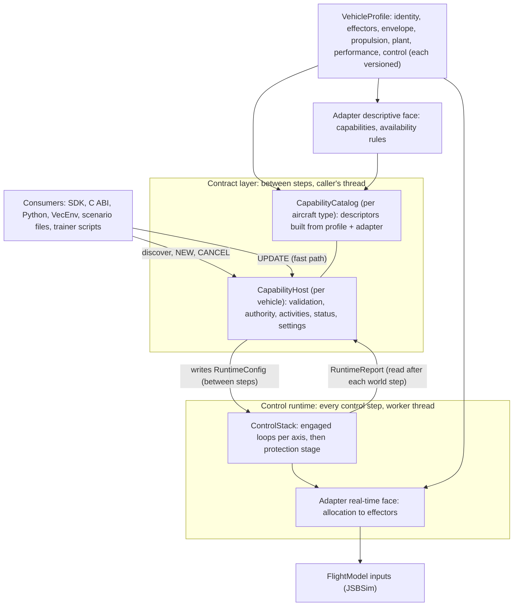
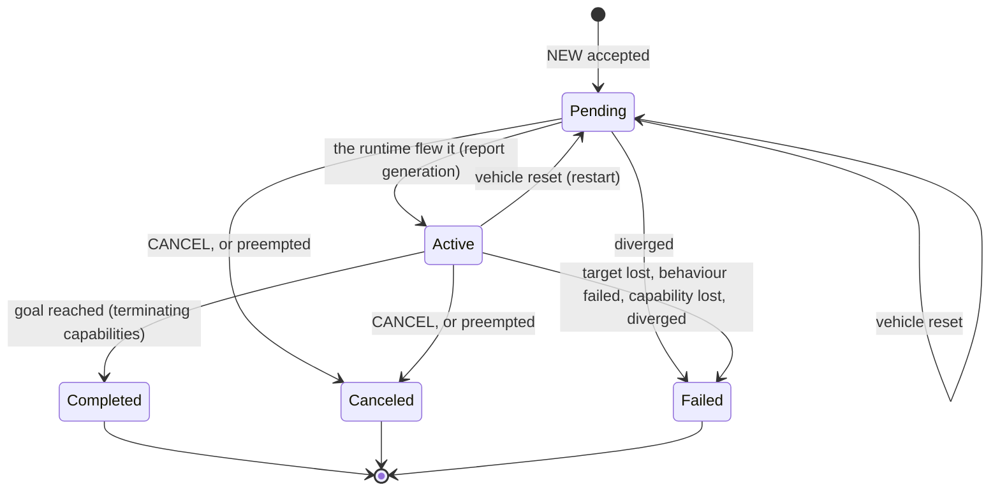

# ADR-26: Control architecture — capability contracts over the control runtime

| | |
| --- | --- |
| Status | Accepted 2026-09-26. The owner approved the two-part design and asked for this record before any code; implementation follows the migration order in section 14 |
| Extends | ADR-20 (the multi-level control stack), which stays in force for the runtime |
| Scope | How consumers command aircraft; how an aircraft describes what it can do; how commands are arbitrated, tracked and ended; how knowledge about one aircraft reaches the control loops |
| Related | [Design document](FlightSim_System_Architecture_and_Design.md) §9.3 (control), §10.3 (stability rules), §12 (performance); [sdk/control.md](sdk/control.md); [hangar.md](hangar.md) |

## 1. Context

### 1.1 What exists

Every vehicle owns a `ControlStack` (design §9.3, ADR-20). It has six strictly ordered levels: actuator, attitude, acceleration, velocity, position and behaviour. Each level has one controller, and the stack holds one active command.

- **Commanding.** Commanding a level makes it the active level. Each control step, the stack runs the cascade from that level down to the actuators, on the worker thread that steps the vehicle.
- **Per-aircraft gains.** Since a6eeab3 an aircraft can carry its own gains as JSBSim properties `fsim/control/<controller>/<parameter>`. hangar's autopilot stage tunes them for its 31 designs.
- **Entry points.** Commands arrive through `World::command`, `Vehicle::command`, the C ABI (`fsim_vehicle_command_*`, `fsim_world_command_batch`), Python, VecEnv's action mappers (every vehicle, every step) and scenario files. `command()` only reports whether the vehicle exists.

### 1.2 What is missing

| # | Gap |
| --- | --- |
| P1 | **No command lifecycle.** A command is not checked against the aircraft and never acknowledged with a reason. It has no end: the only completion signal is `ControlStack::behaviorFinished()`. A c172x accepts a 9 g pull. |
| P2 | **One command owns every axis.** A policy cannot fly roll while an engaged hold keeps height and speed; mixing the two needs a custom controller. |
| P3 | **Nothing is discoverable.** A consumer cannot ask whether an aircraft has flaps, a speedbrake or separately controlled engines, or what its limits are. VecEnv's action ranges are the c172x's (airspeed 20–120 m/s) for every aircraft. |
| P4 | **Aircraft knowledge is scattered.** Gains live in properties, limits inside the fly-by-wire laws, class-dependent constants in hangar, and c172x assumptions in the built-in loops. |
| P5 | **Limits are neither enforced nor reported.** Nothing limits demand on an aircraft whose own laws do not, and nothing reports when a limit is crossed. |
| P6 | **The step path allocates.** While a behaviour with parameters or waypoints runs, the stack copies its `BehaviorCommand` (a string, a map and a vector) every control step. That breaks design §12.1's rule of no allocation in `step()`. |

### 1.3 Forces

- **Determinism:** lockstep, deterministic stepping (ADR-2).
- **Throughput:** no allocation in `step()` and under 2 µs per vehicle outside JSBSim (design §12).
- **No scripting runtime** (ADR-15), and a lightweight core.
- **Compatibility:** every existing entry point keeps working.
- **Range of aircraft:** a Cessna, a fly-by-wire fighter and a B-52 must sit behind the same interface.

### 1.4 What was taken from UCI and A-GRA

The Air Force Open Architecture Collaboration documents were read for principles only: the UCI standard and specifications (OAC-STD-001, OAC-SPC-001, OAC-SPC-002) and A-GRA's goal of mission software portable across air vehicles.

Taken:
- capabilities as the unit of description, declared by the aircraft that provides them and discovered by query;
- separate command, status and activity semantics;
- NEW / UPDATE / CANCEL command states, answered at once with accepted, rejected or canceled;
- explicit availability states, and the rule that a state or transition, where supported, is used with its stated meaning;
- versioned descriptors and deterministic identifiers;
- functions described independently of how they are implemented.

Not taken:
- domain services (sensors, weapons, communications, mission planning) and the message schemas;
- the publish/subscribe and distributed runtime, and heartbeats;
- consent protocols and task allocation.

## 2. Decision

The control system becomes two parts that run at different rates and share exactly two structures.

- **Contract layer.** It describes, validates and records. There is a `CapabilityCatalog` per aircraft type and a `CapabilityHost` per vehicle; the host takes commands, arbitrates authority, keeps activities and reports status. It runs only between world steps, on the caller's thread.
- **Control runtime.** It flies the aircraft. It is today's `ControlStack`, evolved rather than replaced, and it keeps its name. It runs the engaged loops per axis, then a protection stage, then the adapter's allocation to the flight model, every control step on the worker threads.

Knowledge about one aircraft lives in two places only:
- a **VehicleProfile**: data, as an aggregate of small, individually versioned sections;
- a **VehicleAdapter** per aircraft family: the code for what its controls mean, what is available when, and how demand becomes flight-model inputs.



## 3. Boundary rules

**B1: Two structs cross the boundary.**
- `RuntimeConfig` is written by the host between steps and read by the runtime during them.
- `RuntimeReport` is written by the runtime during steps; the host reads it, then clears it, after each world step.

Both are per vehicle and fixed in size. The runtime object holds them, and the host reaches them through two accessors that it uses only between steps. The two sides never touch them at once: `World::step()` returns only when every worker has finished, and commands arrive only between steps, so no locks or atomics are needed.

Besides the two structs, the host configures the runtime only through its settings calls, and only between steps:
- `install()` hands over a new controller or behaviour instance, after which the host keeps no pointer to it;
- `setControllerSettings()` passes on the aircraft's gains.

None of them runs during a step.

**B2: Commands take two paths.**
- NEW and CANCEL go through the host. They are validated and arbitrated, and the result comes back synchronously.
- UPDATE is the fast path: a new setpoint for an accepted activity whose capability takes updates. The host looks up the activity, checks the command type, applies the activity's range policy, writes the slot and bumps its revision. No allocation, strings or virtual calls are involved.

**B3: The adapter has two faces.** The host calls only the descriptive face (capabilities and availability). The runtime calls only the real-time face (allocation and writing inputs).

**B4: Each layer stays on its side.** The runtime knows nothing of capability ids, activities, sources or authority; it flies slots and fills a report. The host never computes a control output and never touches the flight model.

**B5: The flying runtime does not allocate.** Once a vehicle flies, the runtime allocates nothing, formats no strings and takes no locks. The one piece of heap data it reads, a behaviour's parameters, was allocated by the host at NEW and stays in place until the slot is reassigned.

**B6: Identity is deterministic.** An activity id is the vehicle id plus a per-vehicle serial number, so the same seed and the same calls give the same ids.

**B7: Aircraft knowledge lives in the profile and the adapter.**
- The profile holds data only, and the adapter holds the code.
- The platform never branches on aircraft names: whatever differs between aircraft is in a profile or an adapter.

**B8: Stock aircraft are unchanged.** A stock aircraft with no profile flies exactly as it does today (section 13).

## 4. Responsibilities

| Component | Owns | Must not |
| --- | --- | --- |
| `CapabilityCatalog` (per aircraft type, immutable) | The descriptors: id and version, kind, the interactions it supports, entry level, default axes, which axis subsets may be commanded, persistent or terminating, typed parameters with units and this aircraft's ranges, and what it flies through (`uses`) | Hold per-vehicle state; run during a step |
| `CapabilityHost` (per vehicle) | <ul><li>Command intake and validation</li><li>The authority table</li><li>Activities and their records</li><li>Capability status</li><li>Settings (controller choice, gains, protection mode)</li><li>Writing `RuntimeConfig` and reading `RuntimeReport`</li><li>The legacy façade</li></ul> | Compute control outputs; touch the flight model; run inside a step |
| `ControlStack` (the control runtime) | <ul><li>Running the engaged loops per slot and merging them per axis</li><li>The protection stage</li><li>Calling the adapter's real-time face</li><li>Writing `ControlInputs` and the report</li><li>Controller and behaviour instances</li></ul> | Validate commands; know capability ids, activities or sources; allocate or handle strings while flying |
| `VehicleAdapter` (per aircraft family: `jsbsim.stock`, `jsbsim.direct`, `jsbsim.fbw`) | <ul><li>What each control means for this family</li><li>Which capabilities the aircraft offers, and when they are available</li><li>Allocating demand to effectors and writing the flight model's inputs</li><li>Checking the profile's claims against the loaded model</li></ul> | Know about consumers, activities or authority |
| `VehicleProfile` | Data: versioned sections with provenance (section 7) | Contain code |
| hangar | Producing profiles from a design and its flight tests; checking an aircraft with the manoeuvre suite | Put aircraft knowledge anywhere but the profile |
| Consumers | Choosing capabilities, issuing commands, sequencing by watching activity states | Reach into the runtime (except through the legacy API, section 10.7) |

## 5. Non-goals and deferred work

Not part of this architecture:

- **No plan or workflow engine:** no sequences, parallel branches, fallbacks or conditions. The caller sequences work by watching activity states.
- **No task allocation between vehicles,** and no coordination between vehicles beyond today's behaviours (pursuit, evade, formation).
- **No consent or negotiation protocol.** Fixed priorities decide authority (section 9).
- **No messaging runtime:** no publish/subscribe, heartbeats, network transport or broadcast discovery of capabilities. Discovery is a function call.
- **No UCI or A-GRA message schemas,** and no claim of conformance to them.
- **No promise that the aircraft stays inside its envelope** (section 11), and no automatic recovery, takeover or episode termination when it leaves it.
- **No changes at run time** to JSBSim, to an aircraft's own flight control laws, or to flight-model files.
- **No scripting runtime** (ADR-15 stands), and no second thread or rate: the runtime stays in the worker's pre-step hook.

| Deferred | Revisit when |
| --- | --- |
| A plan/workflow engine | Steps 1–4 have been in use, and scripted sequences built on activity states show what a plan layer would have to abstract. It would sit above the host as one more consumer, so adding it is purely additive |
| Group capabilities (a formation as one activity, hand-offs) | A task needs several vehicles' activities to succeed or fail together |
| Capability faults injected by effects | An `Effect` needs to fail an effector. The `Faulted` availability state already exists |
| A profile file beside the aircraft XML | An aircraft needs a profile that can live neither in its XML nor in code (section 7.4) |

## 6. The boundary structs

### 6.1 Axes

| Axis | Kind | What drives it |
| --- | --- | --- |
| `Roll` | primary | bank, roll rate, heading, turn rate, aileron |
| `Pitch` | primary | pitch, flight path, vertical speed, load factor, altitude, elevator |
| `Yaw` | primary | rudder. Above the actuator level it goes with `Roll` (coordinated flight): the loop that flies the bank also drives the rudder from sideslip |
| `Thrust` | primary | throttle, airspeed, longitudinal acceleration |
| `Flaps`, `Gear`, `Brakes` | support | the positions `ActuatorCommand` already carries |
| `Speedbrake`, `PitchTrim` | support | new effectors (step 2), where the aircraft has them |

Axis groups are the units that flight capabilities can own on their own:
- lateral: `Roll` + `Yaw`;
- `Pitch`;
- `Thrust`.

At the actuator level, each primary axis is its own group.

### 6.2 `RuntimeConfig`

This struct and `RuntimeReport` are internal (`src/control/Runtime.h`), not SDK. They show the full layout; step 1 fills only what it uses.

```cpp
namespace fsim::control {

enum class Axis : std::uint8_t {
    Roll, Pitch, Yaw, Thrust,                     // primary: flown through the cascade
    Flaps, Gear, Brakes, Speedbrake, PitchTrim,   // support: set directly
    Count
};
using AxisMask = std::uint16_t;                   // bit (1 << Axis)

/// One engaged activity's input to the cascade.
struct SetpointSlot {
    std::uint32_t generation = 0;   ///< bumped when the slot is given to a new activity (NEW): per-slot runtime state restarts
    std::uint32_t revision = 0;     ///< bumped on every write (NEW and UPDATE)
    Level level = Level::Actuator;  ///< where the setpoint enters the cascade
    AxisMask axes = 0;              ///< the axes it drives; 0 = the slot is free
    Command command;                ///< the setpoint, a command at `level`; at Level::Behavior the behaviour's parameters
};

/// A support axis owned by a support activity (gear, flaps, ...).
struct SupportDemand {
    std::uint32_t revision = 0;
    double value = kHold;           ///< normalised position; kHold = keep the last input
};

/// One configuration's limits (section 11). Every field NaN (no limit) unless the profile gives it.
struct EnvelopeLimits {
    double loadFactorMin, loadFactorMax;   ///< g
    double alphaMaxRad;
    double bankMaxRad, pitchMinRad, pitchMaxRad;
    double rollRateMaxRadS;
    double casMinMs, casMaxMs;             ///< calibrated airspeed
    double machMax;
};

enum class ProtectionMode : std::uint8_t { Off, Report, Limit };

struct Protection {
    ProtectionMode mode = ProtectionMode::Off;
    std::uint16_t lawEnforces = 0;  ///< limits (bit per Limit) the aircraft's own law already enforces
    EnvelopeLimits clean{}, flaps{};
    double flapsThreshold = 0.05;   ///< flaps beyond this select `flaps`
    double gearCasMaxMs = std::numeric_limits<double>::quiet_NaN();  ///< with the gear down; NaN = no limit
};

struct RuntimeConfig {
    static constexpr std::size_t kSlots = 4;        ///< a slot drives at least one primary axis, so four at most
    static constexpr std::uint8_t kNone = 0xFF;     ///< no owner: the vehicle default flies the axis
    static constexpr std::uint8_t kSupport = 0xFE;  ///< a support activity: support[axis - Axis::Flaps]
    std::array<SetpointSlot, kSlots> slots{};
    std::array<std::uint8_t, kAxisCount> owner;     ///< per axis: a slot index, kSupport or kNone (all kNone at first)
    std::array<SupportDemand, kSupportAxisCount> support{};
    std::uint32_t revision = 0;                     ///< bumped whenever owner[] or a slot's axes change
    Protection protection{};
};

}
```

- **Vehicle default.** An axis with no owner flies the neutral actuator command `ActuatorCommand{}`: surfaces centred, throttle 0, flaps 0 and brakes off, with the gear, speedbrake and trim held. This is exactly the command a stack starts with today. Because of it, a vehicle nobody commands goes to idle at its first control update, whatever its initial inputs were. That quirk is kept for compatibility (section 13). Step 3 adds a per-vehicle setting that makes the default `hold` instead.
- **Behaviour parameters.** `SetpointSlot::command` holds a `BehaviorCommand` only at `Level::Behavior`. The host builds it at NEW, the runtime reads it by reference, and it is never copied during a step (P6).
- **Envelope source.** `Protection` comes from the profile's envelope section (section 7) and the vehicle's protection setting. The host writes it when the vehicle is created and whenever the setting changes, not every step. The runtime picks the configuration (`clean` or `flaps`) from the state on each update.

### 6.3 `RuntimeReport`

```cpp
namespace fsim::control {

enum class Limit : std::uint8_t {
    LoadFactorMax, LoadFactorMin, AlphaMax, Bank, PitchMax, PitchMin, RollRate, CasMin, CasMax, Mach, Count
};

enum AxisFlag : std::uint16_t {
    kSaturated     = 1 << 0,   ///< an actuator output sat at its travel limit
    kDemandLimited = 1 << 1,   ///< the protection stage reduced the demand on this axis
    kExceeded      = 1 << 2,   ///< the state was beyond a limit this axis flies against
};

enum SlotEvent : std::uint8_t { kFinished = 1 << 0, kFailed = 1 << 1 };

struct SlotReport {
    std::uint32_t generation = 0;   ///< the slot generation the runtime last flew
    std::uint32_t revision = 0;     ///< the setpoint revision it last flew
    std::uint8_t events = 0;        ///< SlotEvent bits, latched until the host clears them
    Reason failure = Reason::None;  ///< with kFailed, e.g. TargetLost
};

struct LimitReport {
    std::uint32_t limitedUpdates = 0;   ///< updates in which this limit reduced the demand
    std::uint32_t exceededUpdates = 0;  ///< updates in which the state was beyond it
    float worstExcess = 0.0f;           ///< the largest excess, in the limit's unit
};

struct RuntimeReport {
    std::array<SlotReport, RuntimeConfig::kSlots> slots{};
    std::array<std::uint16_t, kAxisCount> axisFlags{};  ///< OR of AxisFlag over the updates
    std::array<LimitReport, kLimitCount> limits{};
    std::uint32_t updates = 0;                          ///< control updates run
    std::uint32_t errors = 0;                           ///< cascade errors: a controller's invalid output, a missing controller
};

}
```

- **One report per world step.** The report gathers the `frameSkip / controlDivider` control updates of one world step. Flags are OR-ed, counts added and the worst excess kept.
- **Clearing.** After each world step the host reads the report, updates its activities (section 10), then clears everything except the latched events it has not yet processed.
- **Limits and axes.** Each limit belongs to the axis whose control flies against it:
  - load factor, angle of attack and pitch → `Pitch`;
  - bank and roll rate → `Roll`;
  - airspeed and Mach → `Thrust`.
- **Time beyond a limit** is `exceededUpdates × controlDivider × dt`. The host computes it; the runtime keeps no floating-point clock.

### 6.4 One world step

1. **Before the step,** on the caller's thread, the host has applied every NEW, UPDATE and CANCEL to `RuntimeConfig` and installed any new behaviour instances.
2. **During `World::step()`,** for each FDM sub-step, each worker runs its vehicles' pre-step:
   - effects first, as today;
   - then, on control sub-steps, the runtime. It reads the config and restarts per-slot state where a `generation` changed. It runs the merged cascade, the protection stage and the adapter's allocation, writes `ControlInputs` and adds to the report.
3. **After each world step,** on the caller's thread and still inside `World::step()`, the host processes every vehicle's report:
   - Pending → Active;
   - completion and failure;
   - constraint flags;
   - `diverged` → Failed.

   It then clears the report. This is O(vehicles × slots) of integer tests and allocates nothing.

### 6.5 Cost

- **Size.** A `SetpointSlot` is about 140 bytes; its command variant is sized by `BehaviorCommand`. That puts `RuntimeConfig` under 1 KB and `RuntimeReport` at about 200 bytes per vehicle.
- **Fast path.** The UPDATE path costs the same hash lookup that `World::command` pays today, plus a small switch and a copy of at most 64 bytes (an `ActuatorCommand`).
- **Measurement.** Section 12 lists the benchmarks and budgets.

## 7. VehicleProfile

### 7.1 Shape

A profile is an aggregate of sections, not one structure. Each section:
- belongs to one domain;
- has its own `version` and `provenance`;
- is produced and consumed independently of the others.

A producer can own some sections (hangar writes most of them; an identification pass may later rewrite `plant`) without touching the rest. A reader that does not understand a newer `envelope` still reads `control`.

```cpp
enum class Provenance : std::uint8_t { Default = 0, Hangar = 1, Identified = 2, User = 3, Derived = 4 };

struct SectionHeader {
    std::uint16_t version = 0;      ///< 0 = absent (defaults in use)
    Provenance provenance = Provenance::Default;
};

struct VehicleProfile {
    std::string aircraft;
    IdentitySection identity;       // each section starts with a SectionHeader
    EffectorsSection effectors;
    EnvelopeSection envelope;
    PropulsionSection propulsion;
    PlantSection plant;
    PerformanceSection performance;
    ControlSection control;
};
```

`Derived` means the adapter read the value from the loaded flight model, for example the engine count or whether the gear retracts.

### 7.2 Sections, version 1

| Section | Carries | Written by | Read by |
| --- | --- | --- | --- |
| `identity` | <ul><li>Class (code)</li><li>Control family: 0 stock, 1 direct surfaces, 2 fly-by-wire</li><li>Build date (yyyymmdd)</li></ul> | hangar | the catalog (which adapter); tasks and VecEnv (class defaults) |
| `effectors` | <ul><li>What each primary control means: pitch 0 surface, 1 load-factor demand, 2 pitch-rate demand; roll 0 surface, 1 roll-rate demand; yaw 0 surface, 1 sideslip demand</li><li>What neutral stick holds: 0 nothing (surface), 1 the flight path, 2 one g</li><li>Which support effectors exist: flaps, retractable gear, speedbrake, pitch trim, wheel brakes, and their transit times</li></ul> | hangar; the adapter derives flaps and gear for stock aircraft | the adapter (support capabilities, allocation), the catalog |
| `envelope` | Limits per configuration, each for `clean` and `flaps` (with the threshold between them): <ul><li>`n_min`, `n_max`</li><li>`alpha_max_deg`, `bank_max_deg`, `pitch_min_deg`, `pitch_max_deg`</li><li>`roll_rate_max_deg_s`</li><li>`cas_min_ms`, `cas_max_ms`, `mach_max`</li></ul> Also `gear_cas_max_ms` | hangar: design limits, flight-tested stall speeds, published placards | the protection stage, the catalog's ranges, VecEnv's ranges |
| `propulsion` | <ul><li>Engine count and type: 0 piston, 1 turboprop, 2 turbofan, 3 turbojet, 4 electric</li><li>Afterburner, with the throttle where it begins</li><li>Reverse thrust</li><li>Spool time constant</li></ul> | hangar; derived from the flight model | the adapter (per-engine throttle), the catalog |
| `plant` | <ul><li>The reference condition: altitude, true and equivalent airspeed, mass</li><li>Identified first-order responses (time constant and gain) for roll, pitch, yaw and speed</li><li>Trim elevator and its lift part</li><li>Zero-lift angle of attack</li></ul> | hangar's identification | the control laws (step 5), the trim feedforwards |
| `performance` | Stall speeds (clean, flaps), maximum speed, ceiling, climb rate; informational | hangar's flight tests | tasks, curricula, scenario checks |
| `control` | The gains per controller id, as today | hangar's autopilot stage | the `ControlStack` settings (unchanged) |

The class codes are: 0 unknown, 1 light GA, 2 fighter, 3 attack, 4 bomber, 5 transport, 6 tanker, 7 AEW&C, 8 reconnaissance, 9 electronic warfare, 10 UAV and 11 trainer.

Units are in the property names (`_deg`, `_ms`, `_s`, `_m`). In memory everything is SI with radians.

### 7.3 Versioning

- **Version numbers.** A section's `version` is an integer. A section present in a carrier without a `version` field is version 1; that makes today's `fsim/control` properties the control section, version 1. In memory, version 0 marks a section no carrier had, holding defaults (section 7.1).
- **Additive fields.** Adding a field does not bump the version. A reader ignores fields it does not know, logging each one once.
- **Meaning or unit changes.** A change of meaning or unit bumps the version. The loader converts every older version it knows to the current one.
- **Newer versions.** A section newer than the loader knows is skipped, with one warning, and its defaults are used; it is never half-read.
- **Validation.** Each section validates its own fields: in range and consistent with each other (`n_min < 1 < n_max`, `cas_min < cas_max`). An invalid field falls back to its default, with a warning.
- **Provenance** is recorded per section. A consumer can require it; for example, VecEnv can use envelope ranges only when they did not come from defaults.

### 7.4 Carriers and precedence

For each section, the first source that has it wins; a field the winning section lacks takes its default.

1. **The SDK override.** `VehicleSpec.profile` holds sections the trainer supplies, which replace the aircraft's own for that vehicle. This is how a stock JSBSim aircraft, whose files are not ours to edit, gets a profile.
2. **The aircraft's JSBSim file.** Properties `fsim/<section>/<field>` in its flight control section. This is the carrier hangar writes: it is the mechanism a6eeab3 introduced for the gains, read once per aircraft type through `FlightModel::properties`. One artifact per aircraft, found wherever JSBSim finds the aircraft.
3. **The adapter's derivations** from the loaded flight model, with provenance `Derived`.
4. **Built-in defaults,** with provenance `Default`.

Profiles are built once per aircraft type and shared by its vehicles. A vehicle with an override gets its own copy.

When the aircraft loads, the adapter checks the profile's claims against the flight model. For example, it looks for a speedbrake command property when the profile declares a speedbrake. A claim it cannot confirm is logged, and the capability is not offered.

## 8. Capabilities

### 8.1 Descriptors

```cpp
struct ParameterInfo {
    const char* name;           ///< the command struct's field, e.g. "roll_rad"
    const char* unit;
    double min, max;            ///< this aircraft's advertised range
    double defaultValue;
    bool optional;              ///< accepts kHold
};

enum class CapabilityKind : std::uint8_t { Flight, Guidance, Support, Status };
enum class Persistence : std::uint8_t { Persistent, Terminating };
enum Interaction : std::uint8_t { kCommand = 1, kUpdate = 2, kCancel = 4, kSettings = 8, kStatus = 16 };

struct CapabilityDescriptor {
    std::string id;                          ///< "fsim.flight.attitude"
    std::uint16_t version = 1;
    CapabilityKind kind;
    std::uint8_t interactions;               ///< Interaction bits
    Level level;                             ///< cascade entry level (flight, guidance)
    AxisMask axes;                           ///< the axes a command owns by default
    std::uint8_t axisGroups;                 ///< the groups (lateral, pitch, thrust) it may own alone; step 3
    Persistence persistence;
    std::vector<ParameterInfo> parameters;
    std::vector<std::string> uses;           ///< the capabilities it flies through
    std::string behavior;                    ///< guidance: the behaviour's registry id
    bool needsTarget;                        ///< guidance: follows BehaviorCommand::target
};
```

**Ids.** An id has three dotted parts: `<namespace>.<domain>.<name>`.
- The platform's own capabilities use `fsim`.
- A behaviour registered with a plain id `x` is published as `user.guidance.x`; one registered with a dotted id keeps it. `BehaviorCommand::id` accepts either form.

**Versions.** A descriptor's `version` rises only when a parameter changes meaning or unit; new optional parameters do not raise it. A command can require a minimum version, and is rejected with `VersionUnsupported` if the aircraft's is older.

**Status.** Per vehicle, each capability has an `Availability`:

| Availability | Meaning |
| --- | --- |
| `Available` | may be commanded |
| `TemporarilyUnavailable` | a condition that will pass: weight on wheels for a gear retraction, above the placard speed for flaps or gear, a diverged vehicle |
| `Faulted` | an effector has failed (reserved for effects, section 5) |
| `Disabled` | switched off by a setting for this vehicle |

A capability the aircraft does not have is simply absent from its catalog.

### 8.2 Initial capability types

| Id | Kind, level | Default axes | Persistence | Parameters (range until a profile narrows it) | Step |
| --- | --- | --- | --- | --- | --- |
| `fsim.flight.actuator` | flight, actuator | roll, pitch, yaw, thrust, plus each support axis whose field is set | persistent | aileron, elevator, rudder −1..1; throttle 0..1; flaps 0..1; gear_down 0/1; brake_left, brake_right 0..1 | 1 |
| `fsim.flight.attitude` | flight, attitude | lateral, pitch, thrust | persistent | roll_rad, pitch_rad; heading_rad and max_bank_rad (optional); throttle or airspeed_ms (optional) | 1 |
| `fsim.flight.acceleration` | flight, acceleration | lateral, pitch, thrust | persistent | load_factor_g, roll_rate_rad_s; longitudinal_ms2 or throttle (optional) | 1 |
| `fsim.flight.velocity` | flight, velocity | lateral, pitch, thrust | persistent | airspeed_ms (optional), vertical_speed_ms; heading_rad or turn_rate_rad_s (optional) | 1 |
| `fsim.flight.position` | flight, position | lateral, pitch, thrust | persistent | latitude_rad, longitude_rad, altitude_msl_m; airspeed_ms (optional); capture_radius_m | 1 |
| `fsim.guidance.hold` | guidance | all primary | persistent | airspeed_ms, heading_deg (default: as at the start) | 1 |
| `fsim.guidance.waypoints` | guidance | all primary | terminating: completes after the last capture, unless `loop` | points, loop | 1 |
| `fsim.guidance.loiter` | guidance | all primary | persistent | lat_deg, lon_deg or target, radius_m, altitude_m, clockwise, airspeed_ms | 1 |
| `fsim.guidance.pursuit` | guidance | all primary | persistent; fails `TargetLost` when the target is removed | target, range_m, lead_s, min/max_airspeed_ms | 1 |
| `fsim.guidance.evade` | guidance | all primary | persistent; fails `TargetLost` | target, altitude_delta_m, airspeed_ms | 1 |
| `fsim.guidance.formation` | guidance | all primary | persistent; fails `TargetLost` | target, ahead_m, right_m, below_m, closure_gain | 1 |
| `fsim.guidance.aerobatics` | guidance | all primary | terminating: completes when the manoeuvre does | manoeuvre, load_factor_g, roll_rate_rad_s | 1 |
| `fsim.flight.engines` | flight, actuator | thrust | persistent | throttle per engine 0..1 (the aircraft's engine count); owning thrust alone needs step 3's merging | 3 |
| `fsim.support.gear` | support | gear | terminating: completes when the gear is there | down 0/1; retraction unavailable on the ground; operation above `gear_cas_max_ms` unavailable | 2 |
| `fsim.support.flaps` | support | flaps | terminating: completes at the commanded position | position 0..1; extension beyond `flaps_threshold` above the flaps configuration's `cas_max_ms` unavailable | 2 |
| `fsim.support.wheel_brakes` | support | brakes | persistent | left, right 0..1 | 2 |
| `fsim.support.speedbrake` | support | speedbrake | persistent | position 0..1; only where the aircraft has one | 2 |
| `fsim.support.pitch_trim` | support | pitch trim | persistent | position −1..1; only where the flight model has a trim channel | 2 |
| `fsim.envelope.protection` | status (settings, status) | none | none | mode: off, report or limit; status: the active limits, what was limited and what was exceeded | 4 |

**What guidance flies through.** Guidance capabilities list the flight capabilities their output goes through (`uses`), for example `fsim.guidance.hold` uses `fsim.flight.velocity`. Their availability follows the least available of those.

**Updates.** Guidance capabilities do not take UPDATE in version 1, because their parameters are heap data. A new target is a NEW, which preempts the old activity.

**Ranges.** Until a profile narrows them, the ranges are the loops' own bounds, so step 1 changes no command (section 13).

### 8.3 Discovery

Discovery is a query, answered from the catalog and the host:

| Query | Answer |
| --- | --- |
| `capabilities(vehicle)` | the descriptors |
| `capabilityStatus(vehicle, id)` | availability and reason |
| `activities(vehicle)` | the live activities, then the recent ended ones |
| `activity(id)` | one activity's record |
| `envelope(vehicle)` | protection status (step 4) |

The same queries are available in C++, the C ABI and Python. There are no heartbeats or subscriptions.

## 9. Authority

### 9.1 Owners

Each axis has at most one owner:
- a slot, holding a flight or guidance activity;
- a support activity;
- or nobody, in which case the vehicle default flies it.

A command's axes are normalized before arbitration:
- Above the actuator level, `Roll` and `Yaw` go together.
- A flight capability may own any union of the groups its descriptor allows (step 3; until then, all of its default axes).
- An actuator command owns the primary axes in its options (all four by default) and the support axes whose fields it sets.
- A legacy command always owns the fixed legacy axes (section 10.7).

### 9.2 Sources and priority

| Source | Priority | Used by |
| --- | --- | --- |
| `Policy` | 0 | a trainer's or RL policy's commands; the legacy façade |
| `Autopilot` | 1 | an explicitly engaged autopilot mode that a policy must not silently override, e.g. an altitude hold under a roll policy |
| `Override` | 2 | an operator or scenario script taking control |

Protection is not a source and never owns an axis. It limits whatever the owners demand (section 11).

### 9.3 Arbitration of a NEW

1. **Validation.** The host checks, in order:
   - the capability is known;
   - it is available;
   - its version is at least the requested minimum;
   - the parameters: every non-optional field must be set, and then the range policy applies (`Clamp` clamps, `Reject` rejects with `OutOfRange` and the field);
   - the axes the capability may own;
   - that no controller the command would pass through with mixed owners lacks axis awareness (section 9.6).

   The legacy façade's range policy, `None`, skips the availability and parameter checks, as today's `command()` does.
2. **Authority.** For every requested axis, the host looks at the current owner. If a live activity with a higher-priority source owns it, the result is `REJECTED(AuthorityHeld)`, naming the blocking activity, and nothing changes.
3. **Acceptance.** Otherwise the command is accepted, and the new activity takes every requested axis. For each live activity that loses axes:
   - **It loses a primary axis:** it ends `Canceled(Preempted)`, naming the new activity. The axes it keeps become a residual hold (section 9.4).
   - **It loses only support axes:** it continues with fewer axes and is flagged `kActivityAxesReduced`.
   - **It loses its last axis:** it ends `Canceled(Preempted)`. A support activity whose axis is taken ends this way.

   The same rule applies at equal priority, so the newer command wins. That keeps today's "the last command replaces the previous one".

### 9.4 After an activity ends

- **Completed or Failed.** The runtime keeps flying what the activity's loop produces after its goal: a finished behaviour holds its last output, as it does today. That output is the residual hold. Any NEW, of any source, may claim these axes without preempting anyone. A slot whose axes have all been claimed is freed.
- **Canceled(Preempted).** The axes the preemptor did not take stay as a residual hold, so the aircraft keeps flying that part of the task instead of dropping to neutral.
- **Canceled(Requested)** (CANCEL). The activity's axes return to the vehicle default. CANCEL means stop doing this.

### 9.5 Merging in the runtime (step 3)

With several slots, the runtime runs one pass from the highest engaged level down to the actuators.

1. **Merged command.** At each level it builds one command. For each axis group, the fields come from:
   - the owning slot, if the slot enters at this level;
   - the command the level above produced, if the group's demand arrived from above;
   - otherwise nowhere: the fields stay `kHold`, and the group is not engaged at this level.
2. **One controller run per level.** The level's controller runs once on the merged command, and its output carries each group's demand down.
3. **Skipped levels.** A group whose demand skips a level, as the acceleration loop does when it goes straight to the actuators, joins again where its demand lands.
4. **Actuator level.** Here the groups' actuator fields combine with the default for unowned axes.

With a single slot this is exactly today's cascade, which is why steps 1 and 2 do not need it.

Each controller runs once per step, and each keeps one instance per level, as today. The built-in loops learn which groups they are driving (`ControlContext::engaged`), so the loop of a group that is not engaged neither integrates nor winds up.

### 9.6 Custom controllers

A controller registered by a trainer keeps working exactly as today under whole-vehicle commands. A partial-axis command whose merge would pass mixed owners through a controller is rejected with `ControllerNotAxisAware`, unless that controller declares `axisAware()` (a new virtual that defaults to false). The built-in controllers declare it from step 3.

## 10. Command lifecycle

### 10.1 Operations

```cpp
struct CommandOptions {
    Source source = Source::Policy;
    AxisMask axes = 0;                    ///< 0 = the capability's default axes
    RangePolicy range = RangePolicy::Clamp;   // Clamp | Reject | None (legacy)
    std::uint16_t minVersion = 0;
};

enum class CommandStatus : std::uint8_t { Accepted, Rejected, Canceled };
enum CommandFlag : std::uint16_t { kClamped = 1 };

struct CommandResult {
    CommandStatus status;
    Reason reason = Reason::None;
    ActivityId activity = 0;              ///< the new (NEW) or addressed (UPDATE, CANCEL) activity
    ActivityId other = 0;                 ///< the blocking activity (AuthorityHeld)
    std::uint16_t flags = 0;              ///< kClamped
};

// session::World and the SDK's World/Vehicle, between steps, on the caller's thread
CommandResult submit(std::uint32_t vehicle, const Command& command, const CommandOptions& options = {});   // NEW
CommandResult submit(std::uint32_t vehicle, const SupportCommand& command, const CommandOptions& options = {}); // NEW (step 2)
CommandResult update(ActivityId activity, const Command& setpoint);    // UPDATE: the fast path
CommandResult cancel(ActivityId activity);                            // CANCEL
bool command(std::uint32_t vehicle, const Command& command);           // the legacy façade (10.7)
```

| Operation | Accepted when | Result |
| --- | --- | --- |
| NEW | validation and authority pass (9.3) | `Accepted` with the new activity id, `kClamped` if a value was clamped; or `Rejected(reason)` |
| UPDATE | the activity is live (Pending or Active), its capability takes updates, and the setpoint is the same command type. The setpoint is checked as the NEW was: the activity keeps its range policy | `Accepted` (`kClamped`); or `Rejected(UnknownActivity, ActivityEnded, NotUpdatable, WrongCommandType, InvalidParameter)` |
| CANCEL | the activity is live | `Canceled`; or `Rejected(UnknownActivity, ActivityEnded)` |

### 10.2 Reasons

| Reason | Where |
| --- | --- |
| `UnknownVehicle`, `UnknownCapability`, `UnknownActivity` | results |
| `Unavailable`, `VersionUnsupported`, `InvalidParameter`, `OutOfRange`, `InvalidAxes`, `AuthorityHeld`, `ControllerNotAxisAware` | NEW rejected |
| `ActivityEnded`, `NotUpdatable`, `WrongCommandType` | UPDATE or CANCEL rejected |
| `GoalReached` | Completed |
| `Requested`, `Preempted` | Canceled |
| `TargetLost`, `BehaviorFailed`, `CapabilityLost`, `Diverged` | Failed |

### 10.3 Activities



```cpp
enum class ActivityState : std::uint8_t { Pending, Active, Completed, Failed, Canceled };

enum ActivityFlag : std::uint16_t {
    kActivitySaturated     = 1 << 0,   ///< from the report: an effector it drives sat at its limit
    kActivityDemandLimited = 1 << 1,   ///< from the report: protection reduced its demand
    kActivityExceeded      = 1 << 2,   ///< from the report: the state was beyond a limit on its axes
    kActivityClamped       = 1 << 3,   ///< from the host: a setpoint was clamped to the advertised range
    kActivityAxesReduced   = 1 << 4,   ///< from the host: another activity took one of its support axes
};

struct ActivityRecord {
    ActivityId id;
    std::uint32_t vehicle;
    std::uint16_t capability;        ///< index into the vehicle's catalog
    Source source;
    AxisMask axes;                   ///< current (support axes may have been taken)
    ActivityState state;
    Reason reason;                   ///< why it ended, else None
    ActivityId by;                   ///< the preempting activity, with Preempted
    std::uint16_t constraints;       ///< ActivityFlag bits of the last world step
    std::uint16_t constraintsSeen;   ///< every ActivityFlag bit since it started
    double startTime, endTime;       ///< simulation time; endTime NaN while live
};
```

- **Persistent and terminating.** A persistent activity (a hold, an attitude, a velocity) never completes; it runs until it is canceled, preempted or fails. A terminating one completes when the runtime reports `kFinished` (a behaviour's `finished()`, gear or flaps in position).
- **Constraint flags.** A live activity is `Active` plus flags; they describe how the flight went, not a separate state.
- **Behaviour failure.** Behaviours report failure through a new virtual, `Behavior::failure()`. It returns a `Reason` and defaults to `None`. Pursuit, evade and formation return `TargetLost` once their target is gone, while still flying their fallback hold as today.

### 10.4 Timing

- **NEW before step k.** The activity is Pending. The runtime flies it during step k, and after step k it is Active. If it also reached its goal during step k, the same processing takes it on to Completed.
- **Completion or failure during step k.** The activity is terminal after step k, with `endTime` set to the simulation time at the end of that step.
- **CANCEL between steps.** It takes effect at the next step's first control update.
- **Many NEWs between two steps.** They are arbitrated in call order; the last one standing flies.

### 10.5 Records and ids

- **Ids.** `ActivityId = (vehicle id << 32) | serial`. The serial starts at 1 per vehicle and counts accepted NEWs. Vehicle ids are never reused in a world.
- **Records.** A vehicle keeps its live activities (at most 4 slots plus 5 support axes) and a ring of its 16 most recent ended ones, both fixed-size.
- **Old ids.** A query for an older ended activity answers `UnknownActivity`.
- **Removal.** Records go with the vehicle.

### 10.6 Vehicle events

- **Reset.** A reset restarts rather than ends:
  - live activities return to Pending and resume;
  - the runtime resets its loops and restarts behaviours;
  - residual holds restart too.

  This is exactly today's behaviour, where a reset keeps the active command.
- **Diverged.** A vehicle whose state reports `diverged` fails every live activity with `Diverged`, and its flight capabilities become `TemporarilyUnavailable` until a reset.
- **Removal.** Removing a vehicle discards its host, runtime and records.

### 10.7 The legacy façade

Every existing entry point keeps its signature and its flight behaviour:

| Entry point | Becomes |
| --- | --- |
| `World::command`, `Vehicle::command`, `fsim_vehicle_command_*`, Python `command_*`, scenario commands | `host.command(cmd)`:<ul><li>an UPDATE when the vehicle's legacy activity is live and has the same capability;</li><li>otherwise a NEW with source `Policy`, the legacy axes (roll, pitch, yaw, thrust, flaps, gear, brakes) and `RangePolicy::None`, which means no availability or parameter checks.</li></ul>A behaviour command is always a NEW (today it re-creates the behaviour). Returns `false` only if the host rejects it: a behaviour nobody registered (D1), or an axis held by an `Autopilot` or `Override` activity |
| `fsim_world_command_batch`, Python `World.command`, VecEnv's action mappers | the same, per vehicle. After a vehicle's first call at a level, every call is the UPDATE fast path |
| `Vehicle::use`, `fsim_vehicle_use_controller`, `setParameter`, `fsim_vehicle_set_controller_parameter`, `controller_parameter` | unchanged: runtime objects, changed between steps |
| `ControlStack::activeLevel`, `activeCommand`, `derived`, `behavior`, `behaviorFinished`, `reset` | unchanged in meaning; `activeLevel` is the highest engaged level |
| A stand-alone `ControlStack` (no `World`) | unchanged: `command()` writes slot 0 directly, as its own minimal host |

## 11. Envelope protection

### 11.1 What it is

**Envelope protection limits what the control system demands. It does not bound the aircraft's state.**

- **Clamping.** The runtime clamps setpoints and demands to the active limits.
- **Feedback limiting.** Where a limit can only be approached through feedback, it reduces the demand as the state nears the limit. Examples are the angle of attack and the load factor on a directly driven elevator.

The aircraft can still cross a limit, through:
- gusts and turbulence;
- external forces from effects;
- inertia and overshoot;
- saturated surfaces;
- a law or plant that the profile describes imperfectly;
- anything flown with protection off, or by the aircraft's own flight control law.

Every such crossing is detected and reported: which limit, by how much and for how long. The report goes to the activity that was flying and into the vehicle's envelope status.

The platform does not take over, recover, reset the vehicle or end the episode because of an exceedance. What to do about one is the consumer's decision: a reward term, a termination condition or an evaluation metric.

### 11.2 Limits

The limits are those in `EnvelopeLimits` (section 6.2), taken from the profile's envelope section.
- **Configuration.** The runtime selects `flaps` when the flaps are beyond `flapsThreshold`, else `clean`, and applies `gearCasMaxMs` while the gear is down.
- **Missing limits.** A limit the profile does not give is NaN: it is neither limited nor reported.

### 11.3 Where demand is limited

| Level | Demand limiting |
| --- | --- |
| Behaviour, position | the airspeed setpoint to [cas_min, cas_max], converted at the current condition |
| Velocity | <ul><li>Turn rate: to the bank limit, \|ω\| ≤ g·tan(bank_max)/v</li><li>Vertical speed: to the flight path the pitch limits allow</li><li>Airspeed: as above</li></ul> |
| Attitude | roll to ±bank_max; pitch to [pitch_min, pitch_max]; airspeed as above |
| Acceleration | <ul><li>Load factor: to [n_min, min(n_max, n_α)], where n_α = n·(α_max − α₀)/(α − α₀) is the load factor the wing gives at α_max here</li><li>Roll rate: to ±roll_rate_max</li></ul> |
| Actuator (after the loops) | on the elevator of a directly controlled aircraft, a nose-down correction as α or n nears its limit. It only ever moves the demand away from the limit, and it is skipped for limits in `lawEnforces` |

For a fly-by-wire design whose law already limits g and α (hangar writes this into the profile), the runtime still clamps setpoints but does not add its own feedback limiter, so the two cannot fight. It still reports exceedances.

### 11.4 Reporting

| When | What is reported |
| --- | --- |
| Every control update, with the mode `Report` or `Limit` | For each limit: whether the demand was limited, and whether the state was beyond it by any amount, with no hysteresis |
| After each world step | <ul><li>The host sets the owning activity's `kActivityDemandLimited` and `kActivityExceeded` flags</li><li>It adds to the vehicle's `EnvelopeStatus`: per limit, the updates limited, the time beyond it and the worst excess, since the consumer last read it</li></ul> |

### 11.5 Modes

| Mode | Behaviour |
| --- | --- |
| `Off` | no limiting and no reports: today's behaviour. The default for aircraft without an envelope section |
| `Report` | exceedances detected and reported; demand untouched. Useful for training a policy to respect limits by reward |
| `Limit` | demand limiting and reporting. The default, from step 4, for aircraft whose profile has an envelope section |

The mode is a per-vehicle setting through the host, available as the `fsim.envelope.protection` capability.

## 12. Determinism, threads and performance

### 12.1 Threads

- **Host.** It runs on the caller's thread, only between steps and in the post-step processing inside `World::step()`.
- **Runtime.** It runs on the vehicle's worker. Each worker touches only its own vehicles' configs and reports.
- **Ordering.** Iteration order is fixed (slot order, vehicle order), so trajectories and ids stay the same for any number of workers.

### 12.2 Allocation

There is no heap allocation in `step()` in the steady state (design §12.1). That covers:
- the runtime;
- the host's post-step processing;
- the UPDATE fast path and the legacy façade's UPDATE.

NEW for a behaviour allocates, between steps, as it does today. Step 1 removes the per-step `BehaviorCommand` copy (P6).

### 12.3 Benchmarks

`fsim_control_bench` is built with the tests and linked against the internal static libraries. It has five modes:

| Mode | What it measures |
| --- | --- |
| `micro` | `ControlStack::update` on a synthetic state with no flight model: 200,000 updates per case, reported in ns per update (median of 5). Cases: actuator, attitude, acceleration, velocity, position, `hold`, `loiter` (parameters) and `waypoints` (three points) |
| `command` | the legacy façade and the UPDATE fast path, in ns per call over 64 vehicles; NEW and CANCEL for reference |
| `world` | 64 c172x commanded at the attitude level every world step, as VecEnv does, plus one hangar fly-by-wire and one hangar direct design when present: vehicle-steps/s over 2,000 world steps, with a fixed worker count |
| `alloc` | heap allocations counted during 10,000 steady-state updates per micro case and 200 steps of the world case: the process's `malloc`, `calloc` and `realloc` entries, in the executable and in libstdc++, redirected to counters |
| `digest` | for a fixed set of legacy flights (the c172x at each level, a behaviour, a level switch, a reset, and the two hangar designs), an FNV-1a hash of every world step's `VehicleState` and `ControlInputs`, written to a file and compared across builds |

### 12.4 Gates

| Gate | Threshold | Enforced |
| --- | --- | --- |
| Allocations in the steady state | 0 | the `alloc` mode as a ctest, in CI |
| Legacy flights, steps 1–3 | bit-identical digests against the build before the step | locally at each step; recorded in the commit and in section 17 |
| Stock aircraft, always | the c172x's checkpoints (state and inputs every 5 s over 60 s, per level and for a behaviour) within 1e-9 relative of committed values. Tolerant of a toolchain's last-bit differences; any real change is orders of magnitude larger | ctest |
| Runtime update | ≤ baseline + 10 % per case (steps 1–3); with protection `Limit` ≤ + 25 %, unchanged with `Off` | recorded per step |
| Command path | ≤ baseline + 10 % | recorded per step |
| World throughput | ≥ 97 % of baseline | recorded per step |

## 13. Compatibility guarantees

**C1: Flight.**
- **Steps 1–3.** Every flight commanded through the existing entry points (section 10.7) gives bit-identical `ControlInputs` and `VehicleState` for every aircraft.
- **Step 4** changes flight only for aircraft with an envelope section and protection not `Off`.
- **Step 5** changes flight only for aircraft whose profile selects the new laws.
- **Stock aircraft without a profile** fly as today for good, with a test to keep it so.

**C2: The C++ SDK.** Every public declaration in `Control.h`, `ControlStack.h`, `ControllerRegistry.h`, `BuiltinControllers.h` and `World.h` keeps compiling with the same meaning; the changes are additions. New virtuals with defaults change vtables, so C++ plugins are rebuilt against a new SDK, as for any SDK release. Binary stability is the C ABI's job.

**C3: The C ABI** changes additively only (1.4 onwards). No existing function or struct changes; `fsim_control_inputs` stays frozen, and new effector demand gets its own struct and getter.

**C4: Data.**
- Aircraft files with `fsim/control` properties keep working (the control section, version 1).
- `VehicleState` and `ControlInputs` grow only by appending. When they do, their shared-memory and recording layouts bump their versions, and readers accept the older ones.

**C5: Custom controllers and behaviours** keep working at their level under whole-vehicle commands. Partial-axis commands pass through them only when they declare themselves axis-aware (section 9.6).

**C6: Determinism.** The same seed and the same calls give the same trajectories and activity ids, independent of the worker count; the existing worker-count test is extended.

**C7: Performance** stays within section 12.4.

**C8: A stand-alone `ControlStack`** keeps `command()`, `update()`, `derived()`, `behavior()` and `reset()`.

Deliberate changes, the complete list:

| # | Step | Change |
| --- | --- | --- |
| D1 | 1 | A command naming a behaviour nobody registered now fails, in `World::command`, `Vehicle::command`, `fsim_vehicle_command_behavior` and Python. Today it is logged, ignored and reported as success. A scenario file naming one fails to load |
| D2 | 1 | The active behaviour's parameters are no longer copied every control step. Nothing visible changes except the allocations |
| D3 | 4 | Aircraft with an envelope section fly with protection `Limit` unless it is switched off |

## 14. Migration order

Each step ships on its own:
- as one or more commits on main;
- with its tests, its benchmark numbers recorded in section 17, and its documentation (sdk/control.md, the design document's status);
- with flight unchanged unless the step says otherwise.

**Step 1: contracts over today's runtime.**
- *Scope:*
  - 1a: `fsim_control_bench` and the baseline, recorded before any control code changes: timings, allocations, digests, and the c172x checkpoints committed.
  - 1b: the runtime boundary. `RuntimeConfig` and `RuntimeReport` inside `ControlStack`, with slot 0 carrying today's active command; the per-step `BehaviorCommand` copy removed.
  - 1c: the contract layer. Public `fsim/Capability.h`, the default catalog (the five levels and the registered behaviours), `CapabilityHost` (NEW/UPDATE/CANCEL, activities, whole-vehicle authority with the three sources, records, the legacy façade), `World`/`Vehicle` `submit`, `update`, `cancel`, `activity`, `activities`, `capabilities`, and `Behavior::failure()`.
  - 1d: C ABI 1.4 and Python. `fsim_vehicle_submit`, `fsim_vehicle_submit_behavior`, `fsim_activity_update` (and `_batch`, for bindings' fast path), `fsim_activity_cancel`, `fsim_activity_info`, `fsim_vehicle_capability_count` and `fsim_vehicle_capability`; Python `Vehicle.submit` returning an `Activity`, and `Vehicle.capabilities()`.
- *Tests:*
  - state-machine conformance: Pending→Active, UPDATE, CANCEL, preemption at equal and lower priority, rejection at higher, completion (waypoints, aerobatics), `TargetLost`, reset restart, divergence, records ring, ids;
  - the legacy façade equals explicit NEW plus UPDATEs;
  - worker-count determinism;
  - D1.
- *Benchmarks:* all modes before (1a) and after 1b and 1c.
- *Exit criteria:* all existing tests pass unchanged; digests identical; 0 allocations (including the loiter and waypoints cases that allocate today); gates of section 12.4 met.

**Step 2: VehicleProfile and adapters.**
- *Scope:*
  - `VehicleProfile` with its seven sections, the loader (versions, provenance, precedence) and the `VehicleSpec` override;
  - the `jsbsim.stock`, `jsbsim.direct` and `jsbsim.fbw` adapters, with the actuator stage moved into them;
  - per-aircraft catalogs with the profile's ranges;
  - support capabilities (gear, flaps, wheel brakes, speedbrake, pitch trim) where the aircraft has them, with availability from placards, and the actuator stage taking support axes from their owners;
  - hangar writing the identity, effectors, envelope, propulsion, plant and performance sections.
- *Tests:* section versioning (older, newer, missing, invalid); provenance; the hangar → XML → profile round trip; adapter claim checks; support capabilities and their availability (gear retraction rejected on the ground); support preemption shrinking a legacy activity.
- *Benchmarks:* all modes.
- *Exit criteria:* digests identical for legacy flights; the 31 designs fly as before; support capabilities work where declared.

**Step 3: per-axis authority.**
- *Scope:*
  - partial-axis NEW and axis groups;
  - residual holds after preemption;
  - merging in the runtime (9.5), with axis-aware built-in loops (`ControlContext::engaged`, no windup when disengaged);
  - `fsim.flight.engines` (per-engine throttle);
  - the vehicle-default setting;
  - `ControllerNotAxisAware`.
- *Tests:* mixed ownership (a policy on roll while a hold owns pitch and thrust, flying a turn at constant height); preemption and residual semantics; merge equivalence (one slot equals today's cascade); an axis-unaware custom controller rejected.
- *Benchmarks:* all modes, plus a mixed-ownership micro case.
- *Exit criteria:* digests identical for legacy flights; mixed ownership flies within the manoeuvre suite's tolerances.

**Step 4: envelope protection.**
- *Scope:*
  - the protection stage (11.3) and exceedance detection;
  - `EnvelopeStatus` and activity flags;
  - the `fsim.envelope.protection` settings;
  - VecEnv's opt-in `action_ranges = "aircraft"` (ranges from the catalog).
- *Tests:*
  - for random setpoints and states, the demand leaving each clamp is within its limit, and a feedback limiter never pushes demand further past its limit;
  - an effect that drives α beyond α_max is reported (limit, excess, duration) and nothing else happens;
  - with `Off`, flight is identical to step 3.
- *Benchmarks:* all modes, with protection `Off` and `Limit`.
- *Exit criteria:*
  - the demand the runtime passes on never exceeds the active limits;
  - every exceedance of a limit by the state is reported, with its size and duration;
  - no claim that the state stays within;
  - the manoeuvre suite fails no more than today's 29 of 558.

**Step 5: control laws behind the capabilities.**
- *Scope:* loops that compute pseudo-controls (demanded rates and load factor), which the adapters allocate to effectors using the profile's plant section. hangar's tuning stage becomes identification of the plant, followed by the manoeuvre suite.
- *Tests:* the manoeuvre suite for all 31 designs; stock aircraft unchanged.
- *Benchmarks:* all modes.
- *Exit criteria:* failures at most today's 29 of 558, with fewer tuned numbers per aircraft.

**Step 6: conformance in CI.**
- *Scope:* the state-machine conformance suite run for every adapter; the c172x checkpoints; the allocation gate; a short manoeuvre suite for one design per adapter.
- *Exit criteria:* green on the runner.

Steps 1 and 2 are mostly plumbing and low-risk. Step 3 is the first real change to the runtime. Step 5 is the largest, and it deliberately comes after the contracts and boundaries have settled, so that reworking the control laws cannot spill into the interfaces.

## 15. Alternatives considered

| # | Alternative | Outcome |
| --- | --- | --- |
| A1 | Replace `ControlStack` with a new capability-based runtime | Rejected. It risks trajectories, throughput and every entry point, and gains no capability that evolving the stack cannot deliver |
| A2 | One layer, with capability bookkeeping inside the stack | Rejected. It puts strings, validation and records in the per-step path, and risks allocation and determinism (the owner's first caution) |
| A3 | Adopt UCI/A-GRA's messaging and services | Rejected. That is distributed-runtime machinery an in-process simulator does not need, and domain services are out of scope |
| A4 | Keep adding parameters per aircraft | Rejected. It answers none of P1–P5 |
| A5 | A plan or behaviour-tree engine now | Deferred (section 5) |
| A6 | The profile as one flat bag of properties | Rejected (the owner's second caution). One version for everything means any change breaks every reader, and no producer can own part of it |
| A7 | The profile as a JSON file beside the aircraft XML | Deferred. It would be a second artifact to find and keep in step, and the stock JSBSim tree cannot carry it; the SDK override covers aircraft whose XML cannot be edited |
| A8 | Envelope protection as a guarantee, with hard state bounds and automatic recovery | Rejected. A limiter cannot bound a state that gusts, effects and inertia also drive; the promise would be false, and would hide the exceedances that training and evaluation need to see |
| A9 | Enforce ranges on the legacy path | Rejected for compatibility. The new API clamps by default |

## 16. Consequences

**Benefits:**
- Consumers can discover what an aircraft offers, command it with feedback, see activities end, and mix owners per axis.
- Differences between aircraft sit in data and one adapter per family.
- Demand limiting is uniform, and exceedances are visible to training and evaluation.
- The runtime becomes allocation-free.

**Costs:**
- Two new concepts in the SDK: capabilities and activities.
- Work after every world step in the host, O(vehicles) and measured.
- Profile sections to keep versioned.
- A merge in the cascade (step 3) whose rules custom controllers must know.

**Risks and mitigations:**

| Risk | Mitigation |
| --- | --- |
| A step silently changes flight | Digests at each step, and the committed c172x checkpoints |
| Throughput regressions | The benchmark gates |
| Scope creep toward an autonomy framework | The non-goals, and entry criteria for everything deferred |
| Profiles that drift from the flight model | The adapter checks the profile's claims when the aircraft loads |

## 17. Measurements

Filled in as the steps land: the baseline first (step 1a), then each step's numbers against it.

- **Machine:** AMD Ryzen 7 9700X (8 cores), Windows 11, the release build (GCC 16, `-O3`).
- **Precision:** `micro` is the median of 5 runs of 200,000 updates, good to about ±3 % (±5 % for `position`). `world` is the best of 3 runs of 1,000 world steps on 6 pinned workers, good to about ±1 %.

**Baseline (1a, 2026-09-26).** Measured on a252827, which fixed a determinism bug the digests found first: a behaviour that followed another vehicle could read it mid-step, from another worker.

| micro (ns/update) | actuator | attitude | acceleration | velocity | position | hold | loiter | waypoints |
| --- | --- | --- | --- | --- | --- | --- | --- | --- |
| baseline | 31 | 47 | 41 | 65 | 118–129 | 68 | 240–249 | 179–181 |
| 1b | 30–31 | 46–47 | 40 | 64 | 117–118 | 66–67 | 153 | 129 |
| 1c | 30–31 | 44–47 | 40 | 63–64 | 116–117 | 65–67 | 153–156 | 127–128 |
| 2c | 31–33 | 46 | 41–43 | 64 | 118–119 | 66–67 | 152 | 128–130 |

| command (ns/call, 64 vehicles) | same level | level switch | behaviour | update, checked |
| --- | --- | --- | --- | --- |
| baseline | 6.2 | 6.7 | 57 | – |
| 1b | 7.7–8.1 | 8.0–8.6 | 63 | – |
| 1c | 4.9–5.1 | 28–31 | 86–88 | 14–15 |
| 2c | 4.9 | 36 | 91–94 | 18–19 |

| world (vehicle-steps/s) | 64 c172x | 32 f16c (fly-by-wire) | 32 b52h (direct) |
| --- | --- | --- | --- |
| baseline | 823,000 | 556,000 | 579,000 |
| 1b | 817,000–822,000 | 551,000–556,000 | 559,000–577,000 |
| 1c | 802,000–823,000 | 551,000–556,000 | 568,000–581,000 |
| 2c | 810,000–812,000 | 550,000–562,000 | 571,000–579,000 |

**Step 1b.**
- **Allocations:** none in any case. The `control_alloc` ctest now gates it.
- **Behaviour updates:** loiter and waypoints are 35 % and 28 % faster, since nothing is copied any more.
- **Digests:** identical to the baseline.
- **Command path:** 1.5–2 ns slower, from reading the level through the config. That is over the 10 % gate, but it is an intermediate: step 1c replaces this path with the host's UPDATE, and the gate is judged there.

**Step 1c.**
- **Digests:** every legacy flight identical to the baseline.
- **Allocations:** none, the new UPDATE path included.
- **Legacy per-step path:** 20 % faster than the baseline. At the level its activity flies, a command is one inline write of the setpoint (`CapabilityHost::updateLegacy`).
- **NEWs cost more** (22 ns more for a level switch, 30 ns more for a behaviour): they validate, arbitrate and keep records. They happen once per change of level, not per step.
- **The checked UPDATE path** of the new API (clamping every field) takes 14–15 ns.
- **Throughput:** within the gate (c172x ≥ 97 % of the baseline in every run). After each world step the contract layer reads every vehicle's report: a few integer tests per slot.

**Step 2 (2a profile, 2b adapters, 2c support effectors).**
- **Digests:** identical to the baseline after each sub-step.
- **Allocations:** none, a support activity updated every step included.
- **Per-step path:** unchanged (4.9 ns). The actuator stage is now the adapter's virtual `apply()`, and support axes are resolved by their owner, both within the timings' noise.
- **NEWs and checked UPDATEs** scan the host's nine activity slots (four for the cascade, five for support axes) instead of four: 36 ns for a level switch, 18–19 ns for a checked update.
- **Throughput:** c172x at 98.5 % of the baseline, after two economies. The flap position, for flaps that complete in position, is read only while such an activity is under way, and the post-step pass skips empty slots.

**Allocations.**
- Per update, none, except `loiter` (4, one per parameter's map node) and `waypoints` (2): the per-step `BehaviorCommand` copy, P6.
- In the world, the platform's own allocations are none, except while a behaviour with parameters runs. For example, 12,800 over 100 steps of 16 vehicles on `loiter`.
- JSBSim allocates about 4 times per vehicle per FDM step on its own. The counter attributes an allocation to JSBSim when any caller up the stack is in its DLL, and does not gate on it.

**Digests.** 20 flights, reproducible run to run: `fsim_control_bench digest`, kept outside the repository. The c172x's six closed-loop flights are committed as checkpoints (`tests/data/c172x_checkpoints.txt`).
