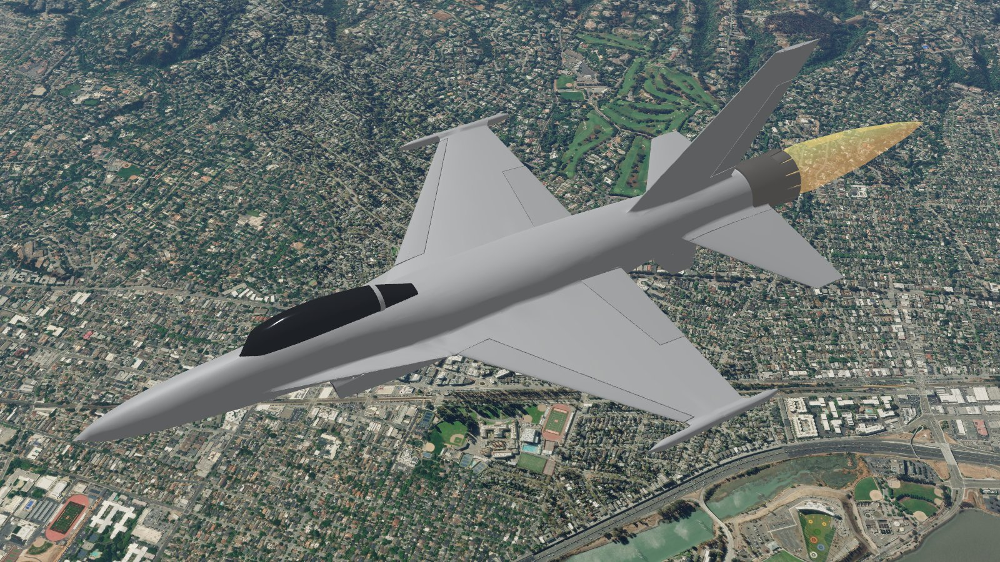
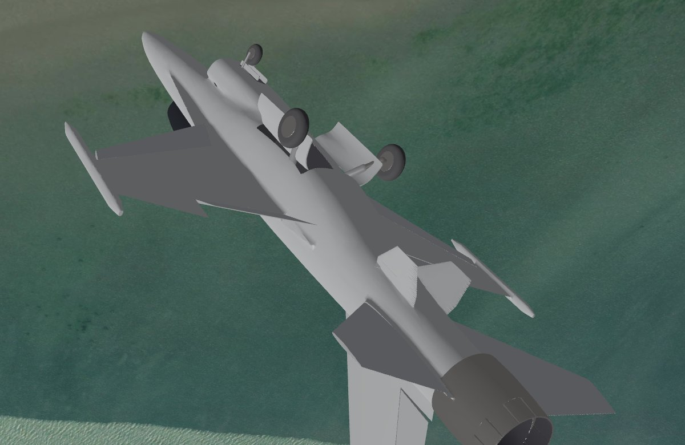
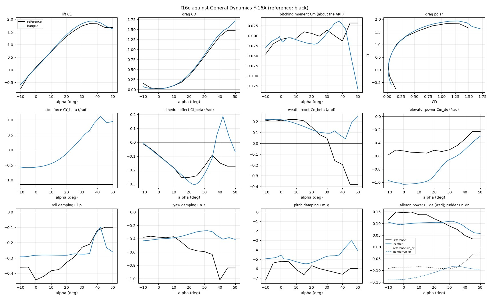
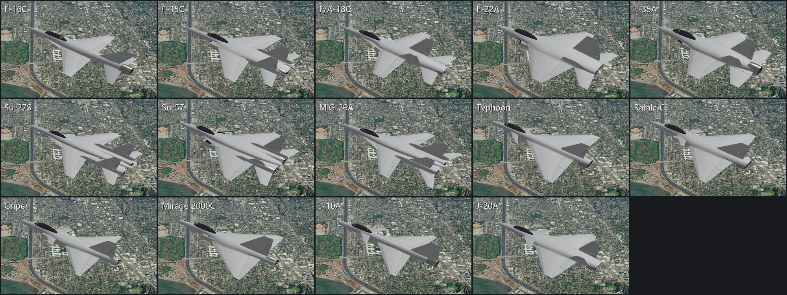
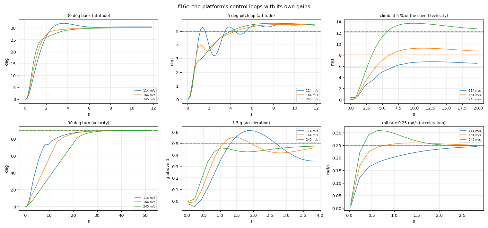

# hangar: JSBSim aircraft from a design file

JSBSim flies an aircraft from tables of aerodynamic coefficients. For an
aircraft that only exists on paper, nobody has those tables. With hangar you
describe the aircraft in one TOML file: its surfaces, bodies, engine, gear
and masses. hangar then:

- computes the tables, mass properties and propeller;
- writes a JSBSim aircraft and a 3D model of it;
- flies it in the platform's own JSBSim, checking it against performance
  targets and handling-quality criteria.

The finished aircraft is `jsbsim:<name>` everywhere on the platform: in the
viewer, the C++ and Python SDKs, and scenario files. In the viewer its
control surfaces move with the simulation, its gear folds away, its
afterburner lights and its propeller turns (see [the 3D model](#the-3d-model)).

It builds light aircraft and fighters. For a fighter it adds afterburning
turbofans, vortex lift, supersonic drag and a fly-by-wire flight control
system, so the aircraft flies like the real one: the stick asks for load
factor and roll rate, and the angle of attack stays within its limit.
Fourteen of the best-known fourth- and fifth-generation fighters are
included, built from public data (see [the fighter library](#the-fighter-library)).






## Use

```bat
fsim hangar list                      the designs in aircraft\
fsim hangar new mine --like skua      start a design from another
fsim hangar mine geometry             one stage: look at aircraft\mine\out\threeview.png
fsim hangar mine --quick              every stage, coarse: a first look in half a minute
fsim hangar mine                      every stage, full tables (a few minutes)
fsim hangar mine calibrate            fit corrections to published performance
fsim hangar mine autopilot            tune the platform's control loops for it (in every full run)
fsim demo --aircraft mine             watch it fly
fsim hangar f16c                      a fighter: NASA's wind-tunnel data as reference
```

`fsim python examples\python\control_surfaces.py` flies the C172 and the
Skua through a slalom. Watch it with
`fsim viewer --camera chase --chase-distance 20`; `tab` switches aircraft.
`fsim python examples\python\fighters.py` flies the fourteen fighters
together (`--chase-distance 60`). `fsim demo --aircraft typhoon` starts
eight of one type at a speed that suits it.

`aircraft\mine\out\report.html` collects everything on one page.

## The loop

Each stage reads the design and what the stages before it wrote. It writes
`out/<stage>.json`, which holds its numbers and its checks, plus any images.
Every check is marked pass, warn, fail or info.

The loop: read the images and the checks, change the design, and run that
stage again. A stage costs seconds, except the full tables, which take a few
minutes. The tables are cached and rebuilt only when the geometry, or the
code that computes them, changes.

| stage | produces | checked against |
|---|---|---|
| geometry | three-view and 3D views; areas, MAC, aspect ratio, tail volumes | usual ranges for the category |
| aero | coefficient tables over α ±180° and β ±90°, and factors on them over Mach; section polars; derivative plots; the reference aircraft's coefficients beside the design's | signs and sizes of the stability derivatives, CL max, smoothness; the reference's lift, drag and pitching moment |
| mass | component weights, CG, inertia, static margin | target empty mass; Roskam's radii of gyration; margin 5–40 % MAC (fly-by-wire: from −15 %, full and with the tanks dry) |
| propulsion | propeller thrust and power tables, engine | peak efficiency, static thrust / weight |
| build | `<name>.xml`, `Engines/`; the fly-by-wire's gains | the fly-by-wire's short period, MIL-F-8785C; full nose-down control reaching 2° past the angle-of-attack limit |
| model | `<name>.glb`: the airframe as one closed solid, its moving parts on their hinges | no crack, pinch or loose piece; gear stowed inside; length, span and height against `[dimensions]` |
| verify | JSBSim's forces and moments at 150 random states, compared with the tables | largest error below 0.002 in any coefficient |
| fly | trim across the speed range; stall; climb and ceiling; top speed (a jet's also at its published height); dynamic modes; 40 runs from random states; six crashes into the ground. A fly-by-wire aircraft instead: top speed at sea level and at the published height, excess power, the ceiling at the best climb speed, sustained turn, the angle-of-attack limiter, a 3 g step from trim, a full-stick roll | `[targets]`, MIL-F-8785C level 1, no diverged run; crashes that stop without blowing up |
| calibrate | `calibration.toml`: extra drag, and the propeller pitch unless the design gives the real one; for a supersonic jet, the throttle ratio and the wave drag; for a subsonic one, where its wing's drag diverges | `[targets]` |
| autopilot | `autopilot.toml`: the platform's control loops tuned for it, from small steps flown at a reference condition, written into `<name>.xml` as `fsim/control` properties; the aircraft then flown through standard manoeuvres at the attitude, acceleration and velocity levels at three speeds (`out/autopilot.png`) | no manoeuvre loses control at the reference speed; overshoot and height hold ([The autopilot](#the-autopilot)) |
| report | `out/report.html` | |

The fly stage flies the same tests on a reference aircraft (`reference =
"jsbsim:c172x"` in `[targets]`) and prints its numbers beside the design's.

A rebuild that changes nothing leaves the aircraft's files as they were:
the build writes them with LF line ends, as git keeps them, and
`<name>.xml` keeps the date in its header until something else in it
changes. An `.xml` that git shows as modified has really changed.

## The design file

Positions are in metres, in JSBSim's structural frame: x aft, y right, z up.
Wings and tails are given for the right half and mirrored. A fin or a body
is single unless `mirror = true`. Here is an excerpt of
`aircraft/skua/skua.toml`, with a `[targets]` section added:

```toml
[[surface]]
name = "wing"
kind = "wing"                    # wing, htail, canard, fin, vtail
airfoil = "naca4412"             # NACA 4/5-digit, or a .dat file beside the design
sections = [                     # leading edge, chord, twist about the leading edge (deg)
  { le = [0.550, 0.000, 0.120], chord = 0.360, twist = 2.0 },
  { le = [0.580, 2.000, 0.225], chord = 0.240, twist = 0.0 },
]
controls = [                     # span as a fraction of the half span
  { name = "aileron", channel = "aileron", span = [0.45, 0.95], chord_fraction = 0.25, limits = [-20, 20] },
]

[[body]]                         # superelliptic stations: width, top, bottom, exponent n
name = "pod"
stations = [ { x = 0.20, w = 0.26, top = 0.13, bottom = -0.13, n = 2.3 }, ... ]

[[engine]]
type = "electric"                # or "piston"
power_kw = 3.0
[engine.propeller]
diameter = 0.56
pitch = 0.30

[mass]
empty = 21.0                     # kg; components by name, or Raymer's statistics
[targets]                        # optional: what fly checks against
stall_speed_kcas = 27            # also max_speed_ktas, climb_rate_fpm, service_ceiling_ft;
                                 # operational_ceiling_ft for a published clearance (reached or not)
```

A fighter adds strakes, all-moving tails, surfaces that several channels
move, a turbofan and fly-by-wire. From `aircraft/f16c/f16c.toml`:

```toml
[[surface]]
name = "strake"
kind = "strake"                  # a sharp leading-edge extension: vortex lift
airfoil = "plate"                # also NACA 6A ("naca64a204"), "biconvex5"

controls = [                     # chord_fraction 1: the whole panel turns (pivot at 30 % chord);
                                 # mix: other channels it follows - here it rolls the aircraft too
  { name = "stabilator", channel = "elevator", mix = { aileron = 0.25 }, span = [0.27, 1.0], chord_fraction = 1.0, pivot = 0.30, limits = [-25, 25] },
]

[[engine]]
type = "turbofan"                # afterburner above 80 % throttle
thrust_dry_kn = 79.2
thrust_wet_kn = 129.4
bypass_ratio = 0.36

[flight_control]
type = "fbw"                     # load factor, roll rate and sideslip commands
n_max = 9.0
alpha_max_deg = 25.0

[targets]
max_mach = 2.05                  # at max_mach_altitude_ft: calibrates the wave drag
max_mach_altitude_ft = 40000
```

A turboprop drives a constant-speed propeller through a gearbox. From
`aircraft/c130j/c130j.toml`:

```toml
[[engine]]
type = "turboprop"
power_kw = 3458                  # the shaft power rating (4,637 shp)
psfc = 0.280                     # kg/(kW h) at the rating
thermodynamic_power_kw = 4474    # what the core makes unrated: flat-rated to a greater height
[engine.propeller]
diameter = 4.115
blades = 6
rpm = 1020                       # governed
gear_ratio = 14.0                # the engine's rpm over the propeller's
blade_angle = [15, 65]           # deg at 75 % radius: the governor's range

[targets]
max_speed_ktas = 362             # flown at max_speed_altitude_ft
max_speed_altitude_ft = 22000
```

A thrust-vectoring nozzle gives its travel, and how far its plane leans
outboard (0, pitch only, for the F-22A). From `aircraft/su57/su57.toml`:

```toml
[engine.nozzle]
position = [18.750, 1.250, -0.150]
vectoring = 15.0                 # deg each way
vectoring_cant = 32.0            # deg outboard: together they pitch, differentially they yaw and roll
```

The 3D model has its own keys (all optional):

```toml
[[intake]]                       # a body whose first station is the lip, open onto a dark duct
name = "intake"
lip = 0.035                      # m
rake = 12                        # deg: the lip's top ahead of its bottom (negative: behind)
sweep = 0                        # deg: its outboard edge behind its inboard one
duct = 1.6                       # m seen into; duct_rise and duct_taper bend it towards the engine
stations = [ { x = 4.40, w = 0.96, top = -0.56, bottom = -1.16, chine = -0.82, n_top = 4.0, n_bottom = 2.4 }, ... ]
                                 # any body: chine is the widest line's height, n_top and n_bottom
                                 # the exponents above and below it (a flat belly, a chined nose);
                                 # lean = 40 (deg) tips a section's top outboard, its walls sloping
                                 # (a stealth fighter's caret intakes)
[[body]]
name = "canopy"                  # a pod named canopy... is glass
frames = [5.45]                  # a frame round it at each x

[[surface]]
leading = [                      # leading-edge flaps or slats, on the angle-of-attack schedule
  { name = "lef", span = [0.28, 0.97], chord_fraction = 0.17, limits = [-2, 25], schedule = [1.38, 9.05, 1.45] },
]

[aircraft]
stands_in_for = ["f16"]          # a stock JSBSim aircraft drawn with this model (fsim hangar register)

[[gear]]
retract = "forward"              # forward, aft, inward, outward; hangar fits the angle, the
wheels = 2                       # trunnion's cant and the wheel's twist that stow the leg inside
axles = 2                        # a bogie: two axles one behind the other (axle_spacing, m)
bogie_deg = "over"               # the bogie turns on its pivot as the leg folds: degrees (nose up),
                                 # or "level" / "over": lying level stowed, upright or on its back
wheel_turn = "flat"              # or retract_deg, retract_axis: what is known of the real leg;
                                 # hangar fits only the rest
doors = false                    # an open well: the stowed wheel may stand out up to its radius
fairing = true                   # fixed gear: a spat over the wheel

[[strut]]                        # a high wing's lift strut, drawn only (its drag is in the
from = [0.99, 0.50, 0.15]        # extra drag area): its ends, mirrored unless mirror = false
to = [1.21, 2.50, 1.54]
chord = 0.16                     # m; thickness 0.35 of it unless given

[dimensions]                     # published: the model is checked against them
length = 15.06
span = 9.45
height = 5.09
```

Included designs:

- `aircraft/c172`: a Cessna 172P built from published dimensions, used to
  validate the methods.
- `aircraft/skua`: a hypothetical twin-boom pusher UAV.
- `aircraft/f16c`: an F-16C Block 52, checked against NASA's wind-tunnel
  data.
- Thirteen more fighters: [the fighter library](#the-fighter-library).
- Bombers, tankers, transports and special-mission aircraft:
  [support aircraft](#support-aircraft).

## Methods

Every method is a published one. The tests in `tools/hangar/tests` check the
section and lattice methods against theory and published data, and run every
stage end to end through the platform (`ctest -R hangar`).

- **Sections.** Thin-airfoil theory gives the zero-lift angle and the
  pitching moment. The lift slope is corrected for thickness and Reynolds
  number. CL max follows DATCOM's leading-edge-sharpness trend. Past the
  stall come Viterna and Corrigan's model and then flat-plate values,
  covering the whole ±180° range. Flaps use Glauert's flap effectiveness and
  Raymer's flap drag.
- **Lifting surfaces.** A vortex lattice (Katz & Plotkin, ch. 12) with
  Prandtl–Glauert compressibility and Vatistas vortex cores. The lattice is
  decambered onto the viscous section polars (after Mukherjee &
  Gopalarathnam, J. Aircraft 43(3), 2006). Each strip then reads its full
  polar at its own induced angle. Past 30–60° of flow angle this becomes
  plain strip theory. The lift a strip's angle of attack makes acts where
  the lattice's loading puts it on the chord, not at the quarter chord a
  section alone has: aft on a wing root behind a strake or a canard, whose
  trailing vortices wash the front of the root down, and forward towards a
  swept wing's tips (Küchemann's centre and tip effects). So in the linear
  range the strips give the lattice's pitching moment as well as its lift.
- **Induced drag.** By default each strip's lift is tilted by its own
  induced angle. That overstates the induced drag of the lattice's loading:
  by about 15 % on a plain wing of aspect ratio 6-10, and by a factor of 1.5
  to 2 on a swept or cambered transport wing, whose lift-to-drag ratio then
  comes out a quarter low (a B-52's 15 against 21.5). `[analysis]
  induced_drag = "trefftz"` takes it from the Trefftz plane instead: the far
  wake of every surface's trailing vortices, from the spanwise loading
  alone, as potential flow has it (a rectangle's span efficiency 0.95, an
  elliptic loading's drag within 1 %). The support aircraft use it; the
  fighters and the light aircraft still use the strips' tilt.
- **Bodies.** Slender-body theory as far as the flow stays attached (DATCOM
  4.2.1.1), then Allen and Perkins' crossflow drag (NACA TR 1048), plus skin
  friction. The wing–body dihedral effect comes from DATCOM. A fuselage and
  the intakes, nacelles and booms against it are one body to the air, their
  sections' union at each station; an intake's mouth swallows its air rather
  than pushing it aside, and turns it into the duct: the inlet's normal force
  at the lip. The area rule counts overlapping bodies once.
- **Derivatives.** Rate derivatives are central differences of the full
  nonlinear model, so they change through the stall. The α̇ terms come from
  the lag of the downwash at the tail (Nelson, *Flight Stability and
  Automatic Control*, ch. 3).
- **Mass.** Component weights come from Raymer's general-aviation equations
  (ch. 15) or are given directly. Each component is spread over its own skin
  to give the inertia. Systems mass is placed to meet the empty CG.
- **Ground contacts.** Besides the wheels, the airframe gets contact
  points wherever a crash can meet the ground first: the extreme points of
  its convex hull in every direction, plus points along keels and surface
  edges. Each point's spring is sized from the mass it moves (small at a
  wingtip, where the aircraft rolls easily), so JSBSim's 120 Hz step
  integrates it stably. Points close together share that budget. The fly
  stage checks the result by crashing the aircraft six ways. The wheels
  stay JSBSim's; flightsim's build of JSBSim fixes their force when one
  lands on its side (THIRD_PARTY_NOTICES.md, "Changes to JSBSim").
- **Propeller.** Blade-element momentum theory with Prandtl's tip and hub
  losses.
- **Engines.** Piston engines use JSBSim's piston engine; hangar's control
  system adds mixture that follows the altitude. Electric motors use JSBSim's
  brushless DC motor.
- **Linear model.** Etkin & Reid's small-perturbation equations, built from
  the tables at the trim condition, the lateral ones in body axes with the
  trim angle of attack's kinematic terms (a roll rate turns the trim
  velocity into sideslip): without them a swept-wing transport's predicted
  dutch roll damping was a third of what JSBSim shows. The handling-quality
  checks use it. The 3-2-1-1 flight tests identify the same modes from
  JSBSim's own response as a cross-check.

For fighters:

- **Vortex lift.** A thin swept section does not stall like a light
  aircraft's. The sweep brings this in: none of it at 25° of leading-edge
  sweep, all of it from 35° (a strake, and a wing behind one, always). A
  line drawn at 35° made the F-35A's 34° stabilators stall like
  two-dimensional sections, so that turned fully nose-down they lifted less
  than at neutral. Past its attached-flow limit the leading edge keeps the suction
  it can hold (Carlson's attainable thrust, NASA TP-1500). What it loses turns
  into vortex lift where the edge is sharp (Polhamus' suction analogy, NASA
  TN D-3767), and past 45° of sweep where it is blunt too (the blunt-edged
  65° delta of the VFE-2 experiment). The suction a wing loses to its vortex
  is Polhamus' own: its lift times the angle less its planform's downwash,
  CL/πA. An edge beside the fuselage has less suction to lose: 1 − (a/d)⁴
  of it, at a distance d from the axis of a body a wide (Bryson's slender
  wing–body theory), and none inside the body. So a strake makes little
  vortex lift where it grows out of the fuselage's side. A sharp 60° delta
  gets within 7 % of Polhamus' lift up to 20°. The vortex bursts at an angle
  that rises with the sweep (Earnshaw & Lawford, ARC R&M 3424) and takes 18°
  more to reach the apex; a burst vortex keeps 40 % of its lift, so a 60°
  delta's lift peaks at 1.27 near 30° (Wentz & Kohlman measured about 1.3 at
  35°). A wing behind a strake shares the strake's vortex; a close-coupled
  canard delays the wing's burst. The
  circulation's force uses the local velocity, so the potential lift goes as
  Polhamus' sin α cos² α.
- **Past the stall.** A vortex-lifting aircraft flies two flows there, each
  solved on its own: the vortex flow, a lifting surface in the lattice's
  induced flow, and the separated flow, flat plates in strip theory. The
  wing moves from the one to the other between 45° and 70° of its angle of
  attack, and its tails and canards, in the flow it makes, with it. Each
  flow decides before it solves where a section leaves the vortex regime,
  so each has one solution. Decided while solving, as a lone section decides
  it, a section washed far down and still in the vortex regime and a plate
  hardly washed down at all were both solutions, and the tables jumped
  between them (the Rafale's drag by 0.5 between 55° and 60° in a 30°
  sideslip).
- **Controls.** Each control turns as a whole and stops at its own limits,
  so a canard can travel further than the elevons on its channel. An
  all-moving surface turns its whole section: the lattice gets the deflection
  that gives it sin(α + δ), not the linear sin α + δ cos α.
- **Wake.** The lattice's wake leaves the trailing edge along the free
  stream. It is solved at wake angles 2° apart and interpolated, so a tail
  in the wing's plane sees the wake rise above it.
- **Sideslip.** Simple sweep theory: the windward half of a swept wing
  lifts more, the dihedral effect that grows with lift.
- **Mach number.** Prandtl–Glauert on the lattice to Mach 0.9. From 1.2,
  linear theory per surface: Ackeret, and Stewart's slope for subsonic
  leading edges. Transonic values are faired between. The results are
  factors on the tables: lift, the neutral point's move, control power.
  The neutral point's supersonic move starts from where the lattice puts
  each surface's lift at Mach 0.9, already well behind a low aspect ratio
  surface's quarter chord.
  Drag adds skin friction falling with Mach, and wave drag from the area
  distribution (Sears–Haack times Raymer's E_WD, from Korn's
  drag-divergence Mach). Once the leading edge is supersonic, the edge's
  suction is lost. A flat pod - a rotodome - is a thick section of its own,
  and its drag diverges long before the wing's: as the two-dimensional
  section with its ellipsoid's fastest air (Lamb), at Korn's 0.87 − t.
- **Turbofans.** JSBSim's turbine. Thrust goes as the density to the 0.7
  (afterburner) or 1 (dry) up to 11 km, and as the density above it, where
  the temperature holds. It rises with the ram, 1 + 0.2 M², and is cut back
  once the compressor's inlet temperature passes the throttle ratio TR
  (Mattingly, Heiser & Pratt, *Aircraft Engine Design*, sec. 2.3). A dry
  engine of bypass ratio above 1 moves towards Mattingly's high-bypass
  lapse, δ₀(1 − 0.49√M), all of it from a bypass ratio of 2: a fifth of
  the static thrust at Mach 0.8 and 35,000 ft. A TF33 (1.42) goes two
  fifths of the way, to 0.29 of its static thrust at Mach 0.82 and 35,000
  ft, as the JT3D's cruise ratings give it. A flat-rated engine
  (`thermodynamic_thrust_kn`, its core's thrust above the rating, as the
  AE3007H's 8,917 lbf rated 7,600) keeps its rating at each Mach number
  until the core's, lapsing with height, falls below it. Weight and size
  come from Raymer. Calibration fits TR to a fighter's published top speed,
  and then the wave drag if TR alone cannot. A subsonic jet's engines run
  far below their TR at its top speed, which its wing's transonic drag rise
  sets: calibration fits Korn's airfoil technology factor κ_A in the
  drag-divergence Mach number (Raymer 12.5.10), from conventional sections'
  0.87 to supercritical ones' 0.95, and more wave drag when even
  conventional sections leave it too fast. A top speed below the wing's
  drag rise is none of the wing's doing (the E-3G's, its rotodome holding
  it): there calibration fits an extra drag area. On direct controls the test
  autopilot flies that top speed: trimmed, the height held, full thrust
  until the speed settles.
- **Turboprops.** The propeller's blade-element tables at every blade
  angle, with the tips' drag rise past Korn's divergence Mach number; the
  engine's shaft power lapses as Mattingly's turboprop (delta0, cut past
  its TR). The JSBSim file's governor turns the blades to hold the
  propeller's speed, and starts the engine running at its trimmed power.
  A propeller aircraft whose propellers leave nothing to fit (their pitch
  given, or constant-speed) is calibrated on its top speed alone.
- **Large aircraft.** A jet climbs best well above a propeller aircraft's
  speeds, at up to 2.8 times its stall speed. A heavy jet's stall run goes
  on until the stall breaks, and every crash test starts with the lowest
  point of the aircraft clear of the ground. The platform commands four
  throttles, so engines past the fourth (a B-52's) follow one of them, and
  the viewer shows each as the one it follows. A tank's `fill` is the fuel
  it carries everywhere: the JSBSim file, the mass and CG, the inertia. A
  fly-by-wire transport turns at Mach 0.6 within its load limit and rolls
  long enough to pass 90°.
- **Yaw damper.** A swept-wing jet on direct controls has a lightly damped
  dutch roll, most of all when slow (the KC-135R's 0.03 near its approach
  speed). `yaw_damper = true` under `[flight_control]` adds one: the yaw
  rate, washed out over 2 s so a steady turn keeps its own, against itself
  through the rudder, with at most half the rudder's travel. Its gain over
  dynamic pressure brings the dutch roll's damping to 0.3 in the full
  lateral model, washout and all. The flight tests identify the airframe's
  own modes (they take the surfaces as they moved for inputs), so the
  report adds the dutch roll with the damper on. Flown in JSBSim, the
  KC-135R's sideslip after a rudder doublet decays at 0.31 with it, 0.11
  without.
- **Fighter mass.** Raymer's fighter/attack weight equations. Radii of
  gyration are given per design (NASA's for the F-16).
- **Fly-by-wire.** Gains are placed from the linear model at each dynamic
  pressure and Mach number (`hangar/fcs.py`):
  - Pitch: angle-of-attack and pitch-rate feedback give the short period
    CAP 1 and damping 0.8. A load-factor command follows a model response.
  - Angle-of-attack limits: near a limit the command is cut to the load
    factor the aircraft pulls plus what the angle of attack left gives,
    counting its rise over the next 0.35 s. At the limit the integrator,
    five times as fast there, trims the elevator that holds it: a steady
    pull on a stable airframe such as the MiG-29A, a push on an unstable
    delta. (A feedforward faded out past the limit instead took about 10°
    of elevator per degree of angle of attack, on one side of the limit
    only; against its stabilator's rate limit the MiG-29A cycled between
    24° and 29° at its 26° limit.)
    Full aft stick asks for the lift at the limit beyond the gravity
    reference of the moment, so the limit stays in reach in a steep climb
    or inverted. Past the limit a push back gives all the nose-down travel
    4° beyond it, so an unstable canard delta pitching up fast is caught.
    The command rises at most 12 g/s: a full pull at once would pitch an
    agile airframe (the MiG-29A) faster than its nose-down control can
    stop.
  - Pitching moment: the elevator cancels the moment's departures from a
    straight line through the angle-of-attack envelope (a table over α and
    Mach), and the gains are designed on that line. A band of local
    instability, such as the F-35A's tail passing through the wing's wake
    at 2–5°, then no longer throws a 3 g step up to 70 % past its target.
  - Roll: a roll-rate command about the flight path, with bank hold. At
    angle of attack that roll is also a yaw, r = p sin α, and the rudder
    gives what the ailerons' own yaw and the inclination of the principal
    axis do not: sin α − η cos α − (I_xz/I_zz)(cos α − μ sin α) of the roll
    acceleration, where μ = Cn_δa/Cl_δa and η = μ I_xx/I_zz. That is next to
    nothing at a cruising angle of attack and half or more past 30°. At
    70 m/s the rudder's yaw acceleration is a twentieth to a fifth of the
    ailerons' roll acceleration, so the command is limited to what the
    rudder can coordinate. Its size is limited to what half the rudder's
    yaw holds while the aircraft pitches under the roll: the pitch rate's
    inertia coupling (I_yy − I_xx)/I_zz · pq, the angle of attack rising,
    and the yaw damping. While it grows, its rate of change is limited to
    the roll acceleration whose yaw all of it gives, unless even an
    uncoordinated roll to the rate asked for could not leave 2° of
    sideslip (at worst c²p²/8Y, c the rudder's share, Y its yaw
    acceleration). A roll stops unlimited. The rudder's yaw acceleration is
    the design points' (with canted vectoring nozzles, their yaw at the
    thrust there is now).
  - Yaw: a yaw damper on the rate of the sideslip, and sideslip from the
    pedals. The sideslip's rate is the yaw rate in the dutch roll and zero
    in a steady coordinated turn, a roll about the flight path and a steady
    sideslip, so the damper coordinates those for as long as they last. A
    damper on the washed-out stability-axis yaw rate stopped coordinating a
    sustained roll.
  - Thrust vectoring: the nozzles turn with the surfaces - through their
    travel as the elevator goes through its own, differentially through half
    of it with the ailerons, and with the rudder when their plane leans
    outboard. Their power grows with thrust, the surfaces' with dynamic
    pressure, so each gain is a moment divided at run time by the power
    both give at the thrust the engines make, and the integrators hold
    moments: the loops respond alike at idle and in afterburner, and the
    nozzles add authority where the surfaces run out. At 70 m/s the F-22A's
    3 g step rises in 1.0 s instead of 1.8 s. The Su-57's canted nozzles
    add yaw to its rudder's, so the roll they can coordinate is faster: at
    70 m/s it rolls at 76°/s and reaches 90° in 2.0 s, where without them
    it rolls at 37°/s and does not get there in 3 s, at the same 4° of
    sideslip.

## The 3D model

The model stage writes `<name>.glb` from the same design:

- **Airframe.** One closed solid: every body and surface as a signed
  distance field, joined with fillets where a wing, fin or intake meets the
  fuselage, and meshed by hangar's native mesher (`tools/hangar/native`).
  Intakes open onto dark ducts, nozzles onto their turbine faces; canopies are
  glass in their frames.
- **Thin parts.** A body may end in a knife edge, with no width but some
  height (a pylon's leading or trailing edge, a tail cone's end), or in a
  flat one. The mesher measures a section by the box that holds it as well
  as by its own shape, so a fillet or a canopy frame near such an edge grows
  nothing away from it.
- **Control surfaces.** Each one, and each leading-edge flap, is cut from its
  surface with a 12 mm gap and turns on its own hinge. The gap's edges are
  square: beside a cut the mesher measures a point by how deep in the cut
  it lies, not by the skin the cut took away.
- **Landing gear.** Each leg swings about its trunnion and twists about its
  strut into a bay cut into the airframe. The bay opens where the leg passes
  through the skin; its two doors hinge on the edges either side of the leg's
  swing, open first and close behind it. hangar fits the swing to the
  airframe - through as small an opening as it can - from what the design
  gives (the direction, and any of the angle, the trunnion's axis and the
  wheel's twist). On every leg the oleo slides up the strut as the unit
  compresses, a steerable wheel turns with the steering, and the wheels roll.
  A leg with `doors = false` folds into an open well, its wheel out of the
  skin by up to its radius (the B-52H's outriggers, in its thin wingtips);
  `door_reach` lets a wide truck's doors move further out. A bogie
  (`axles = 2`) carries its wheels in pairs on a beam under the strut, each
  axle's pair rolling on its own; with `bogie_deg` the beam turns on its
  pivot as the leg folds (the H-6K's somersault into its gondolas).
- **Propulsion.** Behind each augmented jet a node (`fsim:afterburner`) the
  viewer draws the exhaust at - flame, glowing nozzle, heat haze, contrail -
  with a flame mesh of its own for anything that does not; nozzle petals
  open as the engine opens them. A round nozzle's petals have their space
  to themselves: whatever of a fuselage or nacelle runs on past their
  hinges, at about their size, is cut away, so no skin lies a hair from
  theirs or is opened through, and each petal carries a seal under the next,
  so the open nozzle shows no sky between them. The nozzle's burnt metal is
  painted by where it is - over its visible length, the case and any skin
  near it - not by which of two nearly touching surfaces is nearer, which
  left ragged patches of paint and metal that read as parts cutting through
  each other. A propeller turns at its engine's rpm. A vectoring nozzle
  turns, flame and all, as the flight controls turn it: a round one on a
  ball seal round its gimbal, a two-dimensional one's flaps cut from the
  airframe with a rounded nose that turns in the socket it leaves. Neither
  opens a gap at any deflection.
- **Surfaces for the viewer.** The model's manifest (`<name>.glb.manifest`)
  also lists the wings, strakes and canards - each section of the right half,
  its leading edge in body axes from the model's origin and its chord - for
  the viewer's vapour and wing tip vortices.
- **Paint.** `paint.toml` beside the design gives its colours: a scheme
  (single, two-tone, camouflage or a cheat line), the radome, an anti-glare
  panel, the canopy's tint, a transport's cockpit windows. hangar draws it
  as a texture, with panel joints
  where the airframe has them - frames round the fuselage, spars and ribs on
  the wings and fins - and a little wear.

The checks: no open, pinched or misturned edge in any mesh; the airframe in
one piece; every moving part a closed solid; the stowed gear inside the skin;
no gear door ever touching a leg, open or closed; length, span and height
within 3 % of `[dimensions]`.

The model is made again only when something that shapes it changes: the
design's geometry, mass (its origin is the empty CG) or paint, or the code
that shapes, meshes and paints it (`geometry/`, `shape/`, `model3d.py`,
`livery.py` and the mesher). An edit to the aerodynamics re-meshes nothing.
The mesher gives the same file, byte for byte, every time and on any number
of cores, so a `.glb` that git shows as changed has really changed.

A design that stands in for a stock JSBSim aircraft (`stands_in_for`) is
drawn for it too: `fsim hangar register` parks each stock aircraft, finds
where its main wheels touch, and writes `aircraft/models.txt` - which model
the viewer uses for each, moved so its wheels stand where the stock
aircraft's do.

The viewer's names for the moving nodes are in
[docs/sdk/viewer.md](sdk/viewer.md#moving-control-surfaces).

## Validation: the Cessna 172P

The C172P was built from public dimensions, not from JSBSim's c172x tables;
its tail stands where c172x's tail arm and a three-view put it, and its lift
struts and wheel spats are drawn. Its propeller has the real McCauley's
57 in (1.448 m) pitch, and calibration fits one number, to the top speed:

- **Extra drag area, 0.235 m².** This stands for the struts, cooling and
  gaps the estimate does not see.

The stall speed, the climb, the ceiling and the dynamics are predictions.
Top speeds are flown: full throttle, the height held, until the speed
settles.

| sea level, 2400 lb | hangar c172 | POH | JSBSim c172x (stock) |
|---|---|---|---|
| stall, clean | 49.4 KCAS | 51 | 41.6 |
| maximum level speed | 122.7 KTAS | 123 | 131 |
| best rate of climb | 715 ft/min | 700 | 870 |
| service ceiling | 12,970 ft | 13,000 | 25,100 |

The dynamic modes at 1500 m and 1.9 times the stall speed, first as the
linear model predicts them and then as identified from JSBSim's response:

| mode | predicted | JSBSim response |
|---|---|---|
| short period ζ | 0.64 | 0.57 |
| phugoid period | 25.3 s | 25.7 s |
| dutch roll ω, ζ | 1.67 rad/s, 0.19 | 1.71 rad/s, 0.19 |
| roll time constant | 0.21 s | 0.22 s |

All modes are MIL-F-8785C level 1, and the spiral mode is stable. JSBSim
reproduces the tables to within 4×10⁻⁴ in every coefficient. None of the 40
runs from random attitudes and rates diverged.

## Validation: the F-16C

The F-16C was built from public dimensions and shaped to two three-views.
JSBSim's own `f16` carries NASA TP-1538's wind-tunnel data (Nguyen et al.,
1979), a reference measured from −20° to 90° angle of attack. It is in
black, hangar's F-16C in blue:



Lift and drag follow NASA's to 40° angle of attack. The mean error to 15°
is 7.1 % in lift and 7.4 % in drag, and from 15° to 40° it is 7.3 % and
9.2 %. The dihedral effect, the weathercock stability to 25°, and the
damping in pitch and yaw at low α also agree.

So does the pitching moment. Both moments are taken about NASA's moment
reference, 35 % of the MAC, which is also the design's reference point.
NASA's Cm stays within 0.015 of zero from 0° to 40°. hangar's stays within
0.015 of NASA's to 15° and within 0.05 to 40°. The neutral point is at
34.8 % of the MAC; NASA's is at 33.5 % from the same slope between −2° and
6°, and at 34.5 % between 0° and 10°.

It used to pitch up: Cm 0.037 above NASA's at 15° and 0.23 above at 40°,
the neutral point at 30.7 %. That showed once the F-16C was reshaped to its
three-views, whose ogee strakes start 1.2 m further forward. Two terms of
the model put the strakes' lift too far forward:

- **Where each strip's lift acts.** Each strip carried its lift at its
  quarter chord, as a section alone does. But the strakes' trailing
  vortices wash the front of the wing root down, and the lattice puts the
  root's load up to a quarter of its chord further aft. The strips kept the
  strakes' own lift ahead of the reference point, but not the load the
  strakes move aft on the wing. Each strip's lift now acts where the
  lattice's loading puts it (see Methods). This moves the neutral point
  4.1 % of the MAC aft, and takes Cm at 40° from 0.22 to 0.11.
- **The strakes' vortex lift beside the fuselage.** It counted the whole
  leading edge, also where the strake grows out of the fuselage's side.
  There the fuselage's cross flow takes the edge's suction, and with it the
  vortex. Only 1 − (a/d)⁴ of the suction remains (Bryson's slender
  wing–body theory). This takes Cm at 40° from 0.11 to 0.04.

The earlier, shorter strakes hid both errors. Today's model puts that
shape's neutral point at 37.8 %, 4.3 % behind NASA's.

hangar's F-16C also differs in these:

- At high angle of attack it keeps more directional stability than NASA's.
- Its all-moving tail is about 1.4 times as powerful below 20°.
- Its side force in sideslip is about half of NASA's.

JSBSim's `f16` applies Stevens & Lewis's aileron and rudder tables per
radian, although they are given per 20° and 30°. The comparison scales them
back (`reference_control_scale`).

Flown through its fly-by-wire:

| F-16C, clean | hangar | published |
|---|---|---|
| top speed, 40,000 ft | Mach 2.04 (calibrated: TR 1.20) | Mach 2.05 |
| sustained turn, Mach 0.9, 15,000 ft | 12.5 deg/s | about 13.5 deg/s |
| full aft stick, 350 kt | 6.7 g, α held at 25.4° | α limit 25° |
| full-stick roll, 350 kt | 267 deg/s | 308 deg/s (limit) |
| top speed, sea level | 868 kt | 795 kt |
| best rate of climb | 62,800 ft/min | 50,000 ft/min |
| service ceiling | 62,300 ft | 50,000+ ft |

The top speed at 40,000 ft is the calibration's one target. The rest are
predictions. The published sea-level speed is the airframe's limit, not
where thrust and drag meet.

## The fighter library

Fourteen fighters, each built the F-16C's way from public dimensions,
weights and engine data, and flown through its own fly-by-wire. Each is
`jsbsim:<name>` on the platform: in the viewer with moving control
surfaces, in the SDKs and in scenario files.



Each airframe is measured off a public three-view drawing and checked
against it silhouette by silhouette: side and top views overlap it 89-99 %,
front views 68-89 % (the drawings' pylons and stores count against them).
The landing gear stands where the drawings put the wheels, and folds the way
the real gear does.

Flown, beside the published figures (the J-20A's and the Su-57's are
estimates):

| aircraft | `jsbsim:` | top speed, Mach | climb, ft/min | ceiling, ft | α held (limit) |
|---|---|---|---|---|---|
| F-16C Block 52 | `f16c` | 2.04 (2.05) | 62,800 (50,000) | 62,300 (50,000+) | 25.4° (25°) |
| F-15C | `f15c` | 2.44 (2.5) | 63,200 (50,000) | 64,500 (65,000) | 30.2° (30°) |
| F/A-18C | `fa18c` | 1.81 (1.8) | 50,800 (45,000) | 60,000 (50,000+) | 35.0° (35°) |
| F-22A | `f22a` | 2.25 (2.25) | 62,000 | 60,400 (65,000) | 40.7° (40°) |
| F-35A | `f35a` | 1.60 (1.6) | 44,900 | 57,500 (50,000+) | 19.5° (20°) |
| Su-27S | `su27s` | 2.35 (2.35) | 64,300 (59,000) | 65,600 (60,700) | 26.3° (26°) |
| Su-57 | `su57` | 2.02 (2.0) | 56,200 | 58,100 (65,600) | 26.3° (26°) |
| MiG-29A | `mig29a` | 2.25 (2.25) | 64,000 (65,000) | 62,700 (59,000) | 26.4° (26°) |
| Typhoon | `typhoon` | 2.02 (2.0) | 72,500 (62,000) | 62,200 (55,000+) | 30.4° (30°) |
| Rafale C | `rafale` | 1.80 (1.8) | 60,400 (60,000) | 62,000 (50,000+) | 29.5° (29°) |
| JAS 39C Gripen | `gripen` | 2.00 (2.0) | 49,800 | 59,900 (50,000+) | 28.1° (28°) |
| Mirage 2000C | `mirage2000` | 2.20 (2.2) | 53,900 (56,000) | 58,600 (56,000) | 29.3° (29°) |
| J-10A | `j10a` | 2.21 (2.2) | 50,700 | 59,300 (59,000) | 30.2° (30°) |
| J-20A | `j20a` | 2.01 (2.0) | 51,100 | 58,700 (66,000) | 30.4° (30°) |

- The top speed at altitude is each design's one calibration target,
  flown where it is published: 40,000 ft for the five American designs,
  36,000 ft for the rest. Every other number is a prediction.
- The ceiling is where the best climb, at any Mach number the aircraft can
  hold level flight at, falls to 100 ft/min. A published 50,000 ft (and
  the Typhoon's 55,000) is a clearance, not where the climb runs out: the
  model must reach it (shown with a +).
- Handling at 350 kt, from trim: a 3 g step overshoots 5-24 % and reaches
  90 % in 0.6-0.9 s; full aft stick holds each limit within 0.5°, the
  F-22A's within 0.7°. In full pulls from sea level to 39,000 ft at
  210-500 kt (true airspeed) every limit holds within 0.8°, the F-22A's
  within 1.2°: its nozzles reach 40° at 210 kt, where its tails alone
  stopped short, and keep their power there, where the tails lose theirs.
- The F-22A and the Su-57 vector their thrust (see Methods, Fly-by-wire).
- Engines fitted to Mach 2.3-2.5 keep too much thrust at sea level (see
  [Limits](#limits)).

## Support aircraft

Bombers, tankers, transports and special-mission aircraft, built the same
way, on direct (hydraulic) controls or their own fly-by-wire. Each is
`jsbsim:<name>` on the platform.

| aircraft | `jsbsim:` | top speed, Mach | climb, ft/min | ceiling, ft |
|---|---|---|---|---|
| B-52H | `b52h` | 0.91 at 20,700 ft (0.906) | 9,300 | 53,000 (50,000) |
| H-6K | `h6k` | 0.92 at 19,700 ft (0.922) | 6,500 | 41,100 (42,000) |
| KC-135R | `kc135r` | 0.88 at 30,000 ft (0.86) | 7,100 | 40,900 (50,000 certified) |
| RC-135W | `rc135w` | 0.88 at 30,000 ft (0.86) | 6,400 | 38,700 (50,000 certified) |
| E-3G | `e3g` | 0.78 at 29,000 ft (0.78) | 3,700 | 34,200 (above 29,000) |
| E-7A | `e7a` | 0.81 at 35,000 ft (0.80) | 6,700 | 39,600 (41,000 certified) |
| A-10C | `a10c` | 0.57 at sea level (0.576) | 4,700 | 29,800 (45,000) |
| Su-25 | `su25` | 0.82 at sea level (0.796) | 17,000 | 52,400 (23,000 unpressurised) |
| C-130J | `c130j` | 361 kt at 22,000 ft (362) | 2,800 | 32,400 (28,000 at 70 t) |
| EC-130H | `ec130h` | 262 kt at 20,000 ft (261) | 2,300 | 24,500 (25,000) |
| C-17A | `c17a` | 0.87 at 28,000 ft (0.875) | 6,200 | 36,800 (45,000 certified) |
| KC-46A | `kc46a` | 0.86 at 26,000 ft (0.86) | 5,200 | 29,500 (40,100 certified) |
| EA-18G | `ea18g` | 1.80 at 40,000 ft (1.8) | 44,500 | 57,200 (50,000+) |
| U-2S | `u2s` | 0.82 at 60,000 ft (0.715) | 10,700 | 64,800 (70,000+) |
| RQ-4B | `rq4b` | 359 kt at sea level (340, height not given) | 3,600 | 45,200 (60,000) |

- The B-52H flies at 140 t, 40 % fuel, about its combat weight. Its wing
  droops to the tips as it does on the ground. Spoilers roll the real one;
  ailerons on the outer wing stand in for them. Its yaw damper takes the
  dutch roll's damping from 0.11 to 0.31. Even conventional sections'
  drag rise leaves it too fast, so it needs 5 times Sears-Haack's wave
  drag, beyond the usual 2-3 (a warning in its report). Its L/D peaks at
  19.7 (21.5 published).
- The H-6K is the Tu-16's airframe, measured off a Tu-16 three-view, with
  the H-6K's radar nose, its enlarged intakes for two D-30KP-2s, six empty
  pylons and a tail cone where the guns were. It flies at 59 t, 60 % of
  its fuel. Its main legs fold aft into the wing's gondolas, each bogie
  turning over onto its back as the Tu-16's do, into open wells: hangar's
  doors would wrap the tapering gondola's sides above their hinges, and
  swing in against the bogie. The published 1,050 km/h has no altitude;
  flown at 6,000 m (Mach 0.922), it needs Korn's factor at 0.94, nearly a
  supercritical section's. Its overall length, 35.9 m, is 3 % over the
  published 34.8 m, which is the fuselage's: the tailplane's tips reach
  past the tail.
- The KC-135R flies at 100 t, half its fuel: a tanker mid-mission. It
  climbs to 40,900 ft there; 50,000 ft is its certified altitude. Its
  boom, the boom's ruddevators and the fin's HF probe are drawn. The main
  bogies fold into open wells: hangar's doors for an inward swing split fore
  and aft, where a bogie's ends pass (the real ones close). Its yaw damper
  takes the dutch roll's damping from 0.10 to 0.35. Like the B-52H, it
  needs the most wave drag calibration allows for its top speed, which is
  also its limit Mach number.
- The RC-135W is the KC-135R's airframe with its signals-intelligence fit:
  the drooping hog nose radome, the cheek fairings along the forward
  fuselage, no boom. It flies at 111 t, 24 t of it mission systems, half
  its fuel.
- The E-3G is a 707-320B with four TF33s and the rotodome, 9.1 m across,
  on two struts. It flies at 150 t, full of fuel. Its rotodome's drag
  diverges from Mach 0.62, and calibration adds 2.4 m² of drag (CD
  +0.008: the rotodome's pressure drag, the antennas) for its published
  top speed. Its yaw damper takes the dutch roll from 0.07 to 0.26.
- The E-7A is a 737-700, measured off a four-view whose length label,
  31.20 m, is the -600's (scaled by its span, it measures the -700's 33.6
  m), with the MESA radar's plank and top hat on its back, the ventral fins
  and ESM pods on the wing tips. It flies at 60.3 t, 60 % of its fuel. The
  plank is a surface: its side force counts, and the ventral fins balance
  it, Cn_beta 0.09 and the dutch roll damped 0.21 by the airframe alone.
  Its main wheels fold inward and stack in the belly, open to it, as a
  737's do. Uncalibrated it flies Mach 0.813 at 35,000 ft against the
  published 460 kt (Mach 0.80 there): calibration would take the wave drag
  to its limit for 1.6 %. As with the KC-46A, hangar puts its neutral point
  far aft, at 65 % of the MAC: its CG is where 7 % of its weight rests on
  the nose wheel, 32 % of the MAC ahead of it. Its overall length, 35.1 m,
  runs past the published 33.63 m, the fuselage's: the stabilizer's tips
  reach 1.5 m past the tail cone.
- The A-10C flies at 17.2 t, full of fuel and ammunition. Its eleven
  pylons, the gun and the half-exposed main wheels need 1.2 m² of extra
  drag (CD +0.026) for its published 381 kt at sea level. Its high-bypass
  TF34s keep too little thrust up high for the published 45,000 ft: it
  climbs to 29,800 ft. Its thick, cambered sections' maximum lift is held
  to 1.8. Its yaw damper takes the dutch roll from 0.10 to 0.32.
- The C-130J flies at 60.4 t, full of fuel with 5 t of cargo: the mid
  weight its published top speed needs. Its published climb, 2,100
  ft/min, and ceiling, 28,000 ft, are at about 70 t (42,000 lb of
  payload): hangar flies every test at one weight. Its main wheels, in
  tandem, rise into open wells in the sponsons; its six-bladed propellers
  turn at the governed 1,020 rpm.
- The EC-130H is the C-130H airframe the C-130J shares, on four T56s and
  four-bladed 54H60 propellers, with the Compass Call antennas: pods under
  the outer wings, blisters on the aft fuselage, the spur array's struts
  under the tail. It flies at 59.6 t, 60 % of its fuel; its antennas and
  the spur's wires take 2.4 m² of extra drag (CD +0.015) for its published
  300 mph at 20,000 ft.
- The Su-25 flies at 13.1 t, full of fuel. It stands 5 deg nose-high on its
  gear (its height is measured so), its main wheels fold into open wells in
  the nacelles. Its estimated zero-lift drag leaves out its ten pylons:
  calibration holds its sea-level top speed with the most wave drag it
  allows, and it climbs 17,000 ft/min against the published 11,400.
- The C-17A flies through its own fly-by-wire, with a transport's limits
  (+2.5/-1 g, 14 deg, 35 deg/s), at 236 t: full of fuel, no cargo. Its
  supercritical wing's drag diverges late: calibration puts Korn's factor
  at 0.93, near supercritical sections' 0.95.
- The KC-46A is the 767-2C with the boom and two wing refuelling pods, and
  no winglets (the real one has none), flown at 179 t, full of fuel. Its
  top speed is flown where the 767's VMO meets its MMO, 26,000 ft: at this
  weight the model cannot hold 35,000 ft. hangar puts its neutral point at
  67 % of the MAC, likely too far aft for a 767, with the trim drag that
  follows up high.
- The EA-18G carries its typical jamming load: three ALQ-99 pods, and the
  ALQ-218 receivers on the wing tips. It flies through the F/A-18's
  fly-by-wire (7.5 g, 35 deg: the lower end of the published 35-40 with
  pods). For the published (clean) Mach 1.8, calibration takes its engines'
  throttle ratio to the top of its range to make up the pods' wave drag.
  The centre-line pod hangs 0.23 m lower than the drawing puts it, clear of
  the main gear's bays.
- The U-2S flies at 12.6 t, half its fuel. On its bicycle gear the main and
  tail wheels share the weight by the lever rule, both pedals brake the main
  wheel, and parked it stands 4 deg nose-high (its height is measured so).
  hangar has no buffet boundary: at 60,000 ft its F118 takes it to Mach
  0.82, past the 0.715 where the real one's Mach buffet holds it - the
  coffin corner. It is not calibrated. At half fuel it climbs to 64,800 ft,
  short of the 70,000 it reaches as the fuel burns: its estimated zero-lift
  drag, 0.014, is above the published 0.009.
- The RQ-4B stretches the RQ-4A's drawing to the published 47.6 ft and
  130.9 ft, on NASA's LRN 1015 section (a coordinate file beside the
  design). It flies at 10.5 t, 30 % of its fuel, on direct controls with a
  yaw damper (hangar's fly-by-wire tests are a fighter's). Its V-tail only
  just outweighs the bulbous nose in yaw (Cn_beta 0.004, a warning), yet
  its dutch roll is level 1, damped 0.17 by the airframe alone; set at -4
  deg, the tail trims the cambered wing to its stall, CL 1.65 at 76 KCAS.
  It climbs to 45,200 ft, not 60,000: the high-bypass lapse, flat-rated,
  leaves its AE3007H about 470 lbf there, where it needs some 700 (the
  real engine's thrust up there is not published). Its phugoid, at L/D
  27, is barely damped (a warning).

## The autopilot

Every vehicle on the platform can be flown at five levels above its
surfaces ([control.md](sdk/control.md)): attitude, acceleration, velocity,
position and behaviours, each a built-in loop commanding the one below it.
Their shared gains suit the stock c172x. Flown with them, every fly-by-wire
design sat in a standing pitch oscillation of 5-15° while only holding its
height, a 1.5 g step overshot by up to 1,500 %, and the B-52H, which needs a
third of its elevator to trim at cruise, climbed out of a height hold. The
autopilot stage gives each design its own gains, as a flight-test engineer
would:

1. **Identify.** From level flight at a reference condition - 3,000 m, where
   the wing carries the weight at CL 0.35 (faster if that needs more than
   90 % throttle, and no more than 80 % of the top speed) - small steps at
   the actuator level: aileron 0.1, elevator 0.05, rudder 0.1, throttle
   0.15. First-order fits give the roll rate per unit aileron and its lag,
   the load factor per unit elevator and its lag, the sideslip the rudder
   holds, and the thrust per unit throttle with the engine's lag. Level
   flight at three speeds gives the elevator that trims a surface-controlled
   aircraft and the angle of attack it flies at. A fly-by-wire law is
   levelled at neutral stick, which holds its flight path; the rest by
   JSBSim's trim.
2. **Place the poles.** The bank loop's on G_p / (s (τ_p s + 1)), the pitch
   attitude's on the pitch rate the load factor gives (g G_n / tas), damping
   0.8; on surfaces at least a quarter of the proportional gain as rate
   damping, for the short period and dutch roll a first-order fit cannot
   see. The heading loop a fifth of the bank loop's speed (at most
   0.2 rad/s), the vertical speed a quarter of the pitch's (at most 0.35),
   the altitude a third of that.
3. **Schedule.** The gains hold at the reference and follow the airspeed
   elsewhere as the aircraft's answer to its controls does, so each loop
   keeps its damping: a fly-by-wire law's roll and load factor need no
   change; its pitch gains grow with tas (its pitch rate per g falls as
   1 / tas); surfaces' roll gains fall as (eas / tas)² (their roll rate grows
   as tas, their roll mode slows as tas / eas²).
4. **Feed forward** what the loops can know: a surface-controlled aircraft's
   trim law (the elevator that holds 1 g, growing with lift as n / eas²);
   the flight-path angle a vertical speed needs plus the angle of attack the
   wing flies at 1 g; the stick a load factor or a roll rate needs. On
   aircraft without a law the rudder takes out half the sideslip.

The gains go to `autopilot.toml` beside the design (reviewable; delete it
to fly the shared defaults) and, at every build, into `<name>.xml` as
JSBSim properties `fsim/control/<controller>/<parameter>`. The platform sets
them on every vehicle of the type ([control.md](sdk/control.md#per-aircraft-gains));
a trainer's own setting still wins. The stage then flies the aircraft as
built - the platform taking the gains from its file, as it will for a
trainer - through standard manoeuvres at 0.7, 1 and 1.5 times the reference
speed: a 40 s velocity hold, a 30° bank step, a 5° pitch step, a climb at
5 % of the speed, a 1.5 g step, a roll-rate step and a 90° turn
(`out/autopilot.png`).

Flown with the shared gains, 336 of the 558 manoeuvres (31 designs, three
speeds, the hold and five steps) lost control, never reached their target,
overshot it by more than half, or - holding - drifted over 100 m or
oscillated. With each design's own gains, 29 do. What is left is mostly a
heavy's roll rate or load factor at 0.7 times its reference speed, which
the aircraft cannot give there, and the RQ-4B's pitch: its engine sits high
on its back, so the thrust the airspeed hold adds in a pitch-up puts the
nose down, and a 5° step settles at 3°. The same commands, before and after,
are in [control.md](sdk/control.md#per-aircraft-gains).



At the reference speed:

| aircraft | reference, m/s | 30° bank: to 90 %, overshoot | 5° pitch | climb at 5 % of the speed | 90° turn settled | height held, 40 s |
|---|---|---|---|---|---|---|
| A-10C | 151 | 2.3 s, 0 % | 2.3 s, 9 % | 3.5 s, 10 % | 23 s | 1 m |
| B-52H | 153 | 5.9 s, 0 % | 4.9 s, 33 % | 7.0 s, 29 % | 51 s | 1 m |
| C-130J | 149 | 4.2 s, 3 % | 2.1 s, 18 % | 3.1 s, 17 % | 41 s | 1 m |
| C172 | 50 | 2.3 s, 4 % | 1.4 s, 21 % | 2.1 s, 15 % | 16 s | 1 m |
| C-17A | 203 | 2.9 s, 0 % | 0.9 s, 14 % | 3.4 s, 11 % | 57 s | 0 m |
| E-3G | 181 | 7.8 s, 0 % | 2.9 s, 20 % | 4.5 s, 20 % | 54 s | 3 m |
| E-7A | 173 | 4.1 s, 0 % | 2.7 s, 25 % | 4.1 s, 24 % | 52 s | 3 m |
| EA-18G | 174 | 1.7 s, 1 % | 2.2 s, 16 % | 4.2 s, 16 % | 23 s | 4 m |
| EC-130H | 108 | 4.4 s, 6 % | 2.3 s, 16 % | 3.8 s, 16 % | 30 s | 1 m |
| F-15C | 141 | 1.5 s, 0 % | 2.3 s, 15 % | 4.5 s, 17 % | 21 s | 4 m |
| F-16C | 164 | 2.1 s, 0 % | 2.4 s, 15 % | 4.7 s, 15 % | 21 s | 1 m |
| F-22A | 152 | 1.8 s, 0 % | 2.8 s, 16 % | 5.4 s, 16 % | 21 s | 2 m |
| F-35A | 179 | 1.7 s, 0 % | 2.4 s, 16 % | 4.4 s, 15 % | 23 s | 3 m |
| F/A-18C | 165 | 1.6 s, 0 % | 2.1 s, 14 % | 4.3 s, 15 % | 22 s | 3 m |
| Gripen | 140 | 1.3 s, 0 % | 3.3 s, 19 % | 5.9 s, 21 % | 21 s | 5 m |
| H-6K | 149 | 4.5 s, 1 % | 4.8 s, 23 % | 7.0 s, 24 % | 43 s | 1 m |
| J-10A | 157 | 1.9 s, 0 % | 3.5 s, 19 % | 6.4 s, 20 % | 21 s | 6 m |
| J-20A | 162 | 1.6 s, 0 % | 2.8 s, 16 % | 5.5 s, 17 % | 22 s | 5 m |
| KC-135R | 164 | 5.7 s, 0 % | 3.3 s, 21 % | 5.0 s, 21 % | 48 s | 4 m |
| KC-46A | 197 | 5.3 s, 0 % | 2.6 s, 17 % | 4.3 s, 18 % | 58 s | 0 m |
| MiG-29A | 155 | 1.6 s, 0 % | 2.3 s, 15 % | 4.3 s, 16 % | 22 s | 3 m |
| Mirage 2000C | 127 | 1.8 s, 0 % | 5.1 s, 21 % | 8.4 s, 27 % | 19 s | 3 m |
| Rafale C | 141 | 1.6 s, 0 % | 3.0 s, 19 % | 5.2 s, 19 % | 21 s | 4 m |
| RC-135W | 173 | 5.0 s, 0 % | 3.2 s, 21 % | 5.0 s, 21 % | 51 s | 4 m |
| RQ-4B | 101 | 3.1 s, 1 % | not in 12 s | 17.4 s, 0 % | 58 s | 1 m |
| Skua | 28 | 1.7 s, 3 % | 1.0 s, 19 % | 1.5 s, 10 % | 14 s | 2 m |
| Su-25 | 164 | 2.5 s, 2 % | 2.8 s, 29 % | 4.3 s, 27 % | 26 s | 0 m |
| Su-27S | 147 | 1.6 s, 0 % | 2.1 s, 16 % | 3.9 s, 17 % | 21 s | 3 m |
| Su-57 | 148 | 1.7 s, 0 % | 2.9 s, 16 % | 5.6 s, 18 % | 21 s | 6 m |
| Typhoon | 139 | 1.7 s, 0 % | 4.0 s, 21 % | 6.9 s, 23 % | 20 s | 4 m |
| U-2S | 91 | 2.6 s, 2 % | 2.2 s, 23 % | 3.0 s, 22 % | 30 s | 0 m |

## The profile

The build also writes what the platform should know of the aircraft, its
*profile* ([control-architecture.md](control-architecture.md), section 7).
It goes into the flight control section beside the gains, as six sections
`fsim/<section>/<field>`, each marked version 1 and provenance hangar
(`hangar/profile.py`).

hangar writes only what it knows; a field it does not know it leaves out,
and the platform treats it as unknown:

| Section | From |
| --- | --- |
| `identity` | the design's category (fighter, transport, ...) and its law: fly-by-wire or surfaces |
| `effectors` | the law again, for what the stick means: a load-factor and roll-rate demand, or the surfaces. Also the effectors the design has: flaps if it has a flap channel, retractable gear, wheel brakes, and pitch trim where the elevator channel sums one |
| `envelope` | the `[flight_control]` limits the design states (g, angle of attack, roll rate), and, for an aircraft without a limiting law, the stall its flight tests flew (its speed and angle). A fly-by-wire design's also says which of them its law enforces (`law_load_factor`, `law_alpha`, `law_roll_rate`): the platform's envelope protection clamps setpoints to those and adds no limiter of its own ([control.md](sdk/control.md#envelope-protection)) |
| `propulsion` | the engines, their type, afterburning, and the thrust lag the autopilot identified |
| `plant` | the autopilot's `[reference]` and `[identified]` tables in `autopilot.toml`: the responses to aileron, elevator, rudder and throttle there, each with its lag; and the trim law and zero-lift angle the gains use |
| `performance` | the flight tests' stall speed, maximum speed, ceiling and climb (`out/fly.json`) |

The platform reads the profile once per aircraft type. It drives what a
vehicle offers: the support effectors that exist, and the envelope's ranges
for commands that ask. It also chooses the vehicle's adapter (fly-by-wire or
direct).

## Limits

- **Speed range.** Subsonic tables, with Mach factors to about Mach 2.6.
  The factors come from linear theory, not from a transonic or supersonic
  solution of the flow.
- **Propeller wash.** The propeller's slipstream over the wing and tail is
  not modelled.
- **Stall and spin.** Past the stall the numbers are estimates. They come
  from empirical section data and, at high angles of attack, from strip
  theory. This is enough for an agent to meet the stall and recover, not for
  spin research.
- **Reynolds number.** The tables use one Reynolds number per strip, at
  one cruise speed (`[analysis] speed`), whatever the altitude. Laminar separation bubbles below
  Re ≈ 2×10⁵ are not modelled.
- **Engines.** Piston, electric, and turbofans with or without an
  afterburner. Thrust
  lapse comes from one published model, not from each engine's own data. An
  engine fitted to Mach 2.3-2.5 at altitude keeps too much thrust at sea
  level: the F-15C and Su-27S reach 990-1,070 kt there, where the real ones
  are held near 800 kt.
- **High angle of attack.** Forebody vortices, and the fin's shielding by
  the wing, are not modelled. Past about 30° a fighter keeps more
  directional stability than the real one. Thrust vectoring adds control,
  but the angle-of-attack limits stay the aerodynamic ones (the Su-57's
  26°, the F-22A's 40°): no post-stall manoeuvres such as the cobra.
  At 70 m/s, the edge of 1 g flight, the rudder can coordinate only a slow
  roll, and the roll command is held to it (see Methods, Fly-by-wire). A
  full-stick roll holding height sideslips 4-16° there, where it
  sideslipped 20-35° before (the F-35A, Gripen, J-20A, Typhoon), and takes
  2-3 s to 90° of bank, where it took 1.3-2.4 s; six of the fourteen do not
  reach 90° within the test's 3 s (four did not before). The F-22A, whose
  nozzles let it pull to its 40° limit while rolling, is directionally
  unstable there and still sideslips 22° (58°, and a departure, before).
  From 90 m/s none passes 11°. The F-35A's limiter holds 20°,
  though full nose-down stabilator brings its nose down to 38° (the real
  one flies to 50°).
- **Tails on booms.** The lattice carries a horizontal tail across the gap
  between two booms (Su-27, MiG-29) as if it were one surface, so those
  aircraft come out stable where the real ones are close to neutral.
- **Balance.** Real fighters' CGs are rarely published. The deltas' are
  placed up to 11 % of the MAC behind the neutral point the model finds,
  as far aft as their main wheels allow: at least 15° of tip-back, a sixth
  or less of the weight on the nose wheel. The Mirage 2000's wheels stop
  it at 0.4 %. Full nose-down control still reaches 8-20° past each
  delta's angle-of-attack limit there (the build stage checks it). The
  F-35A's CG sits where its main wheels leave a fifth of the weight on the
  nose wheel, 8.8 % of the MAC behind its neutral point. A
  design placed from the neutral point says so in its file; when the
  model's neutral point moves, its CG moves with it, as far as its wheels
  allow.
- **Post-stall tables.** From 45° to 70° of angle of attack a fighter's
  tables blend two estimates, the vortex flow and the separated flow (see
  Methods): smoothly, and alike in sideslip either way. The vortex flow
  carries more normal force than the flat plates, so for most of the
  fighters it falls by a sixth to a third from a peak near 46° to a low near
  60-70°, and drag dips by up to 0.3 after a hump near 50° before it rises
  towards 90°. A fin in a sideslip of about 25° can still stall two ways;
  the tables average the two sideslips there.
- **Leading-edge devices.** The flight controls move them on the F-16's
  published schedule (NASA TP-1538), standing in for each type's own; the
  simulation reports where they are (`leadingEdgeFlapRad`) and the 3D model
  follows. The aerodynamic tables do not model them; they stand for the wing
  as its schedule flies it.
- **Gear kinematics.** Each leg folds the way the real one does where that
  is well documented (the F/A-18's main gear aft, the Typhoon's and the
  Mirage 2000's mains inward, every Rafale leg forward), and otherwise by
  hangar's default: a nose gear aft, a main gear forward. The swing itself
  is fitted to the airframe, not taken from drawings.
- **Layouts.** Swing wings do not move. There is no flying wing in the
  library yet.
- **The autopilot.** One set of gains per aircraft, designed at one
  condition and scheduled on airspeed alone: not on configuration (flaps,
  gear), weight, or Mach beyond what the true and equivalent airspeeds carry.
  First-order fits stand for the aircraft's answer to its controls; the
  loops are PID loops, not a certified autopilot. At 0.7 times their
  reference speed the heavies roll and pull slowly - there the roll rate and
  the load factor the aircraft can give are the limit, not the loops. The
  B-52H has no stabiliser trim: above about 200 m/s at 3,000 m its elevator
  runs out of nose-down travel and it holds its height to about 50 m.

## For Claude

`.claude/skills/aircraft-design/SKILL.md` describes the working loop: which
images to read after each stage, which numbers to question, and how to fix
the usual problems.
