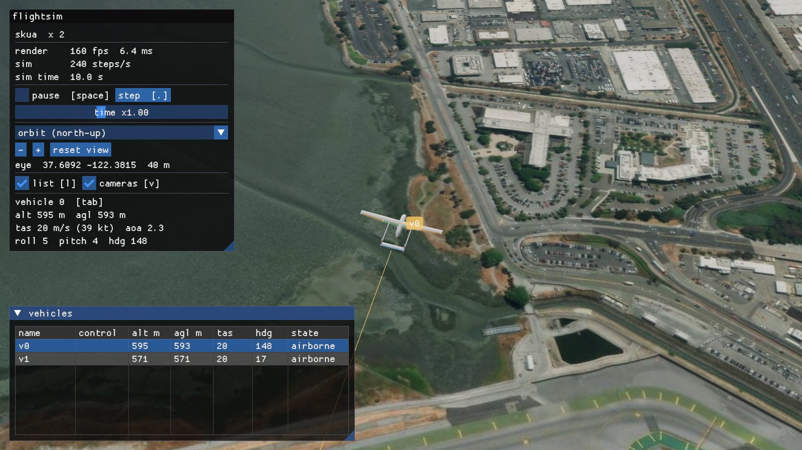

# hangar: JSBSim aircraft from a design file

JSBSim flies an aircraft from tables of aerodynamic coefficients. For an
aircraft that only exists on paper, nobody has those tables. With hangar you
describe the aircraft in one TOML file: its surfaces, bodies, engine, gear
and masses. hangar then:

- computes the tables, mass properties and propeller;
- writes a JSBSim aircraft and a 3D model of it;
- flies it in the platform's own JSBSim, checking it against performance
  targets and handling-quality criteria.

The finished aircraft is `jsbsim:<name>` everywhere on the platform: in the
viewer, the C++ and Python SDKs, and scenario files.



## Use

```bat
fsim hangar list                      the designs in aircraft\
fsim hangar new mine --like skua      start a design from another
fsim hangar mine geometry             one stage: look at aircraft\mine\out\threeview.png
fsim hangar mine --quick              every stage, coarse: a first look in half a minute
fsim hangar mine                      every stage, full tables (a few minutes)
fsim hangar mine calibrate            fit two corrections to published performance
fsim demo --aircraft mine             watch it fly
```

`aircraft\mine\out\report.html` collects everything on one page.

## The loop

Each stage reads the design and what the stages before it wrote. It writes
`out/<stage>.json`, which holds its numbers and its checks, plus any images.
Every check is marked pass, warn, fail or info.

The loop: read the images and the checks, change the design, and run that
stage again. A stage costs seconds, except the full tables, which take a few
minutes. The tables are cached and rebuilt only when the geometry, or the
code that computes them, changes.

| stage | produces | checked against |
|---|---|---|
| geometry | three-view and 3D views; areas, MAC, aspect ratio, tail volumes | usual ranges for the category |
| aero | coefficient tables over α ±180° and β ±90°; section polars; derivative plots | signs and sizes of the stability derivatives, CL max, smoothness |
| mass | component weights, CG, inertia, static margin | target empty mass; Roskam's radii of gyration; margin 5–40 % MAC |
| propulsion | propeller thrust and power tables, engine | peak efficiency, static thrust / weight |
| build | `<name>.xml`, `Engines/`, `<name>.glb` | |
| verify | JSBSim's forces and moments at 150 random states, compared with the tables | largest error below 0.002 in any coefficient |
| fly | trim across the speed range; stall; climb and ceiling; top speed; dynamic modes; 40 runs from random states | `[targets]`, MIL-F-8785C level 1, no diverged run |
| calibrate | `calibration.toml` | `[targets]` |
| report | `out/report.html` | |

The fly stage flies the same tests on a reference aircraft (`reference =
"jsbsim:c172x"` in `[targets]`) and prints its numbers beside the design's.

## The design file

Positions are in metres, in JSBSim's structural frame: x aft, y right, z up.
Wings and tails are given for the right half and mirrored. A fin or a body
is single unless `mirror = true`. Here is an excerpt of
`aircraft/skua/skua.toml`, with a `[targets]` section added:

```toml
[[surface]]
name = "wing"
kind = "wing"                    # wing, htail, canard, fin, vtail
airfoil = "naca4412"             # NACA 4/5-digit, or a .dat file beside the design
sections = [                     # leading edge, chord, twist about the leading edge (deg)
  { le = [0.550, 0.000, 0.120], chord = 0.360, twist = 2.0 },
  { le = [0.580, 2.000, 0.225], chord = 0.240, twist = 0.0 },
]
controls = [                     # span as a fraction of the half span
  { name = "aileron", channel = "aileron", span = [0.45, 0.95], chord_fraction = 0.25, limits = [-20, 20] },
]

[[body]]                         # superelliptic stations: width, top, bottom, exponent n
name = "pod"
stations = [ { x = 0.20, w = 0.26, top = 0.13, bottom = -0.13, n = 2.3 }, ... ]

[[engine]]
type = "electric"                # or "piston"
power_kw = 3.0
[engine.propeller]
diameter = 0.56
pitch = 0.30

[mass]
empty = 21.0                     # kg; components by name, or Raymer's statistics
[targets]                        # optional: what fly checks against
stall_speed_kcas = 27            # also max_speed_ktas, climb_rate_fpm, service_ceiling_ft
```

Two complete designs are included:

- `aircraft/c172`: a Cessna 172P built from published dimensions, used to
  validate the methods.
- `aircraft/skua`: a hypothetical twin-boom pusher UAV.

## Methods

Every method is a published one. The tests in `tools/hangar/tests` check the
section and lattice methods against theory and published data, and run every
stage end to end through the platform (`ctest -R hangar`).

- **Sections.** Thin-airfoil theory gives the zero-lift angle and the
  pitching moment. The lift slope is corrected for thickness and Reynolds
  number. CL max follows DATCOM's leading-edge-sharpness trend. Past the
  stall come Viterna and Corrigan's model and then flat-plate values,
  covering the whole ±180° range. Flaps use Glauert's flap effectiveness and
  Raymer's flap drag.
- **Lifting surfaces.** A vortex lattice (Katz & Plotkin, ch. 12) with
  Prandtl–Glauert compressibility and Vatistas vortex cores. The lattice is
  decambered onto the viscous section polars (after Mukherjee &
  Gopalarathnam, J. Aircraft 43(3), 2006). Each strip then reads its full
  polar at its own induced angle. Past 30–60° of flow angle this becomes
  plain strip theory.
- **Bodies.** Slender-body theory as far as the flow stays attached (DATCOM
  4.2.1.1), then Allen and Perkins' crossflow drag (NACA TR 1048), plus skin
  friction. The wing–body dihedral effect comes from DATCOM.
- **Derivatives.** Rate derivatives are central differences of the full
  nonlinear model, so they change through the stall. The α̇ terms come from
  the lag of the downwash at the tail (Nelson, *Flight Stability and
  Automatic Control*, ch. 3).
- **Mass.** Component weights come from Raymer's general-aviation equations
  (ch. 15) or are given directly. Each component is spread over its own skin
  to give the inertia. Systems mass is placed to meet the empty CG.
- **Propeller.** Blade-element momentum theory with Prandtl's tip and hub
  losses.
- **Engines.** Piston engines use JSBSim's piston engine; hangar's control
  system adds mixture that follows the altitude. Electric motors use JSBSim's
  brushless DC motor.
- **Linear model.** Etkin & Reid's small-perturbation equations, built from
  the tables at the trim condition. The handling-quality checks use it. The
  3-2-1-1 flight tests identify the same modes from JSBSim's own response as
  a cross-check.

## Validation: the Cessna 172P

The C172P was built from public dimensions, not from JSBSim's c172x tables.
Calibration fitted two numbers:

- **Extra drag area, 0.25 m².** This stands for the struts, cooling and gaps
  the estimate does not see.
- **Propeller pitch, 1.452 m.** The real McCauley propeller has a 57 in
  (1.448 m) pitch.

The top speed and the climb rate were the calibration's targets. The stall
speed, the ceiling and the dynamics are predictions.

| sea level, 2400 lb | hangar c172 | POH | JSBSim c172x (stock) |
|---|---|---|---|
| stall, clean | 49.0 KCAS | 51 | 41.6 |
| maximum level speed | 126.7 KTAS | 123 | 144 |
| best rate of climb | 699 ft/min | 700 | 870 |
| service ceiling | 12,780 ft | 13,000 | 25,100 |

The dynamic modes at 1500 m and 1.9 times the stall speed, first as the
linear model predicts them and then as identified from JSBSim's response:

| mode | predicted | JSBSim response |
|---|---|---|
| short period ζ | 0.71 | 0.63 |
| phugoid period | 25.7 s | 25.9 s |
| dutch roll ω, ζ | 1.74 rad/s, 0.17 | 1.80 rad/s, 0.18 |
| roll time constant | 0.21 s | 0.23 s |

All modes are MIL-F-8785C level 1, and the spiral mode is stable. JSBSim
reproduces the tables to within 4×10⁻⁴ in every coefficient. None of the 40
runs from random attitudes and rates diverged.

## Limits

- **Speed range.** Subsonic only: compressibility is limited to the
  Prandtl–Glauert correction.
- **Propeller wash.** The propeller's slipstream over the wing and tail is
  not modelled.
- **Stall and spin.** Past the stall the numbers are estimates. They come
  from empirical section data and, at high angles of attack, from strip
  theory. This is enough for an agent to meet the stall and recover, not for
  spin research.
- **Reynolds number.** The tables use one Reynolds number per strip, at
  one cruise speed (`[analysis] speed`), whatever the altitude. Laminar separation bubbles below
  Re ≈ 2×10⁵ are not modelled.
- **Engines.** Piston and electric only; no turbines yet.

## For Claude

`.claude/skills/aircraft-design/SKILL.md` describes the working loop: which
images to read after each stage, which numbers to question, and how to fix
the usual problems.
