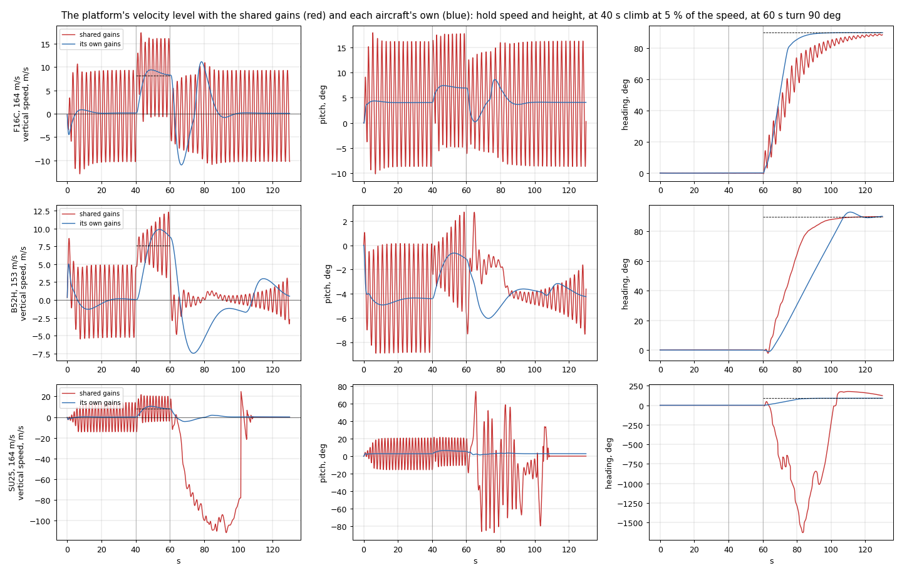

# Multi-level control

`#include <fsim/Control.h>` (commands, interfaces), `<fsim/ControlStack.h>`,
`<fsim/ControllerRegistry.h>`, `<fsim/BuiltinControllers.h>`.

Every vehicle owns a **control stack**: six strictly ordered levels, one
controller per level, and one *active command*. You command a level; each
step the stack runs the cascade from that level down to the actuators. Nothing
above the active level runs.

```
Behavior   pursue / loiter / waypoints / formation / evade / aerobatics / hold / yours
  -> Position   fly to lat/lon/alt at an airspeed
    -> Velocity   airspeed, vertical speed, heading or turn rate
      -> Acceleration   load factor, roll rate, longitudinal acceleration
        -> Attitude   roll, pitch, heading, throttle or airspeed hold
          -> Actuator   aileron, elevator, rudder, throttle, flaps, gear, brakes
            -> flight model
```

## Choosing a level: one line

```cpp
using namespace fsim::control;
v.command(ActuatorCommand{.aileron = 0.1, .elevator = -0.05, .throttle = 0.7});
v.command(AttitudeCommand{.rollRad = 0.3, .pitchRad = 0.05, .airspeedMs = 60});
v.command(AttitudeCommand{.headingRad = 1.57, .maxBankRad = 0.5, .throttle = 0.8});   // heading mode
v.command(AccelerationCommand{.loadFactorG = 3.0, .rollRateRadS = 0.0, .throttle = 1.0}); // pull 3 g
v.command(VelocityCommand{.airspeedMs = 65, .verticalSpeedMs = 2.5, .headingRad = 0.0});
v.command(PositionCommand{.latitudeRad = lat, .longitudeRad = lon, .altitudeMslM = 1800, .airspeedMs = 60});
v.command(BehaviorCommand{.id = "pursuit", .target = other.id(), .params = {{"range_m", 300}}});
v.activeLevel();          // Level::Behavior
```

(Designated initialisers are C++20; in a C++17 trainer set the fields one by
one - the structs are plain aggregates with defaults.) Commands are plain
structs. A field set to `kHold` (NaN) means "keep the
current value / let the controller decide": `AttitudeCommand{.rollRad = 0.2}`
holds the current pitch, `VelocityCommand{.headingRad = kHold}` flies wings
level, a `throttle` of `kHold` keeps the last throttle. The last command
persists until replaced; a finished behaviour keeps producing its final
output.

| Command | Fields (defaults) |
| --- | --- |
| `ActuatorCommand` | `aileron`, `elevator` (+nose down, JSBSim), `rudder` (-1..1), `throttle` (0..1), `flaps` (0..1), `gearDown` (hold), `brakeLeft`, `brakeRight` |
| `AttitudeCommand` | `rollRad`, `pitchRad`, `headingRad` (hold; when set, roll follows the heading error within `maxBankRad`), `throttle` (hold), `airspeedMs` (hold; when set, throttle holds this speed) |
| `AccelerationCommand` | `loadFactorG` (1), `rollRateRadS` (0), `longitudinalMs2` (hold), `throttle` (hold). Works through any attitude, so it flies loops and rolls |
| `VelocityCommand` | `airspeedMs` (hold), `verticalSpeedMs` (0), `headingRad` (hold) or `turnRateRadS` (hold) |
| `PositionCommand` | `latitudeRad`, `longitudeRad`, `altitudeMslM`, `airspeedMs` (hold), `captureRadiusM` (200) |
| `BehaviorCommand` | `id`, `target` (vehicle id), `params` (name -> number), `points` (route) |

## Built-in behaviours

| id | Uses | Parameters (defaults) |
| --- | --- | --- |
| `hold` | - | `airspeed_ms`, `heading_deg`, `altitude_m` (all: current at start) |
| `waypoints` | `points` | `loop` (0), `airspeed_ms` (current) for points without one. `finished()` after the last capture |
| `loiter` | `target` or `lat_deg`/`lon_deg` | `radius_m` (1500), `altitude_m` (current), `clockwise` (1), `airspeed_ms` (current) |
| `pursuit` | `target` | `range_m` (300), `lead_s` (2), `min_airspeed_ms` (30), `max_airspeed_ms` (400) |
| `evade` | `target` | `altitude_delta_m` (-300), `airspeed_ms` (current) |
| `formation` | `target` (leader) | `ahead_m` (-100), `right_m` (60), `below_m` (0), `closure_gain` (0.1) |
| `aerobatics` | - | `manoeuvre` (0 aileron roll, 1 loop, 2 Immelmann, 3 split-S), `load_factor_g` (3.5), `roll_rate_rad_s` (1.5); `finished()` when done, then holds the entry altitude/heading |

Behaviours that need another vehicle read it through the world view
(`ctx.world->vehicleState(id)`) as the world step began, whichever worker
steps which vehicle: the same calls fly the same trajectories with any number
of workers.

## Capabilities and activities

`#include <fsim/Capability.h>`: the contract layer of
[ADR-26](../control-architecture.md). `command()` is the per-step path and
flies as it always has. Beside it, a vehicle says what it offers, answers
every command at once, and keeps what it was told as an *activity* with a
state and an end:

```cpp
using namespace fsim::control;
for (const auto& c : v.capabilities())      // fsim.flight.attitude, fsim.guidance.hold, ...
    std::printf("%s (v%u)\n", c.id.c_str(), c.version);

CommandResult r = v.submit(VelocityCommand{.airspeedMs = 60, .verticalSpeedMs = 2});   // NEW
if (!r.accepted()) std::printf("refused: %s\n", reasonName(r.reason));
world.step();
world.activity(r.activity)->state;          // ActivityState::Active
world.update(r.activity, VelocityCommand{.airspeedMs = 60, .verticalSpeedMs = 0});    // UPDATE
world.cancel(r.activity);                   // CANCEL: its axes fly the vehicle default
```

**Capabilities.** One per level (`fsim.flight.actuator` ... `fsim.flight.position`)
and one per registered behaviour (`fsim.guidance.hold`, ...; your own are
`user.guidance.<id>`). A descriptor gives its id and version, what it
takes (`kCommand`, `kUpdate`, `kCancel`), the level it enters at, whether it
completes (`Persistence::Terminating`: `waypoints`, `aerobatics`) and its
parameters. A level's parameters are its command struct's fields in order,
with units and this aircraft's range. A behaviour's are its `params`.
`capabilityStatus(id)` says whether it can be commanded now; a diverged
vehicle's are `TemporarilyUnavailable` until it is reset.

**Answers.** `submit` (NEW), `update` (UPDATE) and `cancel` (CANCEL) return a
`CommandResult` at once:

| Field | What it holds |
| --- | --- |
| `status` | `Accepted`, `Rejected` or `Canceled` |
| `reason` | why it was rejected (`reasonName()`: `unknown_capability`, `invalid_parameter`, `out_of_range`, `authority_held`, `activity_ended`, `not_updatable`, `wrong_command_type`, ...) |
| `activity` | the activity it made or addressed |
| `other` | the activity that holds the authority |
| `kClamped` | set in `flags` when a value was clamped |

**Updates and parameters.**
- `update` is the per-step path of an activity. It writes the new setpoint, checked like its NEW was, and allocates nothing. A behaviour's parameters are heap data, so a behaviour takes no UPDATE; a new target is a new `submit`.
- Range policies: by default a value outside its advertised range is clamped (`RangePolicy::Clamp`, flagged `kClamped`). `RangePolicy::Reject` refuses the command instead. A required field left at `kHold` (a position's latitude) is refused as `invalid_parameter`.

**Activities.**
- An activity is `Pending` until the next step has flown it, then `Active`.
- It ends in one of three ways:
  - `Completed` (`goal_reached`): a route's last point, a manoeuvre flown;
  - `Failed`: `target_lost` when a followed vehicle is removed, `diverged`;
  - `Canceled`: `requested` by CANCEL, or `preempted` by a newer command.
- While it runs, its record carries flags: an effector saturated, a setpoint clamped (`constraints` for the last step, `constraintsSeen` since it started).
- A completed or failed behaviour keeps flying its last output, a hold, until another command takes over. CANCEL hands the axes to the vehicle default instead: the neutral actuator command (surfaces centred, throttle 0, as every vehicle starts), unless the vehicle's default is a hold (below).
- `ActivityId` is the vehicle's id in its high 32 bits and a per-vehicle count, so the same calls give the same ids. A vehicle remembers its 16 latest ended activities (`v.activities()`).

**Authority.** A command has a `Source` in `CommandOptions`:
- `Policy` (the default and what `command()` uses);
- `Autopilot`: a mode a policy must not silently override;
- `Override`: an operator or script.

A newer command replaces an activity of its own or a lower source on the axes it takes, and that activity ends `preempted`. A higher source's activity refuses it with `authority_held`.

**Owning axes apart.** A command owns every primary axis (roll, pitch, yaw,
thrust) unless its `CommandOptions::axes` names fewer. Then the others keep
their owners, so that, for example, a policy banks while an autopilot holds
the height and the speed:

```cpp
CommandOptions autopilot{.source = Source::Autopilot, .axes = axisBit(Axis::Pitch) | axisBit(Axis::Thrust)};
v.submit(VelocityCommand{.airspeedMs = 55, .verticalSpeedMs = 0}, autopilot);          // the height and the speed
auto bank = v.submit(AttitudeCommand{.rollRad = 0.35}, CommandOptions{.axes = kLateral}).activity;
world.update(bank, AttitudeCommand{.rollRad = -0.2});                                  // the policy's per-step path
```

- **What can be owned apart.** A capability's `axisGroups` says what it can own apart:
  - above the actuators: the lateral axes (roll and yaw together, since the loop that banks also coordinates), pitch, and thrust;
  - at the actuators: any primary axis alone.

  A command must own at least one primary axis. Guidance (a behaviour) owns all of them or none. Anything else is refused as `invalid_axes`.
- **Merging.** The runtime makes one pass from the highest owner's level down. At each level it merges the demands that reached it into one command and runs that level's controller once. The built-in loops honour `ControlContext::engaged`: a channel whose axis belongs to someone else neither integrates nor outputs. When one activity owns every primary axis, the cascade runs exactly as it always has.
- **Preemption leaves a residual.** A command that takes some of an activity's primary axes ends that activity as `preempted`. Its other axes keep flying what it was flying, as a *residual hold*, and a later command claims them without preempting anyone. A behaviour's residual keeps running the behaviour, and only the fields for the axes it kept are used. CANCEL, by contrast, returns an activity's axes to the vehicle default.
- **The engines.** `fsim.flight.engines` (`EnginesCommand`) sets a throttle per engine and owns thrust beside a cascade that flies the rest. An aircraft offers it when its profile's propulsion section gives more than one engine. One with more than four gangs them onto four throttles, as its flight control system does; the B-52H flies eight engines on four throttles.

  ```cpp
  v.submit(AttitudeCommand{.rollRad = 0, .pitchRad = 0.03}, CommandOptions{.axes = kLateral | axisBit(Axis::Pitch)});
  auto engines = v.submit(EnginesCommand{{0.9, 0.4, kHold, kHold}}).activity;   // kHold keeps what an engine flies
  ```
- **The vehicle default.** This is what flies a primary axis nobody owns.
  - `VehicleDefault::Neutral`, the default, is the neutral actuator command every vehicle starts with: surfaces centred, throttle 0.
  - `v.setVehicleDefault(VehicleDefault::Hold)` instead holds, at the velocity level, the heading, true airspeed and height each axis had when it was let go. It flies the height as `fsim.guidance.hold` does. A policy can then own the lateral axes alone and leave the aircraft flying.

  A reset captures the hold again from the new state. The support effectors nobody owns keep their neutral default either way: flaps up, brakes off, the gear, speedbrake and trim left as they are.
- **Custom controllers.** A controller of your own keeps working as before under commands that own the whole vehicle. When the axes are owned apart, a command whose demand would pass through it is refused as `controller_not_axis_aware`, unless the controller declares itself axis-aware ([Writing a controller](#writing-a-controller)).

**From C and Python.**
- **C.** The C ABI has the same calls: `fsim_vehicle_submit` (with the axes in `fsim_command_options`), `fsim_activity_update`, `fsim_activity_cancel`, `FSIM_SUPPORT_ENGINES`, `fsim_vehicle_set_default`, and the capability and activity queries ([c_abi.md](c_abi.md)).
- **Python.** `vehicle.submit(Level.VELOCITY, airspeed_ms=60, axes=fsim.Axis.PITCH | fsim.Axis.THRUST)` returns an `fsim.Activity` with `update`, `cancel` and `state`. Alongside it are `vehicle.submit_support("engines", throttle_1=0.9)` and `vehicle.set_vehicle_default("hold")` ([python.md](python.md)).

**Support effectors.** Gear, flaps, wheel brakes, speedbrake and pitch
trim are support capabilities (`fsim.support.*`). They are set directly
beside whatever flies the aircraft:

```cpp
auto flaps = v.submit(FlapsCommand{.position = 0.5});   // completes when the flaps are there, then holds them
world.update(flaps.activity, FlapsCommand{.position = 0.2});
v.submit(GearCommand{.down = 0.0});                     // refused "unavailable" on the ground
v.submit(SpeedbrakeCommand{.position = 1.0});           // "unknown_capability" if the aircraft has none
```

- **Which effectors.** An aircraft offers the ones its profile's effectors section names. Without the section, it offers the ones an actuator command has always set (gear, flaps, brakes).
- **The placards.** The adapter refuses gear up on the ground, and gear or flaps out above the envelope's speeds for them.
- **Sharing with `command()`.** A support activity takes its axis from the command that set it until then. The per-step `command()` activity carries on without it (flagged `kActivityAxesReduced`), and a command at another level takes it back.
- **How they reach JSBSim.** The speedbrake and trim reach the flight model beside `ControlInputs` (`EffectorInputs`), whose layout stays as viewers and recordings know it.

**What `command()` does now.**
- At the level the vehicle's own activity flies, a new setpoint updates it: the same few nanoseconds as before.
- Any other level, or a behaviour, starts a new activity with no range or availability checks, exactly as before.
- It returns `false` when the command is refused. That covers a behaviour nobody registered (until 2026-09-26 it was logged, ignored and reported as success; the C ABI now returns `FSIM_INVALID_ARGUMENT`, Python raises), or an axis an `Autopilot` or `Override` activity holds.

## Envelope protection

An aircraft whose profile has an envelope section flies with envelope
protection. Every hangar design has one; a stock JSBSim aircraft has none,
unless a `VehicleSpec::profile` gives it one.

Protection limits what the control system demands to the envelope and reports
what the aircraft does beyond it ([ADR-26](../control-architecture.md),
section 11). It does not keep the aircraft inside: a gust, inertia, a
saturated surface or an external force can still take it past a limit. That
is reported, not prevented, and what to do about it is yours: a reward term,
the end of an episode, a line in an evaluation.

```cpp
using namespace fsim::control;
v.protection();                           // ProtectionMode::Limit with an envelope, else Off
v.setProtection(ProtectionMode::Report);  // report only
world.step();
EnvelopeStatus e = v.envelope();          // since the last read; each read starts a new count
if (e[Limit::AlphaMax].exceededUpdates) penalty += e[Limit::AlphaMax].worstExcess;
```

- **The modes.**
  - `Limit` limits and reports. It is the default with an envelope.
  - `Report` only reports.
  - `Off` does neither and flies exactly as before. It is the default without an envelope.
- **What is limited.** Each level's setpoint, before its loop flies it:
  - airspeeds to `cas_min` .. `cas_max` and the Mach limit, converted at the present condition;
  - bank and turn rate to `bank_max`;
  - pitch to its limits, and to what puts the wing at α_max on the present flight path;
  - load factor to `n_min` .. `n_max`, and to what the wing gives at α_max here;
  - roll rate to its limit;
  - an elevator commanded directly, on a surface-controlled aircraft: eased nose-down as α or the load factor nears its maximum.

  A fly-by-wire law that limits g and α itself (hangar's does) keeps doing so. Protection clamps setpoints to its limits but adds no feedback limiter of its own, so the two cannot fight.
- **What is reported.** For each limit, since the last `envelope()`:
  - the control updates in which the demand was limited (`limitedUpdates`);
  - the updates in which the state was beyond it (`exceededUpdates`), and for how long (`exceededS`);
  - how far at most (`worstExcess`): in g, rad, rad/s, m/s calibrated or Mach.

  The activity flying the axis collects `kActivityDemandLimited` and `kActivityExceeded` in its constraints. Exceedances are judged on the aircraft's truth, not on its sensors, and only in flight.
- **Discovery.** Where the aircraft has an envelope, it offers `fsim.envelope.protection`, a status capability that owns no axis. The limits are the profile's, for example `profileValue(v.profile(), "envelope/clean/alpha_max_deg")`.
- **Training with the aircraft's ranges.** A VecEnv with `action_ranges` set to `"aircraft"` maps actions onto the ranges the aircraft's profile narrows. A fighter's load-factor action then spans its `n_min` .. `n_max` instead of -1 .. 5 g ([vecenv.md](vecenv.md)).
- **From C and Python.**
  - C: `fsim_vehicle_set_protection`, `fsim_vehicle_get_protection`, `fsim_vehicle_envelope` (`fsim_envelope_status`) and `fsim_limit_name`.
  - Python: `vehicle.set_protection("report")`, `vehicle.protection`, and `vehicle.envelope()`, which returns `fsim.Envelope(mode, {name: fsim.LimitStatus})`.

## Built-in loops and their gains

| Level | id | Output | Tunables (`controller->setParameter("name", v)`) |
| --- | --- | --- | --- |
| Attitude | `pid_attitude` | actuators | `roll.kp/ki/kd`, `roll.max_rate`, `roll.integral_limit`, `pitch.kp/ki/kd`, `pitch.integral_limit`, `pitch.trim`, `pitch.trim_lift`, `airspeed.kp/ki`, `airspeed.integral_limit`, `heading.gain`, `rudder.beta_gain`, `throttle.feedforward`; the schedule: `schedule.tas_ms`, `schedule.eas_ms`, `roll.eas_exponent`, `roll.tas_exponent`, `pitch.eas_exponent`, `pitch.tas_exponent` |
| Acceleration | `pid_acceleration` | actuators | `load_factor.kp/ki/kd`, `load_factor.integral_limit`, `load_factor.feedforward`, `load_factor.path_hold`, `roll_rate.kp/ki`, `roll_rate.integral_limit`, `roll_rate.feedforward`, `pitch.trim`, `pitch.trim_lift`, `longitudinal.kp/ki`, `rudder.beta_gain`, `throttle.feedforward`; the schedule as above with `load_factor.*` and `roll_rate.*` exponents |
| Velocity | `pid_velocity` | attitude | `vertical_speed.kp/ki`, `vertical_speed.integral_limit`, `vertical_speed.feedforward`, `vertical_speed.command_lag`, `vertical_speed.alpha_zero_lift`, `pitch.min`, `pitch.max`, `max_bank`, `schedule.tas_ms` |
| Position | `pid_position` | velocity | `altitude.gain`, `max_vertical_speed` |
| Actuator | `actuator` | actuators | - |

The defaults fly the stock JSBSim c172x, and every new parameter's default
leaves that flight as it was. `controller->parameter("name")` reads one back
(C: `fsim_vehicle_controller_parameter`, Python:
`v.controller_parameter(Level.ATTITUDE, "pitch.kp")`).

What the others do:

- **The schedule.** At the reference true and equivalent airspeeds
  (`schedule.tas_ms`, `schedule.eas_ms`) a loop's gains are as set;
  elsewhere a channel's are multiplied by
  (eas_ref / eas)^a (tas_ref / tas)^b, where the aircraft's response to that
  control grows as eas^a tas^b - so the loop keeps its speed and its damping
  over the envelope (the calibrated airspeed stands in for the equivalent;
  the factor stays within 0.2 - 5). The heading gain grows with tas (a bank
  turns the heading at g tan(bank) / tas) and the vertical-speed gains fall
  with it (a pitch change moves the vertical speed by tas times as much).
  `schedule.tas_ms` 0 - the default - turns it off.
- **Feedforwards.** `pitch.trim` and `pitch.trim_lift` give the elevator
  that holds a surface-controlled aircraft in level flight at the reference
  speed and the part of it that goes with lift: the loops feed
  trim - lift + lift n (eas_ref / eas)^2 forward (n that of a level turn at
  the current bank, or the one commanded), so the integrator only trims what
  is left. `load_factor.feedforward` is the stick per g beyond what neutral
  stick gives - cos(pitch) cos(roll) when `load_factor.path_hold` is 1 (a
  fly-by-wire law that holds its flight path), 1 g when it is 0;
  `roll_rate.feedforward` the aileron per rad/s. With
  `vertical_speed.feedforward` 1 the pitch is the flight-path angle the
  vertical speed needs, asin(vz / tas), plus the angle of attack the wing
  would fly at 1 g, alpha0 + (alpha - alpha0) / n about its zero-lift angle
  `vertical_speed.alpha_zero_lift` (so a pull does not feed itself).
  `vertical_speed.command_lag` (s) follows a commanded vertical speed
  through a first-order lag, starting from the one flown, so a step asks for
  a climb the aircraft can enter without overshoot.
- A loop that missed a period - the stack flew another level meanwhile -
  starts again from the state (its bank setpoint, its lagged command).

## Per-aircraft gains

An aircraft can carry its own gains for the built-in loops: JSBSim
properties `fsim/control/<controller id>/<parameter>`, the parameter's dots
written as slashes, declared in its flight control section:

```xml
<flight_control name="f16c">
  <property value="1.11952">fsim/control/pid_attitude/pitch/kp</property>
  <property value="163.54">fsim/control/pid_attitude/schedule/tas_ms</property>
  ...
```

Every vehicle of that type gets them when it is created, and again whenever
the stack creates the controller by id (`use(level, "pid_attitude")`); an
instance you hand to `use()` is left as it is, and your own
`setParameter` wins. The aircraft designed with hangar all carry a set,
tuned for each by flight test ([hangar.md](../hangar.md#the-autopilot)); a
stock JSBSim aircraft flies the shared defaults. A setting no built-in
controller takes is logged once when the aircraft first loads, and kept for
a controller registered under that id.



The same commands - hold speed, height and heading, climb, turn 90° - with
the shared gains (red) and each aircraft's own (blue): with the shared ones
the F-16C and the B-52H never stop oscillating in pitch, and the Su-25
departs in the turn.

Retuning or replacing them in code:

```cpp
auto& stack = v.controls();
stack.controller(Level::Attitude)->setParameter("roll.kp", 1.2);
stack.use(Level::Velocity, "my_velocity_loop");     // by registry id
stack.use(Level::Attitude, std::make_unique<MyAttitude>());
const Command* d = stack.derived(Level::Attitude);   // what the cascade produced at that level last step
```

`derived(level)` gives every intermediate command of the last cascade: use it
for telemetry, for observations (e.g. the attitude your velocity policy
implied), or to debug a behaviour.

## The aircraft's profile

`#include <fsim/VehicleProfile.h>`. What the platform knows about an aircraft
is its *profile* ([ADR-26](../control-architecture.md), section 7). It is
seven small sections, each with its own version and provenance (default,
hangar, identified, user, derived):

| Section | What it holds |
| --- | --- |
| `identity` | class, and whether the controls are the aircraft's own FCS, surfaces or a fly-by-wire law |
| `effectors` | what the stick means; flaps, retractable gear, speedbrake, pitch trim |
| `envelope` | load factor, angle of attack, bank, pitch, roll rate, airspeed and Mach limits, clean and with flaps |
| `propulsion` | engines, type, afterburner, reverse |
| `plant` | the identified responses at a reference condition |
| `performance` | stall speeds, maximum speed, ceiling |
| `control` | the gains above |

An aircraft carries its profile as JSBSim properties `fsim/<section>/<field>`
in its file; the `fsim/control` gains were the first. A section the aircraft
lacks keeps its defaults (version 0).

```cpp
const auto& p = v.profile();
if (p.envelope.header.present()) use(p.envelope.clean.loadFactorMax);
control::profileValue(p, "envelope/clean/alpha_max_deg");   // by path, in the unit it names; NaN if unknown

auto mine = std::make_shared<control::VehicleProfile>();     // a stock aircraft's envelope, say
mine->envelope.header = {1, control::Provenance::User};
mine->envelope.clean.loadFactorMax = 3.8;
spec.profile = mine;                                         // replaces those sections for this vehicle only
```

`fsim_vehicle_profile_value` and `fsim_vehicle_profile_section` do the same
from C, and `vehicle.profile_value(path)` and `vehicle.profile_section(name)`
from Python.

## Writing a controller

A controller accepts a command at its level and returns a command at **any
strictly lower** level; the stack keeps cascading from there.

```cpp
struct BangBangAttitude final : fsim::control::Controller {
    const char* id() const noexcept override { return "bang_bang_attitude"; }
    fsim::control::Level level() const noexcept override { return fsim::control::Level::Attitude; }
    fsim::control::Command update(const fsim::control::ControlContext& ctx, const fsim::control::Command& in) override {
        const auto& c = std::get<fsim::control::AttitudeCommand>(in);
        fsim::control::ActuatorCommand out;
        out.aileron = c.rollRad > ctx.sensed.eulerRad[0] ? 0.5 : -0.5;
        out.throttle = fsim::control::orHold(c.throttle, 0.7);
        return out;
    }
};

fsim::control::ControllerRegistry::instance().add("bang_bang_attitude", fsim::control::Level::Attitude,
                                                  [] { return std::make_unique<BangBangAttitude>(); });
v.use(fsim::control::Level::Attitude, "bang_bang_attitude");
```

`ControlContext` gives you the vehicle id, truth `state`, `sensed` state, the
period `dt`, the `world` view (other vehicles, environment, time) and the
vehicle's deterministic `rng`. Override `reset()` to clear integrators and
`setParameter`/`parameter` to expose gains.

**Axes owned apart.** When activities own the vehicle's axes apart
([Owning axes apart](#capabilities-and-activities)), `ctx.engaged` says which
primary axes this level drives in this update; the others belong to someone
else. A controller that leaves those channels alone - no integrating, `kHold`
out - says so:

```cpp
bool axisAware() const noexcept override { return true; }
```

Without it, a controller only ever sees commands that own the whole vehicle.
A command that would split the axes through it is refused, and the controller
flies exactly as it always has.

## Writing a behaviour

```cpp
struct Orbit final : fsim::control::Behavior {
    const char* id() const noexcept override { return "orbit_target"; }
    void start(const fsim::control::ControlContext&, const fsim::control::BehaviorCommand& c) override {
        target_ = c.target; radius_ = c.param("radius_m", 800.0);
    }
    fsim::control::Command update(const fsim::control::ControlContext& ctx, const fsim::control::Command&) override {
        const auto* t = ctx.world ? ctx.world->vehicleState(target_) : nullptr;
        fsim::control::PositionCommand p;   // or a VelocityCommand, AttitudeCommand, ... any lower level
        // ... aim at a point on the circle around t ...
        return p;
    }
    bool finished() const noexcept override { return false; }       // true: its activity completes
    fsim::control::Reason failure() const noexcept override {         // not None: its activity fails
        return lost_ ? fsim::control::Reason::TargetLost : fsim::control::Reason::None;
    }
    std::uint32_t target_ = 0; double radius_ = 800.0; bool lost_ = false;
};
fsim::control::BehaviorTraits traits;   // optional: how consumers see it (user.guidance.orbit_target)
traits.parameters = {{"radius_m", "m", 100.0, 1e5, 800.0, true}};
traits.uses = {"fsim.flight.position"};
traits.needsTarget = true;              // submit() refuses it without a target
fsim::control::ControllerRegistry::instance().addBehavior("orbit_target", [] { return std::make_unique<Orbit>(); }, traits);
v.command(fsim::control::BehaviorCommand{.id = "orbit_target", .target = other.id()});
```

## RL at any level

Because actions are just commands, one policy can act on surfaces, attitudes
or velocities by changing which command you build; hierarchical RL maps to
the stack directly (a high-level policy commands `Position`, a low-level
policy owns the `Attitude` controller). The batch layer exposes this as the
`"surfaces"`, `"attitude"`, `"acceleration"` and `"velocity"` action spaces
([vecenv.md](vecenv.md)).
