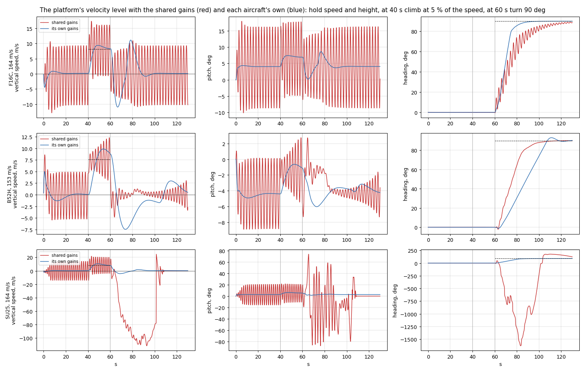

# Multi-level control

`#include <fsim/Control.h>` (commands, interfaces), `<fsim/ControlStack.h>`,
`<fsim/ControllerRegistry.h>`, `<fsim/BuiltinControllers.h>`.

Every vehicle owns a **control stack**: six strictly ordered levels, one
controller per level, and one *active command*. You command a level; each
step the stack runs the cascade from that level down to the actuators. Nothing
above the active level runs.

```
Behavior   pursue / loiter / waypoints / formation / evade / aerobatics / hold / yours
  -> Position   fly to lat/lon/alt at an airspeed
    -> Velocity   airspeed, vertical speed, heading or turn rate
      -> Attitude   roll, pitch, heading, throttle or airspeed hold
        -> Acceleration   load factor, roll rate, longitudinal acceleration
          -> Actuator   aileron, elevator, rudder, throttle, flaps, gear, brakes
            -> flight model
```

A loop may skip levels: the default attitude loop commands the actuators
itself. An aircraft whose loops the platform designs from its plant flies its
attitude through the acceleration level ([per-aircraft gains](#per-aircraft-gains)).
The order is `levelRank`'s; the levels' enum values, which the C ABI and
Python use, are not the order (the acceleration level sat above the attitude
level until ADR-26's step 5b).

## Choosing a level: one line

```cpp
using namespace fsim::control;
v.command(ActuatorCommand{.aileron = 0.1, .elevator = -0.05, .throttle = 0.7});
v.command(AttitudeCommand{.rollRad = 0.3, .pitchRad = 0.05, .airspeedMs = 60});
v.command(AttitudeCommand{.headingRad = 1.57, .maxBankRad = 0.5, .throttle = 0.8});   // heading mode
v.command(AccelerationCommand{.loadFactorG = 3.0, .rollRateRadS = 0.0, .throttle = 1.0}); // pull 3 g
v.command(VelocityCommand{.airspeedMs = 65, .verticalSpeedMs = 2.5, .headingRad = 0.0});
v.command(PositionCommand{.latitudeRad = lat, .longitudeRad = lon, .altitudeMslM = 1800, .airspeedMs = 60});
v.command(BehaviorCommand{.id = "pursuit", .target = other.id(), .params = {{"range_m", 300}}});
v.activeLevel();          // Level::Behavior
```

(Designated initialisers are C++20; in a C++17 trainer set the fields one by
one - the structs are plain aggregates with defaults.) Commands are plain
structs. A field set to `kHold` (NaN) means "keep the
current value / let the controller decide": `AttitudeCommand{.rollRad = 0.2}`
holds the current pitch, `VelocityCommand{.headingRad = kHold}` flies wings
level, a `throttle` of `kHold` keeps the last throttle. The last command
persists until replaced; a finished behaviour keeps producing its final
output.

| Command | Fields (defaults) |
| --- | --- |
| `ActuatorCommand` | `aileron`, `elevator` (+nose down, JSBSim), `rudder` (-1..1), `throttle` (0..1), `flaps` (0..1), `gearDown` (hold), `brakeLeft`, `brakeRight` |
| `AttitudeCommand` | `rollRad`, `pitchRad`, `headingRad` (hold; when set, roll follows the heading error within `maxBankRad`), `throttle` (hold), `airspeedMs` (hold; when set, throttle holds this speed) |
| `AccelerationCommand` | `loadFactorG` (1), `rollRateRadS` (0), `longitudinalMs2` (hold), `throttle` (hold). Works through any attitude, so it flies loops and rolls. A rotorcraft's also `pitchRateRadS`, `yawRateRadS` (hold): body rates with the collective's load factor |
| `VelocityCommand` | `airspeedMs` (hold), `verticalSpeedMs` (0), `headingRad` (hold) or `turnRateRadS` (hold). A rotorcraft's also `northMs`, `eastMs` (hold): a velocity over the ground, the heading free - hovering, sideways |
| `PositionCommand` | `latitudeRad`, `longitudeRad`, `altitudeMslM`, `airspeedMs` (hold), `captureRadiusM` (200). A rotorcraft's also `headingRad` (hold): it stops at the point, facing it |
| `BehaviorCommand` | `id`, `target` (vehicle id), `params` (name -> number), `points` (route) |

## Built-in behaviours

| id | Uses | Parameters (defaults) |
| --- | --- | --- |
| `hold` | - | `airspeed_ms`, `heading_deg`, `altitude_m` (all: current at start). An aircraft that hovers keeps its velocity over the ground instead of the airspeed it had (a hover stays put in wind), unless given `airspeed_ms`. It flies to its altitude at the aircraft's own position-loop gain and vertical speeds, as the modes do. Superseded by `fsim.guidance.hsa` |
| `waypoints` | `points` | `loop` (0), `airspeed_ms` for points without one (a wing: current; a rotorcraft: its position loop's speed). `finished()` after the last capture. A NEW checks the points: somewhere on the Earth, a positive capture radius, no negative airspeed (`invalid_parameter`); and, checked, none a wing cannot capture - inside a turn circle at its arrival, at its full bank, farther than its capture radius (`invalid_waypoint`, the point's index, `max_turn_rate`). One it circles a full turn without closing on fails the activity (`behavior_failed`), and it flies on straight and level. Superseded by `fsim.guidance.route` |
| `loiter` | `target` or `lat_deg`/`lon_deg` | `radius_m` (left out: 1500, or 1.25 times the circle a wing's bank and heading loop hold at its speed - a heavy's is kilometres; at least 100 for a wing, 1 for a rotorcraft), `altitude_m` (current), `clockwise` (1), `airspeed_ms` (a wing: current; a rotorcraft: its cruise, no faster than it follows the circle). It chases a point 0.6 rad ahead on its circle, whose own circle it trims until the one flown is the one asked (following the point at once, a vehicle would fly its chord, 17 % inside). Superseded by `fsim.guidance.pattern` |
| `pursuit` | `target` | `range_m` (300), `lead_s` (2), `min_airspeed_ms` (30), `max_airspeed_ms` (400). It aims `range_m` behind the target along its track and holds that range as the least: it closes no faster than it could stop closing (0.25 m/s2 for a wing, half a rotorcraft's deceleration, after a 10 s lag), and inside the range it turns back out. A light aircraft whose speed answers in tens of seconds dips up to a quarter inside it once, then settles |
| `evade` | `target` | `altitude_delta_m` (-300), `airspeed_ms` (current; a rotorcraft's at least its cruise, as it has none to flee at in a hover), `floor_agl_m` (150): never lower over the terrain under it than the floor (nor than it started, if that was lower); while the floor holds its descent, its activity carries `kActivityClamped` |
| `formation` | `target` (leader) | `ahead_m` (-100), `right_m` (60), `below_m` (0), in the leader's heading frame; `closure_gain` (1/s; left out, half its speed loop's bandwidth: a wing's 0.05). It closes on the slot no faster than it could stop closing there, as `pursuit` does. A wing flies the leader's airspeed plus that closing and joins the slot's line along the look-ahead a route's legs are flown with; a rotorcraft flies the leader's velocity over the ground plus the closing, straight to its slot, facing as the leader does |
| `aerobatics` | - | `manoeuvre` (0 aileron roll, 1 loop, 2 Immelmann, 3 split-S), `load_factor_g` (3.5), `roll_rate_rad_s` (1.5). Offered to aircraft cleared for aerobatics (rule R10). Checked, a NEW is refused `performance_limit` too slow (`min_airspeed`: a loop or an Immelmann twice the least calibrated airspeed, a roll or a split-S the least times the root of the load factor, where the aircraft's least is known) or a split-S too low (`min_altitude`). It gives up (`behavior_failed`) below its least airspeed, past its angle of attack by more than 3 deg (a departure) or within 150 m of the ground, and completes only if flown within the envelope to its limiters' tolerance; either way it then holds the entry altitude and heading |
| `hover` | - | `lat_deg`, `lon_deg`, `altitude_m`, `heading_deg` (all: current at start). Offered to aircraft that can hover ([rotorcraft](#rotorcraft)) |

Behaviours that need another vehicle read it through the world view
(`ctx.world->vehicleState(id)`) as the world step began, whichever worker
steps which vehicle: the same calls fly the same trajectories with any number
of workers.

## Capabilities and activities

`#include <fsim/Capability.h>`: the contract layer of
[ADR-26](../control-architecture.md). `command()` is the per-step path and
flies as it always has. Beside it, a vehicle says what it offers, answers
every command at once, and keeps what it was told as an *activity* with a
state and an end:

```cpp
using namespace fsim::control;
for (const auto& c : v.capabilities())      // fsim.flight.attitude, fsim.guidance.hold, ...
    std::printf("%s (v%u)\n", c.id.c_str(), c.version);

CommandResult r = v.submit(VelocityCommand{.airspeedMs = 60, .verticalSpeedMs = 2});   // NEW
if (!r.accepted()) std::printf("refused: %s\n", reasonName(r.reason));
world.step();
world.activity(r.activity)->state;          // ActivityState::Active
world.update(r.activity, VelocityCommand{.airspeedMs = 60, .verticalSpeedMs = 0});    // UPDATE
world.cancel(r.activity);                   // CANCEL: its axes fly the vehicle default
```

**Capabilities.** One per level (`fsim.flight.actuator` ... `fsim.flight.position`)
and one per registered behaviour (`fsim.guidance.hold`, ...; your own are
`user.guidance.<id>`). A descriptor gives its id and version, what it
takes (`kCommand`, `kUpdate`, `kCancel`), the level it enters at, whether it
completes (`Persistence::Terminating`: `waypoints`, `aerobatics`) and its
parameters. A level's parameters are its command struct's fields in order,
with units and this aircraft's range. A behaviour's are its `params`.
`capabilityStatus(id)` says whether it can be commanded now; a diverged
vehicle's are `TemporarilyUnavailable` until it is reset.

**Answers.** `submit` (NEW), `update` (UPDATE) and `cancel` (CANCEL) return a
`CommandResult` at once:

| Field | What it holds |
| --- | --- |
| `status` | `Accepted`, `Rejected` or `Canceled` |
| `reason` | why it was rejected (`reasonName()`: `unknown_capability`, `invalid_parameter`, `out_of_range`, `authority_held`, `activity_ended`, `not_updatable`, `wrong_command_type`, ...) |
| `activity` | the activity it made or addressed |
| `other` | the activity that holds the authority |
| `kClamped` | set in `flags` when a value was clamped |
| `index`, `constraint` | what the answer was about: the field (in the command struct's order), route point or curve segment, and the performance limit its value broke (`constraintName()`: `max_airspeed`, `max_orientation`, `max_climb_rate`, ...). For a clamp, the first value clamped. `-1` and `None` when there is nothing to say ([The Vehicle Interface](#the-vehicle-interface)) |

**Updates and parameters.**
- `update` is the per-step path of an activity. It writes the new setpoint, checked like its NEW was, and allocates nothing. A behaviour's parameters are heap data, so a behaviour takes no UPDATE; a new target is a new `submit`.
- Range policies: by default a value outside its advertised range is clamped (`RangePolicy::Clamp`, flagged `kClamped`). `RangePolicy::Reject` refuses the command instead. A required field left at `kHold` (a position's latitude) is refused as `invalid_parameter`.

**Activities.**
- An activity is `Pending` until the next step has flown it, then `Active`.
- It ends in one of three ways:
  - `Completed` (`goal_reached`): a route's last point, a manoeuvre flown;
  - `Failed`: `target_lost` when a followed vehicle is removed, `diverged`;
  - `Canceled`: `requested` by CANCEL, or `preempted` by a newer command; under grants, `released` when the policy lets go, and `revoked`, `collision_avoidance`, `restricted` or `not_granted` when the platform takes control back ([Grants](#grants-who-may-command-a-vehicle)).
- While it runs, its record carries flags: an effector saturated, a setpoint clamped (`constraints` for the last step, `constraintsSeen` since it started).
- A completed or failed behaviour keeps flying its last output, a hold, until another command takes over. CANCEL hands the axes to the vehicle default instead: the neutral actuator command (surfaces centred, throttle 0, as every vehicle starts), unless the vehicle's default is a hold (below).
- **Letting go safely.** CANCEL, a release and a revocation all leave the aircraft to the vehicle default, and by default that is neutral. A mission autonomy that wants the aircraft to carry on when it lets go (A-GRA's relinquishing control to the VI) sets `v.setVehicleDefault(VehicleDefault::Hold)` first. The aircraft then holds, for its class, what it was flying: a wing its heading, height and airspeed; a rotorcraft its heading, height and velocity over the ground.
- `ActivityId` is the vehicle's id in its high 32 bits and a per-vehicle count, so the same calls give the same ids. A vehicle remembers its 16 latest ended activities (`v.activities()`).

**Authority.** A command has a `Source` in `CommandOptions`:
- `Policy` (the default and what `command()` uses);
- `Autopilot`: a mode a policy must not silently override;
- `Override`: an operator or script.

A newer command replaces an activity of its own or a lower source on the axes it takes, and that activity ends `preempted`. A higher source's activity refuses it with `authority_held`.

**Owning axes apart.** A command owns every primary axis (roll, pitch, yaw,
thrust) unless its `CommandOptions::axes` names fewer. Then the others keep
their owners, so that, for example, a policy banks while an autopilot holds
the height and the speed:

```cpp
CommandOptions autopilot{.source = Source::Autopilot, .axes = axisBit(Axis::Pitch) | axisBit(Axis::Thrust)};
v.submit(VelocityCommand{.airspeedMs = 55, .verticalSpeedMs = 0}, autopilot);          // the height and the speed
auto bank = v.submit(AttitudeCommand{.rollRad = 0.35}, CommandOptions{.axes = kLateral}).activity;
world.update(bank, AttitudeCommand{.rollRad = -0.2});                                  // the policy's per-step path
```

- **What can be owned apart.** A capability's `axisGroups` says what it can own apart:
  - above the actuators: the lateral axes (roll and yaw together, since the loop that banks also coordinates), pitch, and thrust;
  - at the actuators: any primary axis alone.

  A command must own at least one primary axis. Guidance (a behaviour) owns all of them or none. Anything else is refused as `invalid_axes`.
- **Merging.** The runtime makes one pass from the highest owner's level down. At each level it merges the demands that reached it into one command and runs that level's controller once. The built-in loops honour `ControlContext::engaged`: a channel whose axis belongs to someone else neither integrates nor outputs. When one activity owns every primary axis, the cascade runs exactly as it always has.
- **Preemption leaves a residual.** A command that takes some of an activity's primary axes ends that activity as `preempted`. Its other axes keep flying what it was flying, as a *residual hold*, and a later command claims them without preempting anyone. A behaviour's residual keeps running the behaviour, and only the fields for the axes it kept are used. CANCEL, by contrast, returns an activity's axes to the vehicle default.
- **The engines.** `fsim.flight.engines` (`EnginesCommand`) sets a throttle per engine and owns thrust beside a cascade that flies the rest. An aircraft offers it when its profile's propulsion section gives more than one engine. One with more than four gangs them onto four throttles, as its flight control system does; the B-52H flies eight engines on four throttles.

  ```cpp
  v.submit(AttitudeCommand{.rollRad = 0, .pitchRad = 0.03}, CommandOptions{.axes = kLateral | axisBit(Axis::Pitch)});
  auto engines = v.submit(EnginesCommand{{0.9, 0.4, kHold, kHold}}).activity;   // kHold keeps what an engine flies
  ```
- **The vehicle default.** This is what flies a primary axis nobody owns.
  - `VehicleDefault::Neutral`, the default, is the neutral actuator command every vehicle starts with: surfaces centred, throttle 0.
  - `v.setVehicleDefault(VehicleDefault::Hold)` instead holds, at the velocity level, the heading, true airspeed and height each axis had when it was let go. It flies the height as `fsim.guidance.hold` does. A policy can then own the lateral axes alone and leave the aircraft flying.

  A reset captures the hold again from the new state. The support effectors nobody owns keep their neutral default either way: flaps up, brakes off, the gear, speedbrake and trim left as they are.
- **Custom controllers.** A controller of your own keeps working as before under commands that own the whole vehicle. When the axes are owned apart, a command whose demand would pass through it is refused as `controller_not_axis_aware`, unless the controller declares itself axis-aware ([Writing a controller](#writing-a-controller)).

**From C and Python.**
- **C.** The C ABI has the same calls: `fsim_vehicle_submit` (with the axes in `fsim_command_options`), `fsim_activity_update`, `fsim_activity_cancel`, `FSIM_SUPPORT_ENGINES`, `fsim_vehicle_set_default`, and the capability and activity queries ([c_abi.md](c_abi.md)).
- **Python.** `vehicle.submit(Level.VELOCITY, airspeed_ms=60, axes=fsim.Axis.PITCH | fsim.Axis.THRUST)` returns an `fsim.Activity` with `update`, `cancel` and `state`. Alongside it are `vehicle.submit_support("engines", throttle_1=0.9)` and `vehicle.set_vehicle_default("hold")` ([python.md](python.md)).

**Support effectors.** Gear, flaps, wheel brakes, speedbrake and pitch
trim are support capabilities (`fsim.support.*`). They are set directly
beside whatever flies the aircraft:

```cpp
auto flaps = v.submit(FlapsCommand{.position = 0.5});   // completes when the flaps are there, then holds them
world.update(flaps.activity, FlapsCommand{.position = 0.2});
v.submit(GearCommand{.down = 0.0});                     // refused "unavailable" on the ground
v.submit(SpeedbrakeCommand{.position = 1.0});           // "unknown_capability" if the aircraft has none
```

- **Which effectors.** An aircraft offers the ones its profile's effectors section names. Without the section, it offers the ones an actuator command has always set (gear, flaps, brakes).
- **The placards.** The adapter refuses gear up on the ground, and gear or flaps out above the envelope's speeds for them.
- **Sharing with `command()`.** A support activity takes its axis from the command that set it until then. The per-step `command()` activity carries on without it (flagged `kActivityAxesReduced`), and a command at another level takes it back.
- **How they reach JSBSim.** The speedbrake and trim reach the flight model beside `ControlInputs` (`EffectorInputs`), whose layout stays as viewers and recordings know it.

**What `command()` does now.**
- At the level the vehicle's own activity flies, a new setpoint updates it: the same few nanoseconds as before.
- Any other level, or a behaviour, starts a new activity with no range or availability checks, exactly as before.
- It returns `false` when the command is refused. That covers a behaviour nobody registered (until 2026-09-26 it was logged, ignored and reported as success; the C ABI now returns `FSIM_INVALID_ARGUMENT`, Python raises), or an axis an `Autopilot` or `Override` activity holds.

## The Vehicle Interface

[ADR-28](../vehicle-interface.md) gives the platform A-GRA ASK 6.0a's
Vehicle Interface semantics: what a mission autonomy is told about its
commands, how far its activities have got, what the aircraft is commanding,
and which of A-GRA's flight modes a capability is. There are no messages;
the platform answers in its own terms and `fsim.agra` (Python) names them
as A-GRA does.

**What an answer is about.** A rejection says which field, route point or
curve segment it refused (`CommandResult::index`) and the performance limit
its value broke (`constraint`); a clamp says the first value it clamped.

```cpp
auto r = v.submit(AttitudeCommand{.rollRad = 4.0}, CommandOptions{.range = RangePolicy::Reject});
// r.reason == Reason::OutOfRange, r.index == 0 (roll_rad), r.constraint == Constraint::MaxOrientation
```

**Progress.** A guidance activity's record carries its `ActivityProgress`,
which its behaviour reports after every world step (`Behavior::progress()`):

| Field | What it holds |
| --- | --- |
| `segment`, `segments`, `segmentId` | the waypoint (or curve segment, or pattern leg) flown now, of how many, and the id the route gave it |
| `laps` | a loiter's, or a repeating route's, completed |
| `percent`, `segmentPercent` | of the whole activity and of the segment, 0..100 |
| `distanceToGoM`, `timeToGoS` | to the end, at the ground speed now |
| `crossTrackM` | off the path, + right of it |
| `courseRad`, `headingRad`, `altitudeMslM`, `speedMs`, `speedReference` | what it commands (A-GRA's VehicleCommandState): `speedReference` 0 true airspeed, 1 calibrated, 2 ground speed, 3 Mach |

`waypoints` reports the point it flies to, the distance and time to the last one and the course, altitude and airspeed it asks for; `loiter` its laps and how far it is off its circle; `hold` and `hover` their targets. A NaN field is one the activity says nothing about: a level's activity reports none.

**The commanded state.** `v.commanded()` (`ControlStack::commanded()`) is
what the cascade asked for in its last control update, level by level: the
position level's point and altitude, the velocity level's heading, turn rate,
airspeed, vertical speed and velocity over the ground, the attitude level's
roll and pitch, the acceleration level's load factor and rates, the
throttle. NaN where no level set it.

**A-GRA's flight modes.** A capability's `mode` (`FlightMode`) is the A-GRA
flight capability type it is: `fsim.guidance.formation` is FORMATION,
`fsim.guidance.hover` LOITER. The platform's own levels and behaviours are
`FlightMode::None`.

### HSA/CSA: a heading or a course, a speed, an altitude

`fsim.guidance.hsa` is A-GRA's HSA/CSA mode (`#include <fsim/GuidanceModes.h>`
for its behaviour): hold a heading or a course, a speed and an altitude until
told otherwise. Its setpoint is fixed-size, so it takes UPDATE, and an
UPDATE changes only the fields it gives:

```cpp
HsaCommand hsa;
hsa.courseRad = M_PI;                                          // the track over the ground (or headingRad: the nose)
hsa.speed = 0.7, hsa.speedReference = double(SpeedReference::Mach);
hsa.altitudeM = 6500;                                          // above sea level (AltitudeReference::Msl)
auto a = v.submit(hsa).activity;
HsaCommand climb;
climb.altitudeM = 8000;                                        // only the altitude: the course and Mach as commanded
world.update(a, climb);
```

- **References.** The speed is true airspeed, calibrated airspeed, ground speed or Mach (`SpeedReference`). The altitude is above sea level, above the ground under the aircraft, or above the ellipsoid (`AltitudeReference`; the simulation's sea level is the ellipsoid), or barometric - on the isobar the altimeter reads it on (below). A heading or course may be magnetic (`directionReference`, [flight-autonomy.md](../flight-autonomy.md) 4.22).
- **Speed optimisation** ([flight-autonomy.md](../flight-autonomy.md), 4.17). `hsa.speedOptimization = double(SpeedOptimization::MaxEndurance)` (or `LongRangeCruise`) flies the performance tables' best-endurance (or best-range) speed at the altitude and weight now, as a true airspeed, in place of a speed.
  - A speed replaces it, and it a speed.
  - Resolved, `speed` is the optimum's at the altitude flown to as the command was given; the progress gives the speed flown now.
  - `optimalTasMs(tables, optimization, altitudeMslM, fuelKg)` (fsim/GuidanceModes.h) works it out; a behaviour finds the tables in `ControlContext::tables`.
  - An aircraft without tables (a stock one) refuses it `not_implemented`. A pattern takes one too.
- **Left out.** A NEW continues what a live `hsa` it replaces commanded, else what the aircraft flies now (a rotorcraft's ground speed: a hovering one stays put). A reference given alone takes the aircraft's own value in it: `speedReference = Mach` alone holds the Mach it flies. In an UPDATE a reference needs its value.
- **Checked** against the aircraft's performance: a speed beyond what it flies, below 1.2 times its stall speed or beyond its envelope, an altitude above its ceiling or below the ground, is clamped (flagged, with the field and the limit in the result) or, under `RangePolicy::Reject`, refused `performance_limit`.
- **Flown** as the vehicle flies:
  - A wing flies its heading. For a course it flies the heading that holds it against the wind its own air data see, plus a slow trim. It flies the airspeed its reference asks, or the one that makes the ground speed along its track.
  - A rotorcraft flies its velocity over the ground along the heading or course, nose along the track. Given an airspeed, it flies along its nose, or into the wind to hold a course.
  - Both fly the altitude at their position loop's gain and vertical-speed limits.

In a 12 m/s crosswind a c172x, a B-52H and an F-16C hold a course within
0.2° and a ground speed exactly; the tests are in `tests/test_modes.cpp`.

### Routes: waypoint following

`fsim.guidance.route` is A-GRA's waypoint following. A `RouteCommand` holds
its options, and its waypoints (at most 256) go beside it into the vehicle's
path store:

```cpp
std::vector<Waypoint> route(3);
route[0].latitudeRad = ..., route[0].longitudeRad = ...;   // 0 flown to from where the aircraft is
route[0].altitudeM = 1600, route[0].speed = 55;            // (true airspeed: SpeedReference's default for a wing)
route[1].turn = double(TurnType::FlyOver);                 // passed over, then the next leg intercepted
route[2].climbRateMs = 3;                                  // climb at 3 m/s, then level
RouteCommand options;
options.repeat = 1;                                        // round and round (Projection, EndBehavior, start: the others)
auto a = v.submit(options, route).activity;
world.update(a, options, other);                           // a new route, flown from where the aircraft is
```

- **Legs.** Great circles between the points, or rhumb lines (`Projection::Rhumb`); the first from where the aircraft is when the route starts. Distances and the cross-track are measured on the sphere, not on a flat map: a 120 km leg east at 60° north bows 489 m to the north.
- **Turns.** A fly-by point is turned early, on a circle tangent to both legs. The circle's radius is the one 80 % of the aircraft's bank (or the point's `maxBankRad`) gives at the faster segment's speed plus the wind. A turn of more than 150° is flown over. A fly-over point is passed abeam and the next leg intercepted.
- **Profiles.** The altitude runs straight from point to point, or climbs at the point's `climbRateMs` and levels. Each segment flies its point's speed, in its reference.
- **Left out.** A waypoint's fields continue the previous point's. The first point's are what the aircraft flies now, and a rotorcraft given no speed flies its cruise speed over the ground.
- **End.** The activity completes after the last point, unless the route repeats (`progress.laps` counts). It then flies on along the last leg (`EndBehavior::Continue`), or loiters there (`Loiter`): a wing orbits the point, a rotorcraft stops and hovers over it.
- **Checked** as it is given:
  - A point that cannot be flown is refused `invalid_waypoint`, and `index` names it: not finite, out of range, a speed not above 0, the same place as the one before.
  - A value beyond the aircraft's limits is clamped or refused `performance_limit`: speed, altitude, bank, climb rate.
  - A leg too short for the fly-by turns at its ends has them flown smaller (clamped, the point named) or, under `RangePolicy::Reject`, is refused `invalid_waypoint`.
  - A gradient steeper than the aircraft climbs is flown at its climb rate (clamped) or, under Reject, refused `performance_limit` with `MaxClimbRate`.
- **UPDATE** replaces the options given (a field left out, `kHold`, keeps its value) and the waypoints (none: those it has). The route is then flown afresh from its start, from where the aircraft is.
- **As A-GRA's schema gives them** ([flight-autonomy.md](../flight-autonomy.md), 4.29): a point's altitude block (`altitudeMinM`, `altitudeMaxM`: an altitude left out held within it, one given outside it refused); a barometric altitude flown on its isobar; its `kind` (`EndPointKind`: a waypoint, with no turn there, is flown over) and a waypoint's `waypointType` (`WaypointType`: nav only, passive and a last point's end of path flown; the actions not built yet refused naming the point, `not_implemented` or `not_supported` as the support table says); a point in a frame (`frame` and its offsets, as a pattern's point: placed where the frame is, a moving one's as the route is flown, a leg within one moving frame flown over it, a leg to a moving point pursuing it).
- **Turn points** ([flight-autonomy.md](../flight-autonomy.md), 4.30): `TurnType::CaptureOutboundCourse` flies over the point and captures its `courseRad` (the next point along it); `StartTurn` begins an arc to the next point, tangent to its course there (left out, the leg in's) - ARINC 424's radius to fix - which `EndTurn` ends; a given `turnRadiusM` must agree with the arc, and sizes a fly-by's turn (clamped to its full bank, or refused under Reject). What does not make one is refused `invalid_waypoint` naming the point.
- **Loiter points** ([flight-autonomy.md](../flight-autonomy.md), 4.31): a point of kind `EndPointKind::LoiterPoint` flies the `RouteLoiter` beside the waypoints that names it (`submit(route, waypoints, options, loiters)`; 16 at most) - any pattern (`PatternCommand` and `PatternShape`) at the point's place, ended by its duration, its laps or its `endTimeS` (simulation seconds), else the route's end. An orbit is entered along the tangent from a radius outside its circle, anything else at its point (a rotorcraft stops for a hover); it is left for the next point where its tangent runs to it (a hold at its fix), and the leg on runs from there. Refused as a point is, naming it; its limits named by its point and its field numbered from 100.
- **Flown** by one path follower (`RouteBehavior`, `fsim/GuidanceModes.h`), line of sight to the path with its curvature fed forward, its gains the vehicle's own course bandwidth:
  - A wing flies it as a turn rate: the heading's that turns its track as the path asks, in the wind too. It begins and ends each turn early by as long as its roll lags, and a slow integral takes out a turn-rate bias.
  - A rotorcraft flies it as a velocity over the ground, nose along the track. It slows for a turn only as much as the turn's radius asks, and to stop only at an end where it loiters.

`progress` names the point flown to and its id, the laps, the percent of the
segment and of the route, the distance and time to go and the cross-track.
In a 12 m/s crosswind the c172x, B-52H and F-16C hold each leg within 9 m.
The UH-60A holds within 11 m and the IRIS within 1.1 m (5 m/s), and the
rotorcraft keep 80 % of their speed through the turns (`tests/test_routes.cpp`).
`fsim python examples/python/vehicle_interface.py` flies four of them for the
viewer.

### Loiter patterns: orbit, racetrack, figure-eight, hold, hover

`fsim.guidance.pattern` is A-GRA's loiter. Its setpoint is fixed-size, and
an UPDATE merges the fields it gives, as an hsa's does:

```cpp
PatternCommand hold;
hold.pattern = double(PatternKind::Hold);                  // or Orbit, Racetrack, FigureEight
hold.latitudeRad = ..., hold.longitudeRad = ...;           // the fix (a centre for an orbit or a figure-eight)
auto a = v.submit(hold).activity;                          // right turns, inbound the way it arrives, rate one, a minute's legs
PatternCommand wider;
wider.radiusM = 1500;                                      // only the radius
world.update(a, wider);
```

- **Patterns.**
  - An orbit circles the centre.
  - A racetrack has two half circles joined by legs, the inbound one ending at the fix; the aircraft enters it direct to the fix.
  - A figure-eight has two circles meeting at the centre, one flown each way round.
  - A hold is ATC's racetrack, on the fix.
- **Left out:** an orbit, here, as the aircraft flies now (a rotorcraft at its cruise speed over the ground), right turns, its track now, the radius its speed plus the wind and 80 % of its bank give (a rotorcraft's: 80 % of its acceleration, and no tighter than a turn rate a third of its velocity loop's bandwidth, which it follows; on a tighter circle it slows to that rate). A hold instead takes the way to its fix as its inbound course, rate-one turns and a minute's legs (90 s above 14,000 ft). A racetrack's legs are twice its radius.
- **Checked:** a radius tighter than the aircraft's full bank flies at its speed is clamped (a rotorcraft's least is a metre), or refused `performance_limit` under Reject; speed and altitude as for an hsa.
- **Duration:** `durationS` completes the activity when it has passed; the aircraft flies on in the pattern. `progress` has the piece flown, the laps, the percent of the lap or of the duration, and the time to go.

Calm, the orbits hold within 6 m. In a 12 m/s wind they hold within:

| Aircraft | Radius | Worst off the circle |
| --- | --- | --- |
| c172x | 800 m | 4.6 m |
| B-52H | 9 km | 5.2 m |
| F-16C | 4 km | 4.2 m |
| UH-60A | 150 m | 6.6 m |

An IRIS flies a 2 m circle within a centimetre (`tests/test_patterns.cpp`).

**A-GRA's orbit as its schema gives it** ([flight-autonomy.md](../flight-autonomy.md), 4.23) goes beside the pattern in a `PatternShape`, as a route's waypoints do:

```cpp
PatternCommand track;
track.pattern = double(PatternKind::Racetrack);
track.latitudeRad = ..., track.longitudeRad = ..., track.radiusM = 900;  // the first circle
PatternShape shape;
shape.latitude2Rad = ..., shape.longitude2Rad = ..., shape.radius2M = 1200; // the second
shape.orbits = 2;                                                         // two laps, then it completes...
shape.exitLatitudeRad = ..., shape.exitLongitudeRad = ...;                // ...at its exit point, and flies on out
auto a = v.submit(track, shape).activity;
PatternShape steeper;
steeper.bankRad = 0.35;                                                   // an UPDATE: turns by bank, the radius filled in again
world.update(a, PatternCommand{}, steeper);
```

- **Another way to give one thing:** `headingRad` for the course (the course it makes good on it, in the wind), `legS` for the legs (the inbound leg's time), `bankRad` for the radius (the radius at which it banks no more, with the wind); `directionReference` makes a course or heading magnetic. Given both, the pattern's own flies; in an UPDATE either replaces both.
- **Two circles** make a racetrack (legs touching both on the outside) or a figure-eight (legs crossing between them, the second circle flown the other way); they give its course and legs.
- **`orbits`:** it completes after so many laps, counted where it was joined (with a duration, the first).
- **The entry point** is flown to directly, and the laps are counted from there; **the exit point** ends it once its duration or laps are flown, and it flies on out along its course.
- **A hold's** ([flight-autonomy.md](../flight-autonomy.md), 4.24): `turnRateRadS` or `turnType` (`HoldTurn`: STANDARD rate one, MIL_POWER its tightest, RELAX half rate one) for the radius; `holdEntry` (`HoldEntry`) for a racetrack's or a hold's way in - DIRECT where it is nearest, ANCHOR at the fix by ATC's entry for the side it comes from, INBOUND or OUTBOUND onto that leg on its course, ATC's PARALLEL or TEARDROP; left out, direct to the fix; `holdContext` (`HoldContext`), ATC's defaults for every one. Its entry and exit times are the command's `options.window`.
- **A hover** ([flight-autonomy.md](../flight-autonomy.md), 4.25; `PatternKind::Hover`), a rotorcraft's: over its point at its altitude, its duration from its arrival there (within a metre, and 2 m of its height), then it completes and hovers on. It takes its point, altitude, speed there and duration alone: anything that shapes a circuit is refused naming the field. A wing's is refused `not_supported` (`not_implemented` for a stock model whose design declares nothing), naming field 0.
- **A point in a frame** (4.25): `frame` (`World::createFrame`'s id), `frameRotation` (`FrameRotation`), `frameOffsets` (`FrameOffsets`), `frameXM`, `frameYM`, `frameZM` (z down; left out, the pattern's own altitude). The pattern's point - its centre, fix or hover's point - is the frame's, placed as the frame moves; the pattern is flown over the frame. A vehicle's frame whose vehicle is gone fails the activity `target_lost`. In an UPDATE a point replaces the frame, and a frame the point.
- The C ABI and Python keep one list: the shape's fields follow the pattern's 13. `activitySetpoint` gives the shape back (`Setpoint::shape`); tasks and batches carry it.

### Curves: curve following

`fsim.guidance.curve` is A-GRA's curve following. A `CurveCommand` holds its
options, and its segments go beside it into the vehicle's path store:
quintic Béziers, 1 to 10 a command, 32 at most.

```cpp
BezierSegment s;                                        // six control points, metres north, east and down
for (int k = 0; k < 6; ++k) s.east[k] = 600.0 * k;      // from the reference: 3 km east, level
std::vector<BezierSegment> curve = {s /* , each starting where the one before ends */};
CurveCommand c;                                         // the reference left out: where the aircraft is
c.speedMinMs = 45, c.speedMaxMs = 60;                   // ground speeds (or durationS: the time to fly all of it)
c.end = double(EndBehavior::Loiter);
auto a = v.submit(c, curve).activity;
CurveCommand more;
more.append = 1;                                        // after its end, from the same reference
world.update(a, more, next);
```

- **Segments.** Each has six control points (weights 1, the clamped knots), metres north, east and down from the reference: its latitude, longitude and altitude, or where the aircraft is. `invalid_curve` refuses one, and `index` names it, when:
  - it does not start within a metre of where the one before ends;
  - a control point is not finite;
  - it is shorter than a metre over the ground;
  - there are more than 10, or more than the store has room for.
- **Speed.** A range is of ground speeds. A wing holds its airspeed and keeps the ground speed that makes within the range; a rotorcraft flies its ground speed within it. A duration flies the ground speed that takes the rest of the curve in the rest of the time, counted from the NEW. Left out, the speed as now.
- **Checked:**
  - A section a wing cannot turn at its full bank, at the fastest it will fly, is refused `invalid_curve` whatever the policy: the segment, the section (`from`, `to`) and `max_turn_rate`. A rotorcraft slows for it instead.
  - A climb steeper than the aircraft climbs at that speed is flown at its rate (clamped) or refused `performance_limit`.
  - A range it cannot fly within, or a duration it cannot keep, is clamped or refused.
- **UPDATE** with `append` 1 adds segments after the curve's end: the aircraft flies on to them, the activity the same. With segments and no append it is a new curve, flown afresh; with none, its options alone.
- **End.** The activity completes at the curve's end. The aircraft continues along its last course, or loiters: it circles the end point in right turns (A-GRA's CIRCULAR_LOITER, [flight-autonomy.md](../flight-autonomy.md) 4.28), a wing at the radius its airspeed and 80 % of its bank give, a rotorcraft at its ground speed's (the radius its velocity loop follows).
- **Flown** by the path follower, the nearest point found by Newton steps over the segments' length tables, the curvature ahead fed forward from them. `progress` names the segment flown, the percent of the curve and of the segment, the distance and time to go.
- **As A-GRA's schema gives them** ([flight-autonomy.md](../flight-autonomy.md), 4.26): `NurbsSegment`s, clamped rational B-splines - 4 to 10 control points with their weights, 4 to 14 knots, of the degree they make - submitted, updated, appended, batched and kept as tasks as Bezier segments are (`Span<const NurbsSegment>`). One that is not a clamped curve is refused `invalid_curve` naming it; its `curvature`, given, is checked: turning tighter anywhere is refused, naming the section; its `firstIndex` and `lastIndex`, given, are 0 and its last point. A Bezier's form flies as a `BezierSegment` does. `Setpoint::nurbs` gives every segment back.
- **Its reference as A-GRA's schema gives it** ([flight-autonomy.md](../flight-autonomy.md), 4.27): `CurveCommand`'s `altitudeReference` (the reference's altitude above sea level, above the ground, the ellipsoid or barometric; the curve's heights read in it) and range, `altitudeMinM` and `altitudeMaxM` (left out, the aircraft's altitude held within it; given outside it, refused); in a frame, `CurveShape` beside the command (`frame` and its offsets, as a pattern's point), carried and turned with it, flown over it where it moves. Its points: `pointRotation` (a frame's yaw, track or, in three dimensions, its attitude), `pointOffsets` (the plane, great circles - A-GRA's azimuthal equidistant layout - or rhumb lines) and `pointZ` (`CurveZ`: down, an altitude offset up, the altitude itself). Where a curve is changes only with a new curve's segments: its reference, range, points' reading and frame, given in an UPDATE of its options alone, are refused naming the field; segments appended go on from its reference, their points read as its, as A-GRA's append does (those given with them are not used). `Setpoint::curveShape` gives the frame back.

An S of six segments (100° right, then 100° left, climbing), its tightest
a quarter wider than the aircraft's planning radius, is flown within:

| Aircraft | calm | 12 m/s crosswind |
| --- | --- | --- |
| c172x, R 630 m | 4.7 m | 7.4 m |
| B-52H, R 8.4 km | 4.3 m | 4.7 m |
| F-16C, R 2.7 km | 5.4 m | 10.4 m |
| UH-60A, R 150 m at 20 m/s | 7.4 m | 11.9 m |
| IRIS, R 20 m at 4 m/s (5 m/s wind) | 0.0 m | 0.2 m |

A c172x meets a duration in a 10 m/s wind within 0.2 %, and an IRIS within
0.7 % (`tests/test_curves.cpp`).

### Grants: who may command a vehicle

By default a vehicle is `ControlMode::Open`, and every command is arbitrated
by its source and axes as it always has been. The platform's side can put a
vehicle in `Granted` mode: its policy (`Source::Policy`) then commands only
the capabilities it holds a grant for.

```cpp
v.setControlMode(ControlMode::Granted);            // what the policy flies without a grant ends: Canceled(NotGranted)
v.submit(hsa);                                     // refused NotGranted, and nothing recorded
if (v.requestControl("fsim.guidance.hsa") == Reason::None) v.submit(hsa); // granted: flown
v.releaseControl("fsim.guidance.hsa");             // the policy lets go: its hsa ends Canceled(Released)
v.revokeControl("fsim.guidance.route", Reason::CollisionAvoidance); // the platform takes it back, saying why
v.setAllowed("fsim.flight.attitude", false);       // may not be requested; a grant for it is revoked
v.controlStatus("fsim.guidance.hsa");              // {allowed, granted}
```

- **The platform's own sources** (`Autopilot`, `Override`) never need a grant. A grant opens a gate and nothing more: a live autopilot still holds its axes against a granted policy.
- **The existing entry points** (`command()`, `fsim_vehicle_command_*`) are gated the same way.
- **UPDATE and CANCEL** declare the caller's source, as a NEW's options do: `world.update(Source::Override, id, setpoint)`, `world.cancel(Source::Override, id)`; the calls without one are the policy's. Under Granted a source below the activity's is refused `authority_held`, naming it: a policy cannot change or end what the platform's own sources fly. In Open mode the source changes nothing: any caller may, as always.
- **A request** is refused `not_allowed`, or with the reason the capability is unavailable.
- **Release and revocation** end what the policy flies of the capability, in either mode, and the vehicle default flies its axes. The platform says why in its own terms: `revoked` (the default), `collision_avoidance` or `restricted`. Any other reason is refused `invalid_parameter`, and nothing changes.
- **Sources are declared, not authenticated.** The platform trusts each caller to declare what it is, as ADR-26 always has. A mission autonomy declares `Policy` (the default everywhere), and `Autopilot` and `Override` belong to the platform's own components.

**Availability.** `v.setAvailability("fsim.guidance.route", Availability::TemporarilyUnavailable, Reason::CollisionAvoidance)`
restricts a capability, with `restricted` (the default), `collision_avoidance`
or `unavailable` (any other reason is refused); `capabilityStatus` reports it. A policy's NEW for it,
and a request, are refused with the reason. What flies goes on, taking its
UPDATEs, and the platform's own sources are not stopped. `Available` lifts it.

**The performance.** `v.performance()` is what the vehicle can do, as its
guidance plans with it (A-GRA's performance profile):
- the calibrated speeds from its envelope, its fastest true airspeed, the cruise a mode flies given no speed, a rotorcraft's fastest over the ground;
- its ceiling;
- its bank, pitch, load factor and roll-rate limits; a rotorcraft's tilt and accelerations;
- the climb and descent guidance asks for;
- how fast its loops answer.

NaN where the aircraft's profile and loops say nothing: the c172x's profile
gives no top speed. It is computed afresh when the loops change through the
stack (`use`, `setControllerSettings`, `ControlStack::setParameter`, the C
ABI's and Python's parameter calls), with a new `revision`.

**Polling.** `v.controlRevision()` counts every change to the control mode,
the grants, what is allowed, availability and the performance. A consumer
that polls it knows when to look again.

**New reasons.** `invalid_waypoint`, `invalid_curve`, `performance_limit`,
`not_granted`, `not_allowed`, `revoked`, `released`, `collision_avoidance`
and `restricted` belong to ADR-28's modes and grants.

### The command envelope: ids, findings, validation, batches

What a command carries beside its setpoint, and what its answer carries
beside its reason ([flight-autonomy.md](../flight-autonomy.md), 4.8; A-GRA's
command base and CannotComply details):

```cpp
CommandOptions o;
o.commandId = 42;                                   // the caller's id: echoed in every answer, kept in the record
o.trace[0] = {RequirementKind::Task, 7};            // the requirements it comes from (up to four)
o.interactive = false;                              // its activity takes no activity commands
CommandResult r = v.submit(hsa, o);                 // r.commandId == 42, r.newActivity
world.activity(r.activity)->commandId;              // 42; ->trace, ->interactive

o.range = RangePolicy::Reject;                      // too fast and too high: refused with the first finding...
r = v.submit(HsaCommand{.speed = 600, .speedReference = 0, .altitudeM = 25000}, o);
for (std::size_t i = 0; i < v.commandDetails().findingCount; ++i) ...   // ...and every one named: altitude, then speed
o.range = RangePolicy::Clamp;                       // flown instead, each value held an adjustment:
v.commandDetails().adjustments[0];                  // {index 4, MaxAltitude, requested 25000, adjusted <ceiling>}

o.validateOnly = true;                              // checked as a NEW is, answered Valid or refused; nothing flies
v.submit(hsa, o).status == CommandStatus::Valid;

std::vector<BatchCommand> batch(2);                 // several NEWs at once, each answered on its own
batch[0].command = Command(hsa);
batch[1].command = SupportCommand(GearCommand{0.0});
auto answers = v.submitBatch(batch);
```

- **Every finding.** Under Reject a command is checked as Clamp would check
  it, each value beyond the aircraft held there so the checking goes on, and
  each is a finding: a route's every point and field at fault (a point too
  high also asks a climb the aircraft cannot make), a curve's every section
  too tight, an hsa's altitude and speed. The answer is refused with the
  first, as before. A malformed command stops at its first fault.
- **Every value flown other than asked.** Under Clamp each value held is an
  adjustment: the field, a route point's field (`Waypoint`'s order), the limit,
  what was asked and what flies.
- `commandDetails()` is the vehicle's last NEW, validation or UPDATE's;
  `reasonDescription(r.reason)` puts the reason in words and `r.other` is the
  id it is about (the C ABI's detail and `fsim.Rejected` carry both).
  `newActivity` is false for an UPDATE, a CANCEL, a validation and a command
  the existing entry points' live activity takes.

### Ranks, queues and time windows

Who takes contested axes, and when a command flies
([flight-autonomy.md](../flight-autonomy.md), 4.9; A-GRA's ranking and
temporal constraints):

```cpp
CommandOptions o;
o.rank = {2, 0};                                    // lower first; {0, 0}, every command's without one, first of all
CommandResult r = v.submit(hsa, o);                 // ranked behind what flies: accepted to wait
r.flags & kDeferred;                                // r.other: what it waits for
world.activity(r.activity)->waiting;                // ActivityWait::Queued (->waitingFor; ->basis() Planned)
                                                    // ...and it starts once that ends: after a step, a CANCEL, a release
o = CommandOptions{};
o.interrupt = false;                                // a policy's "nice" command: waits for whatever flies
o.window.startNotBefore = world.time() + 30.0;      // no earlier (ActivityWait::Scheduled until then)
o.window.endNotAfter = world.time() + 90.0;         // a hold or a level is done then; a route late...
o.window.criticality = TimeCriticality::End;        // ...fails (time_constraint) if its end is critical
v.setCapabilityPrecedence("fsim.flight.velocity", 2); // the platform's: before the rank, lower first
```

- **Who takes the axes.** A higher source's activity refuses an interrupting
  command (`authority_held`) and is waited for by one that does not. The
  platform's own interrupting command takes any rank. A policy's command that
  does not interrupt waits for whatever flies. Otherwise the capability's
  precedence decides, then the rank; equal, the newer command takes - a NEW
  always, what waited never. Left as they are, every command behaves as before.
- **What waits** is listed with what flies, updated and canceled like it, and
  prepared afresh from where the aircraft is when it starts: a refusal there
  fails it with that reason. Sixteen wait at most (`queue_full`). The existing
  entry points (`command()`) never wait: they are refused where they may not
  take the axes.
- **Time windows** are checked after each world step; a window that cannot be
  met is refused `time_constraint`. Repetition is a task's (FA-2d).

**Endurance** ([flight-autonomy.md](../flight-autonomy.md), 4.18). A flight with an end - a route that does not repeat, a timed pattern, a curve - is checked at its NEW against what the vehicle has above its reserve (the navigation settings'). Flown level at each leg's speed and altitude, at the performance tables' burn, one that needs more is refused `InsufficientEndurance`, and `CommandDetails::endurance` says by how much (in kg, or a battery's J, and in seconds). It is the first soft rejection: `options.overrideRejection = true` flies it anyway, flagged `kOverridden`.

**The barometric altimeter** ([flight-autonomy.md](../flight-autonomy.md), 4.20; `#include <fsim/Altimeter.h>`). Each vehicle's altimeter is set to a QNH: `World::setQnh(id, pa)` (`Vehicle::setQnh`) applies it, or answers `OutOfRange` outside 850 to 1,100 hPa and changes nothing; until set it is 1013.25 hPa, and the altimeter reads the pressure altitude. It reads the ICAO standard atmosphere's height of the static pressure above the pressure it is set to, in the world's air (the environment's sea-level temperature and pressure, as the flight model has them). `World::stateData(id)` gives its reading, rate and Kollsman with the air's static pressure and temperature (A-GRA's air data). `AltitudeReference::Barometric`, in an hsa or a pattern, is flown on the isobar the altimeter reads it on: warm air lifts it, a lower setting lifts it, and the mode follows.

**The magnetic model** ([flight-autonomy.md](../flight-autonomy.md), 4.22; `#include <fsim/Magnetic.h>`). `magneticField(lat, lon, h, year)` is the World Magnetic Model 2025's field (NOAA NCEI and the British Geological Survey) at a place and decimal year: north, east, down, its declination and inclination. An hsa's `directionReference = DirectionReference::MagneticNorth` makes its heading or course magnetic: flown turned by the declination where the aircraft is, at the world's date (`magneticYear`: its UTC, held within 2025.0 to 2030.0), refreshed every 10 s. `World::stateData(id)` gives the magnetic heading and the declination.

**The state data and frames** ([flight-autonomy.md](../flight-autonomy.md), 4.21; `#include <fsim/Frames.h>`). `World::stateData(id)` also gives how fast the vehicle's Euler angles change and how that changes (A-GRA's OrientationRate and OrientationAcceleration; NaN pitched straight up or down), its wander angle (0: its navigation frame is north's) and the wind where it is, as its air data measures it. `World::createFrame(spec)` makes a reference frame (A-GRA's ReferenceFrame): fixed, moving at a constant velocity from a time, or following a vehicle. `World::framePoint(id, offset, t)` places a point in it: offsets turned as A-GRA's RotationEnum says and laid out as its OffsetXY_Enum says, the frame as it is at `t` (NaN: now).

**The terrain** ([flight-autonomy.md](../flight-autonomy.md), 4.19). A route, a pattern, a curve or an hsa is checked against the world's ground at a NEW, a validation or an UPDATE: a route's legs and turns as it flies them and what it flies after its last point, a pattern's lap, a curve, an hsa's line a minute ahead. One whose path goes below the ground is refused `TerrainConflict`, whatever the range policy, and nothing overrides it; `CommandDetails::terrain` names the place, the path's altitude and the ground's there, when it would be there, and the route point or curve segment. `World::terrainHeightM(lat, lon)` answers the ground itself, empty where the provider has no data.

### Activity commands

What may be done to a live activity - flying, waiting or disabled
([flight-autonomy.md](../flight-autonomy.md), 4.10; A-GRA's activity command):

```cpp
world.activityCommand(a, ActivityCommand::Disable);           // kept, flying nothing: ActivityState::Disabled (live)
world.activityCommand(a, ActivityCommand::Enable);            // waits to start again (a route resumes where it was)
world.activityCommand(a, ActivityCommand::Reset);             // over from its beginning
world.activityCommand(a, ActivityCommand::ChangeRank, {2, 0}); // arbitrated afresh at once
world.activityCommand(a, ActivityCommand::Unassign);          // its axes to what waits; it waits for them again
world.activityCommand(a, ActivityCommand::Delete);            // a sticky disable: ActivityState::Deleted, ended
```

They answer as UPDATE does, and declare a caller's source the same way (the
last argument). An activity whose command said `interactive = false` refuses
them all (`not_interactive`), and still takes UPDATE and CANCEL.

### Flight tasks and suggestions

A command kept by id, flown on a task command as often as its repetition
says, and the best effort the platform suggests in place of a command it
refuses ([flight-autonomy.md](../flight-autonomy.md), 4.11; A-GRA's flight
task and task command):

```cpp
BehaviorCommand roll{.id = "aerobatics", .params = {{"manoeuvre", 0.0}}};
v.storeTask(7, Command(roll), {}, {}, TaskRepetition{3, 2.0}); // three rolls, each two seconds after the one before
CommandResult r = v.commandTask(7);                            // its NEW, {Task, 7} among the requirements it traces to
v.taskStatus(7)->state;                                        // TaskState::ExecutionPending, Executing, ... Completed
world.activity(r.activity)->run;                               // 1, 2, 3: one activity, active between its runs

CommandOptions reject;
reject.range = RangePolicy::Reject;
if (!v.submit(tooFastHsa, reject).accepted())                  // refused for what Clamp would hold...
    v.commandTask(v.commandDetails().suggestion);              // ...the platform's suggestion flies it, held to the limits
```

- A task is refused for id 0 or a suggestion's id (`kSuggestedTask`), for
  runs of what never completes, and while it flies (`task_active`); a task
  command for one not kept is `unknown_task`.
- Its status is A-GRA's execution state: awaiting execution, pending,
  executing, completed, dropped (its activity lost its axes or authority),
  failed, canceled - with the reason, the run, the percent of the whole.
- A waiting activity that fails as it would start, for what Clamp would fly,
  names a suggestion in its record (`ActivityRecord::suggestion`).

### Reports: what an activity flies, and where to

An activity's setpoint read back, where it flies to, and what the vehicle
is commanded ([flight-autonomy.md](../flight-autonomy.md), 4.12; A-GRA's
activity report and VehicleCommandState):

```cpp
std::optional<Setpoint> s = world.activitySetpoint(id); // what it flies: an hsa's merged, a route's waypoints completed,
                                                        // a curve's segments with the appended ones (its flyout curve)
for (const EndPoint& e : world.endPoints(id, 4))       // where it flies to, from the point it flies to now:
    e.kind;                                             // Waypoint, TurnPoint (e.turn: fly-by or fly-over), LoiterPoint
VehicleCommandState c = v.commanded();                  // the cascade's levels, and:
c.northAccelerationMs2;                                 // the acceleration it commands, north, east and down (a wing's)
c.altitudeM, c.altitudeReference;                       // the altitude as its mode commanded it, in its reference
```

- A waiting activity's setpoint is its command as given; one that has
  ended has none.
- A route's end points are its waypoints from the one flown to - turn
  points, the last a waypoint (a loiter point if it loiters), a repeating
  route's round again; a curve's, its segment ends; a pattern's, its fix;
  the position level's, its point. An hsa and a behaviour have none.
- The acceleration is a wing's longitudinal acceleration along its path and
  its load factor's lift normal to it, with gravity's pull: NaN where a
  throttle is commanded in place of a longitudinal acceleration, and for a
  rotorcraft.

### Named controllers

A vehicle's policy may be several services - A-GRA's mission autonomy
services - each named by a `ControllerId` (0, the default policy):

```cpp
v.setControlMode(ControlMode::Granted);
v.requestControl("fsim.guidance.hsa", 1);   // controller 1 holds it: controlStatus(...).holder == 1
v.requestControl("fsim.guidance.hsa", 2);   // Reason::AuthorityHeld: another controller holds it
CommandOptions one;
one.controller = 1;
CommandResult r = v.submit(hsa, one);        // flies; controller 2's NEW is refused NotGranted
world.update(Caller{Source::Policy, 2}, r.activity, setpoint); // AuthorityHeld: another controller's activity
v.releaseControl("fsim.guidance.hsa", 1);   // its grant ends, and what it flies of it ends Released
```

- Under `Granted` a grant is one controller's; only its holder's NEW flies
  the capability, and only it (and the platform's own sources) address its
  activities. A release by one that does not hold it is refused
  `not_granted`, and nothing changes.
- Under `Open` controllers change nothing: arbitration is by source,
  precedence and rank.
- A `Source` converts to a `Caller`: the calls that took a source take the
  default policy's controller.

### The navigation report: fuel, endurance, playtime

What a vehicle flies on, how much it has left and for how long, and what it
can spend before it turns back ([flight-autonomy.md](../flight-autonomy.md),
4.14; A-GRA's MA_NavigationReport):

```cpp
NavigationReport n = v.navigationReport(); // n.energy: Energy::Fuel, Battery (Unknown: its model tells of neither)
n.remaining, n.capacity, n.percent;        // fuel (kg) or a battery's charge (J)
n.consumption, n.enduranceS;               // now: the fuel flow (kg/s) or the power (W); what is left over it
NavigationSettings home;
home.recovery = true;
home.latitudeDeg = 37.62, home.longitudeDeg = -122.38, home.altitudeMslM = 5.0;
home.reserveFraction = 0.2;                // kept for the end: a fifth of capacity (a tenth unless set)
v.setNavigation(home);                     // Reason::OutOfRange: a point off the Earth, a reserve outside [0, 1)
n = v.navigationReport();
n.playtimeS;                               // what it can spend before it turns back: less the reserve and the return
n.contingency;                             // FlightCritical at or below the reserve, or starved; else Normal
```

- The endurance is what is left over the consumption now, A-GRA's Duration:
  the vehicle gets lighter as it burns, and flies 0 to 4 % longer. It is
  infinite while the vehicle consumes nothing, 0 once nothing is left.
- The return is flown at the best-range speed and fuel flow of the
  performance tables, at the vehicle's altitude and weight; without tables,
  at its cruise speed and its consumption now. The distance is over the
  ground; the wind, the climb and the descent are not counted.
- MissionCritical and LostComms are never reported: the platform models no
  subsystem failures and no communications.
- The report is worked out when asked; nothing in the step reads it.

### The performance profile: a mode's guard rails

A flight mode's performance profile ([flight-autonomy.md](../flight-autonomy.md),
4.15; A-GRA's MA_FlightControlModesPerformanceProfileType): what a mission
autonomy shapes its commands within, worked out at the vehicle's condition now.

```cpp
PerformanceProfile p;                                // fsim/PerformanceProfile.h; asked again into it, it allocates nothing
Reason r = v.performanceProfile(FlightMode::HsaCsa, p); // or WaypointFollowing, CurveFollowing (InvalidParameter: another)
p.maxAirspeed;                                       // ProfilePoint{value, tasMs, altitudeMslM, weightKg} against altitude
p.maxAltitudeMslM;                                   // the service ceiling at the weight now
p.excessPower;                                       // the climb and acceleration at full power, against airspeed and altitude
p.burn;                                              // fuel flow (kg/s) or a battery's power (W): p.energy says which
p.clean;                                             // flaps and gear up: false, and the tables' values are left out
```

- The airspeeds are true; the least and most are what it flies (the
  tables' level speeds) within what it may (the envelope's and the gear's
  placards). A stock aircraft's come from its Performance at the altitude
  now, with no excess power or burn.
- Accelerations are in body axes, x forward and z down: the specific force
  (1 g of lift is -9.81 m/s2 in z).
- The three modes share the vehicle's performance, so their profiles carry
  the same values; one the vehicle does not offer is refused with its
  support table's reason.

### Support and availability: what a vehicle can do at all, and now

Two questions, answered apart ([flight-autonomy.md](../flight-autonomy.md),
section 4). **Support** - can this aircraft, in this build, do it at all? -
does not change while it flies. **Availability** - can it be commanded now? -
does.

```cpp
const SupportInfo* s = v.support("fsim.guidance.hover");   // on an F-16C:
// s->support == Support::NotSupported, s->rules == ruleBit(Rule::Hover) ("R1"),
// s->evidence == "vertical_flight = false: USAF F-16 fact sheet: a conventional take-off and landing fighter. ..."
v.support("fsim.guidance.hsa/direction/magnetic_north");  // NotImplemented, stage 4 (FA-4)
v.support("fsim.guidance.hsa");                           // Partial: its `missing` says what is not built yet
for (const SupportInfo& row : v.supportTable()) { ... }   // every public feature, in supportFeature()'s order
```

- **The public features** are the SDK's own identifiers: each capability's id
  (`fsim.guidance.hsa`, `fsim.support.gear`), the flight capability types not
  built yet (`fsim.guidance.must_fly`, `marshall`, `launch`, `recovery`,
  `intercept`, `taxi`), the finer features of a capability after a slash
  (`fsim.guidance.pattern/entry/teardrop`), and the command interface's own
  (`fsim.command/time_window`, `fsim.activity/disable`). `supportFeatureCount()`
  and `supportFeature(i)` list them; an identifier never changes meaning.
- **Supported, partial, not implemented, not supported.** Partial names what
  is missing and the stage (FA-n) that completes it; not implemented, the stage
  that builds it; not supported is a physical exception, with the rules that
  exclude it (`ruleName`, `ruleDescription`) and the aircraft's evidence: its
  design's declarations and their public sources
  ([hangar.md](../hangar.md#applicability-what-the-aircraft-physically-is)).
  No evidence, no exception: a stock aircraft declares nothing, so nothing is
  excluded on it, and what its model lacks is not implemented.
- **Never offered, never advertised.** What an aircraft's rules exclude is not
  in its capabilities (a transport has no aerobatics, a wing no hover), and
  what is not built is not either.

The answers a command gets:

| Case | Refused |
| --- | --- |
| An id no platform defines | `unknown_capability` |
| A physical exception, or a field the aircraft has nothing for | `not_supported` (a field's index in the result) |
| Applicable, not built yet | `not_implemented` |
| The platform's airborne guidance, NEW from a policy on the ground | `on_ground` |
| A value outside a placard's range now | `unavailable`, as the status says |
| A diverged vehicle | `diverged`, as the status says (was `unavailable`) |

**The flight phase.** On the ground a policy's NEW of the platform's guidance
(`fsim.guidance.*`) is refused `on_ground`, and the status it reads says
`TemporarilyUnavailable` with `on_ground`. The flight levels and the support
effectors are offered in every phase, so a policy may still fly its own
take-off. Nothing else is gated: FA's own sources (`Autopilot`, `Override`),
UPDATEs, activities already running, and the existing entry points
(`RangePolicy::None`) are untouched.

**The status.** `v.capabilityStatus(id)` is what admission would answer a
policy now: `availability` and `reason`, every reason that holds in `reasons`
(`reasonBit`), a `description`, the id the reason is about (`associated`) and
when it is expected back (`nextAvailableS`, simulation time; NaN when not
known) - both from the platform's `setAvailability(id, availability, reason,
associated, nextAvailableS)`. A placard that narrows a parameter shows as a
range (`ranges`, `rangeCount`): on the ground the gear's `down` is [0.5, 1];
above the flap speed the flaps' `position` is at most their threshold; above
the gear's operating speed the gear is `TemporarilyUnavailable`. A NEW outside
a range is refused with the reason the status gives. A capability the vehicle
does not offer is `Unavailable` with `not_supported`, `not_implemented` or
`unknown_capability`: `Disabled` means switched off by the platform, and
nothing else.

**The descriptors** say how a capability is controlled, `accepted`
(A-GRA's AcceptedInterface: `kAcceptsCapabilityCommand`,
`kAcceptsActivityCommand`, and `kAcceptsAutoMdf` for envelope protection,
which acts on its own), and which A-GRA capability supersedes a platform
behaviour, `superseded` (`fsim.guidance.hold`: `fsim.guidance.hsa`; waypoints:
route; loiter: pattern; hover: `fsim.guidance.pattern/hover`). A superseded
behaviour stays, and works.

**From C and Python.** `fsim_vehicle_support(world, id, feature, &info)`
(`fsim_support_info`, `fsim_support_info_init` first), `fsim_support_feature_count`,
`fsim_support_feature(i)`, `fsim_support_name`, `fsim_rule_name`,
`fsim_rule_description`; `fsim_vehicle_capability_status_info(world, id, capability, &status)`
(`fsim_capability_status`) and `fsim_vehicle_capability_limits`;
`fsim_vehicle_capability_accepted` and `fsim_vehicle_capability_superseded`;
`fsim_vehicle_set_availability_ex`. Python: `vehicle.support(feature)`
(`fsim.SupportInfo`), `vehicle.support_table()`, `fsim.SUPPORT_FEATURES`,
`vehicle.availability(capability)` (`fsim.AvailabilityInfo`),
`vehicle.capability_limits(capability)`, `Capability.accepted` and
`.superseded`, `fsim.Availability.UNAVAILABLE` and `.EXPENDED`
([c_abi.md](c_abi.md), [python.md](python.md)).

**From C and Python.** `fsim_vehicle_submit_mode(world, id, FSIM_MODE_HSA, fields, 7, &options, &result)` and `vehicle.submit_hsa(course_rad=..., speed=..., speed_reference="mach", altitude_m=...)` submit an hsa; `fsim_activity_update` and `activity.update(altitude_m=...)` change only what they give. `fsim_vehicle_submit_route(world, id, fields, 4, waypoints, n, &options, &result)` (`fsim_waypoint`, `fsim_waypoint_init`) and `vehicle.submit_route([fsim.Waypoint(lat, lon, speed=55.0), ...], repeat=True)` submit a route; `fsim_activity_update_route` and `activity.update_route(waypoints, **options)` replace it. `fsim_vehicle_submit_mode(world, id, FSIM_MODE_PATTERN, fields, 13, &options, &result)` and `vehicle.submit_pattern(pattern="hold", latitude_rad=..., longitude_rad=...)` loiter; `activity.update(radius_m=...)` merges. `fsim_vehicle_submit_curve(world, id, fields, 8, segments, n, &options, &result)` (`fsim_bezier_segment`, `fsim_bezier_segment_init`) and `vehicle.submit_curve([fsim.BezierSegment(north, east, down), ...], speed_max_ms=...)` fly a curve; `fsim_activity_update_curve` and `activity.append(segments)` or `activity.update_curve(segments)` extend or replace it. `fsim_vehicle_performance` (`fsim_performance`) and `vehicle.performance` give the performance; `fsim_vehicle_set_control_mode`, `_request_control`, `_release_control`, `_revoke_control`, `_set_allowed`, `_control_status`, `_set_availability` and `_control_revision`, and the same names on Python's `Vehicle` (`request_control` raises `fsim.Rejected`), the grants. The C ABI's result carries the index plus one in
`fsim_command_result.reserved`; `fsim_last_command_detail()` has the rest,
`fsim_activity_get_progress()` the progress, `fsim_vehicle_commanded()` the
commanded state, `fsim_vehicle_capability_flight_mode()` a capability's type
([c_abi.md](c_abi.md)). Python's `fsim.Rejected` has `.index`, `.constraint`
and `.section`, an `Activity` its `.progress`, a `Vehicle` its `.commanded`,
a `Capability` its `.mode`. `fsim.agra` translates: `activity_state(info)`
(ENABLED, ACTIVE_UNCONSTRAINED, ...), `cannot_comply(reason)`,
`validation_result(reason)`, `performance_constraint(constraint)` and
`flight_capabilities(vehicle)` ([python.md](python.md)).

## Envelope protection

An aircraft whose profile has an envelope section flies with envelope
protection. Every hangar design has one; a stock JSBSim aircraft has none,
unless a `VehicleSpec::profile` gives it one.

Protection limits what the control system demands to the envelope and reports
what the aircraft does beyond it ([ADR-26](../control-architecture.md),
section 11). It does not keep the aircraft inside: a gust, inertia, a
saturated surface or an external force can still take it past a limit. That
is reported, not prevented, and what to do about it is yours: a reward term,
the end of an episode, a line in an evaluation.

`fsim python examples/python/authority_and_envelope.py` shows it at work, beside an
autopilot and a policy sharing an F-16C: two pairs of designs pulled hard, one of
each pair protected, the other only reporting.

```cpp
using namespace fsim::control;
v.protection();                           // ProtectionMode::Limit with an envelope, else Off
v.setProtection(ProtectionMode::Report);  // report only
world.step();
EnvelopeStatus e = v.envelope();          // since the last read; each read starts a new count
if (e[Limit::AlphaMax].exceededUpdates) penalty += e[Limit::AlphaMax].worstExcess;
```

- **The modes.**
  - `Limit` limits and reports. It is the default with an envelope.
  - `Report` only reports.
  - `Off` does neither and flies exactly as before. It is the default without an envelope.
- **What is limited.** Each level's setpoint, before its loop flies it:
  - airspeeds to `cas_min` .. `cas_max` and the Mach limit, converted at the present condition;
  - a vertical speed to the climb the airspeed affords over `cas_min` (energy management, [flight-autonomy.md](../flight-autonomy.md) 4.16): 0.5 m/s for each m/s above 1.1 times it, none between, a descent below it. It is reported under `cas_min`;
  - bank and turn rate to `bank_max`;
  - pitch to its limits, and to what puts the wing at α_max on the present flight path;
  - load factor to `n_min` .. `n_max`, and to what the wing gives at α_max here;
  - roll rate to its limit;
  - an elevator commanded directly, on a surface-controlled aircraft: eased nose-down as α or the load factor nears its maximum.

  A fly-by-wire law that limits g and α itself (hangar's does) keeps doing so. Protection clamps setpoints to its limits but adds no feedback limiter of its own, so the two cannot fight.
- **What is reported.** For each limit, since the last `envelope()`:
  - the control updates in which the demand was limited (`limitedUpdates`);
  - the updates in which the state was beyond it (`exceededUpdates`), and for how long (`exceededS`);
  - how far at most (`worstExcess`): in g, rad, rad/s, m/s calibrated or Mach.

  The activity flying the axis collects `kActivityDemandLimited` and `kActivityExceeded` in its constraints. Exceedances are judged on the aircraft's truth, not on its sensors, and only in flight.
- **Discovery.** Where the aircraft has an envelope, it offers `fsim.envelope.protection`, a status capability that owns no axis. The limits are the profile's, for example `profileValue(v.profile(), "envelope/clean/alpha_max_deg")`.
- **Training with the aircraft's ranges.** A VecEnv with `action_ranges` set to `"aircraft"` maps actions onto the ranges the aircraft's profile narrows. A fighter's load-factor action then spans its `n_min` .. `n_max` instead of -1 .. 5 g ([vecenv.md](vecenv.md)).
- **From C and Python.**
  - C: `fsim_vehicle_set_protection`, `fsim_vehicle_get_protection`, `fsim_vehicle_envelope` (`fsim_envelope_status`) and `fsim_limit_name`.
  - Python: `vehicle.set_protection("report")`, `vehicle.protection`, and `vehicle.envelope()`, which returns `fsim.Envelope(mode, {name: fsim.LimitStatus})`.

## Built-in loops and their gains

| Level | id | Output | Tunables (`controller->setParameter("name", v)`) |
| --- | --- | --- | --- |
| Attitude | `pid_attitude` | actuators | `roll.kp/ki/kd`, `roll.max_rate`, `roll.integral_limit`, `pitch.kp/ki/kd`, `pitch.integral_limit`, `pitch.trim`, `pitch.trim_lift`, `airspeed.kp/ki`, `airspeed.integral_limit`, `heading.gain`, `rudder.beta_gain`, `throttle.feedforward`; the schedule: `schedule.tas_ms`, `schedule.eas_ms`, `roll.eas_exponent`, `roll.tas_exponent`, `pitch.eas_exponent`, `pitch.tas_exponent` |
| Attitude | `pseudo_attitude` | acceleration | `roll.gain`, `roll.kd`, `roll.max_rate`, `heading.gain`, `pitch.kp/ki/kd`, `pitch.integral_limit`, `pitch.max_rate`, `airspeed.kp/ki`, `airspeed.integral_limit`, `schedule.tas_ms` (the heading gain's) |
| Acceleration | `pid_acceleration` | actuators | `load_factor.kp/ki/kd`, `load_factor.integral_limit`, `load_factor.feedforward`, `load_factor.path_hold`, `roll_rate.kp/ki`, `roll_rate.integral_limit`, `roll_rate.feedforward`, `pitch.trim`, `pitch.trim_lift`, `longitudinal.kp/ki`, `longitudinal.feedforward`, `rudder.beta_gain`, `throttle.feedforward`; the schedule as above with `load_factor.*` and `roll_rate.*` exponents |
| Velocity | `pid_velocity` | attitude | `vertical_speed.kp/ki`, `vertical_speed.integral_limit`, `vertical_speed.feedforward`, `vertical_speed.command_lag`, `vertical_speed.alpha_zero_lift`, `pitch.min`, `pitch.max`, `max_bank`, `schedule.tas_ms` |
| Position | `pid_position` | velocity | `altitude.gain`, `max_vertical_speed` |
| Acceleration | `rotor_allocation` | actuators | per axis `roll.*`, `pitch.*`, `yaw.*`: `power`, `damping`, `bandwidth`, `ki`, `trim`; `throttle.trim`, `heave.power`, `load_factor.ki` |
| Attitude | `rotor_attitude` | acceleration | `roll.gain`, `pitch.gain`, `yaw.gain`, `roll.max_rate`, `pitch.max_rate`, `yaw.max_rate` |
| Velocity | `rotor_velocity` | attitude | `horizontal.kp/ki`, `max_tilt`, `vertical.kp/ki`, `throttle.trim`, `heave.power`, `heave.damping`, `roll.trim`, `pitch.trim` |
| Position | `rotor_position` | velocity | `horizontal.gain`, `max_speed`, `deceleration`, `velocity.lag_s`, `altitude.gain` |
| Actuator | `actuator` | actuators | - |

The defaults fly the stock JSBSim c172x, and every new parameter's default
leaves that flight as it was. `controller->parameter("name")` reads one back
(C: `fsim_vehicle_controller_parameter`, Python:
`v.controller_parameter(Level.ATTITUDE, "pitch.kp")`).

What the others do:

- **The schedule.** At the reference true and equivalent airspeeds
  (`schedule.tas_ms`, `schedule.eas_ms`) a loop's gains are as set;
  elsewhere a channel's are multiplied by
  (eas_ref / eas)^a (tas_ref / tas)^b, where the aircraft's response to that
  control grows as eas^a tas^b - so the loop keeps its speed and its damping
  over the envelope (the calibrated airspeed stands in for the equivalent;
  the factor stays within 0.2 - 5). The heading gain grows with tas (a bank
  turns the heading at g tan(bank) / tas) and the vertical-speed gains fall
  with it (a pitch change moves the vertical speed by tas times as much).
  `schedule.tas_ms` 0 - the default - turns it off.
- **Feedforwards.** `pitch.trim` and `pitch.trim_lift` give the elevator
  that holds a surface-controlled aircraft in level flight at the reference
  speed and the part of it that goes with lift: the loops feed
  trim - lift + lift n (eas_ref / eas)^2 forward (n that of a level turn at
  the current bank, or the one commanded), so the integrator only trims what
  is left. `load_factor.feedforward` is the stick per g beyond what neutral
  stick gives - cos(pitch) cos(roll) when `load_factor.path_hold` is 1 (a
  fly-by-wire law that holds its flight path), 1 g when it is 0;
  `roll_rate.feedforward` the aileron per rad/s. With
  `vertical_speed.feedforward` 1 the pitch is the flight-path angle the
  vertical speed needs, asin(vz / tas), plus the angle of attack the wing
  would fly at 1 g, alpha0 + (alpha - alpha0) / n about its zero-lift angle
  `vertical_speed.alpha_zero_lift` (so a pull does not feed itself).
  `vertical_speed.command_lag` (s) follows a commanded vertical speed
  through a first-order lag, starting from the one flown, so a step asks for
  a climb the aircraft can enter without overshoot.
- A loop that missed a period - the stack flew another level meanwhile -
  starts again from the state (its bank setpoint, its lagged command).

## Per-aircraft gains

The built-in loops fly each aircraft with gains designed for it from its
*plant*: its responses to each control, measured at a reference condition
and carried in its profile ([the aircraft's profile](#the-aircrafts-profile),
`fsim/plant/...`). The platform designs them when the aircraft loads
(`src/control/Laws.cpp`):
- It places each loop's poles on the response it flies on: the bank on the roll rate per unit aileron and its lag, the pitch attitude on the pitch rate the load factor gives.
- The outer loops run at a fraction of the inner ones' speed.
- The gains are scheduled on the airspeed from the reference.
- The trim law and the flight path's angle of attack are fed forward.
- The attitude is flown over *pseudo-controls* (`pseudo_attitude`). The loop asks the acceleration level for a roll rate, a load factor and an acceleration along the path, with the same poles placed in rates rather than deflections. The acceleration level, designed from the same plant, makes them with the aircraft's surfaces or its law. A heading is the path's through the air, the nose's plus the sideslip, so a dutch roll does not reach the bank.

The aircraft designed with hangar all carry a plant ([hangar.md](../hangar.md#the-autopilot)): 15 measured numbers,
from which the platform designs 64 settings, where they used to carry 51 derived gains. A stock JSBSim aircraft carries none and
flies the shared defaults.

An aircraft can also carry gains of its own, which then win over the design:
JSBSim properties `fsim/control/<controller id>/<parameter>`, the parameter's
dots written as slashes, in its flight control section.

```xml
<flight_control name="mine">
  <property value="1.11952">fsim/control/pid_attitude/pitch/kp</property>
  ...
```

A trainer's `VehicleSpec::profile` can bring a plant of its own, and that
vehicle's loops are designed from it; a control section of its own wins
outright.

Every vehicle of the type gets the gains when it is created, and again
whenever the stack creates the controller by id (`use(level, "pid_attitude")`).
An instance you hand to `use()` is left as it is, and your own `setParameter`
wins. A setting no built-in controller takes is logged once when the aircraft
first loads, and kept for a controller registered under that id.



The same commands - hold speed, height and heading, climb, turn 90° - with
the shared gains (red) and each aircraft's own (blue): with the shared ones
the F-16C and the B-52H never stop oscillating in pitch, and the Su-25
departs in the turn.

Retuning or replacing them in code:

```cpp
auto& stack = v.controls();
stack.controller(Level::Attitude)->setParameter("roll.kp", 1.2);
stack.use(Level::Velocity, "my_velocity_loop");     // by registry id
stack.use(Level::Attitude, std::make_unique<MyAttitude>());
const Command* d = stack.derived(Level::Attitude);   // what the cascade produced at that level last step
```

`derived(level)` gives every intermediate command of the last cascade: use it
for telemetry, for observations (e.g. the attitude your velocity policy
implied), or to debug a behaviour.

## Rotorcraft

Helicopters and multirotors fly every level ([rotorcraft.md](../rotorcraft.md),
ADR-27). Their families (`ControlFamily::Helicopter`, `Multirotor`) say what
the four channels move: a helicopter's lateral and longitudinal cyclic,
pedals and collective; a multirotor's roll, pitch, yaw and thrust into its
mixer, `throttle[i]` each motor's thrust. The actuator capability's parameters
take those names (`lateral_cyclic`, ..., `collective`). A rotorcraft's
authority groups are the cyclic (roll with pitch), the yaw and the thrust
(`fsim_capability_info.axis_groups` 16, 32, 4). A multirotor's
`fsim.flight.engines` owns all four axes: user code sets each motor's thrust
directly (`submit_support("engines", t1, t2, t3, t4)` in Python), and the
viewer turns each propeller at the rotor speed that gives.

A field an aircraft has nothing for is *unsupported* (`ParameterInfo::supported`
false: a wing's `pitchRateRadS`, a helicopter's flaps): a NEW or UPDATE that
sets it other than to hold or its default is refused `invalid_parameter`.
The vehicle default's hold keeps a rotorcraft's heading with the yaw, its
height with the thrust and its velocity over the ground with the cyclic. The
rotorcraft loops (`rotor_*` above) are designed from the profile's `hover`
section. A rotorcraft spawned level lurches until its loops have tilted it to
its hover attitude; spawn it at `profile_value("hover/pitch_attitude_deg")` and
`hover/roll_attitude_deg` to start in trim.

## The aircraft's profile

`#include <fsim/VehicleProfile.h>`. What the platform knows about an aircraft
is its *profile* ([ADR-26](../control-architecture.md), section 7). It is
eight small sections, each with its own version and provenance (default,
hangar, identified, user, derived):

| Section | What it holds |
| --- | --- |
| `identity` | class, and whether the controls are the aircraft's own FCS, surfaces or a fly-by-wire law |
| `effectors` | what the stick means; flaps, retractable gear, speedbrake, pitch trim |
| `envelope` | load factor, angle of attack, bank, pitch, roll rate, airspeed and Mach limits, clean and with flaps |
| `propulsion` | engines, type, afterburner, reverse |
| `plant` | the identified responses at a reference condition |
| `performance` | stall speeds, maximum speed, ceiling |
| `control` | the gains above |
| `hover` | a rotorcraft's plant in the hover: each axis's acceleration per unit command, its damping and lag, the heave per unit thrust, the hover's commands and attitude (hangar identifies it) |

An aircraft carries its profile as JSBSim properties `fsim/<section>/<field>`
in its file; the `fsim/control` gains were the first. A section the aircraft
lacks keeps its defaults (version 0).

```cpp
const auto& p = v.profile();
if (p.envelope.header.present()) use(p.envelope.clean.loadFactorMax);
control::profileValue(p, "envelope/clean/alpha_max_deg");   // by path, in the unit it names; NaN if unknown

auto mine = std::make_shared<control::VehicleProfile>();     // a stock aircraft's envelope, say
mine->envelope.header = {1, control::Provenance::User};
mine->envelope.clean.loadFactorMax = 3.8;
spec.profile = mine;                                         // replaces those sections for this vehicle only
```

`fsim_vehicle_profile_value` and `fsim_vehicle_profile_section` do the same
from C, and `vehicle.profile_value(path)` and `vehicle.profile_section(name)`
from Python.

## Writing a controller

A controller accepts a command at its level and returns a command at **any
level below it** in the cascade - from the bottom: actuator, acceleration,
attitude, velocity, position (`levelRank`); the stack keeps cascading from there.

```cpp
struct BangBangAttitude final : fsim::control::Controller {
    const char* id() const noexcept override { return "bang_bang_attitude"; }
    fsim::control::Level level() const noexcept override { return fsim::control::Level::Attitude; }
    fsim::control::Command update(const fsim::control::ControlContext& ctx, const fsim::control::Command& in) override {
        const auto& c = std::get<fsim::control::AttitudeCommand>(in);
        fsim::control::ActuatorCommand out;
        out.aileron = c.rollRad > ctx.sensed.eulerRad[0] ? 0.5 : -0.5;
        out.throttle = fsim::control::orHold(c.throttle, 0.7);
        return out;
    }
};

fsim::control::ControllerRegistry::instance().add("bang_bang_attitude", fsim::control::Level::Attitude,
                                                  [] { return std::make_unique<BangBangAttitude>(); });
v.use(fsim::control::Level::Attitude, "bang_bang_attitude");
```

`ControlContext` gives you the vehicle id, truth `state`, `sensed` state, the
period `dt`, the `world` view (other vehicles, environment, time) and the
vehicle's deterministic `rng`. Override `reset()` to clear integrators and
`setParameter`/`parameter` to expose gains.

**Axes owned apart.** When activities own the vehicle's axes apart
([Owning axes apart](#capabilities-and-activities)), `ctx.engaged` says which
primary axes this level drives in this update; the others belong to someone
else. A controller that leaves those channels alone - no integrating, `kHold`
out - says so:

```cpp
bool axisAware() const noexcept override { return true; }
```

Without it, a controller only ever sees commands that own the whole vehicle.
A command that would split the axes through it is refused, and the controller
flies exactly as it always has.

## Writing a behaviour

```cpp
struct Orbit final : fsim::control::Behavior {
    const char* id() const noexcept override { return "orbit_target"; }
    void start(const fsim::control::ControlContext&, const fsim::control::BehaviorCommand& c) override {
        target_ = c.target; radius_ = c.param("radius_m", 800.0);
    }
    fsim::control::Command update(const fsim::control::ControlContext& ctx, const fsim::control::Command&) override {
        const auto* t = ctx.world ? ctx.world->vehicleState(target_) : nullptr;
        fsim::control::PositionCommand p;   // or a VelocityCommand, AttitudeCommand, ... any lower level
        // ... aim at a point on the circle around t ...
        return p;
    }
    bool finished() const noexcept override { return false; }       // true: its activity completes
    fsim::control::Reason failure() const noexcept override {         // not None: its activity fails
        return lost_ ? fsim::control::Reason::TargetLost : fsim::control::Reason::None;
    }
    std::uint16_t constraints() const noexcept override { return 0; } // ActivityFlag bits: kActivityClamped for a
                                                                      // setpoint it held back (ctx.envelope: the limits)
    std::uint32_t target_ = 0; double radius_ = 800.0; bool lost_ = false;
};
fsim::control::BehaviorTraits traits;   // optional: how consumers see it (user.guidance.orbit_target)
traits.parameters = {{"radius_m", "m", 100.0, 1e5, 800.0, true}};
traits.uses = {"fsim.flight.position"};
traits.needsTarget = true;              // submit() refuses it without a target
traits.admit = [](const BehaviorCommand& c, const sim::VehicleState& s, const Performance& perf, CommandResult& detail) {
    return Reason::None;                // what a checked NEW must also meet from where the aircraft is (else the refusal)
};
traits.withinEnvelope = false;          // true: it completes only if flown within the envelope (a manoeuvre)
fsim::control::ControllerRegistry::instance().addBehavior("orbit_target", [] { return std::make_unique<Orbit>(); }, traits);
v.command(fsim::control::BehaviorCommand{.id = "orbit_target", .target = other.id()});
```

## RL at any level

Because actions are just commands, one policy can act on surfaces, attitudes
or velocities by changing which command you build; hierarchical RL maps to
the stack directly (a high-level policy commands `Position`, a low-level
policy owns the `Attitude` controller). The batch layer exposes this as the
`"surfaces"`, `"attitude"`, `"acceleration"` and `"velocity"` action spaces
([vecenv.md](vecenv.md)).
