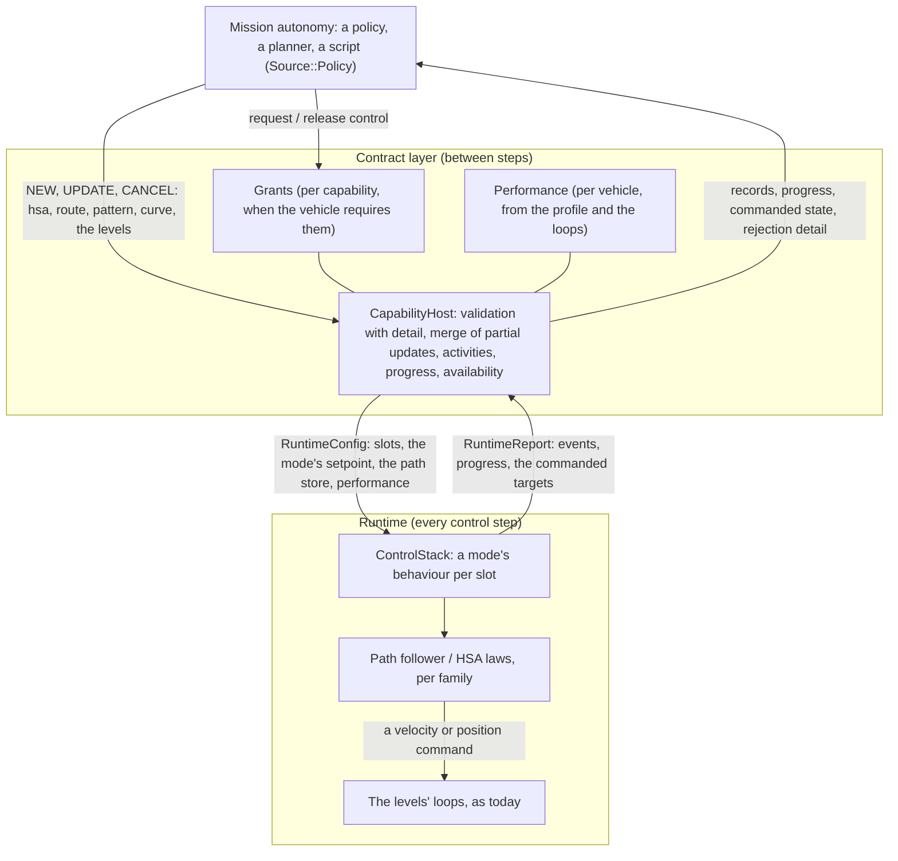

# ADR-28: The Vehicle Interface — A-GRA's flight semantics over the capability contracts

| | |
| --- | --- |
| Status | Accepted 2026-09-26. The owner read the gap analysis (section 1.2) and decided: implement the Vehicle Interface's semantics in the SDK, with authority by grants over the priorities and updatable modes with fixed-size setpoints, the rotorcraft's defects fixed first (section 2). Implemented in the order of section 12 |
| Extends | ADR-26 ([control-architecture.md](control-architecture.md)): its contract layer, runtime, boundary and gates stand. Two of its rules change: guidance may now take UPDATE (ADR-26 8.2), and a vehicle may require grants before a policy commands it (ADR-26 section 5, "no consent protocol"). ADR-27 ([rotorcraft.md](rotorcraft.md)) for the rotorcraft |
| Scope | The flight modes a mission autonomy commands a vehicle through (heading/course, speed and altitude; waypoint following; loiter patterns; curve following), what it is told back (acknowledgment detail, progress, the commanded state), how it gets and loses authority, and what it learns of the vehicle's performance and availability |
| Reference | A-GRA ASK 6.0a, the public repository open-arsenal/a-gra: the *VI L1 Interface Volume* (sections 1.1-1.4), *A-GRA_MessageDefinitions_v6_0_a.xsd* (`MA_FlightCommandMT`, `MA_FlightCommandStatusMT`, `MA_FlightActivityMT`, `MA_FlightCapabilityMT`, `MA_FlightCapabilityStatusMT`), and the *MA L1 Compliance Document* (MA-L1-013, -014, -020). Read for semantics; nothing of them is in this repository |
| Related | [sdk/control.md](sdk/control.md), [sdk/c_abi.md](sdk/c_abi.md), [sdk/python.md](sdk/python.md), [design document](FlightSim_System_Architecture_and_Design.md) §9.3 |

## 1. Context

### 1.1 Roles

A-GRA splits an autonomous aircraft into **Mission Autonomy (MA)**, which decides what to do, and **Flight Autonomy (FA)** behind a **Vehicle Interface (VI)**, which flies the aircraft safely and accepts or rejects what MA asks. Here:

| A-GRA | flightsim |
| --- | --- |
| MA | a consumer of the SDK: a trained policy, a planner, a script. Its commands have `Source::Policy` |
| FA and the VI | the platform: the contract layer (`CapabilityCatalog`, `CapabilityHost`), the runtime (`ControlStack` and its loops), the adapters and the profile |
| FA's own commands (a contingency, a take-over) | `Source::Autopilot` and `Source::Override` |
| A flight capability (`MA_FlightCapabilityMT`) | a capability descriptor (ADR-26 section 8) |
| A flight command, its status, its activity | NEW/UPDATE/CANCEL, `CommandResult`, the activity and its record |

### 1.2 What the gap analysis found (a946dfe)

The analysis traced every VI requirement to the code that implements it, and measured the modes it could find by flying them. Its full matrix is in Appendix A. In short:

| Area | At a946dfe | Gap |
| --- | --- | --- |
| Discovery, acknowledgment, the activity lifecycle, authority by priority | implemented and the best-verified part of the system | the VI's vocabulary: its mode types, its states and reasons |
| HSA/CSA | only through `hold`: true heading, true airspeed, altitude above sea level. No course, calibrated airspeed, Mach, ground speed or height above ground. A partial command loses the other targets. On a rotorcraft in wind, `hold` flies away at 7 m/s | a mode of its own |
| Waypoint following | direct to each point: 379 m off the leg in a 12 m/s crosswind, 203 m past it after a 90° turn. On a rotorcraft, a route with no speed never moves. The points are not validated | leg tracking, turn geometry, validation, progress |
| Curve following | none, and no path-following layer to build it on | all of it |
| Loiter | a circle of at least 100 m around a point, or a hover | patterns, duration, small radii |
| Authority | fixed priorities; no request, grant, revocation or control status | grants |
| Performance, availability | the envelope narrows parameters; availability is Available or, after a divergence, TemporarilyUnavailable | a performance profile; reasons; changes a consumer can see |
| Reporting | an activity's state, reason and constraint flags | rejection detail, progress, ETA, the commanded state |
| Verification | the lifecycle thoroughly; guidance hardly at all: no multi-leg route, loiter or hold test, nothing in wind, the rotorcraft absent from the random sequences | tests per mode and per vehicle class |

ADR-26 took A-GRA's principles and rejected its messaging (ADR-26 1.4, section 5, alternative A3). This record keeps that: it adds the VI's *semantics* to the SDK, and no messages.

## 2. Decisions (the owner, 2026-09-26)

| # | Decision | Consequence |
| --- | --- | --- |
| D1 | **VI semantics in the SDK.** No UCI or A-GRA messages, schemas or transport, and no claim of conformance | ADR-26's non-goal on schemas and messaging stands; a message bridge could be built on the SDK later, outside the core |
| D2 | **Grants over priorities.** A vehicle may require a policy to acquire control of a capability before commanding it; the platform approves, refuses and revokes. The priorities and the per-axis arbitration stay underneath | ADR-26's "no consent protocol" is narrowed: there is no negotiation, only a gate the platform opens and closes (section 6) |
| D3 | **Fixed-size setpoints.** The modes take UPDATE: a mode's setpoint is a fixed-size struct, and routes and curves live in storage each vehicle allocates once | ADR-26 8.2's "guidance takes no UPDATE" holds for the behaviours with heap parameters only (section 4.2) |
| D4 | **The rotorcraft's defects first**, before any new mode | step VI-1 (section 12) |
| D5 | **Relinquishing keeps the vehicle default.** A CANCEL still hands the axes to the vehicle default, neutral unless the consumer chose the hold (ADR-26 9.4). The owner did not adopt holding on relinquish | documented where CANCEL is (sections 5.5, 6.4) |

## 3. Design in one picture



The modes are guidance: a behaviour instance per activity, entering above the levels as ADR-26's behaviours do, and producing a velocity or position command for the family's loops. Nothing below the velocity level changes.

## 4. Flight modes

### 4.1 The mode capabilities

| Id | A-GRA mode | Setpoint | UPDATE | Persistence | Offered to |
| --- | --- | --- | --- | --- | --- |
| `fsim.guidance.hsa` | HSA_CSA | `HsaCommand` | merges the fields given (4.4) | persistent | every aircraft |
| `fsim.guidance.route` | WAYPOINT_FOLLOWING | `RouteCommand` + its waypoints | replaces the route | terminating: completes after the last point (unless it repeats) | every aircraft |
| `fsim.guidance.pattern` | LOITER (orbit, hold) | `PatternCommand` | merges the fields given | persistent; terminating with a duration | every aircraft |
| `fsim.guidance.curve` | CURVE_FOLLOWING | `CurveCommand` + its segments | replaces the curve, or appends to it | terminating: completes at the curve's end | every aircraft |
| `fsim.guidance.hover` (ADR-27) | LOITER (hover) | `BehaviorCommand` | no | persistent | hover-capable aircraft |

A descriptor carries its A-GRA mode (`CapabilityDescriptor::mode`, `FlightMode`), so a consumer can find the VI's modes among an aircraft's capabilities: `fsim.guidance.formation` is FORMATION, and the modes above are theirs.

### 4.2 Setpoints are fixed-size

`HsaCommand`, `PatternCommand`, `RouteCommand` and `CurveCommand` join the `Command` variant after `BehaviorCommand`. They are plain structs of doubles, as the levels' are, so an UPDATE writes them in place with no allocation. Each enters at `Level::Behavior`: `levelOf()` maps them there, and the variant's index no longer equals the level. A route's waypoints and a curve's segments do not fit a setpoint; they travel beside it (`Span<const Waypoint>`, `Span<const BezierSegment>`) and the host copies them into the vehicle's **path store**:
- one per vehicle, in `RuntimeConfig`, allocated at the first NEW that needs it with room for 256 waypoints and 32 curve segments, and never again;
- written between steps by the host, read during them by the mode's behaviour, with a revision the behaviour follows.

A guidance activity owns every primary axis (ADR-26 9.1), so at most one flies at a time and one store suffices.

The behaviours with heap parameters (`hold`, `waypoints`, `loiter`, `pursuit`, `evade`, `formation`, `aerobatics`, `hover` and a trainer's own) keep their `BehaviorCommand` and take no UPDATE, as ADR-26 8.2 says.

### 4.3 References

| Quantity | References | Notes |
| --- | --- | --- |
| Direction | heading (the nose), course (the track over the ground); true north | magnetic north is refused (`InvalidParameter`): the platform has no magnetic model |
| Speed | true airspeed, calibrated airspeed, ground speed, Mach | converted each update with the vehicle's own ratios (TAS/CAS, TAS/Mach) and its wind estimate. Speed optimisation (long-range cruise, maximum endurance) is refused: the profile has no drag polar |
| Altitude | above sea level (MSL), above ground (AGL), above the WGS-84 ellipsoid | the simulation's sea level is the ellipsoid (JSBSim), so ellipsoid and MSL are one. AGL follows the ground provider's terrain. Barometric altitude is refused |

`SpeedReference`, `AltitudeReference`, `TurnType`, `PatternKind`, `EndBehavior` and `Projection` are enums; a setpoint carries them as doubles, like every field, so that `kHold` can mean "as before".

**Wind.** Guidance estimates the wind as the ground velocity less the air velocity (true airspeed along the body's α and β, rotated to north-east-down), low-passed over 3 s, from the *sensed* state. It never reads the environment's wind.

### 4.4 HSA/CSA

```cpp
struct HsaCommand {                   // fsim.guidance.hsa
    double headingRad = kHold;        // the nose's direction, true, -pi..pi, or:
    double courseRad = kHold;         // the track over the ground's
    double speed = kHold;             // m/s, or a Mach number
    double speedReference = kHold;    // SpeedReference
    double altitudeM = kHold;
    double altitudeReference = kHold; // AltitudeReference
};
```

**Partial commands** (the VI's "partial HSA/CSA commands update the most recent commanded values"):
- **UPDATE:** each field given replaces the commanded one, and the rest stay as commanded. A heading replaces a course and a course a heading. A new reference needs its value: a speed reference given without a speed is `InvalidParameter`.
- **NEW:** fields left out continue the commanded values of a live `hsa` activity the NEW replaces; with none, they are what the vehicle flies now. The aircraft's current heading, its altitude above sea level, and its true airspeed (a wing) or its ground speed (a rotorcraft, so a hovering one stays put).
- The host resolves them, so the slot always holds a complete setpoint and the runtime never guesses.

**Laws** (`HsaBehavior`, by the vehicle's features):

| | Wing | Rotorcraft |
| --- | --- | --- |
| Heading | the velocity level's heading | the yaw; a ground speed is flown along the nose, an airspeed along the nose through the air |
| Course | the heading that holds it against the wind estimate (the wind correction angle), plus an integral on the course error | the ground velocity along the course, the nose along the track |
| Speed | true airspeed from the reference; a ground speed solved through the wind triangle | as ground velocity (ground speed) or airspeed |
| Altitude | a vertical speed from the altitude error at the position loop's gain, within the performance's climb and descent rates; AGL targets ride the terrain under the aircraft | the same |

### 4.5 Waypoint following

```cpp
struct Waypoint {                      // one route segment: to here from the previous point (or from where the vehicle is)
    double latitudeRad = 0.0, longitudeRad = 0.0;
    double altitudeM = kHold;          // kHold: the previous point's (the first: as now)
    double altitudeReference = kHold;  // AltitudeReference; kHold: the previous point's
    double speed = kHold;              // flown on this segment; kHold: the previous segment's (the first: as now)
    double speedReference = kHold;
    double turn = 0.0;                 // TurnType: 0 fly-by, 1 fly-over
    double maxBankRad = kHold;         // this segment's bank limit (A-GRA MaximumRoll)
    double climbRateMs = kHold;        // climb or descend at this rate, then level; kHold: along the path's gradient
    std::uint64_t id = 0;              // the caller's segment id, reported back
};
struct RouteCommand {                  // fsim.guidance.route; the waypoints go with it
    double projection = 0.0;           // Projection: 0 great circle, 1 rhumb line
    double repeat = 0.0;               // 1: fly the route again from its first point
    double end = 0.0;                  // EndBehavior after the last point: 0 continue its course, 1 orbit it
    double start = 0.0;                // the index of the point to fly to first
};
```

- **Legs** are great circles, or rhumb lines, between the points, the first from where the vehicle is when the route starts. Cross-track and along-track distances are computed on the sphere, not a flat projection: a 100 km leg's great circle bows 165 m from a straight line at 40° north.
- **Fly-by** turns begin before the point, on a circle tangent to both legs. Its radius is the one the segment's bank limit (or 80 % of the performance's) gives at the planned ground speed plus the wind. A turn of more than 150° is flown over.
- **Fly-over** points are passed abeam, and the next leg is intercepted.
- **Vertical:** the altitude runs straight from point to point along the track. With a climb rate, the aircraft climbs or descends at it and then levels.
- **Speed** per segment, in any reference.
- **UPDATE** replaces the route (its store, its options) and restarts it at `start`.
- **Completion** comes after the last point, unless the route repeats; then the aircraft continues the last leg's course, altitude and speed, or orbits the last point (`end`).
- **Rotorcraft** fly the same geometry at the segment's speed. They slow for a turn only as much as its radius asks (a lateral acceleration within the performance's), and stop only at the route's end, never at each point.

### 4.6 Loiter patterns

```cpp
struct PatternCommand {                // fsim.guidance.pattern
    double pattern = 0.0;              // PatternKind: 0 orbit, 1 racetrack, 2 figure-eight, 3 hold
    double latitudeRad = kHold, longitudeRad = kHold; // the centre; a racetrack's or a hold's fix. kHold: here
    double altitudeM = kHold, altitudeReference = kHold;
    double radiusM = kHold;            // kHold: the aircraft's turn radius at its speed and 80 % of its bank limit
    double clockwise = kHold;          // 1 right turns (the default), 0 left
    double courseRad = kHold;          // a racetrack's or a hold's inbound course; a figure-eight's axis. kHold: as now
    double legM = kHold;               // the straight legs; a hold's kHold: 60 s at or below 14,000 ft, 90 s above
    double speed = kHold, speedReference = kHold;
    double durationS = kHold;          // then it completes; kHold: until canceled
};
```

- **Orbit:** a circle around the centre.
- **Racetrack:** two semicircles joined by legs, the inbound leg ending at the fix.
- **Figure-eight:** two circles crossing at the centre.
- **Hold** is the ATC holding pattern: a racetrack on the fix with the VI's defaults (right turns, inbound course the arrival's, timed legs); it is entered by intercepting the pattern.
- **Radius:** a rotorcraft's minimum is 1 m. A wing's is its turn radius at its speed: a smaller radius is clamped, flagged, or refused under `RangePolicy::Reject`.

### 4.7 Curve following

```cpp
struct BezierSegment { double north[6], east[6], down[6]; }; // six control points, metres from the curve's reference
struct CurveCommand {                  // fsim.guidance.curve; the segments go with it
    double latitudeRad = kHold, longitudeRad = kHold, altitudeM = kHold; // the reference (A-GRA CenterReference); kHold: the vehicle at NEW
    double speedMinMs = kHold, speedMaxMs = kHold; // the ground-speed range to fly it at, or:
    double durationS = kHold;          // the time to fly all of it
    double end = 0.0;                  // EndBehavior: 0 continue (course, speed, altitude), 1 orbit the endpoint
    double append = 0.0;               // with UPDATE: add these segments after the curve's end
};
```

- **Segments:** each is a quintic Bézier: the VI's six control points with weights 1 and the clamped knot vector [0,0,0,0,0,0,1,1,1,1,1,1]. A command carries 1 to 10 of them, as the VI's does. A segment starts where the previous one ends (C0); a gap of more than 1 m is `InvalidCurve`.
- **Append:** extends a live curve by UPDATE with `append` set. The new segments keep the reference of the curve they extend, as the VI's AppendCurve does.
- **Speed:** within the range given, or whatever covers the rest of the curve in the rest of the duration, and within the performance's limits. Without either, the speed as now.
- **After the end:** the course, speed and altitude continue (CSA), or the aircraft orbits the endpoint.

### 4.8 The path follower

Routes, patterns and curves are sequences of pieces: great-circle or rhumb legs, circular arcs (fly-by turns, patterns), and Bézier segments. One follower flies them all:
- **Where on the path.** The nearest point, its tangent course χp and its curvature κ, and the signed cross-track distance e. Legs use closed forms on the sphere. Arcs use a plane at their centre. Béziers use a Newton step from the last parameter, over an arc-length table built when the curve starts.
- **Lateral law.** The course to fly is χd = χp − atan(e/Δ), line-of-sight guidance with the lookahead Δ, plus the curvature's rate κ·Vg fed forward.
- **Wings** turn at ω = κ·Vg + kχ·(χd − χg), as a turn rate at the velocity level; χg is the course over the ground. kχ is the vehicle's course bandwidth (its heading loop's: section 7.1), and Δ = 3·Vg/kχ, so the track settles well outside the heading loop's own lag.
- **Rotorcraft** fly a ground velocity: the path speed along the tangent, less kχ·e across it, the nose along the track. The path speed is limited to what the curvature allows, and to what stops them at the end.
- **Vertical.** The altitude profile gives a vertical speed: its gradient times the ground speed, plus the altitude error at the position loop's gain, within the climb and descent limits.

### 4.9 The behaviours that stay

`hold`, `waypoints` and `loiter` stay as they are for the existing entry points and their trajectories (ADR-26 C1), with VI-1's fixes for the rotorcraft (section 12). The modes are new capabilities beside them.

## 5. Commands, activities and what they report

### 5.1 Validation and rejection detail

The VI answers a rejection with *why*: a validation result, the performance constraint, the invalid segment or section. `CommandResult` gains:

```cpp
struct CommandResult {
    ...                                   // as ADR-26 10.1
    std::int16_t index = -1;              // the field, waypoint or curve segment at fault
    Constraint constraint = Constraint::None; // the performance limit a value broke
    float from = kHold, to = kHold;       // a curve segment's section (its parameter, 0..1) that breaks it
};
enum class Constraint : std::uint8_t {    // A-GRA MA_PerformanceConstraintEnum
    None, MinAirspeed, MaxAirspeed, MinAltitude, MaxAltitude, MinAcceleration, MaxAcceleration,
    MaxOrientation, MaxOrientationRate, MaxTurnRate, MaxClimbRate, MaxDescentRate };
```

New reasons, appended to `Reason`:

| Reason | When | A-GRA |
| --- | --- | --- |
| `InvalidWaypoint` | a waypoint not finite or out of range, a leg too short for its fly-by turn, a repeated point | INVALID_WAYPOINT |
| `InvalidCurve` | a segment count outside 1..10, a gap between segments, a curvature the aircraft cannot fly (the section named) | INVALID_CURVE |
| `PerformanceLimit` | a value beyond the performance, under `RangePolicy::Reject`, or a geometry no range policy can clamp (a climb gradient) | PERFORMANCE_LIMIT_EXCEEDED + `constraint` |
| `NotGranted`, `NotAllowed`, `Revoked`, `Released`, `CollisionAvoidance`, `Restricted` | section 6 and 7.3 | INELIGIBLE_CONTROL_SOURCE, CANCELED, CONSTRAINT_COLLISION_AVOIDANCE, CONSTRAINT_OP |

The C ABI's result gets the detail through a new call (section 9); its `reserved` field carries `index + 1`.

### 5.2 UPDATE of a mode

UPDATE writes the setpoint in place (no allocation), then bumps the slot's revision:
- **HSA and patterns** merge the fields given into the commanded setpoint (4.4).
- **Routes and curves** copy the new waypoints or segments into the path store and bump its revision. The behaviour restarts on the new route, or goes on along the extended curve.
- The values are checked as the NEW's were, with the activity's range policy.

### 5.3 Progress

```cpp
struct ActivityProgress {
    std::uint32_t segment = 0, segments = 0; // the waypoint, curve segment or pattern leg being flown, of how many
    std::uint64_t segmentId = 0;             // a waypoint's id
    std::uint32_t laps = 0;                  // a pattern's or a repeating route's
    double percent = kHold;                  // of the whole route, curve or timed pattern
    double segmentPercent = kHold;
    double distanceToGoM = kHold, timeToGoS = kHold; // to the end, at the ground speed now
    double crossTrackM = kHold;              // + right of the path
    // what the mode commands (A-GRA VehicleCommandState)
    double courseRad = kHold, headingRad = kHold, altitudeMslM = kHold, speedMs = kHold, speedReference = kHold;
};
```

- **Writing it.** A behaviour fills it through a new virtual, `Behavior::progress()`, which by default reports nothing. It keeps what it needs from its last update (a few stores); after each world step the host asks the slot's behaviour through `ControlStack::progress(slot)`, a read between steps like the report's, and keeps the answer in the activity's record. Nothing runs per control update. (Recorded at VI-2: the first design had the runtime write it into the report every update.)
- **Legacy behaviours.** `waypoints` reports its point and the distance to it; `loiter`, its laps.
- **The commanded state of any flight.** `World::commanded(vehicle)` reads the cascade's commands from the last update: the altitude, heading, speed and vertical speed at the velocity and position levels, the attitude, the rates and load factor, the throttle. It is read on demand, so it costs a step nothing.

### 5.4 The lifecycle in A-GRA's terms

| flightsim | A-GRA |
| --- | --- |
| `CommandStatus` Accepted, Rejected, Canceled | `CommandProcessingStateEnum` ACCEPTED, REJECTED, CANCELED. RECEIVED is not needed: every command is answered at once |
| `ActivityState` Pending | ENABLED |
| Active, no constraint flag | ACTIVE_UNCONSTRAINED |
| Active with `kActivityDemandLimited`, `kActivityClamped` or `kActivityAxesReduced` | ACTIVE_PARTIALLY_CONSTRAINED |
| Active with `kActivitySaturated` or `kActivityExceeded` | ACTIVE_FULLY_CONSTRAINED |
| Completed, Failed | COMPLETED, FAILED |
| Canceled | FAILED with reason CANCELED |
| `Reason` | `CannotComplyEnum`: the table in `fsim.agra` (Python) and Appendix B |

`fsim.agra` (Python) holds these mappings and the mode types, for a consumer that speaks A-GRA's vocabulary.

### 5.5 CANCEL

Unchanged (D5): the activity ends `Canceled(Requested)` and its axes fly the vehicle default, which is the neutral command unless the consumer set `VehicleDefault::Hold`. A mission autonomy that wants the VI to carry on when it lets go sets the hold first (sdk/control.md says so where it describes CANCEL).

## 6. Authority: grants over priorities

### 6.1 Control modes

| `ControlMode` | Policy commands | Default |
| --- | --- | --- |
| `Open` | as ADR-26: any capability, arbitrated by source and axes | yes: every existing consumer and flight is unchanged |
| `Granted` | only the capabilities a grant covers; a NEW without one is `Rejected(NotGranted)`. The legacy façade is gated the same way | set per vehicle by the platform's side (`setControlMode`) |

`Autopilot` and `Override`, the platform's own sources (FA), never need a grant: FA is always the primary controller.

### 6.2 Requests, releases, revocations

| Call | Effect | A-GRA |
| --- | --- | --- |
| `requestControl(vehicle, capability)` | approved if the capability is allowed and available; else rejected with `NotAllowed` or the availability's reason | ControlRequest ACQUIRE → APPROVED / REJECTED |
| `releaseControl(vehicle, capability)` | the grant ends; the policy's live activities of that capability end `Canceled(Released)` | MA relinquishes control |
| `revokeControl(vehicle, capability, reason)` | the platform ends the grant; the policy's live activities of that capability end `Canceled(Revoked)` | ControlRequestStatus CANCELED; Unpair |
| `setAllowed(vehicle, capabilities)` | which capabilities a policy may request (all by default); a grant for one no longer allowed is revoked | C2's control designations |
| `controlStatus(vehicle)` | per capability: allowed, granted; the primary controller is always the platform | ControlStatus |

A grant opens a gate and nothing more. Under it, sources and axes arbitrate as before: a live `Autopilot` activity still holds its axes against a granted policy.

### 6.3 A revision to watch

The host counts every change to grants, allowed capabilities, availability and performance (`controlRevision(vehicle)`). A consumer polls it instead of subscribing, keeping ADR-26's "no subscriptions".

### 6.4 Relinquishing

`releaseControl` and CANCEL end the policy's activities, and the vehicle default flies (D5).

## 7. Performance and availability

### 7.1 Performance

The adapter computes a vehicle's `Performance` when the vehicle is created, and again when its loops or their settings change. It is what guidance plans with, what validation checks against, and what a consumer reads (A-GRA's `FlightCapabilityPerformanceProfile`):

| Field | Wing from | Rotorcraft from |
| --- | --- | --- |
| minimum, maximum calibrated airspeed; maximum Mach | the envelope; else the performance section's stall speed × 1.2 | the envelope (maximum) |
| cruise speed (what a mode flies with no speed) | the plant's reference true airspeed; else the airspeed now | the position loop's `max_speed` × 0.5 |
| maximum ground speed | — | the position loop's `max_speed` |
| ceiling | the performance section | — |
| bank, pitch, load factor, roll rate | the envelope; else the velocity loop's `max_bank` | the envelope; the velocity loop's `max_tilt` |
| maximum acceleration, deceleration | — | g·tan(`max_tilt`); the position loop's `deceleration` |
| maximum climb, descent rate | the position loop's `max_vertical_speed` (the performance section's climb, if lower) | the position loop's `max_vertical_speed` |
| course bandwidth | the heading loop's (`heading.gain` × g / its reference speed) | the velocity loop's `horizontal.kp` |
| altitude gain | the position loop's `altitude.gain` | the position loop's `altitude.gain` |

- **Derived limits.** Turn radius, turn rate, and climb gradient at a speed follow from these (`Performance::turnRadiusM(v)` and the like).
- **Per mode.** The VI gives a profile per mode; here every mode shares the vehicle's, and a mode states which fields it uses.
- **Dynamic.** It is recomputed on a change, with a new revision (6.3). Configuration-dependent limits (flaps, gear) stay protection's, as ADR-26 11 has them.

### 7.2 Availability

| Source | Availability, reason |
| --- | --- |
| a diverged vehicle | TemporarilyUnavailable, `Diverged` (as ADR-26) |
| the platform restricts a capability: `setAvailability(vehicle, capability, availability, reason)`, e.g. FA's collision avoidance | the given state and reason; a policy's NEW is `Rejected(Unavailable)` with that reason as the result's detail. Live activities go on until the platform preempts them (an `Override` manoeuvre) |
| a mode whose loops the aircraft lacks | absent from the catalog |

Every change bumps the revision.

## 8. Boundary, threads, allocation

ADR-26's rules B1-B8 hold, with these additions:
- **`RuntimeConfig`** gains the path store (a pointer, allocated at the first route or curve NEW) and `Performance`.
- **Progress** is asked of the slot's behaviour by the host after each world step (`ControlStack::progress`, read-only, between steps), so the report does not grow.
- **`ControlContext`** gains `features` (the vehicle's Feature bits) and `guidance` (its performance and path store), for behaviours. Both are trailing members with defaults, so existing initialisers keep compiling.
- **`Behavior`** gains `start(ctx, const Command&)` and `progress()`. The old `start(ctx, const BehaviorCommand&)` is still called for a `BehaviorCommand`, by the new overload's default.
- **B2, the fast path:** UPDATE of a mode merges or copies in place, with no allocation, strings or virtual calls; so does a route or curve UPDATE within the store's capacity. The allocation gate gains HSA and pattern updates every step, and a route replaced every step.
- **B5:** the modes' behaviours allocate nothing while flying: their geometry lives in fixed arrays allocated with them at NEW.
- **Determinism:** the modes read only the state, the setpoint, the store and the performance, so trajectories stay independent of the worker count.

## 9. SDK surfaces

| C++ (`World`, `Vehicle`) | C ABI 1.6 | Python |
| --- | --- | --- |
| `submit(HsaCommand)`, `submit(PatternCommand)`; `update(activity, …)` | `fsim_vehicle_submit_mode(world, id, FSIM_MODE_HSA / _PATTERN, fields, count, options, result)`; `fsim_activity_update` takes a mode's fields | `Vehicle.submit_hsa(**fields)`, `submit_pattern(**fields)`; `Activity.update(**fields)` merges |
| `submit(RouteCommand, Span<const Waypoint>)`, `update(activity, RouteCommand, Span<const Waypoint>)` | `fsim_vehicle_submit_route`, `fsim_activity_update_route` (`fsim_waypoint[]`) | `submit_route(waypoints, **options)`, `Activity.update_route` |
| `submit(CurveCommand, Span<const BezierSegment>)`, `update(…)` | `fsim_vehicle_submit_curve`, `fsim_activity_update_curve` | `submit_curve(segments, **options)`, `Activity.append(segments)` |
| `ActivityRecord::progress`; `commanded(vehicle)` | `fsim_activity_get_progress`, `fsim_vehicle_commanded` | `Activity.progress`, `Vehicle.commanded` |
| `CommandResult::index`, `constraint`, `from`, `to` | `fsim_command_result.reserved` = index + 1; `fsim_last_command_detail` | `Rejected.index`, `.constraint`, `.section` |
| `performance(vehicle)`, `controlRevision(vehicle)` | `fsim_vehicle_performance`, `fsim_vehicle_control_revision` | `Vehicle.performance`, `.control_revision` |
| grants and availability (section 6, 7.2) | `fsim_vehicle_set_control_mode`, `_request_control`, `_release_control`, `_revoke_control`, `_set_allowed`, `_control_status`, `_set_availability` | the same names on `Vehicle` |

The C ABI changes additively only (ADR-26 C3): new calls, new structs with a `struct_size`, new enum values.

## 10. Non-goals and deferred work

| Not done | Why | Revisit when |
| --- | --- | --- |
| UCI/A-GRA messages, the XSD, a transport, RECEIVED, heartbeats | D1 | an external MA must connect: a bridge over the SDK, outside the core |
| Ranking, `InterruptOtherActivities`, start/end time windows | sources decide precedence; no plan engine (ADR-26 5) | a plan layer is built |
| Stored route plans, their activation and query (A-GRA's route plan package) | a route travels with its command, as the VI's waypoint following does | a plan layer is built |
| Validation against geofences, terrain, traffic, endurance | no such models in the platform | the platform models them |
| Magnetic headings, barometric altitudes, speed optimisation | no magnetic model, altimeter setting or drag polar | a consumer needs them and the data exists |
| MUST_FLY, ALTITUDE_STACKED_MARSHALL, LAUNCH, RECOVERY, ROUTE_INTERCEPT, formation templates, taxi routes, conditional path branches | beyond the VI's three flight modes and loiter | asked for |
| Contingencies (failsafe plans, fault reports) | no fault model | effects model faults |
| Holding on relinquish | D5 | the owner asks |

## 11. Compatibility

- **C1, flight.** Every existing flight is bit-identical: the control digests equal step 5b's, with protection on and off. VI-1 changes flight only for rotorcraft on `hold`, `waypoints` and `loiter`, where it was wrong.
- **C2, the C++ SDK:** additions only. New virtuals change vtables; plugins rebuild, as for any SDK release. `Command` gains alternatives, so a `switch` on `index()` or a `std::visit` over it must handle them. The platform's own do.
- **C3, the C ABI:** additive, 1.6. `fsim_command_result.reserved` becomes the rejection's index + 1, 0 as before when there is none.
- **C4, determinism:** the same seed and calls give the same trajectories, ids and answers.
- **C5, performance:** ADR-26's gates (12.4) hold for every existing case. The new cases' costs are recorded.

## 12. Migration order

Each step ships as commits on main with its tests, benchmark numbers (section 15) and documentation, and changes no existing flight unless it says so.

**VI-1: the rotorcraft's defects, and the tests the analysis found missing.**
- *Scope:*
  - `ControlContext::features`;
  - `waypoints` on a hover-capable vehicle flies its loops' own speed when given none;
  - `hold` on a hover-capable vehicle holds its ground velocity, not the airspeed along the nose;
  - `loiter`'s minimum radius is 1 m for a rotorcraft (100 m stays a wing's);
  - route points validated (finite, in range, a positive capture radius: `InvalidParameter` with the point);
  - Python's `Activity.update` on a behaviour answers `not_updatable`.
- *Tests:*
  - multi-leg routes (c172x, uh1h, iris);
  - `hold` converging on heading, altitude and speed, in a crosswind;
  - a rotorcraft's `hold` in wind;
  - loiter orbits (c172x; a rotorcraft at a small radius);
  - the helicopter and multirotor adapters in the random-sequence conformance;
  - a rotorcraft's airspeed along the nose;
  - Python's UPDATE of a behaviour.
- *Exit criteria:* digests identical for every fixed-wing flight; the rotorcraft suite as before; the new tests green.

**VI-2: what a consumer is told.**
- *Scope:*
  - rejection detail (5.1): `CommandResult` fields, `fsim_last_command_detail`, Python;
  - `Behavior::progress()`, `ActivityProgress` in the report and the record, `waypoints`' and `loiter`'s progress;
  - `commanded(vehicle)`;
  - the C ABI and Python for both;
  - `CapabilityDescriptor::mode`;
  - `fsim.agra`'s mappings.
- *Tests:* progress monotonic and in range through conformance; detail consistent with reasons; the ABI and Python round trip.
- *Exit criteria:* digests identical; allocation gate green.

**VI-3: HSA/CSA.**
- *Scope:*
  - `HsaCommand` in the variant;
  - `fsim.guidance.hsa`, with the host's merge and inheritance;
  - `Performance` and `ControlContext::guidance`;
  - `HsaBehavior` for wings and rotorcraft;
  - the wind estimate, the speed and altitude references;
  - the C ABI and Python.
- *Tests*, for the c172x, a direct design, a fly-by-wire design, a helicopter and a multirotor:
  - heading and course held within 2° in a 12 m/s crosswind;
  - altitude within 15 m;
  - speed within 1 m/s in each reference;
  - a partial UPDATE keeps the rest;
  - a NEW inherits;
  - AGL over a sloping ground provider;
  - determinism.
- *Exit criteria:* the tests; digests identical; allocations none for an HSA updated every step.

**VI-4: the path follower and waypoint following.**
- *Scope:*
  - `RouteCommand`, `Waypoint`, the path store;
  - the follower (4.8), great-circle and rhumb legs, fly-by and fly-over;
  - the vertical and speed profiles;
  - validation per waypoint with the detail;
  - progress;
  - UPDATE;
  - the C ABI and Python.
- *Tests:*
  - routes for the five aircraft of VI-3, with and without a 12 m/s crosswind;
  - every point captured;
  - cross-track within a bound per class once on a leg (a wing within 50 m);
  - a fly-by's overshoot within its turn radius;
  - a rotorcraft through its turns without stopping;
  - rejections with the right waypoint;
  - an UPDATE mid-route.
- *Exit criteria:* the tests; digests identical; no allocations for a route updated every step.

**VI-5: loiter patterns.**
- *Scope:* `PatternCommand`, the four patterns on the follower, the hold's defaults, duration, laps.
- *Tests:* each pattern's track against its geometry per class; the defaults; a rotorcraft's small orbit.

**VI-6: curve following.**
- *Scope:*
  - `CurveCommand`, `BezierSegment`, the Bézier pieces;
  - traversal by speed range or duration;
  - append;
  - the end behaviours;
  - validation by section;
  - status.
- *Tests:*
  - tracking error bounds per class;
  - the section named when a curve is too tight;
  - appending while flying;
  - a duration met within 5 %.

**VI-7: grants, performance, availability.**
- *Scope:*
  - control modes, requests, releases, revocations, allowed capabilities and status;
  - `Performance` in the SDK;
  - `setAvailability` and its reasons;
  - the control revision;
  - the C ABI and Python.
- *Tests:* grant sequences checked against the rules, as conformance checks the lifecycle; a revoked policy's activity ends and its NEWs are refused; the performance against the profile.

## 13. Alternatives considered

| # | Alternative | Outcome |
| --- | --- | --- |
| A1 | A new cascade level for the modes | Rejected. The modes have the lifecycle of behaviours: an instance per activity, a start, completion and failure. A level has one instance per vehicle, and its commands would merge per axis, which a route does not |
| A2 | A fixed block of numbers inside `BehaviorCommand` for updatable behaviours | Rejected: two parameter mechanisms in one struct, and nothing typed for a consumer |
| A3 | The route inside its setpoint | Rejected: a 256-point setpoint would make every slot, merge buffer and copy 25 KB |
| A4 | L1 guidance (Park, Deyst and How, 2004) instead of line of sight with curvature feedforward | Kept for reference. Line of sight takes its gains from the course bandwidth the loops already have, and follows arcs and Béziers without a steady error |
| A5 | A message bridge now | Not decided (D1) |
| A6 | Hold on relinquish | Not adopted (D5) |

## 14. Consequences

- **Benefits.** A mission autonomy flies the VI's modes on every aircraft the platform has, is told why a command fails and how far an activity has got, and gets and loses authority as the VI describes. The rotorcraft fly guidance correctly.
- **Costs.** Four more command types; a path store per vehicle that flies a route or curve (about 25 KB); new C ABI calls; a guidance layer to keep tuned per family.
- **Risks.**

| Risk | Mitigation |
| --- | --- |
| Guidance laws that suit one aircraft and not another | gains from each vehicle's own loops (7.1); tests per class |
| The modes' reporting costs every vehicle | progress is written only by modes; the commanded state is read on demand |
| A-GRA vocabulary drifting from ours | the mapping tables (5.4, Appendix B) and `fsim.agra` in one place |

## 15. Measurements

Filled in as the steps land. The machine and the benchmark's precision are ADR-26's (its section 17).

**VI-1 (the rotorcraft's defects).**
- **Digests:** every flight of the digest set identical to step 5b, with protection on and off. The fixes act only on vehicles that hover.
- **Routes given no airspeed**, square, from a settled hover:
  - the IRIS's 30 m legs flown in 18 s, the Crazyflie's 3 m legs in 33 s;
  - the UH-1H's and UH-60A's 400 m legs in 81 s and 69 s.
  - Before, the IRIS moved 0.0 m in 60 s and the UH-1H 2.0 m in 120 s.
- **`hold` in wind**, from a settled hover, over 30 s:
  - the IRIS within 0.03 m (a 5 m/s wind; it went 204 m before);
  - the UH-60A within 1.4 m and the UH-1H within 15 m (5 m/s; the UH-1H's velocity loop is the slower to take the wind out);
  - the Crazyflie within 2.4 m (1 m/s).
- **`loiter`:** a 20 m orbit flown by the IRIS at 19.0 m, a 2 m one by the Crazyflie at 2.0 m, the c172x's 800 m at 765 m.
- **Conformance:** the random sequences now run the helicopter (UH-1H) and multirotor (IRIS) adapters too, with the same required coverage: every edge of the lifecycle and every answer.
- **Tests:** `tests/test_guidance.cpp`:
  - a wing's three-leg climbing route;
  - rotorcraft routes given no airspeed;
  - `hold` to a heading, altitude and airspeed in a 12 m/s crosswind;
  - rotorcraft `hold` in wind;
  - loiter radii, a rotorcraft's airspeed along its nose;
  - route validation.

  Also two Python cases: a behaviour's UPDATE refused `not_updatable`, and route points checked. ctest 161/161.

**VI-2 (what a consumer is told).**
- **Digests:** identical to step 5b, protection on and off.
- **Allocations:** none; the host's reading of progress after each step included.
- **Cost:** interleaved A/B against VI-1 (5 rounds). Every update case is within ±2.2 %: `waypoints` and `loiter` at +0.5 %, from a few stores per update for their progress. The progress itself is computed between steps, only for guidance activities.
- **What it adds:**
  - rejection detail on every answer (the field, route point or curve segment; the performance limit), with the flight capabilities' ranges saying which limit each breaks;
  - `ActivityProgress` from `waypoints`, `loiter`, `hold` and `hover`;
  - `ControlStack::commanded()` and `Vehicle::commanded()`;
  - `FlightMode` on descriptors (formation, hover);
  - the nine reasons of 5.1;
  - C ABI 1.6 (`fsim_last_command_detail`, `fsim_activity_get_progress`, `fsim_vehicle_commanded`, `fsim_vehicle_capability_flight_mode`, and the result's index);
  - Python's `Rejected.index`, `.constraint` and `.section`, `Activity.progress`, `Vehicle.commanded`, `Capability.mode`, and `fsim.agra`.
- **Tests:**
  - `tests/test_interface.cpp`: detail for a level, a design's envelope and a route; a route's progress point by point to completion; loiter laps; hold targets; the commanded state; modes;
  - the C ABI test, and a Python case;
  - conformance now checks every record's progress is within its bounds.

  ctest 166/166.

## Appendix A: the gap analysis at a946dfe

The review traced each requirement of the VI L1 Interface Volume and the schema to code and tests, and flew the modes it could find with probes against the built SDK (c172x, UH-1H, IRIS, Crazyflie). Classified as verified, partial, missing or intentionally unsupported:

| Area | Verified | Partial | Missing | Intentionally unsupported |
| --- | --- | --- | --- | --- |
| Discovery, availability | discovery of levels and behaviours, ranges per aircraft | mode taxonomy, performance profile, availability reasons | dynamic profile, ready signal | — |
| Authority | FA's primacy (Override) | revocation (only by preemption) | requests, grants, control status, C2 designations | consent protocols (ADR-26) |
| Acknowledgment | NEW/UPDATE/CANCEL, accepted/rejected/canceled | reasons, correlation, "best effort" (clamping) | validation detail; geofence, terrain, traffic, endurance | RECEIVED, ranking, time windows |
| Activities | the lifecycle, constraint flags | state mapping, commanded state | progress, ETA, segment status | publication (polled instead) |
| HSA/CSA | heading; TAS for wings; ground speed for rotorcraft; persistence | course for rotorcraft; altitude via `hold` | course for wings; CAS; Mach; AGL; magnetic; partial updates; a rotorcraft `hold` that holds | speed optimisation |
| Waypoint following | — | direct-to routes (wings), completion | leg tracking, turn geometry, validation, progress, storage; rotorcraft routes without a speed | branches, payload actions |
| Curve following | — | — | everything | — |
| Loiter | hover | orbit ≥ 100 m | racetrack, figure-eight, hold, duration | — |
| Status | state data, envelope exceedances | — | faults | heartbeats, messages |

## Appendix B: `Reason` in A-GRA's terms

| `Reason` | `CannotComplyEnum` / `MA_ValidationResultEnum` |
| --- | --- |
| UnknownCapability | CAPABILITY_NOT_SUPPORTED |
| UnknownVehicle, UnknownActivity | UNKNOWN_ID |
| Unavailable | CAPABILITY_UNAVAILABLE (a placard: CONSTRAINT_SAFETY; the platform's reason when it set one) |
| VersionUnsupported, InvalidAxes, WrongCommandType, NotUpdatable | INPUT_OTHER |
| InvalidParameter | INVALID_INPUT_PARAMETER |
| OutOfRange, PerformanceLimit | PERFORMANCE_LIMIT_EXCEEDED, with the constraint |
| InvalidWaypoint | INVALID_WAYPOINT |
| InvalidCurve | INVALID_CURVE |
| AuthorityHeld | CAPABILITY_PRECEDENCE |
| ControllerNotAxisAware | SYSTEM_CONFLICT |
| ActivityEnded | STATE_OR_SETTINGS |
| NotGranted, NotAllowed | INELIGIBLE_CONTROL_SOURCE |
| Requested, Released | CANCELED |
| Preempted | CAPABILITY_PRECEDENCE |
| Revoked | CANCELED (ControlRequestStatus) |
| TargetLost | MISSION_EVENT |
| BehaviorFailed, CapabilityLost | CAPABILITY_FAULT |
| Diverged | SYSTEM_FAULT |
| CollisionAvoidance | CONSTRAINT_COLLISION_AVOIDANCE |
| Restricted | CONSTRAINT_OP |
| GoalReached | — (COMPLETED) |
