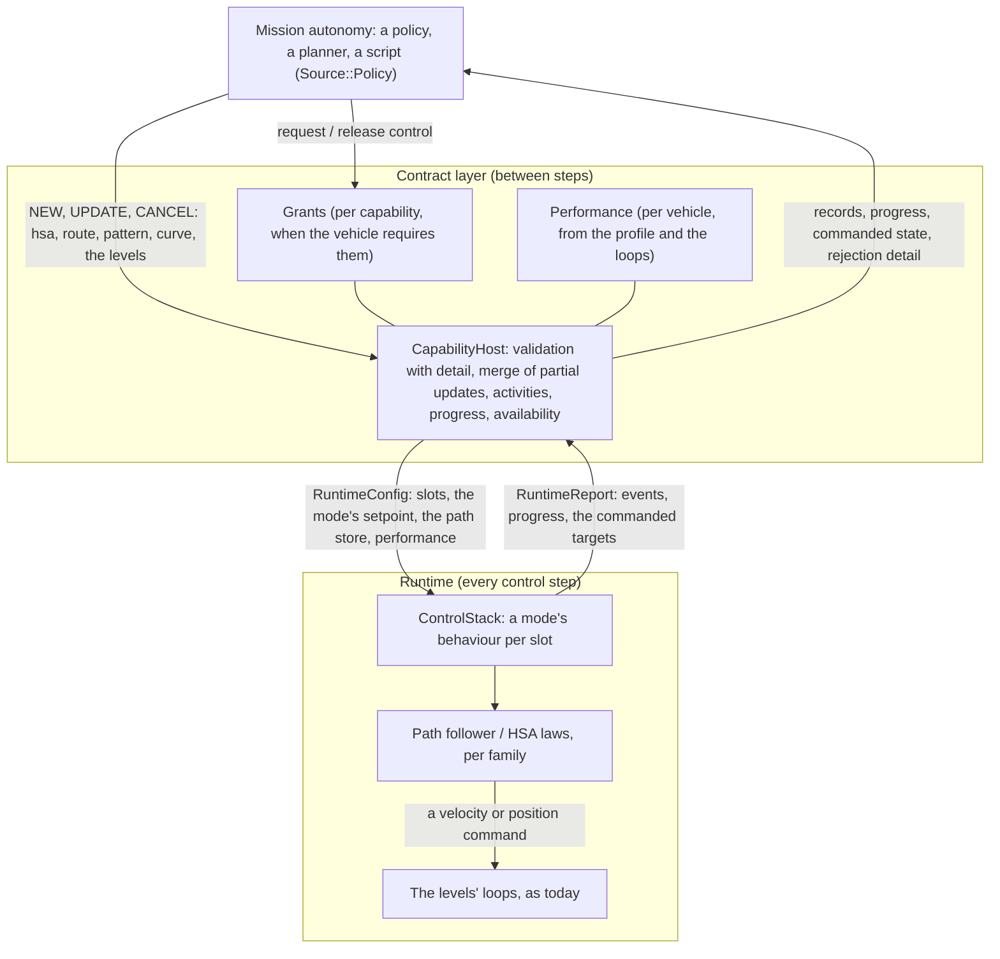

# ADR-28: The Vehicle Interface — A-GRA's flight semantics over the capability contracts

| | |
| --- | --- |
| Status | Accepted 2026-09-26. The owner read the gap analysis (section 1.2) and decided: implement the Vehicle Interface's semantics in the SDK, with authority by grants over the priorities and updatable modes with fixed-size setpoints, the rotorcraft's defects fixed first (section 2). Implemented in the order of section 12: VI-1 to VI-7, 2026-09-26 and 27 (section 15) |
| Extends | ADR-26 ([control-architecture.md](control-architecture.md)): its contract layer, runtime, boundary and gates stand. Three of its rules change: guidance may now take UPDATE (ADR-26 8.2); a vehicle may require grants before a policy commands it (ADR-26 section 5, "no consent protocol"); and under grants an UPDATE or a CANCEL declares its caller's source, which may not be below the activity's (ADR-26 10.1, section 6.1 here). ADR-27 ([rotorcraft.md](rotorcraft.md)) for the rotorcraft |
| Extended by | ADR-29 ([flight-autonomy.md](flight-autonomy.md)): complete native coverage of the Vehicle Interface's Flight Autonomy commands on all 35 aircraft; this record's deferred work (section 10) is its scope, and its discovery tells supported, not implemented, not supported and temporarily unavailable apart |
| Scope | The flight modes a mission autonomy commands a vehicle through (heading/course, speed and altitude; waypoint following; loiter patterns; curve following), what it is told back (acknowledgment detail, progress, the commanded state), how it gets and loses authority, and what it learns of the vehicle's performance and availability |
| Reference | A-GRA ASK 6.0a, the public repository open-arsenal/a-gra: the *VI L1 Interface Volume* (sections 1.1-1.4), *A-GRA_MessageDefinitions_v6_0_a.xsd* (`MA_FlightCommandMT`, `MA_FlightCommandStatusMT`, `MA_FlightActivityMT`, `MA_FlightCapabilityMT`, `MA_FlightCapabilityStatusMT`), and the *MA L1 Compliance Document* (MA-L1-013, -014, -020). Read for semantics; nothing of them is in this repository |
| Related | [sdk/control.md](sdk/control.md), [sdk/c_abi.md](sdk/c_abi.md), [sdk/python.md](sdk/python.md), [design document](FlightSim_System_Architecture_and_Design.md) §9.3 |

## 1. Context

### 1.1 Roles

A-GRA splits an autonomous aircraft into **Mission Autonomy (MA)**, which decides what to do, and **Flight Autonomy (FA)** behind a **Vehicle Interface (VI)**, which flies the aircraft safely and accepts or rejects what MA asks. Here:

| A-GRA | flightsim |
| --- | --- |
| MA | a consumer of the SDK: a trained policy, a planner, a script. Its commands have `Source::Policy` |
| FA and the VI | the platform: the contract layer (`CapabilityCatalog`, `CapabilityHost`), the runtime (`ControlStack` and its loops), the adapters and the profile |
| FA's own commands (a contingency, a take-over) | `Source::Autopilot` and `Source::Override` |
| A flight capability (`MA_FlightCapabilityMT`) | a capability descriptor (ADR-26 section 8) |
| A flight command, its status, its activity | NEW/UPDATE/CANCEL, `CommandResult`, the activity and its record |

### 1.2 What the gap analysis found (a946dfe)

The analysis traced every VI requirement to the code that implements it, and measured the modes it could find by flying them. Its full matrix is in Appendix A. In short:

| Area | At a946dfe | Gap |
| --- | --- | --- |
| Discovery, acknowledgment, the activity lifecycle, authority by priority | implemented and the best-verified part of the system | the VI's vocabulary: its mode types, its states and reasons |
| HSA/CSA | only through `hold`: true heading, true airspeed, altitude above sea level. No course, calibrated airspeed, Mach, ground speed or height above ground. A partial command loses the other targets. On a rotorcraft in wind, `hold` flies away at 7 m/s | a mode of its own |
| Waypoint following | direct to each point: 379 m off the leg in a 12 m/s crosswind, 203 m past it after a 90° turn. On a rotorcraft, a route with no speed never moves. The points are not validated | leg tracking, turn geometry, validation, progress |
| Curve following | none, and no path-following layer to build it on | all of it |
| Loiter | a circle of at least 100 m around a point, or a hover | patterns, duration, small radii |
| Authority | fixed priorities; no request, grant, revocation or control status | grants |
| Performance, availability | the envelope narrows parameters; availability is Available or, after a divergence, TemporarilyUnavailable | a performance profile; reasons; changes a consumer can see |
| Reporting | an activity's state, reason and constraint flags | rejection detail, progress, ETA, the commanded state |
| Verification | the lifecycle thoroughly; guidance hardly at all: no multi-leg route, loiter or hold test, nothing in wind, the rotorcraft absent from the random sequences | tests per mode and per vehicle class |

ADR-26 took A-GRA's principles and rejected its messaging (ADR-26 1.4, section 5, alternative A3). This record keeps that: it adds the VI's *semantics* to the SDK, and no messages.

## 2. Decisions (the owner, 2026-09-26)

| # | Decision | Consequence |
| --- | --- | --- |
| D1 | **VI semantics in the SDK.** No UCI or A-GRA messages, schemas or transport, and no claim of conformance | ADR-26's non-goal on schemas and messaging stands; a message bridge could be built on the SDK later, outside the core |
| D2 | **Grants over priorities.** A vehicle may require a policy to acquire control of a capability before commanding it; the platform approves, refuses and revokes. The priorities and the per-axis arbitration stay underneath | ADR-26's "no consent protocol" is narrowed: there is no negotiation, only a gate the platform opens and closes (section 6) |
| D3 | **Fixed-size setpoints.** The modes take UPDATE: a mode's setpoint is a fixed-size struct, and routes and curves live in storage each vehicle allocates once | ADR-26 8.2's "guidance takes no UPDATE" holds for the behaviours with heap parameters only (section 4.2) |
| D4 | **The rotorcraft's defects first**, before any new mode | step VI-1 (section 12) |
| D5 | **Relinquishing keeps the vehicle default.** A CANCEL still hands the axes to the vehicle default, neutral unless the consumer chose the hold (ADR-26 9.4). The owner did not adopt holding on relinquish | documented where CANCEL is (sections 5.5, 6.4) |

## 3. Design in one picture



The modes are guidance: a behaviour instance per activity, entering above the levels as ADR-26's behaviours do, and producing a velocity or position command for the family's loops. Nothing below the velocity level changes.

## 4. Flight modes

### 4.1 The mode capabilities

| Id | A-GRA mode | Setpoint | UPDATE | Persistence | Offered to |
| --- | --- | --- | --- | --- | --- |
| `fsim.guidance.hsa` | HSA_CSA | `HsaCommand` | merges the fields given (4.4) | persistent | every aircraft |
| `fsim.guidance.route` | WAYPOINT_FOLLOWING | `RouteCommand` + its waypoints | replaces the route | terminating: completes after the last point (unless it repeats) | every aircraft |
| `fsim.guidance.pattern` | LOITER (orbit, hold) | `PatternCommand` | merges the fields given | persistent; terminating with a duration | every aircraft |
| `fsim.guidance.curve` | CURVE_FOLLOWING | `CurveCommand` + its segments | replaces the curve, or appends to it | terminating: completes at the curve's end | every aircraft |
| `fsim.guidance.hover` (ADR-27) | LOITER (hover) | `BehaviorCommand` | no | persistent | hover-capable aircraft |

A descriptor carries its A-GRA mode (`CapabilityDescriptor::mode`, `FlightMode`), so a consumer can find the VI's modes among an aircraft's capabilities: `fsim.guidance.formation` is FORMATION, and the modes above are theirs.

### 4.2 Setpoints are fixed-size

`HsaCommand`, `PatternCommand`, `RouteCommand` and `CurveCommand` join the `Command` variant after `BehaviorCommand`. They are plain structs of doubles, as the levels' are, so an UPDATE writes them in place with no allocation. Each enters at `Level::Behavior`: `levelOf()` maps them there, and the variant's index no longer equals the level. A route's waypoints and a curve's segments do not fit a setpoint; they travel beside it (`Span<const Waypoint>`, `Span<const BezierSegment>`) and the host copies them into the vehicle's **path store**:
- one per vehicle, in `RuntimeConfig`, allocated at the first NEW that needs it with room for 256 waypoints and 32 curve segments, and never again;
- written between steps by the host, read during them by the mode's behaviour, with a revision the behaviour follows.

A guidance activity owns every primary axis (ADR-26 9.1), so at most one flies at a time and one store suffices.

The behaviours with heap parameters (`hold`, `waypoints`, `loiter`, `pursuit`, `evade`, `formation`, `aerobatics`, `hover` and a trainer's own) keep their `BehaviorCommand` and take no UPDATE, as ADR-26 8.2 says.

### 4.3 References

| Quantity | References | Notes |
| --- | --- | --- |
| Direction | heading (the nose), course (the track over the ground); true north | magnetic north is refused (`InvalidParameter`): the platform has no magnetic model |
| Speed | true airspeed, calibrated airspeed, ground speed, Mach | converted each update with the vehicle's own ratios (TAS/CAS, TAS/Mach) and its wind estimate. Speed optimisation (long-range cruise, maximum endurance) is refused: the profile has no drag polar |
| Altitude | above sea level (MSL), above ground (AGL), above the WGS-84 ellipsoid | the simulation's sea level is the ellipsoid (JSBSim), so ellipsoid and MSL are one. AGL follows the ground provider's terrain. Barometric altitude is refused |

`SpeedReference`, `AltitudeReference`, `TurnType`, `PatternKind`, `EndBehavior` and `Projection` are enums; a setpoint carries them as doubles, like every field, so that `kHold` can mean "as before".

**Wind.** Guidance estimates the wind as the ground velocity less the air velocity (true airspeed along the body's α and β, rotated to north-east-down), low-passed over 3 s, from the *sensed* state. It never reads the environment's wind.

### 4.4 HSA/CSA

```cpp
struct HsaCommand {                   // fsim.guidance.hsa
    double headingRad = kHold;        // the nose's direction, -pi..pi (from true north, or magnetic), or:
    double courseRad = kHold;         // the track over the ground's
    double speed = kHold;             // m/s, or a Mach number
    double speedReference = kHold;    // SpeedReference
    double altitudeM = kHold;
    double altitudeReference = kHold; // AltitudeReference
    double speedOptimization = kHold; // SpeedOptimization: LongRangeCruise, MaxEndurance (the speed it varies by itself)
    double directionReference = kHold; // DirectionReference: TrueNorth, MagneticNorth (ADR-29 FA-4d)
};
```

**Partial commands** (the VI's "partial HSA/CSA commands update the most recent commanded values"):
- **UPDATE:** each field given replaces the commanded one, and the rest stay as commanded. A heading replaces a course and a course a heading; a speed replaces a speed optimisation and an optimisation a speed. A new reference needs its value: a speed reference given without a speed (or an optimisation) is `InvalidParameter`, since an UPDATE has no state to take one from.
- **NEW:** fields left out continue the commanded values of a live `hsa` activity the NEW replaces; with none, they are what the vehicle flies now. The aircraft's current heading, its altitude above sea level, and its true airspeed (a wing) or its ground speed (a rotorcraft, so a hovering one stays put). A reference given alone takes the aircraft's own value in it now: a Mach reference alone holds the Mach it flies.
- The host resolves them, so the slot always holds a complete setpoint and the runtime never guesses. It checks the references are whole numbers within their enums and that one direction is given, wraps the angles, and limits the speed and altitude against the performance (7.1): the speed converted at the commanded altitude through the standard atmosphere, the altitude below the ceiling and, above ground, above it.
- **A magnetic heading or course** (`directionReference = DirectionReference::MagneticNorth`; [flight-autonomy.md](flight-autonomy.md), 4.22) is flown turned by the World Magnetic Model's declination where the aircraft is, at the world's date, refreshed every 10 s. A heading or course given alone continues the reference it replaces; a reference alone takes the heading now (in an UPDATE it needs its value).
- **A barometric altitude** (`AltitudeReference::Barometric`; [flight-autonomy.md](flight-autonomy.md), 4.20) is what the vehicle's altimeter reads, set to its QNH. It is flown on the isobar it is read on, which moves as the air and the setting change; the ceiling is checked as the altimeter would read it there. A pattern's is the same; a route's is FA-6's, refused `not_implemented`.
- **Speed optimisation** (A-GRA's SpeedOptimizationEnum; [flight-autonomy.md](flight-autonomy.md), 4.17): the speed the mode varies by itself, the performance tables' best-range speed (`LongRangeCruise`) or best-endurance speed (`MaxEndurance`).
  - The host resolves it as a speed too: the optimum's true airspeed at the altitude the aircraft flies to, as the command is given. The checks judge that speed.
  - The mode flies the optimum afresh as the altitude and the weight change, and its progress gives the speed it flies.
  - An aircraft without performance tables (a stock one) cannot fly one: `NotImplemented`, the field named, as its support table says.

**Laws** (`HsaBehavior`, by the vehicle's features):

| | Wing | Rotorcraft |
| --- | --- | --- |
| Heading | the velocity level's heading | the yaw; a ground speed is flown along the nose, an airspeed along the nose through the air |
| Course | the heading that holds it against the wind estimate (the wind correction angle), plus an integral on the course error | the ground velocity along the course, the nose along the track |
| Speed | true airspeed from the reference; a ground speed solved through the wind triangle | as ground velocity (ground speed) or airspeed |
| Altitude | a vertical speed from the altitude error at the position loop's gain, within the performance's climb and descent rates; AGL targets ride the terrain under the aircraft | the same |

### 4.5 Waypoint following

```cpp
struct Waypoint {                      // one route segment: to here from the previous point (or from where the vehicle is)
    double latitudeRad = 0.0, longitudeRad = 0.0;
    double altitudeM = kHold;          // kHold: the previous point's (the first: as now)
    double altitudeReference = kHold;  // AltitudeReference; kHold: the previous point's
    double speed = kHold;              // flown on this segment; kHold: the previous segment's (the first: as now; a rotorcraft's, its cruise)
    double speedReference = kHold;
    double turn = 0.0;                 // TurnType: 0 fly-by, 1 fly-over
    double maxBankRad = kHold;         // this segment's bank limit (A-GRA MaximumRoll)
    double climbRateMs = kHold;        // climb or descend at this rate, then level; kHold: along the path's gradient
    std::uint64_t id = 0;              // the caller's segment id, reported back
};
struct RouteCommand {                  // fsim.guidance.route; the waypoints go with it
    double projection = 0.0;           // Projection: 0 great circle, 1 rhumb line
    double repeat = 0.0;               // 1: fly the route again from its first point
    double end = 0.0;                  // EndBehavior after the last point: 0 continue, 1 loiter (a wing orbits it, a rotorcraft hovers over it)
    double start = 0.0;                // the index of the point to fly to first
};
```

- **Legs** are great circles, or rhumb lines, between the points, the first from where the vehicle is when the route starts. Cross-track and along-track distances are computed on the sphere, not a flat projection: a 100 km leg's great circle bows 165 m from a straight line at 40° north. A great circle is kept as its start's unit vector and its plane's normal (the n-vector form: Gade, 2010); a rhumb line in the Mercator projection, where it is straight.
- **Fly-by** turns begin before the point, on a circle tangent to both legs, in a plane at the point. The radius is the one the segment's bank limit (or 80 % of the performance's) gives at the faster of the two segments' planned speeds plus the wind. A turn of more than 150° is flown over. The wind is the route's behaviour's estimate when it plans: a route given before the aircraft has flown in the wind plans its turns without it.
- **Short legs.** Where the turns at a leg's two ends need more of it than it has, each is cut to its share of the leg, in proportion to its lead, on both legs it touches. The first turn is from the entry, and shares the next leg with the turn after it.
  - Under `RangePolicy::Clamp` the turns are flown smaller and the answer is clamped, naming the first point so cut.
  - Under `Reject` the route is refused `InvalidWaypoint` with that point.
  - The entry's turn is flown over when the aircraft is too near the point to make it: where the aircraft is, is no fault of the route's.
- **Fly-over** points are passed abeam, and the next leg is intercepted.
- **Vertical:** the altitude runs straight from point to point along the track: a segment runs from the middle of the turn before it to the middle of its own, where the path passes nearest its point. With a climb rate, the aircraft climbs or descends at it and then levels. A gradient steeper than the aircraft climbs (point to point, above sea level) is flown at its climb rate under Clamp, and refused `PerformanceLimit` (`MaxClimbRate`, `MaxDescentRate`) under Reject.
- **Speed** per segment, in any reference.
- **Left out:** a field continues the previous point's. The first point's is the aircraft's own now (a reference given alone, its value in that reference), and a rotorcraft given no speed flies its cruise speed over the ground. A later point that gives a reference alone is refused `InvalidWaypoint`: the previous point has no value in it to take.
- **UPDATE** replaces the route's waypoints (none given: it keeps its own) and the options it gives (`kHold` keeps one), checked as a NEW's. It flies the route afresh from `start`, from where the aircraft is. An UPDATE refused leaves the route as it was.
- **Completion** comes after the last point, unless the route repeats. Then the aircraft continues along the last leg (its course, altitude and speed), or loiters there (`end`): a wing orbits the point at the radius its speed and 80 % of its bank give, a rotorcraft stops and hovers over it.
- **As A-GRA's schema gives them** (ADR-29, [flight-autonomy.md](flight-autonomy.md) 4.29): a point's altitude block and a barometric altitude on its isobar; a waypoint (no turn there, flown over) and its type; a point in a frame, placed where the frame is and, where it moves, as the route is flown.
- **Turn points** (4.30): a capture's course, and arcs from a start turn point to the point after it (ARINC 424's radius to fix), with a course at the point and a turn's radius.
- **Loiter points** (4.31): a loiter inside the route - any pattern at the point, for its duration, laps or end time - flown where the leg meets it and left for the next point, or the route's end.
- **Segment performance** (4.32): a segment at the performance tables' best speed now, and the speed change into a segment at a given acceleration, held to what the aircraft can; its climb or descent at the most the aircraft makes holding its speed, or an efficient climb timed by its tables.
- **Required times of arrival** (4.33): a point's window, the speed scheduled over the ground to arrive in it, and the estimate against it in the progress.
- **Planned states** (4.34): places inside a segment, each with an altitude and a time; the segment flown through their altitudes, arriving at each at its time, what else the plan gives kept and read back.
- **Required navigation performance** (4.35): a segment's RNP in metres; the route farther off its path than it, its activity flagged `kActivityNavigationPerformance`.
- **Rotorcraft** fly the same geometry at the segment's speed. They slow for a turn only as much as its radius asks (a lateral acceleration within the performance's), and stop only at the route's end when they loiter there, never at each point.

### 4.6 Loiter patterns

```cpp
struct PatternCommand {                // fsim.guidance.pattern
    double pattern = kHold;            // PatternKind: 0 orbit (kHold), 1 racetrack, 2 figure-eight, 3 hold, 4 a rotorcraft's hover
    double latitudeRad = kHold, longitudeRad = kHold; // the centre; a racetrack's or a hold's fix. kHold: here
    double altitudeM = kHold, altitudeReference = kHold;
    double radiusM = kHold;            // kHold: the aircraft's turn radius at its speed and 80 % of its bank limit
    double clockwise = kHold;          // 1 right turns (the default), 0 left
    double courseRad = kHold;          // a racetrack's or a hold's inbound course; a figure-eight's axis. kHold: as now
    double legM = kHold;               // the straight legs; a hold's kHold: 60 s at or below 14,000 ft, 90 s above
    double speed = kHold, speedReference = kHold;
    double durationS = kHold;          // then it completes; kHold: until canceled
    double speedOptimization = kHold;  // SpeedOptimization, as an hsa's (4.4): a speed replaces it, it a speed
};
```

- **Orbit:** a circle around the centre; its laps are counted from where the aircraft joins it.
- **Racetrack:** two semicircles joined by legs, the inbound leg ending at the fix. Entered direct to the fix, then the turn there.
- **Figure-eight:** two circles that meet at the centre, their centres along the axis. The one ahead is flown the pattern's way round from the centre, then the other the other way; both are tangent at the centre, so the aircraft passes straight through it.
- **Hold** is the ATC holding pattern: a racetrack on the fix with the VI's defaults, entered direct to the fix:
  - right turns;
  - the inbound course the arrival's: the way to the fix when the hold starts, or the track if the aircraft is at the fix;
  - rate-one turns: 3°/s, or 25° of bank if that is less steep, at the speed plus the wind;
  - legs of a minute's flight, 90 s above 14,000 ft.
- **Defaults** for the other patterns: here, the altitude and speed the aircraft flies now (a rotorcraft's speed its cruise over the ground), right turns, its track now, and the radius its speed plus the wind and 80 % of its bank give (a rotorcraft's: 80 % of its acceleration, and a turn rate no more than a third of its velocity loop's bandwidth). A racetrack's legs are twice its radius. The host fills them in at NEW, as for an hsa, so the slot holds a complete pattern.
- **Radius:** a rotorcraft's minimum is 1 m. A wing's is its turn radius at its speed and full bank: a smaller radius is clamped, flagged, or refused under `RangePolicy::Reject` (`PerformanceLimit`, `MaxOrientation`).
- **Speed optimisation**, as an hsa's (4.4): the pattern is planned at the optimum where it orbits (its radius and legs from that speed), and flown at the optimum at the altitude and weight now.
- **UPDATE** merges the fields given, as an hsa's does; the pattern they make is flown afresh, and a duration still counts from the NEW.
- **Duration:** the activity completes when it has passed, and the aircraft flies on in the pattern.
- **Hover** (ADR-29, [flight-autonomy.md](flight-autonomy.md) 4.25): a rotorcraft's, over its point at its altitude by the position loop; its duration counts from its arrival there. It takes nothing that shapes a circuit; a wing's is refused.
- **A-GRA's orbit and hold as its schema gives them** - two circles, an inbound heading, legs by time, turns by bank, rate or type, laps, entry and exit points, a hold's entries and context, a point in a reference frame - go beside the pattern in a `PatternShape` (ADR-29, [flight-autonomy.md](flight-autonomy.md) 4.23 to 4.25).
- **Progress:** the piece flown of the lap's, the laps, and the percent of the lap (or, timed, of the duration) with the time to go.
- **Flown** by the path follower (4.8), its pieces arcs and straights in the plane at the pattern's point.

### 4.7 Curve following

```cpp
struct BezierSegment { double north[6], east[6], down[6]; }; // six control points, metres from the curve's reference
struct CurveCommand {                  // fsim.guidance.curve; the segments go beside it (World::submit and update take a Span)
    double latitudeRad = kHold, longitudeRad = kHold, altitudeM = kHold; // the reference (A-GRA CenterReference); kHold: the vehicle at NEW
    double speedMinMs = kHold, speedMaxMs = kHold; // the ground speeds to fly it within, or:
    double durationS = kHold;          // the time to fly all of it
    double end = kHold;                // EndBehavior: continue (course, speed, altitude), or loiter at its end
    double append = kHold;             // in an UPDATE, 1: these segments after the curve's end
};
```

- **Segments:** each is a quintic Bézier: the VI's six control points with weights 1 and the clamped knot vector [0,0,0,0,0,0,1,1,1,1,1,1]. A command carries 1 to 10 of them, as the VI's does, and the path store holds 32. Each starts where the one before ends (C0). `InvalidCurve`, naming the segment, refuses:
  - a gap of more than 1 m;
  - a control point not finite;
  - a segment shorter than a metre over the ground (straight up: nothing to follow);
  - more than 10, or more than the store has room for.
- **Append:** extends a live curve by UPDATE with `append` 1. The new segments keep the reference of the curve they extend, as the VI's AppendCurve does, and the first starts where the curve ends. The aircraft flies on to them, the activity the same. An UPDATE with segments and no append is a new curve, flown afresh; one with none changes how the curve is flown, not where.
- **Speed.** A range is of ground speeds:
  - A wing holds its airspeed (the one it had at the NEW) and keeps the ground speed that makes along the curve, in the wind, within the range.
  - A rotorcraft flies its ground speed (its cruise, if it was hovering) within the range.
  - A duration asks for the ground speed that covers the rest of the curve in the rest of the time, recomputed every step; its last second is flown at the pace it had. It counts from the NEW, as a pattern's does, through appends and new curves alike. A wing's airspeed then varies with the wind.
  - Without a range or a duration: the speed as now.
- **Checked** against the aircraft's performance:
  - A range is refused (or its end clamped) only where it cannot be flown: a least faster than the aircraft flies (`MaxAirspeed`), or a most slower (`MinAirspeed`). A least below its slowest, or a most above its fastest, leaves it room. The fastest is the envelope's calibrated speed and Mach at the reference's altitude, and the profile's airspeed; a duration whose speed is beyond it is refused or clamped likewise.
  - A section tighter than a wing turns at its full bank, at the fastest ground speed it will fly, is refused whatever the policy: `InvalidCurve`, with the segment, the section (`from` and `to`, its parameters) and `MaxTurnRate`. No clamp makes it flyable. That speed is its airspeed plus the wind, or its range's most, or the duration's. A rotorcraft slows for such a section instead.
  - A gradient steeper than the aircraft climbs or descends at that speed is flown at its rate (clamped) or, under Reject, refused `PerformanceLimit`, naming the segment and where on it.
- **After the end** the activity completes. The aircraft continues along the last course at its speed and altitude (`EndBehavior::Continue`), or loiters (`Loiter`): a wing orbits the end point in right turns at the radius its speed, the wind and 80 % of its bank give; a rotorcraft circles it too, at its ground speed's radius (A-GRA's CIRCULAR_LOITER; ADR-29, [flight-autonomy.md](flight-autonomy.md) 4.28). Until FA-5d3 a rotorcraft slowed in time, stopped there and hovered.
- **Progress:**
  - the segment flown, of how many;
  - the percent of the curve and of the segment;
  - the distance to go, and the time to go (a duration's own);
  - the cross-track;
  - the course, altitude and speed it commands: a wing's airspeed within a range, else a ground speed.
- **As A-GRA's schema gives them** (ADR-29, [flight-autonomy.md](flight-autonomy.md) 4.26): segments may be `NurbsSegment`s, clamped rational B-splines of 4 to 10 weighted control points and 4 to 14 knots, with a curvature and indices checked against them. A Bezier segment is one, flown as before.
- **Its reference as A-GRA's schema gives it** (ADR-29, [flight-autonomy.md](flight-autonomy.md) 4.27): the reference's altitude in a reference and within a range, or a point in a frame, carried and turned with it; the control points turned with the frame (in two dimensions or three), laid out in the plane or along great circles or rhumb lines, their third read as down, an altitude offset or the altitude itself. Where a curve is changes only with a new curve's segments.

### 4.8 The path follower

Routes, patterns and curves are sequences of pieces: great-circle or rhumb legs, circular arcs (fly-by turns, patterns), and Bézier segments. One follower flies them all:
- **Where on the path.** The nearest point, its tangent course χp and its curvature κ, and the signed cross-track distance e. Legs use closed forms on the sphere. Arcs use a plane at their centre. Béziers use Newton steps from the last parameter, moving on into the next segment past one's end, over an arc-length table built when the curve starts or grows: 32 chords a segment. The curvature ahead (κa, below) is read from the table at the distance it is wanted.
- **Lateral law.** The course to fly is χd = χp − atan(e/Δ), line-of-sight guidance with the lookahead Δ, plus the curvature's rate κ·Vg fed forward.
- **Wings** turn at ω = κa·Vg + kχ·(χd − χg) + ∫, as a turn rate at the velocity level:
  - χg is the course over the ground. kχ is the vehicle's course bandwidth (its heading loop's: section 7.1), and Δ = 3·Vg/kχ, so the track settles well outside the heading loop's own lag.
  - κa is the path's curvature the time the roll lags ahead: half the turn's bank at the attitude loop's rate (`bankRateRadS`), plus the roll's own time constant, taken as 0.2/kχ within 0.3 to 1.5 s (a design's roll loop is five times its heading loop's bandwidth, or faster). The turn begins and ends that much early.
  - ∫ is an integral on the course error once it is under 0.15 rad, its zero at kχ/4. It takes out what the turn-rate loop leaves: the c172x needs 1.5° of bank to fly straight.
  - ω so far is the track's turn rate. The velocity loop banks for a heading rate (the bank whose coordinated turn at the airspeed gives it), and in the wind the track turns at the heading's rate times Va·cos(crab)/Vg. So the feedforward and the proportional term are sent as the heading rate that turns the track at them: times Vg²/(V⃗g·V⃗a), within 0.5 to 2; 1 in calm air.
  - Recorded at VI-4: the first law fed the curvature forward where the arc begins and integrated the cross-track. The F-16C then overshot each leg by 48 m, and the c172x held a steady 15 m off its legs.
  - Recorded at VI-6: until then ω went to the loop as it was. A wing under-turned downwind and over-turned upwind: in a 12 m/s wind the c172x's 800 m orbit was 30 m off it, the F-16C's 21 m, a racetrack 15 m. Sent as a heading rate they are 4.6, 4.2 and 2.1 m (section 15).
- **Rotorcraft** fly a ground velocity along χd, at the path speed, the nose along the track:
  - Near the path the velocity is along the tangent less (kv/3)·e across it; far from it, an intercept at up to 90°, never faster than the path's speed.
  - A lead takes out the velocity loop's lag. It is the velocity error the loop's proportional term needs for the acceleration the curve asks (V²κa, κa the curvature V/kv ahead; kv the loop's bandwidth), less what the loop's own integral has taken up.
  - That integral is modelled as the loop runs it: a gain of kv²/4 that falls off beyond the error a quarter of the tilt answers. So round an orbit the lead fades, and as a turn ends it reverses.
  - An integral on the course error (commanded line of sight against the track, its zero at kv/4) takes out the rest.
  - The path speed is limited to what the curvature allows, to what slows them in time for a smaller turn, and to what stops them at a route's end where they loiter; stopped, they hold the point through the position loop. A curve's end where they loiter they pass at its pace and circle (4.28). Along a curve every section within the braking distance is sampled (25 points) for what it allows and brakes to in time.
  - Recorded at VI-5: VI-4's lead was the whole κa·V/kv. On an orbit the loop's integral takes the turn up and that lead over-leads (a UH-60A settled 21 m outside, then inside), and a lead modelled as a first-order take-up reversed too soon after a route's turns.
- **Vertical.** The altitude profile gives a vertical speed: its gradient times the ground speed, plus the altitude error at the position loop's gain, within the climb and descent limits.

### 4.9 The behaviours that stay

`hold`, `waypoints` and `loiter` stay as they are for the existing entry points and their trajectories (ADR-26 C1), with VI-1's fixes for the rotorcraft (section 12). The modes are new capabilities beside them.

## 5. Commands, activities and what they report

### 5.1 Validation and rejection detail

The VI answers a rejection with *why*: a validation result, the performance constraint, the invalid segment or section. `CommandResult` gains:

```cpp
struct CommandResult {
    ...                                   // as ADR-26 10.1
    std::int16_t index = -1;              // the field, waypoint or curve segment at fault
    Constraint constraint = Constraint::None; // the performance limit a value broke
    float from = kHold, to = kHold;       // a curve segment's section (its parameter, 0..1) that breaks it
};
enum class Constraint : std::uint8_t {    // A-GRA MA_PerformanceConstraintEnum
    None, MinAirspeed, MaxAirspeed, MinAltitude, MaxAltitude, MinAcceleration, MaxAcceleration,
    MaxOrientation, MaxOrientationRate, MaxTurnRate, MaxClimbRate, MaxDescentRate };
```

New reasons, appended to `Reason`:

| Reason | When | A-GRA |
| --- | --- | --- |
| `InvalidWaypoint` | a waypoint not finite or out of range, a leg too short for its fly-by turns (under `RangePolicy::Reject`; Clamp flies them smaller), a repeated point | INVALID_WAYPOINT |
| `InvalidCurve` | a segment count outside 1..10, a gap between segments, a curvature the aircraft cannot fly (the section named) | INVALID_CURVE |
| `PerformanceLimit` | a value beyond the performance, or a gradient steeper than the aircraft climbs, under `RangePolicy::Reject` (Clamp flies the gradient at the climb rate); a geometry no range policy can clamp (a curve's curvature) | PERFORMANCE_LIMIT_EXCEEDED + `constraint` |
| `NotGranted`, `NotAllowed`, `Revoked`, `Released`, `CollisionAvoidance`, `Restricted` | sections 6 and 7.2 | INELIGIBLE_CONTROL_SOURCE, CANCELED, CONSTRAINT_COLLISION_AVOIDANCE, CONSTRAINT_OP |

The C ABI's result gets the detail through a new call (section 9); its `reserved` field carries `index + 1`.

### 5.2 UPDATE of a mode

UPDATE writes the setpoint in place (no allocation), then bumps the slot's revision:
- **HSA and patterns** merge the fields given into the commanded setpoint (4.4).
- **Routes and curves** copy the new waypoints or segments into the path store and bump its revision. The behaviour restarts on the new route, or goes on along the extended curve.
- The values are checked as the NEW's were, with the activity's range policy.

### 5.3 Progress

```cpp
struct ActivityProgress {
    std::uint32_t segment = 0, segments = 0; // the waypoint, curve segment or pattern leg being flown, of how many
    std::uint64_t segmentId = 0;             // a waypoint's id
    std::uint32_t laps = 0;                  // a pattern's or a repeating route's
    double percent = kHold;                  // of the whole route, curve or timed pattern
    double segmentPercent = kHold;
    double distanceToGoM = kHold, timeToGoS = kHold; // to the end, at the ground speed now
    double crossTrackM = kHold;              // + right of the path
    // what the mode commands (A-GRA VehicleCommandState)
    double courseRad = kHold, headingRad = kHold, altitudeMslM = kHold, speedMs = kHold, speedReference = kHold;
};
```

- **Writing it.** A behaviour fills it through a new virtual, `Behavior::progress()`, which by default reports nothing. It keeps what it needs from its last update (a few stores); after each world step the host asks the slot's behaviour through `ControlStack::progress(slot)`, a read between steps like the report's, and keeps the answer in the activity's record. Nothing runs per control update. (Recorded at VI-2: the first design had the runtime write it into the report every update.)
- **Legacy behaviours.** `waypoints` reports its point and the distance to it; `loiter`, its laps.
- **The commanded state of any flight.** `World::commanded(vehicle)` reads the cascade's commands from the last update: the altitude, heading, speed and vertical speed at the velocity and position levels, the attitude, the rates and load factor, the throttle. It is read on demand, so it costs a step nothing.

### 5.4 The lifecycle in A-GRA's terms

| flightsim | A-GRA |
| --- | --- |
| `CommandStatus` Accepted, Rejected, Canceled | `CommandProcessingStateEnum` ACCEPTED, REJECTED, CANCELED. RECEIVED is not needed: every command is answered at once |
| `ActivityState` Pending | ENABLED |
| Active, no constraint flag | ACTIVE_UNCONSTRAINED |
| Active with `kActivityDemandLimited`, `kActivityClamped`, `kActivityAxesReduced` or `kActivityNavigationPerformance` (a route off its required navigation performance: ADR-29 4.35) | ACTIVE_PARTIALLY_CONSTRAINED |
| Active with `kActivitySaturated` or `kActivityExceeded` | ACTIVE_FULLY_CONSTRAINED |
| Completed, Failed | COMPLETED, FAILED |
| Canceled | FAILED with reason CANCELED |
| `Reason` | `CannotComplyEnum`: the table in `fsim.agra` (Python) and Appendix B |

`fsim.agra` (Python) holds these mappings and the mode types, for a consumer that speaks A-GRA's vocabulary.

### 5.5 CANCEL

Unchanged (D5): the activity ends `Canceled(Requested)` and its axes fly the vehicle default, which is the neutral command unless the consumer set `VehicleDefault::Hold`. A mission autonomy that wants the VI to carry on when it lets go sets the hold first (sdk/control.md says so where it describes CANCEL).

## 6. Authority: grants over priorities

### 6.1 Control modes

| `ControlMode` | Policy commands | Default |
| --- | --- | --- |
| `Open` | as ADR-26: any capability, arbitrated by source and axes | yes: every existing consumer and flight is unchanged |
| `Granted` | only the capabilities a grant covers; a NEW without one is `Rejected(NotGranted)`. The legacy façade is gated the same way | set per vehicle by the platform's side (`setControlMode`) |

`Autopilot` and `Override`, the platform's own sources (FA), never need a grant: FA is always the primary controller.

- **Switching to Granted** ends the policy's live activities no grant covers: `Canceled(NotGranted)`, their axes to the vehicle default.
- **The gate** comes before every other check of a NEW, whatever its range policy, and a refused NEW leaves no record. UPDATE and CANCEL need no grant: an activity that lost its grant has ended.
- **UPDATE and CANCEL declare the caller's source**, as a NEW's options do (`update(Source, activity, ...)`, `cancel(Source, activity)`; the C ABI's `_as` calls; a Python `Activity` declares the source it was submitted with). The calls without one are the policy's. Under Granted a source below the activity's may not address it: `Rejected(AuthorityHeld)`, `other` naming the activity (A-GRA's CAPABILITY_PRECEDENCE). So a policy cannot change or end what the platform flies, and FA stays the primary controller. Open is as ADR-26 10.1: any caller may address any live activity.
- **Sources are declared, not authenticated**, as in ADR-26: the platform trusts each caller to declare what it is. A mission autonomy declares `Policy`, the default of every call, and `Autopilot` and `Override` belong to the platform's own components. A consumer that declared `Override` would pass every gate: the grants order a mission autonomy that plays by the interface, they do not sandbox one.
- Recorded at the review after VI-7: CANCEL and UPDATE first carried no source, so under Granted a policy could still end or retarget an autopilot's or an override's activity.

### 6.2 Requests, releases, revocations

| Call | Effect | A-GRA |
| --- | --- | --- |
| `requestControl(vehicle, capability)` | approved (`Reason::None`) if the capability is allowed and available; else rejected with `NotAllowed` or the reason it is unavailable (`Restricted`, `CollisionAvoidance`, `Diverged`); `UnknownCapability` for one that takes no command | ControlRequest ACQUIRE → APPROVED / REJECTED |
| `releaseControl(vehicle, capability)` | the grant ends; the policy's live activities of that capability end `Canceled(Released)` | MA relinquishes control |
| `revokeControl(vehicle, capability, reason)` | the platform ends the grant; the policy's live activities of that capability end `Canceled` with the reason: `Revoked` (the default), `CollisionAvoidance` or `Restricted`. Any other is refused `InvalidParameter` and nothing changes: an end must say truly what ended it (`Preempted` names a preemptor, `Requested` is CANCEL's) | ControlRequestStatus CANCELED; Unpair |
| `setAllowed(vehicle, capability, allowed)` | whether a policy may request it (all may, by default); a grant for one no longer allowed is revoked, `Canceled(Revoked)` | C2's control designations |
| `controlStatus(vehicle, capability)` | allowed, granted; the primary controller is always the platform | ControlStatus |

Capabilities are named by id, as `capabilityStatus` names them. Release and revocation end what the policy flies of the capability whether or not it held a grant, so an Open vehicle's policy can let go the same way. Only the policy's activities end: what an autopilot or an override flies is the platform's.

A grant opens a gate and nothing more. Under it, sources and axes arbitrate as before: a live `Autopilot` activity still holds its axes against a granted policy.

### 6.3 A revision to watch

The host counts every change to the control mode, grants, allowed capabilities, availability (the platform's restrictions, and a divergence) and performance (`controlRevision(vehicle)`). A consumer polls it instead of subscribing, keeping ADR-26's "no subscriptions". A call that changes nothing - a grant already held, the same restriction again - does not count.

### 6.4 Relinquishing

Every way the policy lets go ends its activities and hands their axes to the vehicle default (D5): `releaseControl` (the policy's activities of the capability, `Released`), a revocation (`Revoked` or the platform's reason) and CANCEL (the activity it names, `Requested`; under Granted only a caller whose source is at least the activity's, 6.1). The default is neutral unless the consumer set `VehicleDefault::Hold`, which holds what the aircraft was flying for its class (5.5). Completion and preemption differ: the aircraft keeps flying the ended activity's output (ADR-26 9.4).

## 7. Performance and availability

### 7.1 Performance

The adapter computes a vehicle's `Performance` when the vehicle is created, and again when its loops or their settings change. It is what guidance plans with, what validation checks against, and what a consumer reads (A-GRA's `FlightCapabilityPerformanceProfile`):

| Field | Wing from | Rotorcraft from |
| --- | --- | --- |
| minimum, maximum calibrated airspeed; maximum Mach | the envelope; else the performance section's stall speed × 1.2 | the envelope (maximum) |
| maximum true airspeed | the performance section's (level at full power) | — |
| cruise speed (what a mode flies with no speed) | the plant's reference true airspeed; else the airspeed now | the position loop's `max_speed` × 0.5 |
| maximum ground speed | — | the position loop's `max_speed` |
| ceiling | the performance section | — |
| bank, pitch, load factor, roll rate | the envelope; else the velocity loop's `max_bank` | the envelope; the velocity loop's `max_tilt` |
| maximum acceleration, deceleration | — | g·tan(`max_tilt`); the position loop's `deceleration` |
| maximum climb, descent rate | the position loop's `max_vertical_speed` (the performance section's climb, if lower) | the position loop's `max_vertical_speed` |
| course bandwidth | the heading loop's: `heading.gain` × g / its schedule's reference speed, or / the speed it flies without a schedule | the velocity loop's `horizontal.kp` |
| bank rate (turn anticipation) | the attitude loop's `roll.max_rate` | — |
| altitude gain | the position loop's `altitude.gain` | the position loop's `altitude.gain` |

- **Derived limits.** Turn radius, turn rate, and climb gradient at a speed follow from these (`Performance::turnRadiusM(v)` and the like).
- **Per mode.** The VI gives a profile per mode; here every mode shares the vehicle's, and a mode states which fields it uses. ADR-29 FA-3c works out A-GRA's per-mode profile from it and the performance tables, at the vehicle's condition now ([flight-autonomy.md](flight-autonomy.md), 4.15).
- **Dynamic.** It is recomputed on a change, with a new revision (6.3). Configuration-dependent limits (flaps, gear) stay protection's, as ADR-26 11 has them.
  - The stack counts the changes made through it to its loops (`ControlStack::loopsRevision`): `use`, `setControllerSettings`, and `setParameter`, which the C ABI's and Python's parameter calls go through.
  - The host recomputes when that count moves: after each world step, before it checks a command, and when the performance or the revision is asked for. A change that leaves every field as it was makes no new revision.
  - A caller that sets a controller's parameter on the controller itself is not counted.

### 7.2 Availability

| Source | Availability, reason |
| --- | --- |
| a diverged vehicle | TemporarilyUnavailable, `Diverged` (as ADR-26) |
| the platform restricts a capability: `setAvailability(vehicle, capability, availability, reason)`, e.g. FA's collision avoidance | the given state and reason - `Restricted` (if it gives none), `CollisionAvoidance` or `Unavailable`; any other is refused `InvalidParameter` - which `capabilityStatus` reports. A policy's NEW, and a request, are refused with that reason, so a consumer learns why (`CollisionAvoidance` is A-GRA's CONSTRAINT_COLLISION_AVOIDANCE). The platform's own sources are not stopped: they fly the avoidance. Live activities go on, taking UPDATEs, until the platform preempts them (an `Override` manoeuvre). `Available` lifts it |
| a mode whose loops the aircraft lacks | absent from the catalog |

Every change bumps the revision.

## 8. Boundary, threads, allocation

ADR-26's rules B1-B8 hold, with these additions:
- **`RuntimeConfig`** gains the path store (a pointer, allocated at the first route or curve NEW) and `Performance`. The store holds the waypoints as the host completed them; the plan made from them (legs, turns) is the behaviour's.
- **Progress** is asked of the slot's behaviour by the host after each world step (`ControlStack::progress`, read-only, between steps), so the report does not grow.
- **`ControlContext`** gains `features` (the vehicle's Feature bits) and `guidance` (its performance and path store), for behaviours. Both are trailing members with defaults, so existing initialisers keep compiling.
- **`Behavior`** gains `begin(ctx, const Command&)`, which the runtime calls first, and `progress()`. `begin()`'s default calls the old `start(ctx, const BehaviorCommand&)` with a `BehaviorCommand`, so existing behaviours are unchanged. (A second `start` overload would have hidden the first in every behaviour that overrides one, which `-Woverloaded-virtual` refuses.)
- **B2, the fast path:** UPDATE of a mode merges or copies in place, with no allocation, strings or virtual calls; so does a route or curve UPDATE within the store's capacity. The allocation gate gains HSA and pattern updates every step, and a route replaced every step.
- **B5:** the modes' behaviours allocate nothing while flying: their geometry lives in fixed arrays allocated with them at NEW (a route's plan, about 72 KB). The host checks a route with a plan of its own, allocated at the vehicle's first route and kept, so a route's UPDATE allocates nothing.
- **Determinism:** the modes read only the state, the setpoint, the store and the performance, so trajectories stay independent of the worker count.

## 9. SDK surfaces

| C++ (`World`, `Vehicle`) | C ABI 1.6 | Python |
| --- | --- | --- |
| `submit(HsaCommand)`, `submit(PatternCommand)`; `update(activity, …)` | `fsim_vehicle_submit_mode(world, id, FSIM_MODE_HSA / _PATTERN, fields, count, options, result)`; `fsim_activity_update` takes a mode's fields | `Vehicle.submit_hsa(**fields)`, `submit_pattern(**fields)`; `Activity.update(**fields)` merges |
| `submit(RouteCommand, Span<const Waypoint>)`, `update(activity, RouteCommand, Span<const Waypoint>)` | `fsim_vehicle_submit_route`, `fsim_activity_update_route` (`fsim_waypoint[]`) | `submit_route(waypoints, **options)`, `Activity.update_route` |
| `submit(CurveCommand, Span<const BezierSegment>)`, `update(…)` | `fsim_vehicle_submit_curve`, `fsim_activity_update_curve` | `submit_curve(segments, **options)`, `Activity.append(segments)` |
| `ActivityRecord::progress`; `commanded(vehicle)` | `fsim_activity_get_progress`, `fsim_vehicle_commanded` | `Activity.progress`, `Vehicle.commanded` |
| `CommandResult::index`, `constraint`, `from`, `to` | `fsim_command_result.reserved` = index + 1; `fsim_last_command_detail` | `Rejected.index`, `.constraint`, `.section` |
| `performance(vehicle)`, `controlRevision(vehicle)` | `fsim_vehicle_performance`, `fsim_vehicle_control_revision` | `Vehicle.performance`, `.control_revision` |
| grants and availability (section 6, 7.2): `setControlMode`, `requestControl`, `releaseControl`, `revokeControl`, `setAllowed`, `controlStatus`, `setAvailability` | `fsim_vehicle_set_control_mode`, `_request_control`, `_release_control`, `_revoke_control`, `_set_allowed`, `_control_status`, `_set_availability` | `Vehicle.set_control_mode`, `request_control` (raises `Rejected`), `release_control`, `revoke_control`, `set_allowed`, `control_status`, `set_availability` |
| UPDATE and CANCEL declaring the caller's source (6.1): `update(Source, activity, ...)`, `cancel(Source, activity)` | `fsim_activity_update_as`, `_update_route_as`, `_update_curve_as`, `fsim_activity_cancel_as` | `Activity.source`, declared by its `update`, `update_route`, `update_curve`, `append` and `cancel` |

The C ABI changes additively only (ADR-26 C3): new calls, new structs with a `struct_size`, new enum values.

## 10. Non-goals and deferred work

| Not done | Why | Revisit when |
| --- | --- | --- |
| UCI/A-GRA messages, the XSD, a transport, RECEIVED, heartbeats | D1 | an external MA must connect: a bridge over the SDK, outside the core |
| Ranking, `InterruptOtherActivities`, start/end time windows | sources decide precedence; no plan engine (ADR-26 5) | a plan layer is built |
| Stored route plans, their activation and query (A-GRA's route plan package) | a route travels with its command, as the VI's waypoint following does | a plan layer is built |
| Validation against geofences, terrain, traffic, endurance | no such models in the platform | the platform models them |
| Magnetic headings, barometric altitudes, speed optimisation | no magnetic model, altimeter setting or drag polar | a consumer needs them and the data exists |
| MUST_FLY, ALTITUDE_STACKED_MARSHALL, LAUNCH, RECOVERY, ROUTE_INTERCEPT, formation templates, taxi routes, conditional path branches | beyond the VI's three flight modes and loiter | asked for |
| Contingencies (failsafe plans, fault reports) | no fault model | effects model faults |
| Holding on relinquish | D5 | the owner asks |

## 11. Compatibility

- **C1, flight.** Every existing flight is bit-identical: the control digests equal step 5b's, with protection on and off. VI-1 changes flight only for rotorcraft on `hold`, `waypoints` and `loiter`, where it was wrong.
- **C2, the C++ SDK:** additions only. New virtuals change vtables; plugins rebuild, as for any SDK release. `Command` gains alternatives, so a `switch` on `index()` or a `std::visit` over it must handle them. The platform's own do.
- **C3, the C ABI:** additive, 1.6. `fsim_command_result.reserved` becomes the rejection's index + 1, 0 as before when there is none.
- **C4, determinism:** the same seed and calls give the same trajectories, ids and answers.
- **C5, performance:** ADR-26's gates (12.4) hold for every existing case. The new cases' costs are recorded.

## 12. Migration order

Each step ships as commits on main with its tests, benchmark numbers (section 15) and documentation, and changes no existing flight unless it says so.

**VI-1: the rotorcraft's defects, and the tests the analysis found missing.**
- *Scope:*
  - `ControlContext::features`;
  - `waypoints` on a hover-capable vehicle flies its loops' own speed when given none;
  - `hold` on a hover-capable vehicle holds its ground velocity, not the airspeed along the nose;
  - `loiter`'s minimum radius is 1 m for a rotorcraft (100 m stays a wing's);
  - route points validated (finite, in range, a positive capture radius: `InvalidParameter` with the point);
  - Python's `Activity.update` on a behaviour answers `not_updatable`.
- *Tests:*
  - multi-leg routes (c172x, uh1h, iris);
  - `hold` converging on heading, altitude and speed, in a crosswind;
  - a rotorcraft's `hold` in wind;
  - loiter orbits (c172x; a rotorcraft at a small radius);
  - the helicopter and multirotor adapters in the random-sequence conformance;
  - a rotorcraft's airspeed along the nose;
  - Python's UPDATE of a behaviour.
- *Exit criteria:* digests identical for every fixed-wing flight; the rotorcraft suite as before; the new tests green.

**VI-2: what a consumer is told.**
- *Scope:*
  - rejection detail (5.1): `CommandResult` fields, `fsim_last_command_detail`, Python;
  - `Behavior::progress()`, `ActivityProgress` in the report and the record, `waypoints`' and `loiter`'s progress;
  - `commanded(vehicle)`;
  - the C ABI and Python for both;
  - `CapabilityDescriptor::mode`;
  - `fsim.agra`'s mappings.
- *Tests:* progress monotonic and in range through conformance; detail consistent with reasons; the ABI and Python round trip.
- *Exit criteria:* digests identical; allocation gate green.

**VI-3: HSA/CSA.**
- *Scope:*
  - `HsaCommand` in the variant;
  - `fsim.guidance.hsa`, with the host's merge and inheritance;
  - `Performance` and `ControlContext::guidance`;
  - `HsaBehavior` for wings and rotorcraft;
  - the wind estimate, the speed and altitude references;
  - the C ABI and Python.
- *Tests*, for the c172x, a direct design, a fly-by-wire design, a helicopter and a multirotor:
  - heading and course held within 2° in a 12 m/s crosswind;
  - altitude within 15 m;
  - speed within 1 m/s in each reference;
  - a partial UPDATE keeps the rest;
  - a NEW inherits;
  - AGL over a sloping ground provider;
  - determinism.
- *Exit criteria:* the tests; digests identical; allocations none for an HSA updated every step.

**VI-4: the path follower and waypoint following.**
- *Scope:*
  - `RouteCommand`, `Waypoint`, the path store;
  - the follower (4.8), great-circle and rhumb legs, fly-by and fly-over;
  - the vertical and speed profiles;
  - validation per waypoint with the detail;
  - progress;
  - UPDATE;
  - the C ABI and Python.
- *Tests:*
  - routes for the five aircraft of VI-3, with and without a 12 m/s crosswind;
  - every point captured;
  - cross-track within a bound per class once on a leg (a wing within 50 m);
  - a fly-by's overshoot within its turn radius;
  - a rotorcraft through its turns without stopping;
  - rejections with the right waypoint;
  - an UPDATE mid-route.
- *Exit criteria:* the tests; digests identical; no allocations for a route updated every step.

**VI-5: loiter patterns.**
- *Scope:* `PatternCommand`, the four patterns on the follower, the hold's defaults, duration, laps.
- *Tests:* each pattern's track against its geometry per class; the defaults; a rotorcraft's small orbit.

**VI-6: curve following.**
- *Scope:*
  - `CurveCommand`, `BezierSegment`, the Bézier pieces;
  - traversal by speed range or duration;
  - append;
  - the end behaviours;
  - validation by section;
  - status.
- *Tests:*
  - tracking error bounds per class;
  - the section named when a curve is too tight;
  - appending while flying;
  - a duration met within 5 %.

**VI-7: grants, performance, availability.**
- *Scope:*
  - control modes, requests, releases, revocations, allowed capabilities and status;
  - `Performance` in the SDK;
  - `setAvailability` and its reasons;
  - the control revision;
  - the C ABI and Python.
- *Tests:* grant sequences checked against the rules, as conformance checks the lifecycle; a revoked policy's activity ends and its NEWs are refused; the performance against the profile.

## 13. Alternatives considered

| # | Alternative | Outcome |
| --- | --- | --- |
| A1 | A new cascade level for the modes | Rejected. The modes have the lifecycle of behaviours: an instance per activity, a start, completion and failure. A level has one instance per vehicle, and its commands would merge per axis, which a route does not |
| A2 | A fixed block of numbers inside `BehaviorCommand` for updatable behaviours | Rejected: two parameter mechanisms in one struct, and nothing typed for a consumer |
| A3 | The route inside its setpoint | Rejected: a 256-point setpoint would make every slot, merge buffer and copy 25 KB |
| A4 | L1 guidance (Park, Deyst and How, 2004) instead of line of sight with curvature feedforward | Kept for reference. Line of sight takes its gains from the course bandwidth the loops already have, and follows arcs and Béziers without a steady error |
| A5 | A message bridge now | Not decided (D1) |
| A6 | Hold on relinquish | Not adopted (D5) |

## 14. Consequences

- **Benefits.** A mission autonomy flies the VI's modes on every aircraft the platform has, is told why a command fails and how far an activity has got, and gets and loses authority as the VI describes. The rotorcraft fly guidance correctly.
- **Costs.** Four more command types; per vehicle that flies a route or curve, a path store (25 KB: 256 waypoints and 32 segments), two route plans, the host's and the behaviour's (about 72 KB each), and two curves with their length tables (about 13 KB each); new C ABI calls; a guidance layer to keep tuned per family.
- **Risks.**

| Risk | Mitigation |
| --- | --- |
| Guidance laws that suit one aircraft and not another | gains from each vehicle's own loops (7.1); tests per class |
| The modes' reporting costs every vehicle | progress is written only by modes; the commanded state is read on demand |
| A-GRA vocabulary drifting from ours | the mapping tables (5.4, Appendix B) and `fsim.agra` in one place |

## 15. Measurements

Filled in as the steps land. The machine and the benchmark's precision are ADR-26's (its section 17).

**VI-1 (the rotorcraft's defects).**
- **Digests:** every flight of the digest set identical to step 5b, with protection on and off. The fixes act only on vehicles that hover.
- **Routes given no airspeed**, square, from a settled hover:
  - the IRIS's 30 m legs flown in 18 s, the Crazyflie's 3 m legs in 33 s;
  - the UH-1H's and UH-60A's 400 m legs in 81 s and 69 s.
  - Before, the IRIS moved 0.0 m in 60 s and the UH-1H 2.0 m in 120 s.
- **`hold` in wind**, from a settled hover, over 30 s:
  - the IRIS within 0.03 m (a 5 m/s wind; it went 204 m before);
  - the UH-60A within 1.4 m and the UH-1H within 15 m (5 m/s; the UH-1H's velocity loop is the slower to take the wind out);
  - the Crazyflie within 2.4 m (1 m/s).
- **`loiter`:** a 20 m orbit flown by the IRIS at 19.0 m, a 2 m one by the Crazyflie at 2.0 m, the c172x's 800 m at 765 m.
- **Conformance:** the random sequences now run the helicopter (UH-1H) and multirotor (IRIS) adapters too, with the same required coverage: every edge of the lifecycle and every answer.
- **Tests:** `tests/test_guidance.cpp`:
  - a wing's three-leg climbing route;
  - rotorcraft routes given no airspeed;
  - `hold` to a heading, altitude and airspeed in a 12 m/s crosswind;
  - rotorcraft `hold` in wind;
  - loiter radii, a rotorcraft's airspeed along its nose;
  - route validation.

  Also two Python cases: a behaviour's UPDATE refused `not_updatable`, and route points checked. ctest 161/161.

**VI-2 (what a consumer is told).**
- **Digests:** identical to step 5b, protection on and off.
- **Allocations:** none; the host's reading of progress after each step included.
- **Cost:** interleaved A/B against VI-1 (5 rounds). Every update case is within ±2.2 %: `waypoints` and `loiter` at +0.5 %, from a few stores per update for their progress. The progress itself is computed between steps, only for guidance activities.
- **What it adds:**
  - rejection detail on every answer (the field, route point or curve segment; the performance limit), with the flight capabilities' ranges saying which limit each breaks;
  - `ActivityProgress` from `waypoints`, `loiter`, `hold` and `hover`;
  - `ControlStack::commanded()` and `Vehicle::commanded()`;
  - `FlightMode` on descriptors (formation, hover);
  - the nine reasons of 5.1;
  - C ABI 1.6 (`fsim_last_command_detail`, `fsim_activity_get_progress`, `fsim_vehicle_commanded`, `fsim_vehicle_capability_flight_mode`, and the result's index);
  - Python's `Rejected.index`, `.constraint` and `.section`, `Activity.progress`, `Vehicle.commanded`, `Capability.mode`, and `fsim.agra`.
- **Tests:**
  - `tests/test_interface.cpp`: detail for a level, a design's envelope and a route; a route's progress point by point to completion; loiter laps; hold targets; the commanded state; modes;
  - the C ABI test, and a Python case;
  - conformance now checks every record's progress is within its bounds.

  ctest 166/166.

**VI-3 (HSA/CSA).**
- **What was built:**
  - `HsaCommand` joins the `Command` variant after `BehaviorCommand`. `levelOf()` maps it to `Level::Behavior`, and `modeBehavior()` names the behaviour that flies it, `hsa`.
  - `Behavior::begin(ctx, const Command&)` is what the runtime calls first; by default it calls the old `start()` with a `BehaviorCommand`.
  - `SetpointKind` on descriptors and behaviour traits: a behaviour registered with a mode's setpoint becomes a capability that takes UPDATE.
  - `Performance` from each family's adapter (`VehicleAdapter::performance`), kept by the host and handed to behaviours through `ControlContext::performance`.
  - `HsaBehavior` (`fsim/GuidanceModes.h`, `src/control/Guidance.cpp`) with the wind estimate and the references; `src/control/Atmosphere.h` for the standard atmosphere.
  - A stand-alone `ControlStack` flies a mode too: its `command()` installs the mode's behaviour, and merges a repeated one.
- **Flown**, in a 12 m/s crosswind from the east, after 150 s (`tests/test_modes.cpp`):

  | | heading 180° (TAS) | course 180° (TAS) | course 0°, ground speed | CAS as now | altitude +100 m |
  | --- | --- | --- | --- | --- | --- |
  | c172x | 181.6° (its heading loop's steady error) | 180.0° | 55.00 m/s of 55 | 51.19 of 51.14 | 1600 of 1600 |
  | B-52H | 180.0° | 180.1° | 180.00 of 180 | 156.77 of 156.77 | 3109 of 3100 |
  | F-16C | 180.0° | 180.2° | 159.99 of 160 | 139.05 of 139.05 | 3101 of 3100 |

  The F-16C holds Mach 0.70 at 6500 m, the B-52H Mach 0.65. In a 5 m/s wind from the west the rotorcraft:
  - hover facing east: the IRIS within 5.7 m, the UH-60A within 4.3 m and the UH-1H within 13 m over 60 s;
  - hold a 45° course at the ground speed asked (iris 5.00, UH-1H 20.07, UH-60A 20.00 m/s), their noses along it;
  - with an airspeed, turn into the wind to keep the course (the UH-60A's nose at 34.8° for a 45° track at 20 m/s);
  - along the nose at an airspeed, drift with the wind as a heading should.
- **Semantics tested:**
  - an UPDATE of the altitude alone keeps the heading and speed commanded;
  - a NEW with a speed alone continues the live hsa's heading and altitude and preempts it;
  - a course replaces a heading;
  - a reference alone is refused in an UPDATE and holds the aircraft's own value in a NEW;
  - AGL over ground rising 2 % to the east: within 20 m of 400 m while it climbs 150 m with it;
  - refused or clamped: both directions, a fractional reference, faster than the F-16C flies (446 m/s), above its ceiling, below the ground, slower than the B-52H's 1.2 times its stall speed, and a `BehaviorCommand` naming `hsa`.
- **Conformance:** every aircraft offers `fsim.guidance.hsa`, and it goes through NEW, UPDATE and CANCEL as its descriptor says. The random sequences submit and update it on all five adapters.
- **Digests:** identical to step 5b, protection on and off. **Allocations:** none, with an HSA's heading updated every step on 16 vehicles.
- **Cost:** an HSA update is 127 ns (a course with its wind triangle over the velocity level's 64). Every existing case is within ±2.4 % of VI-2 (interleaved A/B, 5 rounds).
- **SDK:** C ABI `fsim_vehicle_submit_mode(FSIM_MODE_HSA)`, `fsim_mode_field_count`, `fsim_speed_reference`, `fsim_altitude_reference`; `fsim_activity_update` merges. Python `Vehicle.submit_hsa(**fields)`, `SpeedReference`, `AltitudeReference`, `MODE_FIELDS`. ctest 171/171.

**VI-4 (the path follower and waypoint following).**
- **What was built:**
  - `RouteCommand`, `Waypoint`, `TurnType`, `Projection` and `EndBehavior` (`fsim/Control.h`). `RouteCommand` joins the `Command` variant after `HsaCommand`, flown by the `route` behaviour.
  - The vehicle's `PathStore` in `RuntimeConfig`, read through `ControlContext::path`, and `SetpointKind::Route`.
  - The geometry (`src/control/Route.h`, `.cpp`): legs as n-vectors or Mercator lines, arcs in their waypoint's plane, the completion of what points leave out, the plan and its short-leg shares.
  - `RouteBehavior` (`fsim/GuidanceModes.h`), the path follower of 4.8.
  - The host's `checkRoute` (completion, limits, plan, turns that fit, gradients); `limitHsa` became `limitFlight`, shared with the waypoints.
  - `World::submit(RouteCommand, Span<const Waypoint>)` and `update(activity, RouteCommand, Span<const Waypoint>)`; `ControlStack::command(RouteCommand, Span)` for a stack on its own.
  - `Performance::bankRateRadS`. The internal `session::World::performance(id)` (the SDK's is VI-7's).
- **Flown** (`tests/test_routes.cpp`): a route of 5R legs, R the turn radius the route plans with: a 90° fly-by left, one right, 51° right, 78° right flown over, and on. The most cross-track in the middle of the legs after the first turn (the one after the fly-over is an intercept), the most on the turns, and each class's bound:

  | | calm: legs / turns | 12 m/s crosswind: legs / turns | bound on a leg |
  | --- | --- | --- | --- |
  | c172x (R 425 m, 630 in wind) | 14.4 / 14.9 m | 8.6 / 12.1 m | 50 m |
  | B-52H (R 7.4 km, 8.4) | 10.6 / 41.3 m | 12.5 / 34.3 m | 50 m |
  | F-16C (R 2.3 km, 2.7) | 7.3 / 11.6 m | 13.2 / 24.0 m | 50 m |
  | UH-60A (R 140 m, 20 m/s over the ground) | 4.8 / 11.3 m | 10.8 / 12.2 m | 15 m |
  | IRIS (R 6 m, 5 m/s; 5 m/s wind) | 0.4 / 1.1 m | 1.1 / 1.7 m | 3 m |

  - Each passes its fly-by points where its arc does: R (1/cos(a/2) − 1), within 8 % of R. For the B-52H that is 3107 m of 3074; for the IRIS, 4 m of 2.5.
  - Each passes its fly-over point within 6 m.
  - The rotorcraft keep 19.2 of 20 m/s and 4.2 of 5 through the turns.
- **Profiles** (a c172x):
  - altitudes at the points 1600, 1699 and 1899 m, of 1600, 1700 and 1900;
  - a 2 m/s climb flown at 1.99;
  - a calibrated 50 m/s flown at 49.95, a ground speed of 60 at 60.95;
  - a point 1000 m up and 2 km away is refused (`performance_limit`, `max_climb_rate`, point 0), or clamped and climbed at its best rate.
- **Projections** (two F-16Cs, 120 km east along 60° north):
  - the great circle's aircraft goes 489 m north (489 by L² tan φ / 8R), 0.6 m off the circle, its track turning from 89.2° to 90.9° as the meridians close;
  - the rhumb line's stays within 0.2 m of its parallel.
- **Ends:**
  - a repeating triangle flies 5 laps in 900 s and never completes, its distance to go NaN;
  - a c172x that loiters orbits its last point at 411 to 415 m (R 425);
  - an IRIS stops over its last point within 0.01 m;
  - a UH-60A continues north (the last leg's course) at its cruise speed, 15 m/s, which it had been given by default.
- **Semantics tested:**
  - progress point by point (the segment, its id, percent and distance to go monotonic, the time to go at the ground speed, 100 % and 0 m at completion);
  - an UPDATE mid-route flown from where the aircraft is, the same activity;
  - a refused UPDATE (a NaN point, index 1) leaving the route flying;
  - an UPDATE of the options alone flying the same waypoints from point 2;
  - rejections naming the point: none, 257, NaN, a latitude beyond the pole, a fractional turn or reference, a negative speed, a bank beyond 90°, a zero climb rate, the same place twice, a reference alone after the first point; the options (a projection 2, a repeat 0.5, an end 3, a start beyond the route, a repeat of one point);
  - the aircraft's limits (a speed, a ceiling, a bank, a climb rate, a rotorcraft's ground speed);
  - a 300 m leg between two 90° turns: refused at point 0 under Reject, clamped under Clamp, fine when both points are flown over.
- **Tuning found:**
  - the turn anticipated by the roll's lag cut the F-16C's leg error from 48 m to 3 m;
  - the course-error integral removed the c172x's 15 m bias;
  - the entry turn sharing the leg after the start (at first it was left out of the shares, and flown over).
- **Conformance:**
  - `fsim.guidance.route` goes through NEW, UPDATE and CANCEL as its descriptor says, on every aircraft;
  - the random sequences submit and update routes with their waypoints (5 % of points invalid) on all five adapters;
  - `invalid_waypoint` is now a required answer.
- **Digests:** identical to step 5b, protection on and off. **Allocations:** none, with a route replaced every step on 16 vehicles.
- **Cost:** a route update on a leg is 190 ns (its follower's ~125 ns over the velocity level's 65). Every existing case is within ±3.0 % of VI-3 at the median and ±1.6 % at the minimum (interleaved A/B, 5 rounds).
- **SDK:**
  - C ABI: `fsim_waypoint`, `fsim_waypoint_init`, `fsim_vehicle_submit_route`, `fsim_activity_update_route`, `FSIM_MODE_ROUTE`, `fsim_turn_type`, `fsim_projection`, `fsim_end_behavior`. A waypoint array is read at its first element's `struct_size`, so an older header's works.
  - Python: `Vehicle.submit_route(waypoints, **options)`, `Activity.update_route`, `Waypoint`, `TurnType`, `Projection`, `EndBehavior`.
  - `examples/python/vehicle_interface.py` flies a c172x's triangle, an F-16C's climb, fly-over and orbit, a UH-60A that stops at its end and an IRIS square, for the viewer.
  - ctest 178/178.

**VI-5 (loiter patterns).**
- **What was built:**
  - `PatternCommand` and `PatternKind` join the `Command` variant after `RouteCommand` (`SetpointKind::Pattern`, `modeBehavior()` "pattern"). An UPDATE merges the fields given (`mergePattern`).
  - `PatternBehavior`, and the pattern's geometry: straights and arcs in the plane at its point (`route::Line`, `route::Pattern`), and `route::completePattern` for its defaults, used by the host and by a stack on its own.
  - The follower's law is now one function (`route::follow`) that routes and patterns share, with the ahead, steer and trims structs. A refactor that left every route's flight bit for bit as it was.
  - The rotorcraft's lead models the velocity loop's own integral, and a course integral took its place beside it (4.8). Routes changed with it:
    - the UH-60A's legs 7.9 m (4.8 at VI-4) and its turns 9.6 m (11.3);
    - the IRIS's legs 0.9 m (1.1) and its turns 1.4 m (1.7).
  - The host's `checkPattern` and `limitPattern`: a radius no tighter than the full bank flies.
  - `kMaxCommandFields` (16) where a command's fields were 8 at most; the C ABI and Python read 16 values.
- **Flown** (`tests/test_patterns.cpp`), for one lap after one and a half, the most off the circle, both ways round:

  | | calm | 12 m/s wind |
  | --- | --- | --- |
  | c172x, R 800 m | 1.3 m | 30.2 m |
  | B-52H, R 9 km | 5.6 m | 10.7 m |
  | F-16C, R 4 km | 4.2 m | 21.4 m |
  | UH-60A, R 150 m | 1.4 m | 6.6 m |
  | IRIS, R 10 m (5 m/s wind) | 0.01 m | 0.76 m |
  | IRIS, R 2 m at 1 m/s | 0.00 m | — |

- **Shapes** (c172x in an 8 m/s wind, measured against their geometry):
  - a racetrack (R 800 m, 4 km legs) within 15 m;
  - a hold from its defaults (inbound 90.1° the way it arrived, R 1161 m from rate one at 52.8 m/s plus the wind, 3167 m legs) within 7 m;
  - a figure-eight (R 700 m) within 21 m, through its centre within a metre;
  - an IRIS's 20 m racetrack with 5 m turns within 0.5 m.
- **Semantics tested:**
  - a 90 s orbit completes at 90 s (percent and time to go along the way), an UPDATE of its radius alone keeping the rest;
  - refusals naming the field: a pattern 4, a latitude without a longitude, a clockwise 0.5, legs below 0, a duration of 0, a reference alone in an UPDATE;
  - a radius tighter than the c172x's full bank refused (`max_orientation`) or clamped;
  - discovery: LOITER on every aircraft, taking UPDATE, twelve parameters.
- **Conformance:** the random sequences submit and update patterns (enums mostly whole, fields about the flight, now and then one out of range) on all five adapters.
- **Digests:** identical to step 5b, protection on and off. **Allocations:** none, with a hold's radius updated every step on 16 vehicles.
- **Cost:** a racetrack's update 178 ns. Every existing case within ±3.0 % of VI-4 (the minima ±1.1 %). A route's is 198 ns (190 at VI-4): the follower is now a call.
- **SDK:** C ABI `FSIM_MODE_PATTERN` (12 fields), `fsim_pattern_kind`; Python `Vehicle.submit_pattern(**fields)`, `PatternKind`, `MODE_FIELDS["pattern"]`. The example adds a Cessna holding over a fix from the defaults alone. ctest 181/181.

**VI-6 (curve following).**
- **What was built:**
  - `BezierSegment` and `CurveCommand` join the `Command` variant after `PatternCommand` (`SetpointKind::Curve`, `modeBehavior()` "curve"). The path store holds 32 segments beside its waypoints, with a generation that a new curve bumps and an append does not.
  - The geometry (`src/control/Route.h`):
    - the Bernstein sums with their first and second derivatives, and the curvature and gradient over the ground;
    - length tables of 32 chords a segment;
    - the nearest point by Newton steps, moving on into the next segment;
    - a segment's first section tighter than a limit, and its steepest gradient;
    - the curvature ahead, read from the tables;
    - a rotorcraft's speed limit along a curve: every section within its braking distance, sampled.
  - `CurveBehavior`: a new curve is flown afresh, appended segments flown on to. Its pace is a wing's airspeed within the range, a rotorcraft's ground speed, or a duration's ground speed; then the ends.
  - The host's `checkCurve`, `checkCurveOptions`, `limitCurveSpeeds`, `fastest()` and `writeCurve`. `World::submit(CurveCommand, Span<const BezierSegment>)` and `update(activity, CurveCommand, Span<const BezierSegment>)`; `ControlStack::command(CurveCommand, Span)` for a stack on its own.
  - The follower sends a wing's turn rate as the heading rate that turns its track at it (4.8).
  - Two fixes found by flying the example:
    - A timed curve's last second is flown at the pace it had. Before, the speed shrank with what was left, and an IRIS that was to stop at its end never reached it.
    - An activity's cross-track stays, past its end, what it was there. Before, a route or a curve that ended by loitering reported the orbit's radius: the host reads progress when the world step ends, some control updates later.
- **Flown** (`tests/test_curves.cpp`): an S of six quintic Hermite segments from where the aircraft is, flying east. A straight lead of 2R, then a period over which the curvature runs κ sin 2πu, turning 100° right and 100° left, its tightest a quarter wider than R, climbing; a tail of 1.5R. R is a wing's planning radius at its speed plus 12 m/s, a rotorcraft's given. Off the S (past its lead), measured against the Béziers evaluated by de Casteljau's construction:

  | | climb | calm | 12 m/s crosswind |
  | --- | --- | --- | --- |
  | c172x, R 630 m | 100 m | 4.7 m | 7.4 m |
  | B-52H, R 8.4 km | 100 m | 4.3 m | 4.7 m |
  | F-16C, R 2.7 km | 100 m | 5.4 m | 10.4 m |
  | UH-60A, R 150 m at 20 m/s | 20 m | 7.4 m | 11.9 m |
  | IRIS, R 20 m at 4 m/s (5 m/s wind) | 3 m | 0.0 m | 0.2 m |

  - Heights within 6 m of the curve's, except the B-52H's 17 m.
  - Each completes at its end, through its six segments in order, its percent never going back. The cross-track it reports is what the test measures.
  - The first metres of a lead are the worst: the course integral builds up the bank a c172x needs to fly straight (9.5 m calm, 22.6 m in the wind, at 630 m along its lead).
- **Pace:**
  - a c172x meets a duration in a 10 m/s wind: 123 s of 123 (−0.2 %);
  - an IRIS meets one and stops at its end: 34.2 s of 34.5 (−0.8 %);
  - within 40 to 70 m/s a c172x holds its airspeed, 52.2 to 53.1 m/s from 52.7, as its ground speed swings with the wind;
  - at most 45 m/s it flies 42.4 to 46.5 over the ground;
  - an IRIS within 2 to 2.5 m/s flies at most 2.51.
- **Append:** a c172x given the lead and a quarter, then the other four segments 20 s on, flies on to them within 9.9 m of the whole S from its start (height 1.6 m), the activity the same. Refused: a gap where they join, and an append of nothing (`invalid_curve`, segment 0). An UPDATE with segments and no append flies a new curve from its first segment; one with a speed alone keeps them.
- **Ends:**
  - a c172x that continues flies within 0.2° of its last course at its airspeed;
  - one that loiters orbits the end point at 397 to 400 m (its speed's radius);
  - an IRIS stops over its end within 0.01 m;
  - a UH-60A continues east at the 15 m/s it flew.
- **Checked:**
  - Refused `invalid_curve`, naming the segment: none; 11; a control point not finite; 2 m from the one before (0.5 m is accepted); straight up; more than the store's 32 when appended.
  - Options refused naming the field: a latitude without a longitude, a least over a most, a zero duration, an end of 2, an append in a NEW.
  - An S at 0.3 of the c172x's radius is refused whatever the policy: segment 1, its section 0.359 to 1 (0.345 predicted from the design's curvature), `max_turn_rate`. An IRIS takes a 3 m S.
  - A 1500 m climb is refused `max_climb_rate` at segment 1, or clamped.
  - For the F-16C, a least of 900 m/s is refused `max_airspeed` (or clamped), as is 20 km in 10 s. The B-52H's most of 30 m/s is refused `min_airspeed`; a range of 5 to 1000 leaves it room. The c172x's profile knows neither end of its speeds.
- **What the heading rate did to VI-4's and VI-5's flights:**

  | In the wind | VI-5 | VI-6 |
  | --- | --- | --- |
  | c172x orbit, R 800 m | 30.2 m | 4.6 m |
  | B-52H orbit, R 9 km | 10.7 m | 5.2 m |
  | F-16C orbit, R 4 km | 21.4 m | 4.2 m |
  | racetrack, hold, figure-eight (c172x, 8 m/s) | 15, 7, 21 m | 2.1, 1.5, 5.8 m |
  | c172x route: legs / turns | 8.6 / 12.1 m | 2.4 / 3.4 m |
  | B-52H route | 12.5 / 34.3 m | 8.7 / 33.0 m |
  | F-16C route | 13.2 / 24.0 m | 7.7 / 7.8 m |

  Calm flights, and every rotorcraft's, are as they were.
- **Conformance:** the random sequences submit and update curves on all five adapters, their segments made beside them: zigzags of 40 s pieces, 3 % of control points not finite, 3 % of segments apart, appends mostly from where the last curve made ended. `invalid_curve` is a required answer for NEW and for UPDATE.
- **Digests:** identical to step 5b, protection on and off. **Allocations:** none, with a curve replaced every step on 16 vehicles.
- **Cost:** a curve update is 289 ns (Newton steps and the curvature ahead from the tables). Over four interleaved A/B runs against VI-5 (5 rounds each), every case is within ±3.1 % at the median, routes and patterns included, except the two whose axes are split between slots: `axes apart` and `apart, pseudo` are +2.0 to +5.2 % at the median and +2.2 to +4.8 % at the minimum, about 2.5 ns. No VI-6 code runs in them. Moving the stack's new entry point to the end of its file changed nothing, and struct copies in place of the general path's variant assignments made them slower (+7 %); the cause is not found.
- **SDK:**
  - C ABI: `fsim_bezier_segment`, `fsim_bezier_segment_init`, `fsim_vehicle_submit_curve`, `fsim_activity_update_curve`, `FSIM_MODE_CURVE` (8 fields). A segment array is read at its first element's `struct_size`.
  - Python: `Vehicle.submit_curve(segments, **fields)`, `Activity.append`, `Activity.update_curve`, `BezierSegment`, `MODE_FIELDS["curve"]`.
  - The example adds a Cessna's slalom, appended to a minute in, and an IRIS's timed climbing S.
  - ctest 187/187.

**VI-7 (grants, performance, availability).**
- **What was built:**
  - `ControlMode` (Open, Granted) and `ControlStatus` (`fsim/Capability.h`).
  - The host keeps, per capability, whether the policy may request it, whether it holds a grant, and the platform's restriction; the control mode; and the control revision.
  - The gate: a policy's NEW (and the existing entry points') is refused `NotGranted` without a grant under Granted, or with the restriction's reason. It comes before every other check, whatever the range policy.
  - `requestControl`, `releaseControl`, `revokeControl`, `setAllowed`, `controlStatus`, `setAvailability`, `setControlMode`, `controlRevision` on the internal and the SDK's World and Vehicle, by capability id.
  - `status()` reports a restriction; the NEW path checks the vehicle's own availability (a diverged vehicle) apart from it, so the platform's sources fly what it restricts.
  - `ControlStack::loopsRevision` and `ControlStack::setParameter`. The host recomputes the performance when the loops change (after a step, before a check, when asked), with a new revision if any field changed. `fsim_vehicle_set_controller_parameter` goes through the stack now.
  - C ABI `fsim_performance` and `fsim_vehicle_performance`, `fsim_control_mode`, and the seven authority calls and `fsim_vehicle_control_revision`. Python `Vehicle.performance`, `control_revision`, `control_mode`, `set_control_mode`, `request_control` (raises `Rejected` when refused), `release_control`, `revoke_control`, `set_allowed`, `control_status`, `set_availability`, with `ControlMode`, `ControlStatus` and `Performance`.
- **Tests** (`tests/test_grants.cpp`):
  - the gate: a refused NEW leaves no record; the legacy façade is gated; an autopilot needs no grant and still holds its axes against a granted policy;
  - the ends: switching to Granted ends what flies without a grant (`not_granted`); release (`released`); revocation with the platform's reason (`revoked`, `collision_avoidance`); a capability no longer allowed (`revoked`), and a request for it refused `not_allowed`; an override's activity untouched by release and revocation;
  - availability: a restricted capability refuses a policy's NEW and request with its reason, what flies goes on and takes UPDATEs, an override flies it; "restricted" when no reason is given; lifted;
  - the revision: every change counted once, and a call that changes nothing not at all;
  - the performance: a c172x's bank, roll rate, altitude gain and climb from its loops; an IRIS's tilt, acceleration, bandwidth, speed, deceleration and climb from its; a changed `max_bank` giving a new revision and a wider orbit from the defaults.
- **Conformance:** the random sequences add an authority operation (5 % of them): a mode, a request, a release, a revocation, a refusal or a restriction. Beside the World, the test keeps what the rules say the authority is. After every operation it checks:
  - the World's control mode, grants, what is allowed and each restriction against that model;
  - every NEW and legacy command answered as the model has it;
  - exactly the policy's activities it names ended, with their reasons, and nothing else changed.

  Across the five adapters it sees every answer and every end.
- **Digests:** identical to step 5b, protection on and off. **Allocations:** none.
- **Cost:** every micro case within ±2.7 % of VI-6 at the median and ±1.2 % at the minimum (interleaved A/B, 5 rounds). The gate is a few compares in NEW, and the host's step adds one comparison of the loops' revision.
- **Review fixes** (after VI-7, before the push):
  - Under Granted, UPDATE and CANCEL now declare the caller's source (6.1). Before, a policy could end or retarget the platform's autopilot and override activities.
  - Revocations and restrictions take only the platform's reasons (6.2, 7.2). Before, any reason could be recorded, so a revocation named `Preempted` left a preemption with no preemptor.
  - The guide now tells a mission autonomy to set the hold before it lets go, as section 5.5 said it did, and lists the grants' end reasons.
  - Tests: under Granted a policy's UPDATE and CANCEL of an autopilot's hsa, an override's route and flaps are refused `authority_held` with the activity named. The platform's sources still address them, and Open is as before. Every reason that would misreport an end is refused, and nothing changes.
  - Conformance's UPDATE and CANCEL now declare a source, drawn from a generator of their own so the sequences are otherwise as they were. Every answer is checked against the rule, and `authority_held` is seen for both.
  - Digests identical to step 5b; no allocations; ctest 194/194.
- **The example:** the holding Cessna flies Granted; its hold is refused `not_granted` until it asks for the pattern. At 150 s the platform revokes the triangle Cessna's route for collision avoidance: the route ends (A-GRA's FAILED), and its vehicle default, a hold, flies on at its speed.
- ctest 192/192.

## Appendix A: the gap analysis at a946dfe

The review traced each requirement of the VI L1 Interface Volume and the schema to code and tests, and flew the modes it could find with probes against the built SDK (c172x, UH-1H, IRIS, Crazyflie). Classified as verified, partial, missing or intentionally unsupported:

| Area | Verified | Partial | Missing | Intentionally unsupported |
| --- | --- | --- | --- | --- |
| Discovery, availability | discovery of levels and behaviours, ranges per aircraft | mode taxonomy, performance profile, availability reasons | dynamic profile, ready signal | — |
| Authority | FA's primacy (Override) | revocation (only by preemption) | requests, grants, control status, C2 designations | consent protocols (ADR-26) |
| Acknowledgment | NEW/UPDATE/CANCEL, accepted/rejected/canceled | reasons, correlation, "best effort" (clamping) | validation detail; geofence, terrain, traffic, endurance | RECEIVED, ranking, time windows |
| Activities | the lifecycle, constraint flags | state mapping, commanded state | progress, ETA, segment status | publication (polled instead) |
| HSA/CSA | heading; TAS for wings; ground speed for rotorcraft; persistence | course for rotorcraft; altitude via `hold` | course for wings; CAS; Mach; AGL; magnetic; partial updates; a rotorcraft `hold` that holds | speed optimisation |
| Waypoint following | — | direct-to routes (wings), completion | leg tracking, turn geometry, validation, progress, storage; rotorcraft routes without a speed | branches, payload actions |
| Curve following | — | — | everything | — |
| Loiter | hover | orbit ≥ 100 m | racetrack, figure-eight, hold, duration | — |
| Status | state data, envelope exceedances | — | faults | heartbeats, messages |

## Appendix B: `Reason` in A-GRA's terms

| `Reason` | `CannotComplyEnum` / `MA_ValidationResultEnum` |
| --- | --- |
| UnknownCapability | CAPABILITY_NOT_SUPPORTED |
| UnknownVehicle, UnknownActivity | UNKNOWN_ID |
| Unavailable | CAPABILITY_UNAVAILABLE (a placard: CONSTRAINT_SAFETY; the platform's reason when it set one) |
| VersionUnsupported, InvalidAxes, WrongCommandType, NotUpdatable | INPUT_OTHER |
| InvalidParameter | INVALID_INPUT_PARAMETER |
| OutOfRange, PerformanceLimit | PERFORMANCE_LIMIT_EXCEEDED, with the constraint |
| InvalidWaypoint | INVALID_WAYPOINT |
| InvalidCurve | INVALID_CURVE |
| AuthorityHeld | CAPABILITY_PRECEDENCE |
| ControllerNotAxisAware | SYSTEM_CONFLICT |
| ActivityEnded | STATE_OR_SETTINGS |
| NotGranted, NotAllowed | INELIGIBLE_CONTROL_SOURCE |
| Requested, Released | CANCELED |
| Preempted | CAPABILITY_PRECEDENCE |
| Revoked | CANCELED (ControlRequestStatus) |
| TargetLost | MISSION_EVENT |
| BehaviorFailed, CapabilityLost | CAPABILITY_FAULT |
| Diverged | SYSTEM_FAULT |
| CollisionAvoidance | CONSTRAINT_COLLISION_AVOIDANCE |
| Restricted | CONSTRAINT_OP |
| GoalReached | — (COMPLETED) |
